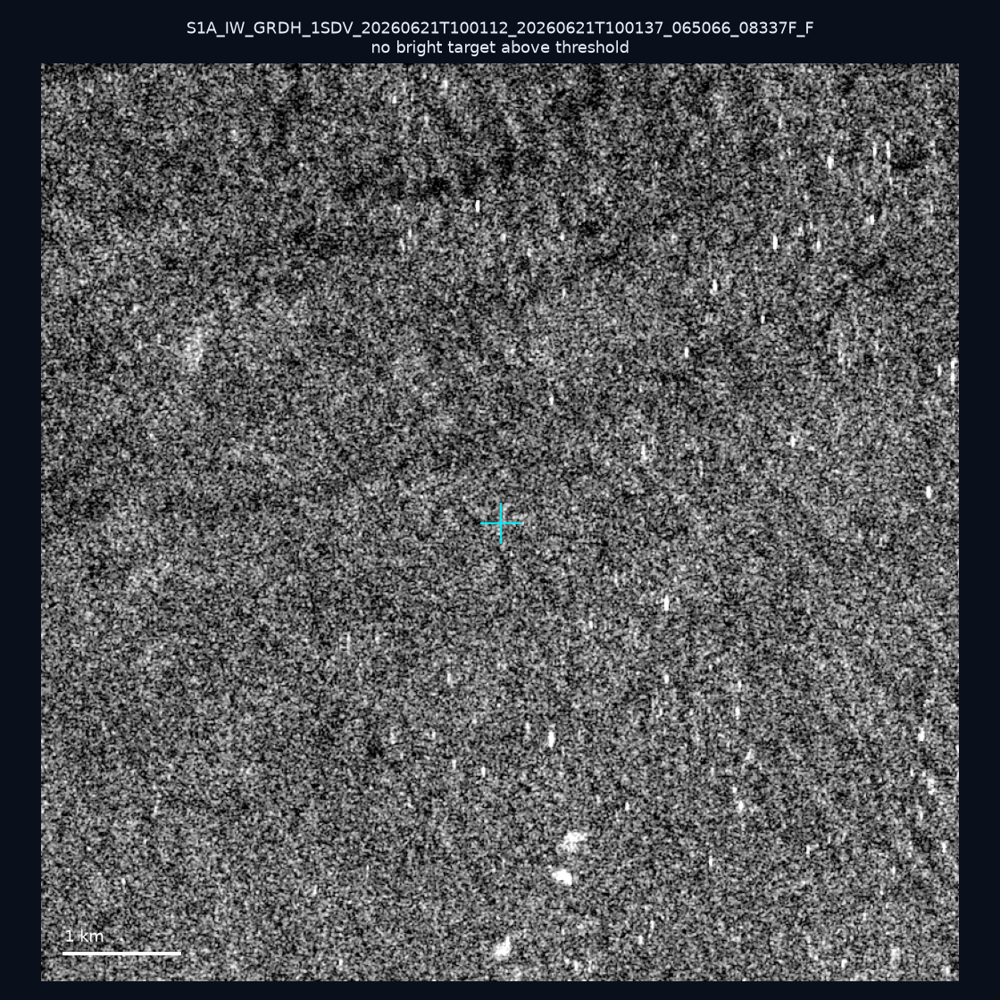
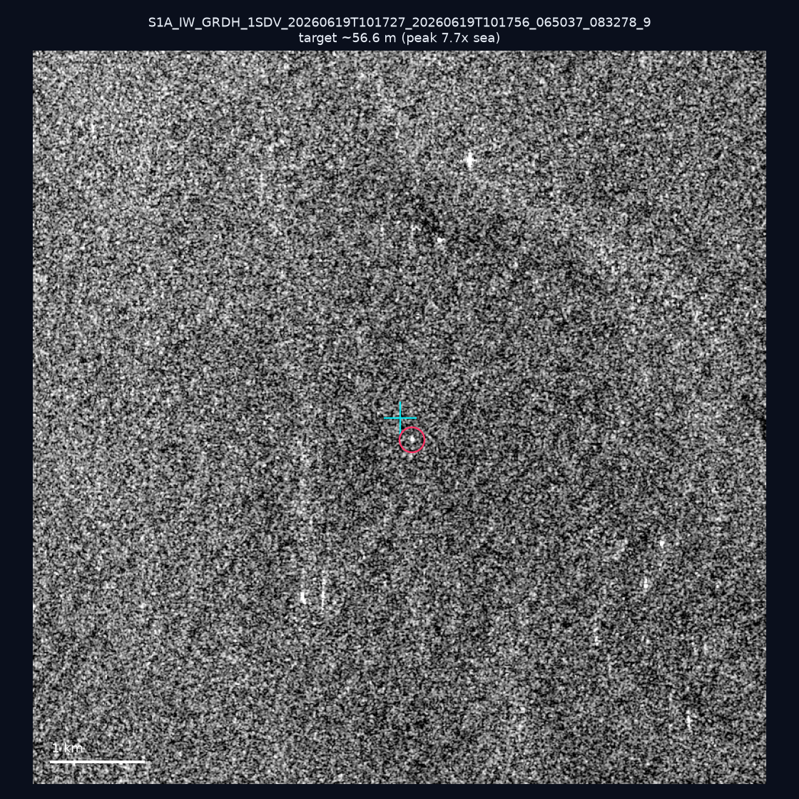
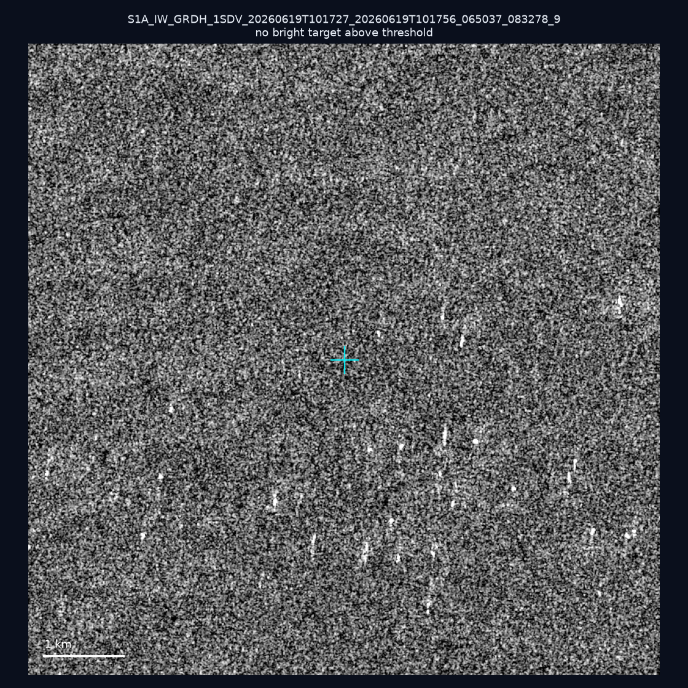
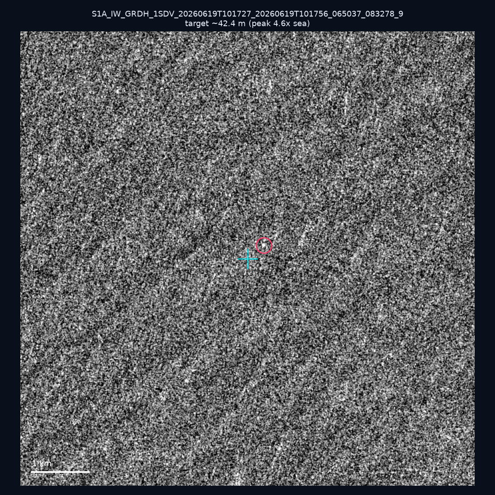
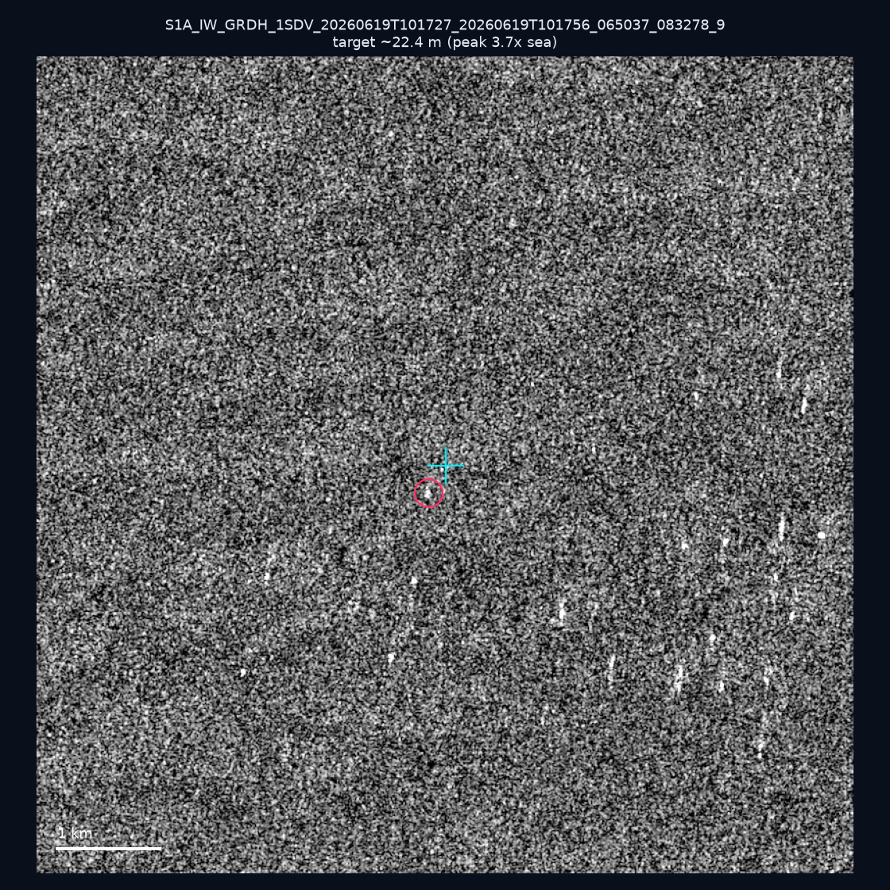
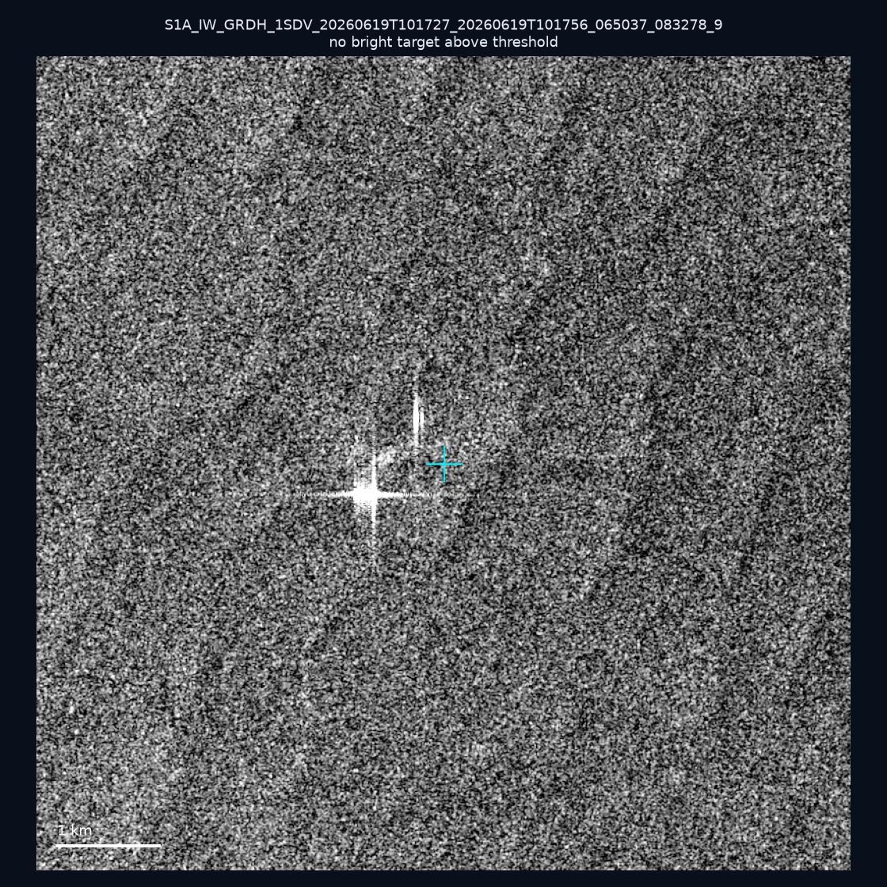
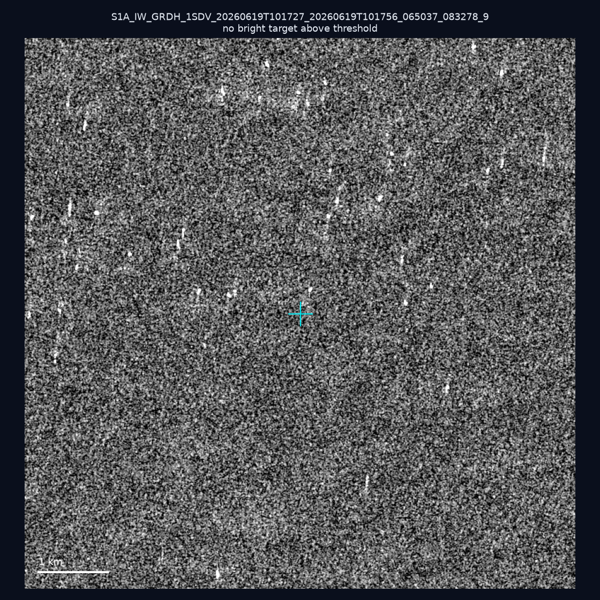
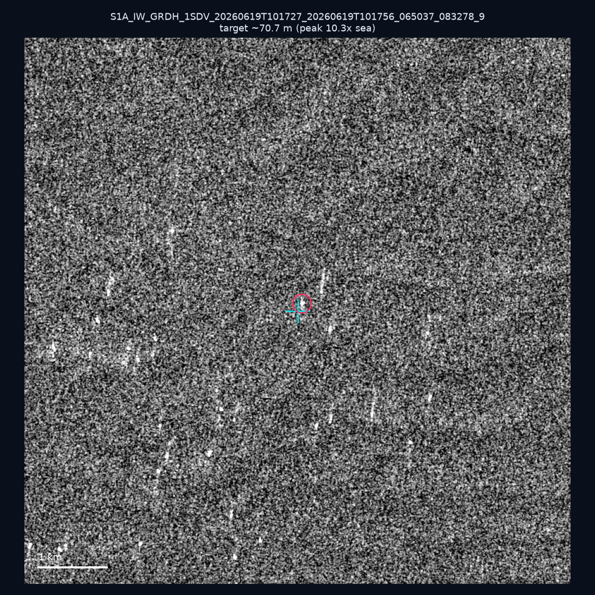
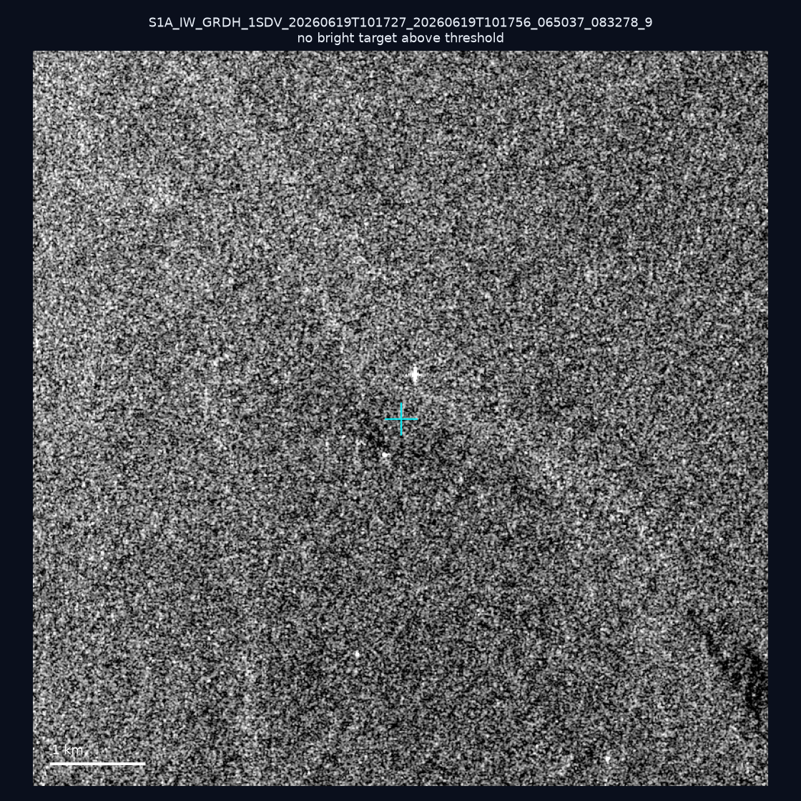
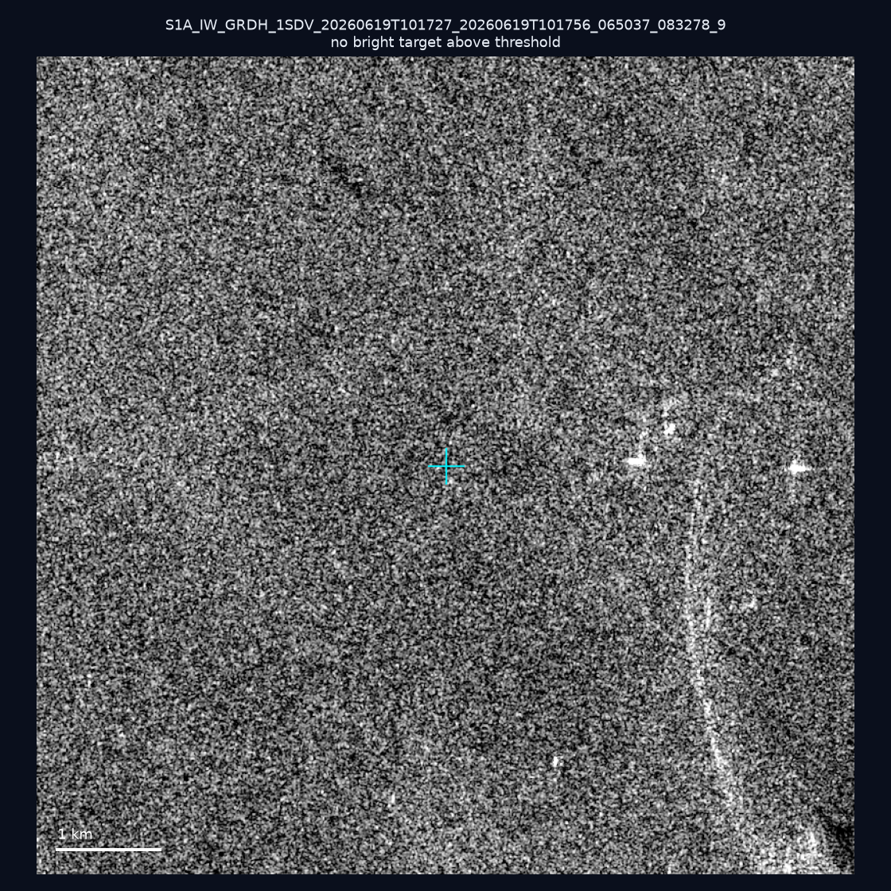

# 暗船 SAR 取證報告 — 2026-07-19

## 1. 總覽

- 執行時間：2026-07-19（GitHub Actions cron 自動執行）
- 線上比對摘要：暗偵測 1646 筆、殘餘暗船 1250 筆、假暗船剔除率 24.1%
- 本輪測試：10 筆
- 成功：10 筆
- 找到亮目標：4 筆
- 失敗：0 筆

## 2. 結果總表

| 日期 | 座標 | 海域 | 法域 | 成像時刻 | 判定 | 估計長度 | 峰值比 |
|------|------|------|------|----------|------|----------|--------|
| 2026-06-21 | 24.36, 121.98 | east | territorial_sea | 10:01:12 | ⚪ 無目標（雜訊或低RCS） | — | — |
| 2026-06-19 | 23.42, 117.68 | southwest | eez | 10:17:27 | 🟡 弱目標 | ~56.6 m | 7.7× |
| 2026-06-19 | 22.99, 118.08 | southwest | eez | 10:17:27 | ⚪ 無目標（雜訊或低RCS） | — | — |
| 2026-06-19 | 22.87, 117.67 | southwest | eez | 10:17:27 | 🟡 弱目標 | ~42.4 m | 4.6× |
| 2026-06-19 | 22.99, 118.06 | southwest | eez | 10:17:27 | 🟡 弱目標 | ~22.4 m | 3.7× |
| 2026-06-19 | 23.29, 117.77 | southwest | eez | 10:17:27 | ⚪ 無目標（雜訊或低RCS） | — | — |
| 2026-06-19 | 23.02, 118.12 | southwest | eez | 10:17:27 | ⚪ 無目標（雜訊或低RCS） | — | — |
| 2026-06-19 | 22.99, 118.15 | southwest | eez | 10:17:27 | ✅ 確認實體目標 | ~70.7 m | 10.3× |
| 2026-06-19 | 23.4, 117.69 | southwest | eez | 10:17:27 | ⚪ 無目標（雜訊或低RCS） | — | — |
| 2026-06-19 | 23.35, 117.02 | southwest | eez | 10:17:27 | ⚪ 無目標（雜訊或低RCS） | — | — |

## 3. 逐目標段落

### 2026-06-21 (24.36, 121.98)

⚪ 無目標（雜訊或低RCS）。

### 2026-06-19 (23.42, 117.68)

🟡 弱目標，估計長度 ~56.6 m，峰值 7.7× 海面背景（13 px）。

### 2026-06-19 (22.99, 118.08)

⚪ 無目標（雜訊或低RCS）。

### 2026-06-19 (22.87, 117.67)

🟡 弱目標，估計長度 ~42.4 m，峰值 4.6× 海面背景（6 px）。

### 2026-06-19 (22.99, 118.06)

🟡 弱目標，估計長度 ~22.4 m，峰值 3.7× 海面背景（2 px）。

### 2026-06-19 (23.29, 117.77)

⚪ 無目標（雜訊或低RCS）。

### 2026-06-19 (23.02, 118.12)

⚪ 無目標（雜訊或低RCS）。

### 2026-06-19 (22.99, 118.15)

✅ 確認實體目標，估計長度 ~70.7 m，峰值 10.3× 海面背景（18 px）。

### 2026-06-19 (23.4, 117.69)

⚪ 無目標（雜訊或低RCS）。

### 2026-06-19 (23.35, 117.02)

⚪ 無目標（雜訊或低RCS）。

## 4. 後續建議

- 值得人工深查（確認實體目標且長度 ≥ 50m）：
  - 2026-06-19 (22.99, 118.15) ~70.7 m — 建議比對周邊 AIS 船長
- 累積統計：全歷史 130 筆（有效 130 筆），確認實體目標 3 筆（2.3%）

> 所有結果是研判線索，不是法律認定；無目標 ≠ 誤報（小型木殼漁船 RCS 低，SAR 可能拍不到）。
