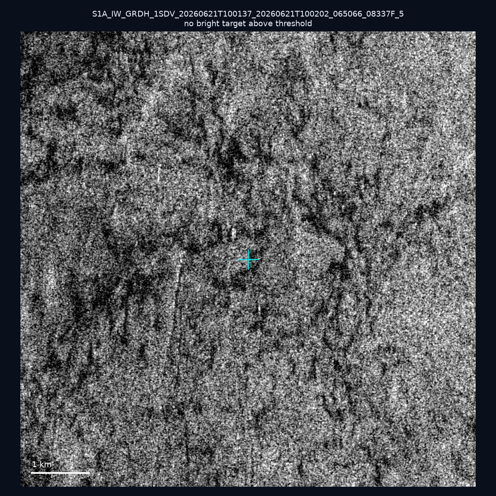
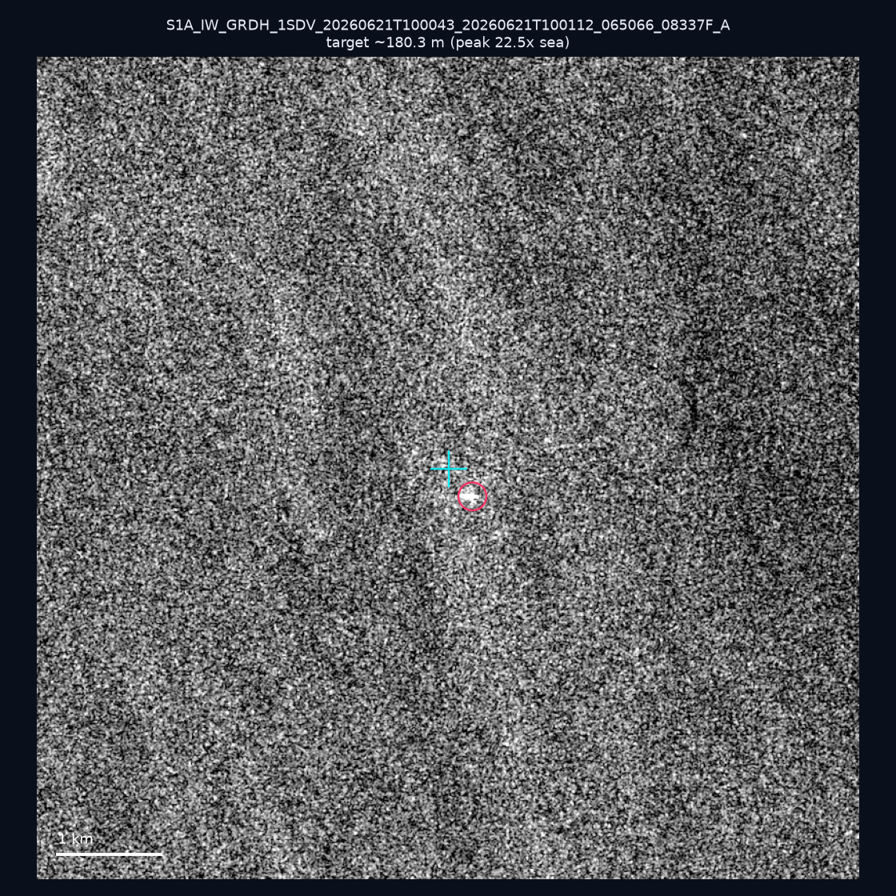
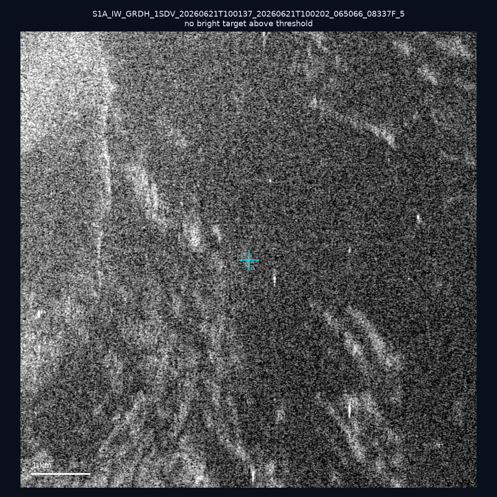
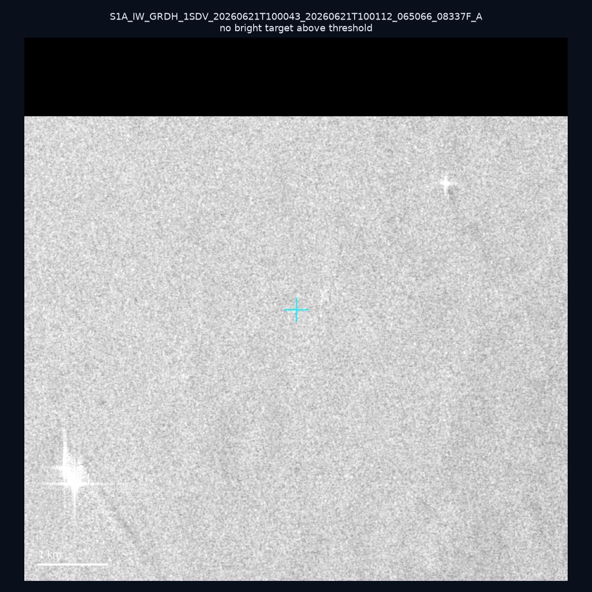

# 暗船 SAR 取證報告 — 2026-07-21

## 1. 總覽

- 執行時間：2026-07-21（GitHub Actions cron 自動執行）
- 線上比對摘要：暗偵測 1491 筆、殘餘暗船 1130 筆、假暗船剔除率 24.2%
- 本輪測試：4 筆
- 成功：4 筆
- 找到亮目標：1 筆
- 失敗：0 筆

## 2. 結果總表

| 日期 | 座標 | 海域 | 法域 | 成像時刻 | 判定 | 估計長度 | 峰值比 |
|------|------|------|------|----------|------|----------|--------|
| 2026-06-21 | 25.49, 121.79 | east | territorial_sea | 10:01:37 | ⚪ 無目標（雜訊或低RCS） | — | — |
| 2026-06-21 | 22.14, 122.19 | east | eez | 10:00:43 | ✅ 確認實體目標 | ~180.3 m | 22.5× |
| 2026-06-21 | 25.3, 121.68 | east | internal_waters | 10:01:37 | ⚪ 無目標（雜訊或低RCS） | — | — |
| 2026-06-21 | 21.89, 122.22 | east | eez | 10:00:43 | ⚪ 無目標（雜訊或低RCS） | — | — |

## 3. 逐目標段落

### 2026-06-21 (25.49, 121.79)

⚪ 無目標（雜訊或低RCS）。

### 2026-06-21 (22.14, 122.19)

✅ 確認實體目標，估計長度 ~180.3 m，峰值 22.5× 海面背景（69 px）。

### 2026-06-21 (25.3, 121.68)

⚪ 無目標（雜訊或低RCS）。

### 2026-06-21 (21.89, 122.22)

⚪ 無目標（雜訊或低RCS）。

## 4. 後續建議

- 值得人工深查（確認實體目標且長度 ≥ 50m）：
  - 2026-06-21 (22.14, 122.19) ~180.3 m — 建議比對周邊 AIS 船長
- 累積統計：全歷史 134 筆（有效 134 筆），確認實體目標 4 筆（3.0%）

> 所有結果是研判線索，不是法律認定；無目標 ≠ 誤報（小型木殼漁船 RCS 低，SAR 可能拍不到）。
