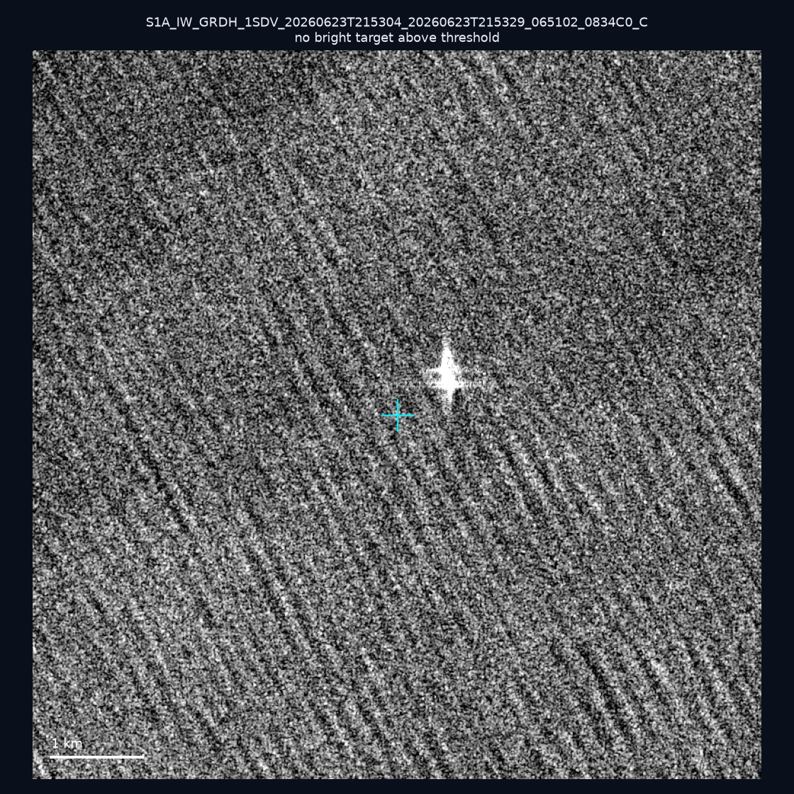
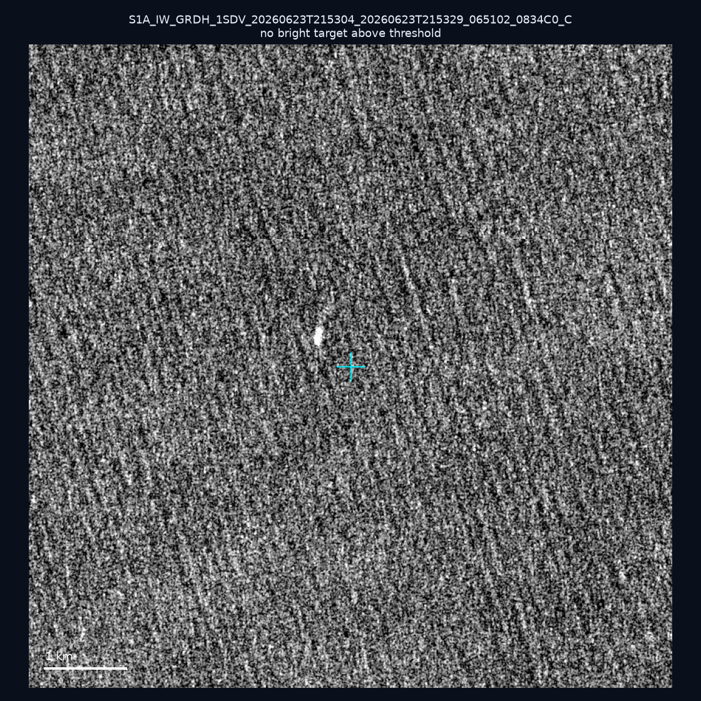
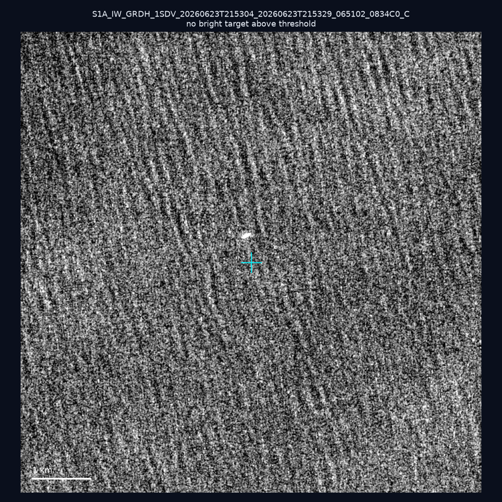
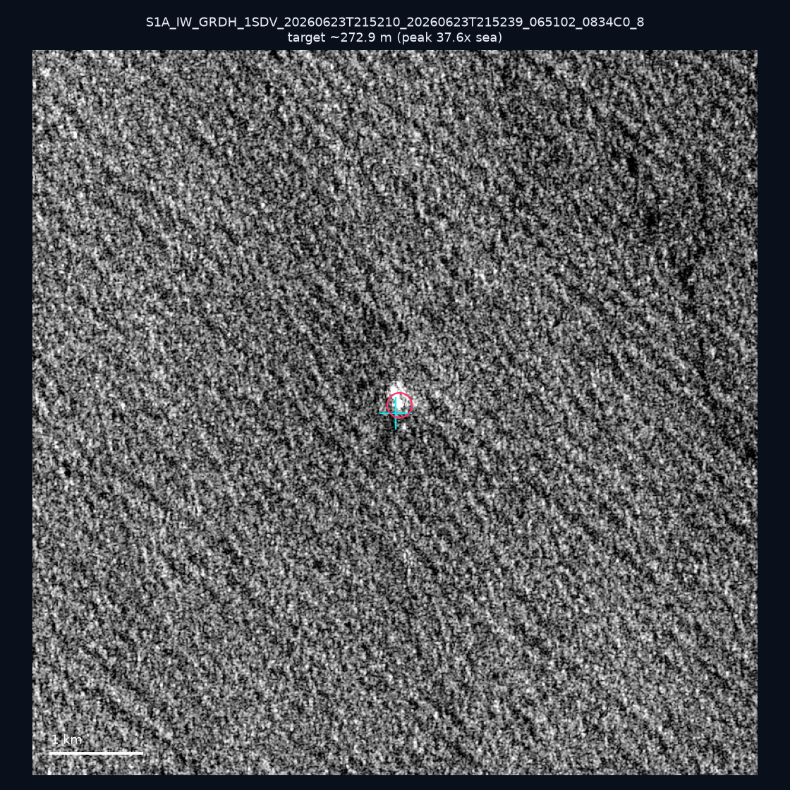
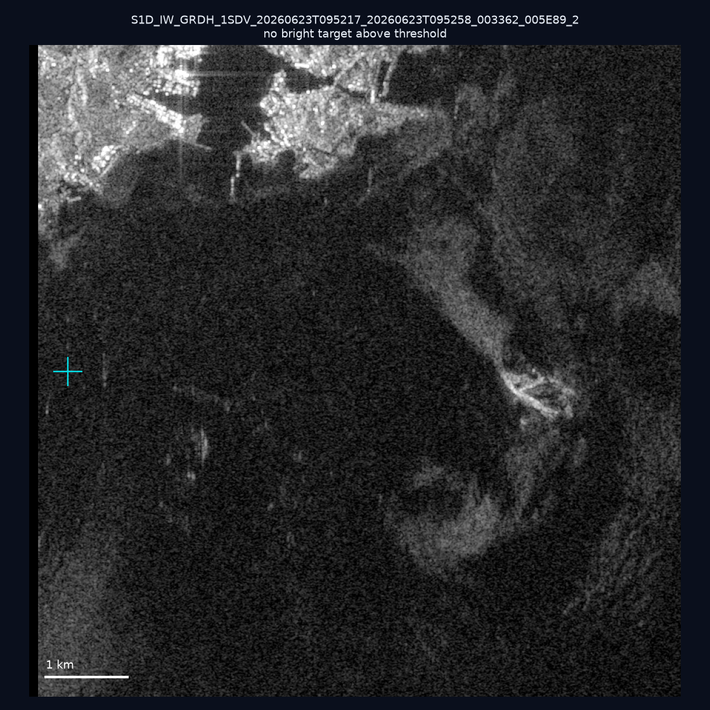
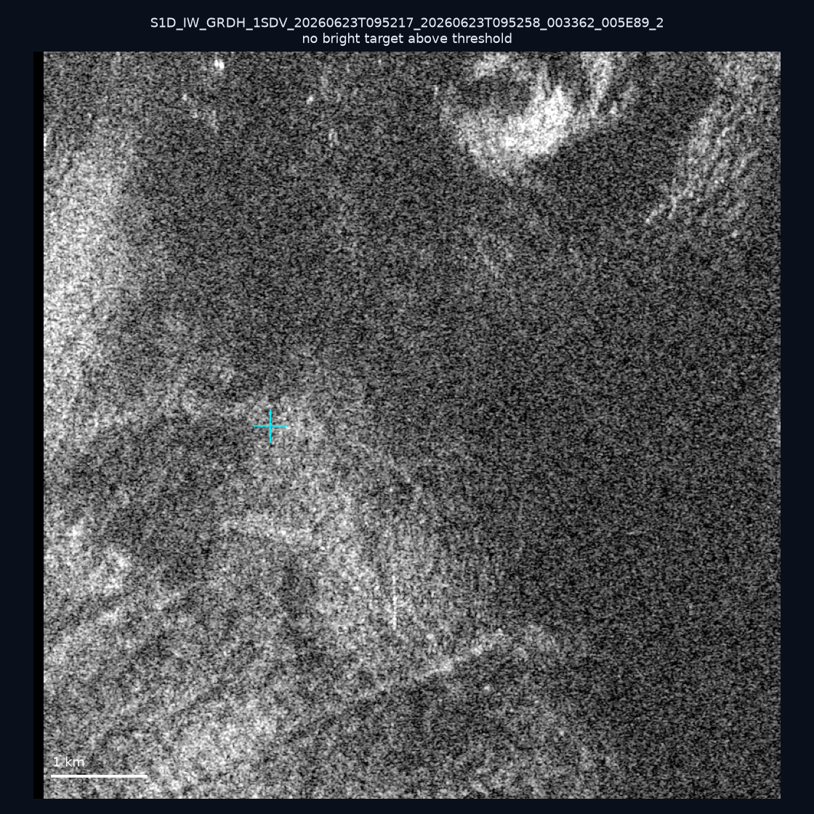
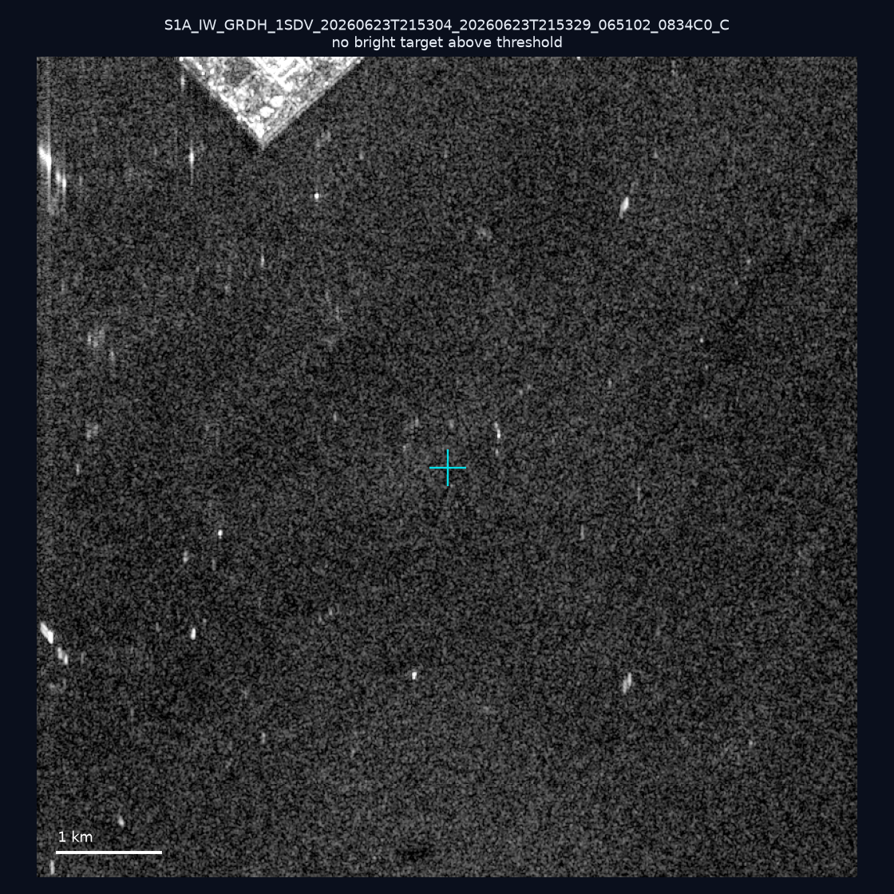
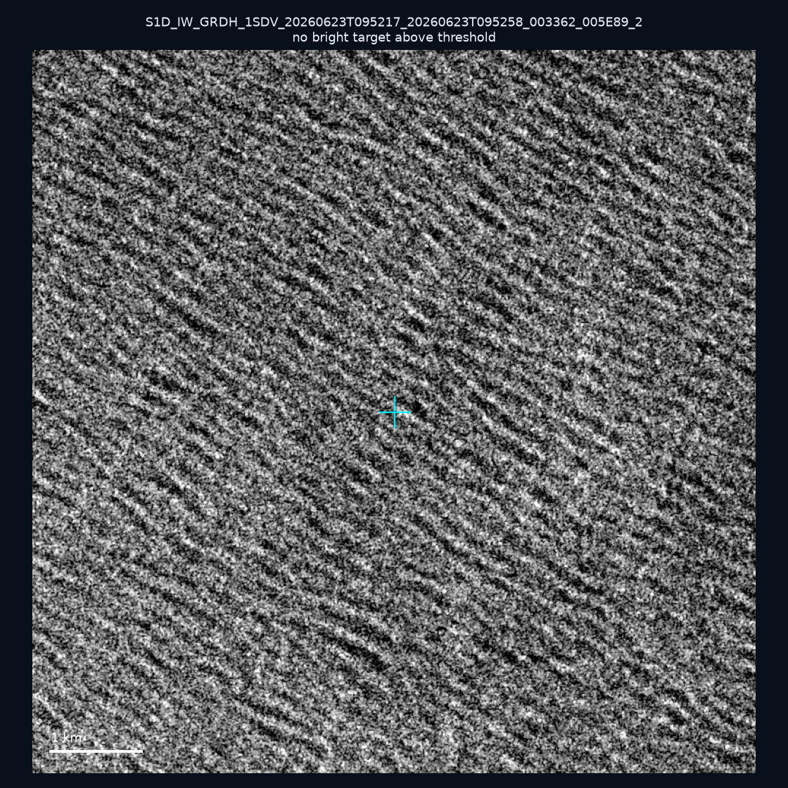
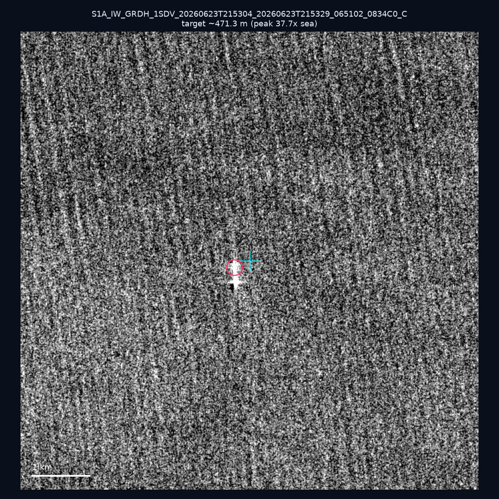
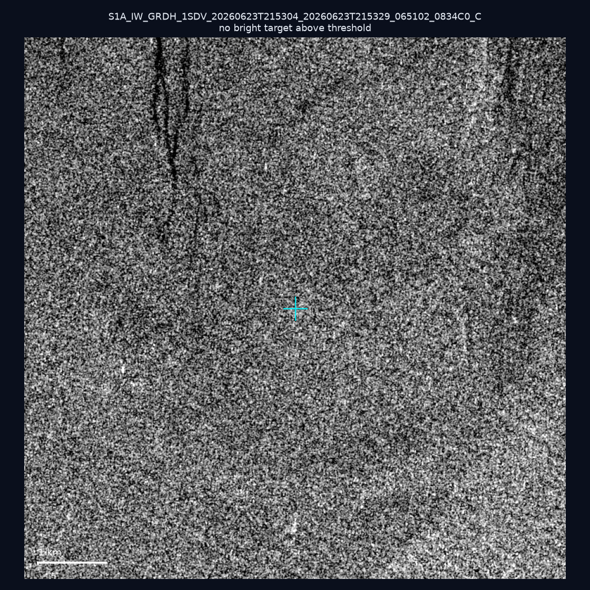

# 暗船 SAR 取證報告 — 2026-07-23

## 1. 總覽

- 執行時間：2026-07-23（GitHub Actions cron 自動執行）
- 線上比對摘要：暗偵測 1040 筆、殘餘暗船 861 筆、假暗船剔除率 17.2%
- 本輪測試：10 筆
- 成功：10 筆
- 找到亮目標：2 筆
- 失敗：0 筆

## 2. 結果總表

| 日期 | 座標 | 海域 | 法域 | 成像時刻 | 判定 | 估計長度 | 峰值比 |
|------|------|------|------|----------|------|----------|--------|
| 2026-06-23 | 22.63, 119.56 | southwest | contiguous_zone | 21:53:04 | ⚪ 無目標（雜訊或低RCS） | — | — |
| 2026-06-23 | 21.63, 120.03 | southwest | eez | 21:53:04 | ⚪ 無目標（雜訊或低RCS） | — | — |
| 2026-06-23 | 22.04, 119.43 | southwest | eez | 21:53:04 | ⚪ 無目標（雜訊或低RCS） | — | — |
| 2026-06-23 | 24.01, 121.88 | east | territorial_sea | 21:52:10 | ✅ 確認實體目標 | ~272.9 m | 37.6× |
| 2026-06-23 | 25.18, 121.73 | east | internal_waters | 09:52:17 | ⚪ 無目標（雜訊或低RCS） | — | — |
| 2026-06-23 | 25.23, 121.74 | east | internal_waters | 09:52:17 | ⚪ 無目標（雜訊或低RCS） | — | — |
| 2026-06-23 | 22.49, 120.29 | southwest | internal_waters | 21:53:04 | ⚪ 無目標（雜訊或低RCS） | — | — |
| 2026-06-23 | 25.33, 121.88 | east | internal_waters | 09:52:17 | ⚪ 無目標（雜訊或低RCS） | — | — |
| 2026-06-23 | 21.34, 119.48 | southwest | eez | 21:53:04 | ✅ 確認實體目標 | ~471.3 m | 37.7× |
| 2026-06-23 | 22.3, 120.53 | southwest | internal_waters | 21:53:04 | ⚪ 無目標（雜訊或低RCS） | — | — |

## 3. 逐目標段落

### 2026-06-23 (22.63, 119.56)

⚪ 無目標（雜訊或低RCS）。

### 2026-06-23 (21.63, 120.03)

⚪ 無目標（雜訊或低RCS）。

### 2026-06-23 (22.04, 119.43)

⚪ 無目標（雜訊或低RCS）。

### 2026-06-23 (24.01, 121.88)

✅ 確認實體目標，估計長度 ~272.9 m，峰值 37.6× 海面背景（134 px）。

### 2026-06-23 (25.18, 121.73)

⚪ 無目標（雜訊或低RCS）。

### 2026-06-23 (25.23, 121.74)

⚪ 無目標（雜訊或低RCS）。

### 2026-06-23 (22.49, 120.29)

⚪ 無目標（雜訊或低RCS）。

### 2026-06-23 (25.33, 121.88)

⚪ 無目標（雜訊或低RCS）。

### 2026-06-23 (21.34, 119.48)

✅ 確認實體目標，估計長度 ~471.3 m，峰值 37.7× 海面背景（259 px）。

### 2026-06-23 (22.3, 120.53)

⚪ 無目標（雜訊或低RCS）。

## 4. 後續建議

- 值得人工深查（確認實體目標且長度 ≥ 50m）：
  - 2026-06-23 (24.01, 121.88) ~272.9 m — 建議比對周邊 AIS 船長
  - 2026-06-23 (21.34, 119.48) ~471.3 m — 建議比對周邊 AIS 船長
- 累積統計：全歷史 144 筆（有效 144 筆），確認實體目標 6 筆（4.2%）

> 所有結果是研判線索，不是法律認定；無目標 ≠ 誤報（小型木殼漁船 RCS 低，SAR 可能拍不到）。
