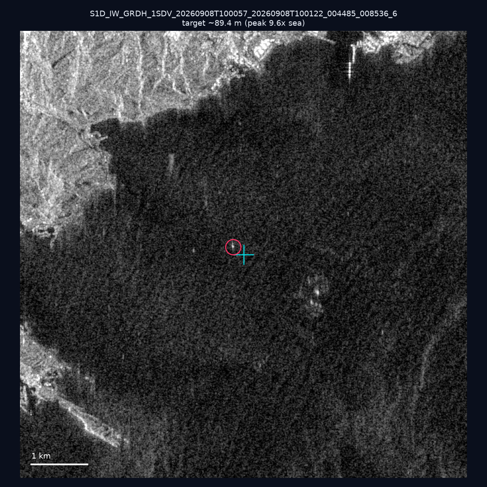
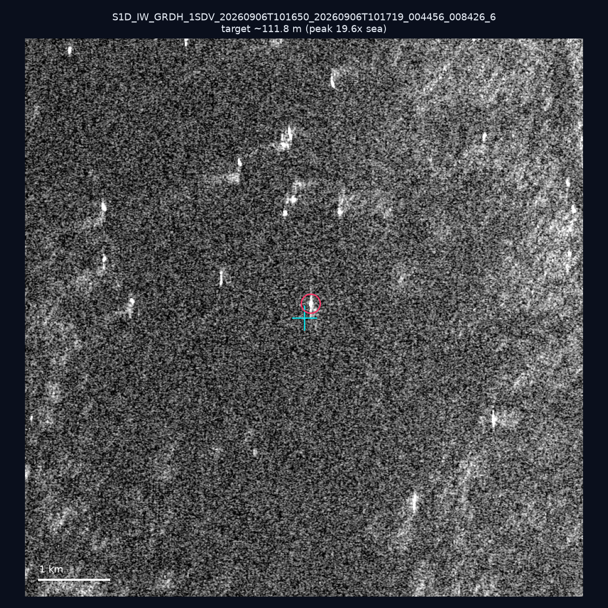
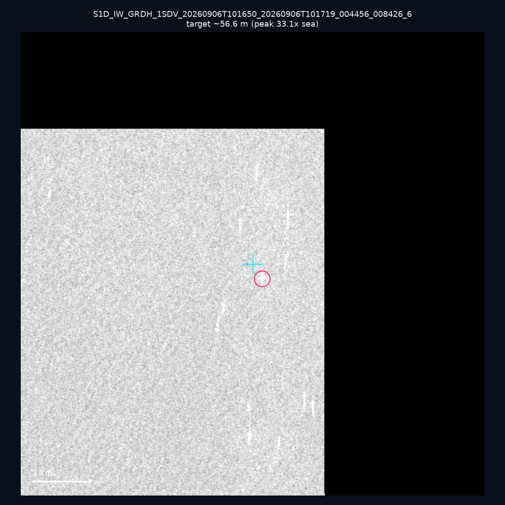
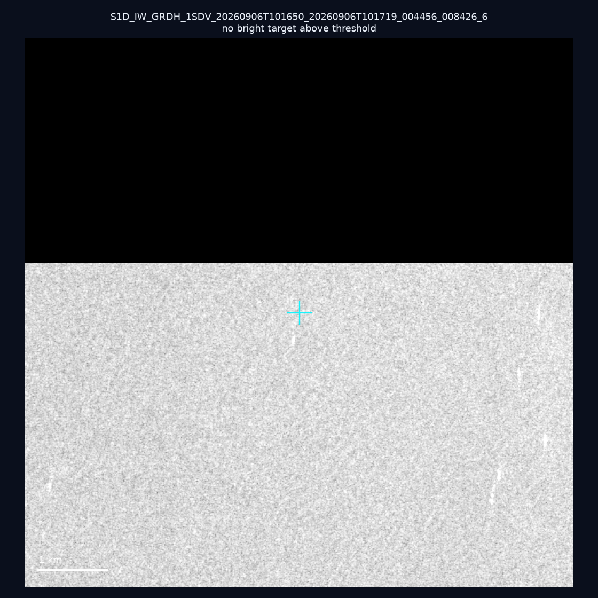
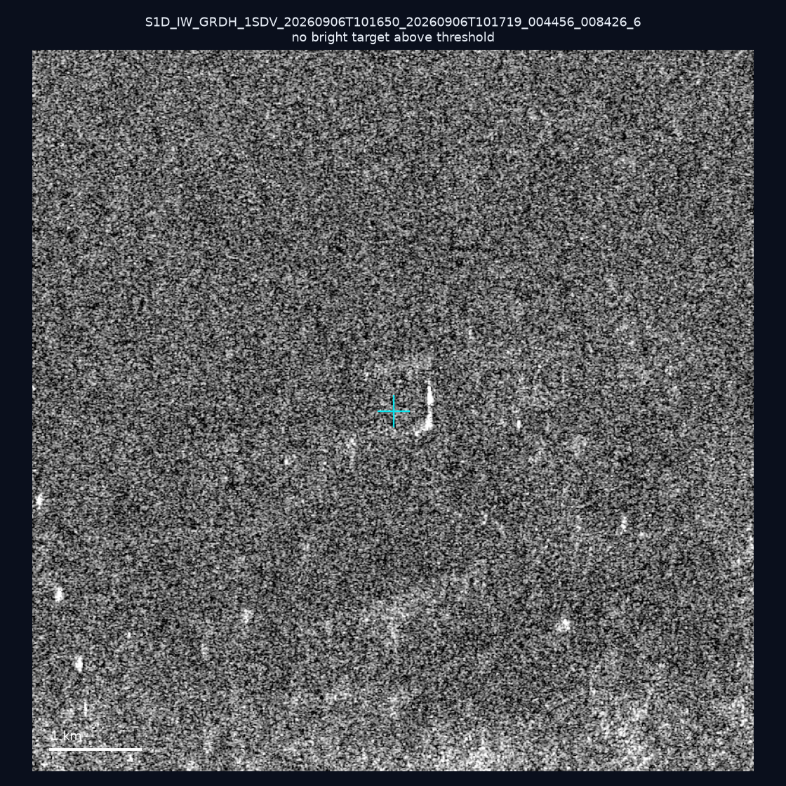
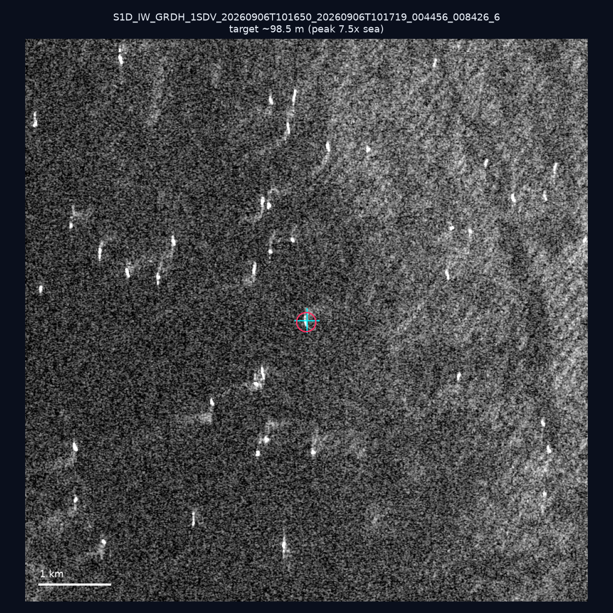
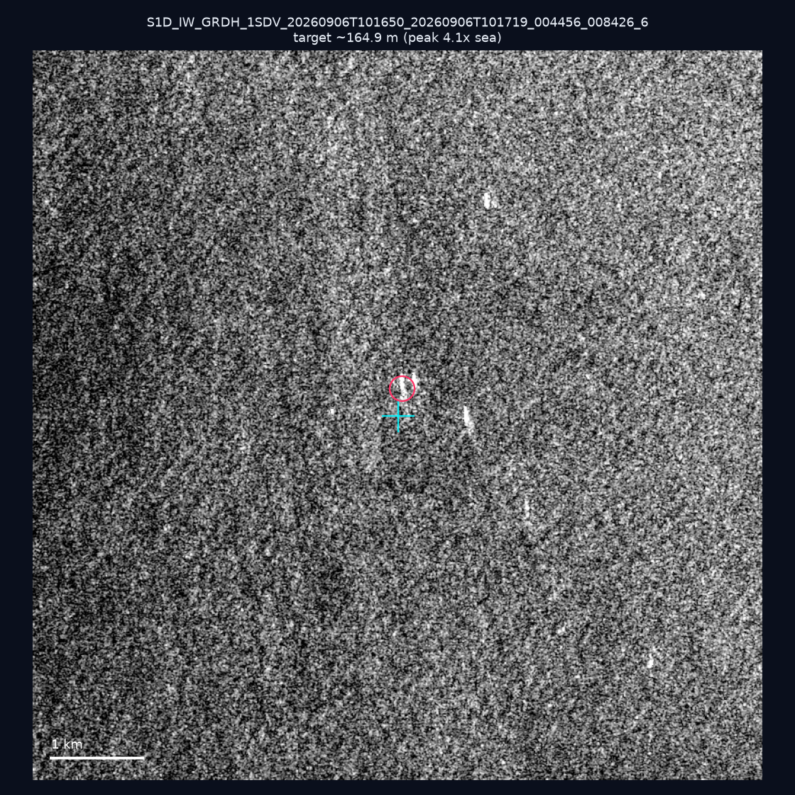
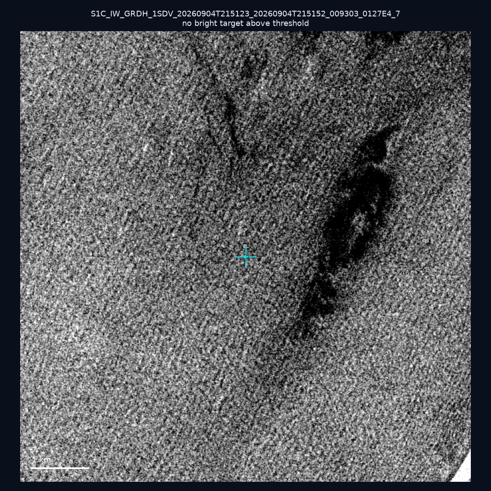
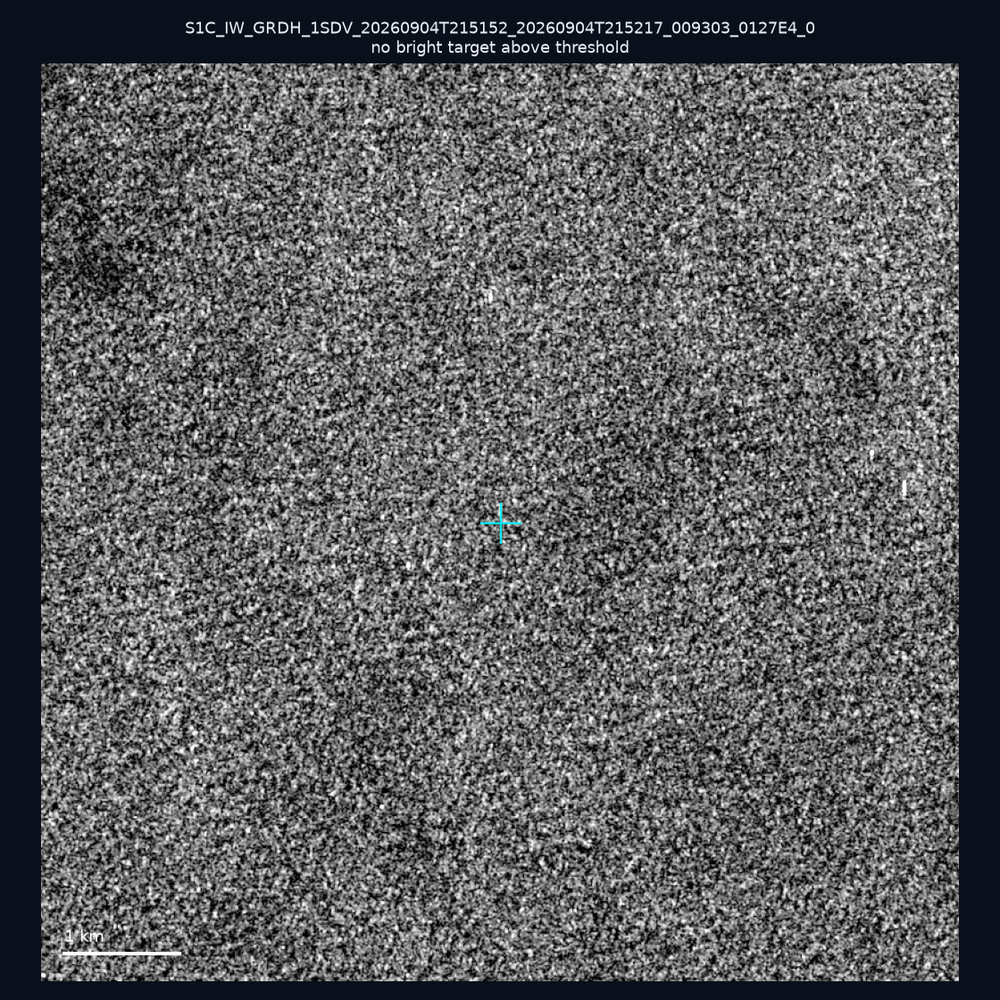
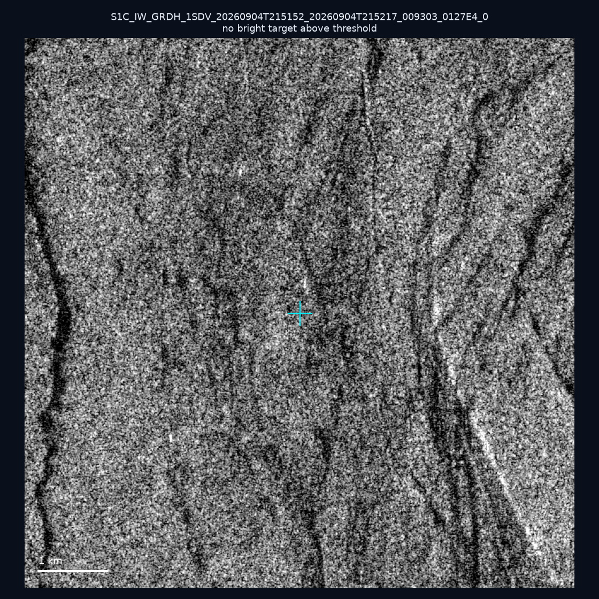

# 暗船 SAR 取證報告 — 2026-09-11

## 1. 總覽

- 執行時間：2026-09-11（GitHub Actions cron 自動執行）
- 線上比對摘要：暗偵測 12772 筆、殘餘暗船 10528 筆、假暗船剔除率 17.6%
- 本輪測試：10 筆
- 成功：10 筆
- 找到亮目標：5 筆
- 失敗：0 筆

## 2. 結果總表

| 日期 | 座標 | 海域 | 法域 | 成像時刻 | 判定 | 估計長度 | 峰值比 |
|------|------|------|------|----------|------|----------|--------|
| 2026-09-08 | 25.19, 121.73 | east | internal_waters | 10:00:57 | 🟡 弱目標 | ~89.4 m | 9.6× |
| 2026-09-06 | 23.32, 118.27 | southwest | eez | 10:16:50 | ✅ 確認實體目標 | ~111.8 m | 19.6× |
| 2026-09-06 | 22.97, 118.51 | southwest | eez | 10:16:50 | ✅ 確認實體目標 | ~56.6 m | 33.1× |
| 2026-09-06 | 22.95, 118.48 | southwest | eez | 10:16:50 | ⚪ 無目標（雜訊或低RCS） | — | — |
| 2026-09-06 | 22.92, 118.04 | southwest | eez | 10:16:50 | ⚪ 無目標（雜訊或低RCS） | — | — |
| 2026-09-06 | 23.29, 118.28 | southwest | eez | 10:16:50 | 🟡 弱目標 | ~98.5 m | 7.5× |
| 2026-09-06 | 22.99, 118.35 | southwest | eez | 10:16:50 | 🟡 弱目標 | ~164.9 m | 4.1× |
| 2026-09-04 | 24.76, 121.87 | east | internal_waters | 21:51:23 | ⚪ 無目標（雜訊或低RCS） | — | — |
| 2026-09-04 | 22.85, 121.5 | east | internal_waters | 21:51:52 | ⚪ 無目標（雜訊或低RCS） | — | — |
| 2026-09-04 | 22.9, 119.69 | southwest | territorial_sea | 21:51:52 | ⚪ 無目標（雜訊或低RCS） | — | — |

## 3. 逐目標段落

### 2026-09-08 (25.19, 121.73)

🟡 弱目標，估計長度 ~89.4 m，峰值 9.6× 海面背景（22 px）。

### 2026-09-06 (23.32, 118.27)

✅ 確認實體目標，估計長度 ~111.8 m，峰值 19.6× 海面背景（37 px）。

### 2026-09-06 (22.97, 118.51)

✅ 確認實體目標，估計長度 ~56.6 m，峰值 33.1× 海面背景（13 px）。

### 2026-09-06 (22.95, 118.48)

⚪ 無目標（雜訊或低RCS）。

### 2026-09-06 (22.92, 118.04)

⚪ 無目標（雜訊或低RCS）。

### 2026-09-06 (23.29, 118.28)

🟡 弱目標，估計長度 ~98.5 m，峰值 7.5× 海面背景（26 px）。

### 2026-09-06 (22.99, 118.35)

🟡 弱目標，估計長度 ~164.9 m，峰值 4.1× 海面背景（48 px）。

### 2026-09-04 (24.76, 121.87)

⚪ 無目標（雜訊或低RCS）。

### 2026-09-04 (22.85, 121.5)

⚪ 無目標（雜訊或低RCS）。

### 2026-09-04 (22.9, 119.69)

⚪ 無目標（雜訊或低RCS）。

## 4. 後續建議

- 值得人工深查（確認實體目標且長度 ≥ 50m）：
  - 2026-09-06 (23.32, 118.27) ~111.8 m — 建議比對周邊 AIS 船長
  - 2026-09-06 (22.97, 118.51) ~56.6 m — 建議比對周邊 AIS 船長
- 累積統計：全歷史 154 筆（有效 154 筆），確認實體目標 8 筆（5.2%）

> 所有結果是研判線索，不是法律認定；無目標 ≠ 誤報（小型木殼漁船 RCS 低，SAR 可能拍不到）。
