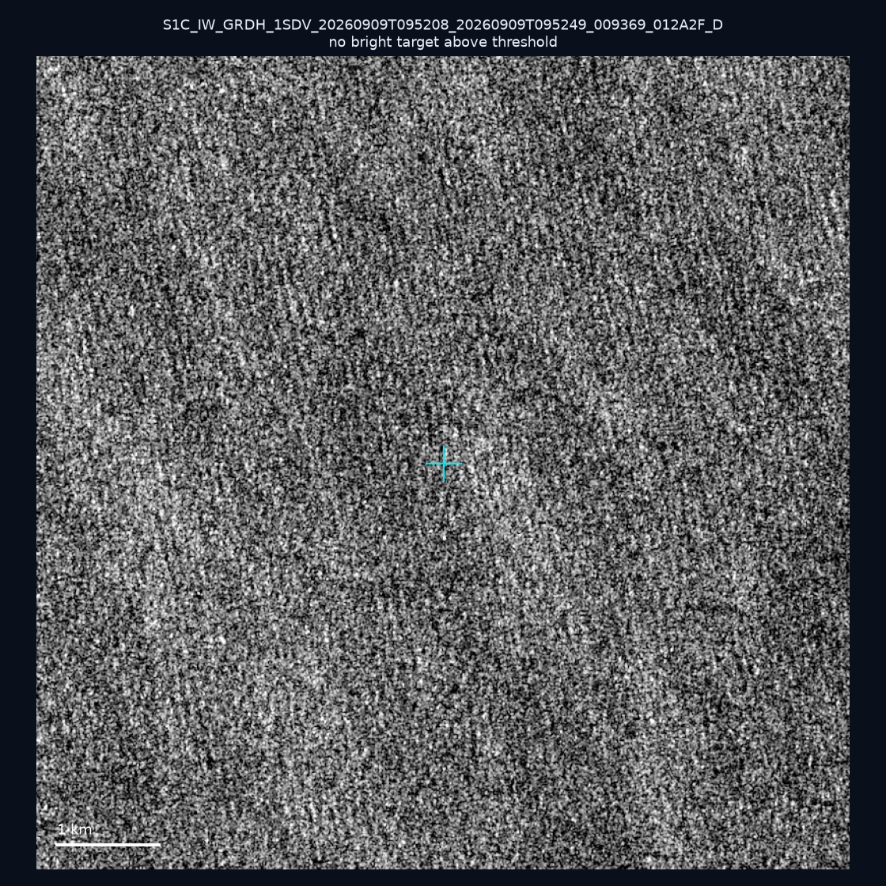
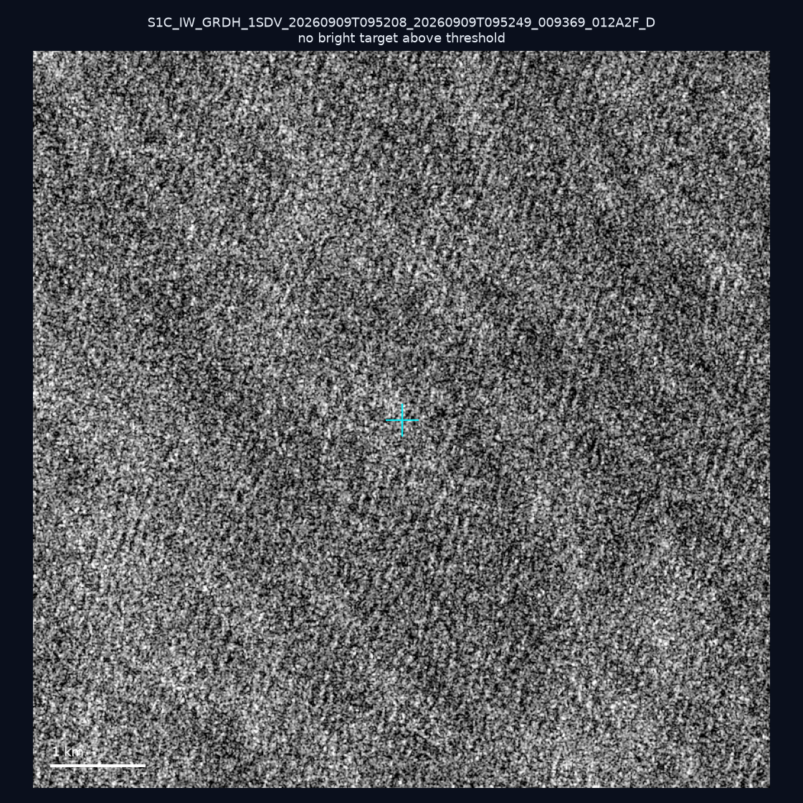
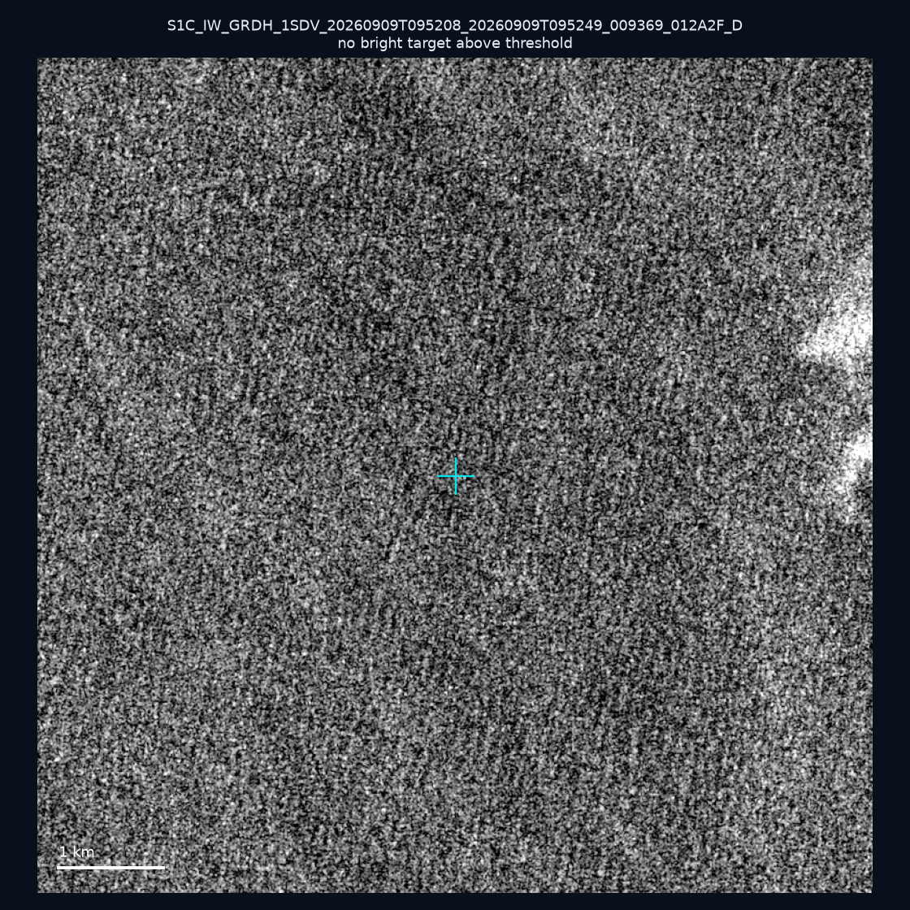
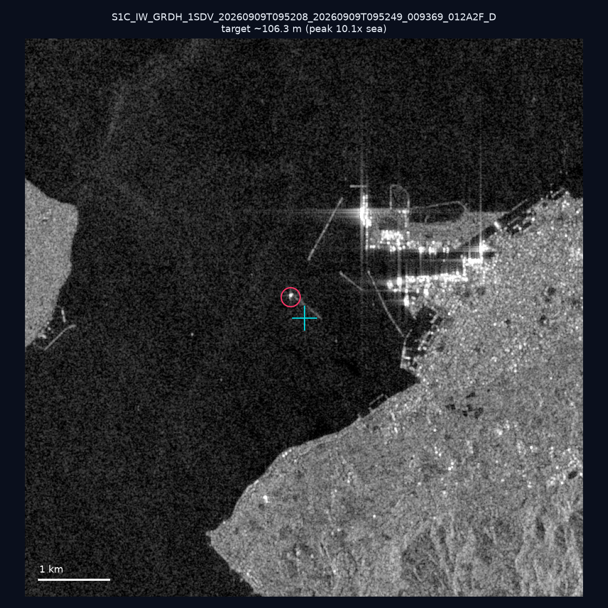
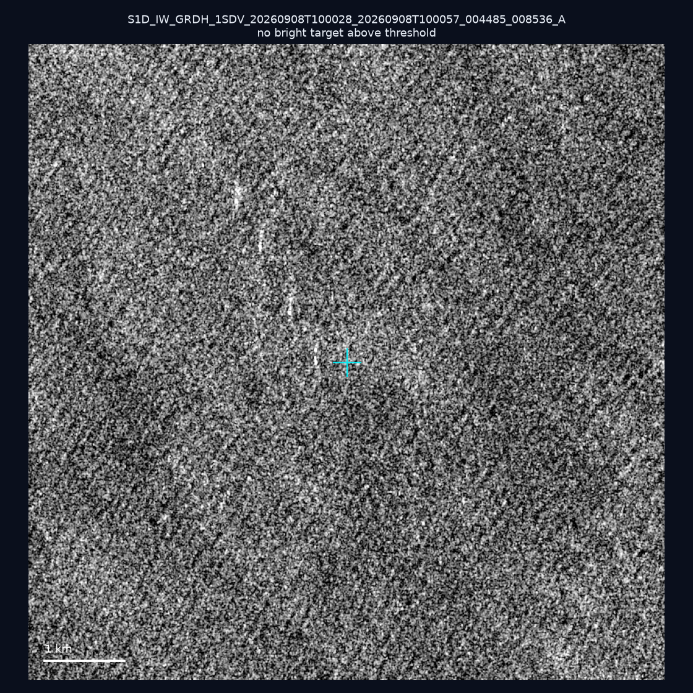
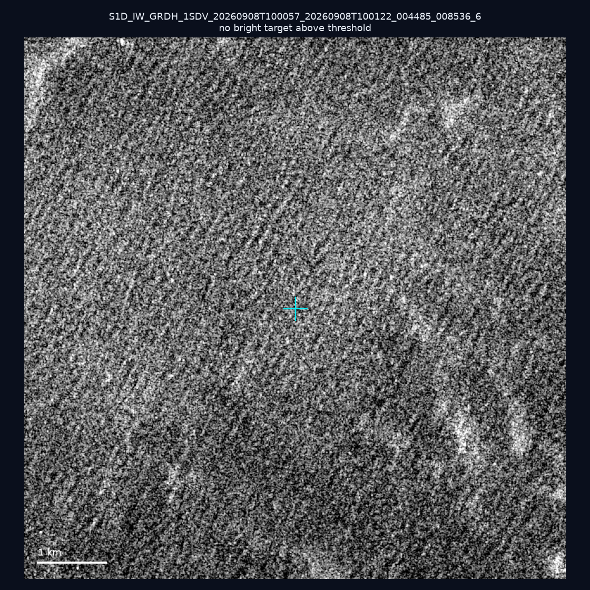
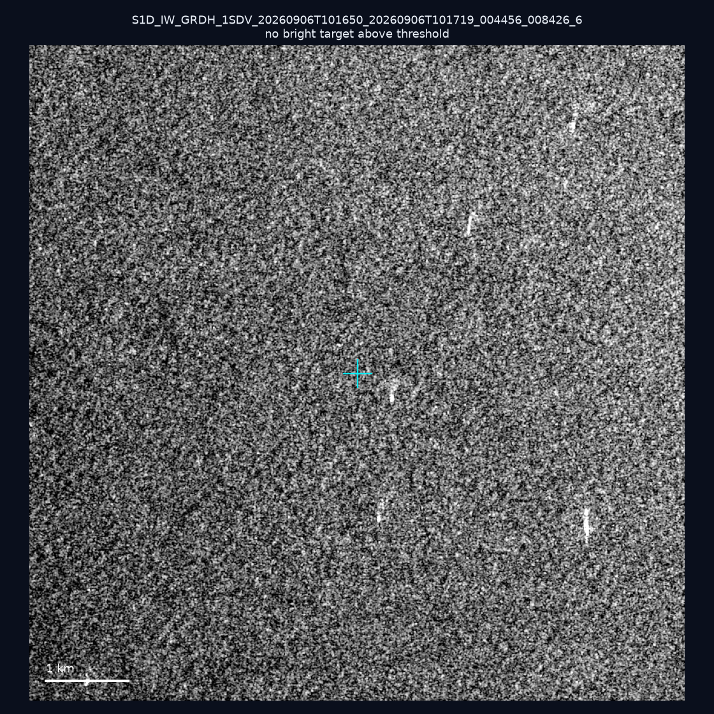
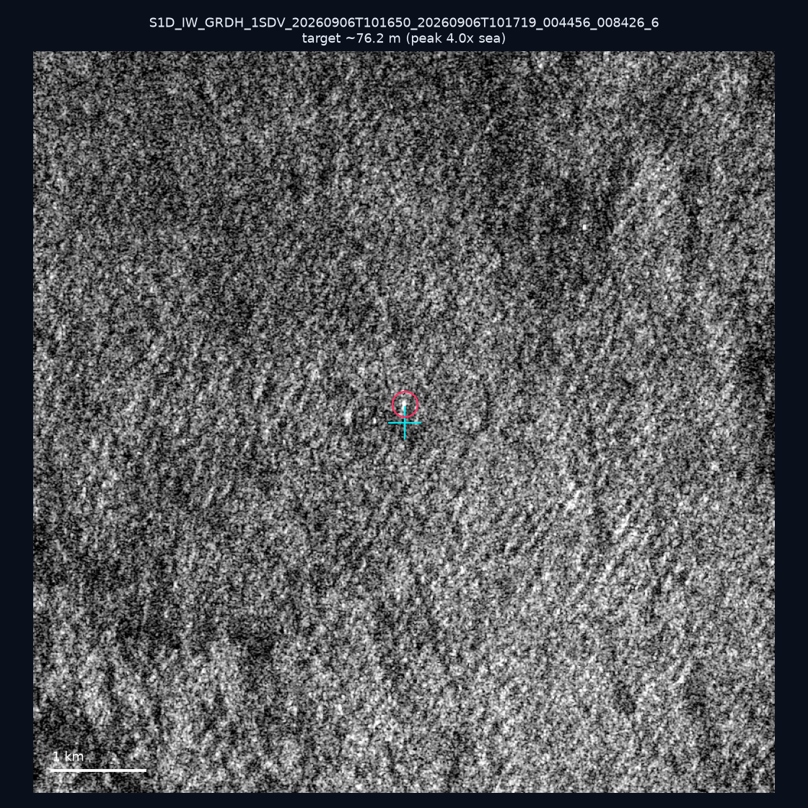
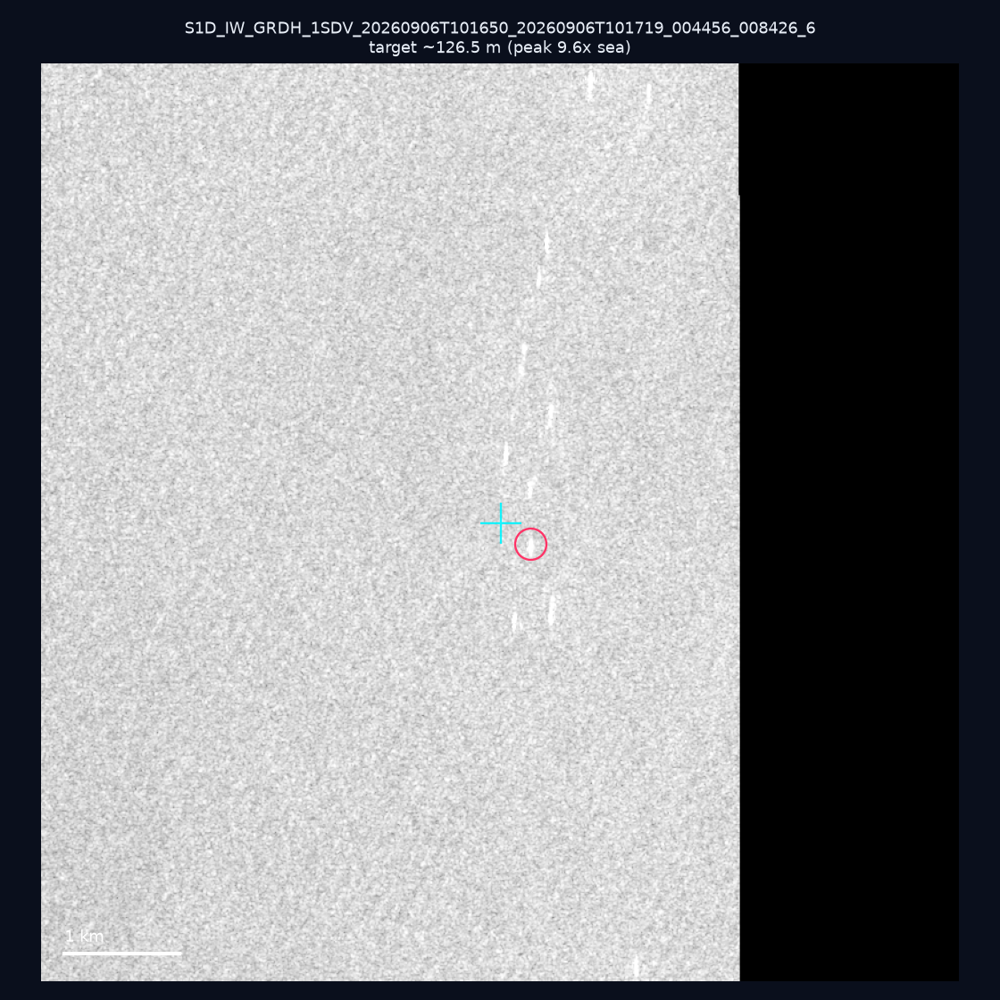
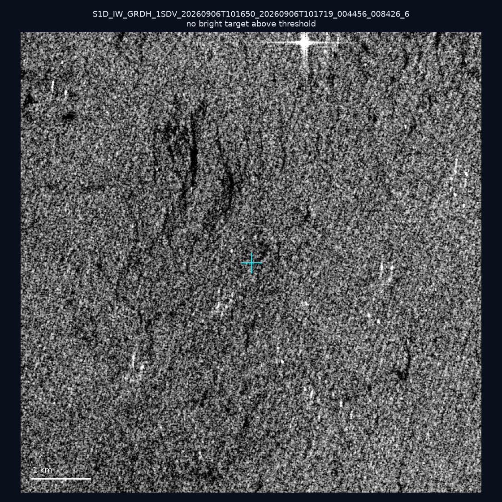

# 暗船 SAR 取證報告 — 2026-09-12

## 1. 總覽

- 執行時間：2026-09-12（GitHub Actions cron 自動執行）
- 線上比對摘要：暗偵測 14520 筆、殘餘暗船 11378 筆、假暗船剔除率 21.6%
- 本輪測試：10 筆
- 成功：10 筆
- 找到亮目標：3 筆
- 失敗：0 筆

## 2. 結果總表

| 日期 | 座標 | 海域 | 法域 | 成像時刻 | 判定 | 估計長度 | 峰值比 |
|------|------|------|------|----------|------|----------|--------|
| 2026-09-09 | 25.44, 123.17 | east | eez | 09:52:08 | ⚪ 無目標（雜訊或低RCS） | — | — |
| 2026-09-09 | 24.9, 123.83 | east | eez | 09:52:08 | ⚪ 無目標（雜訊或低RCS） | — | — |
| 2026-09-09 | 25.0, 123.66 | east | eez | 09:52:08 | ⚪ 無目標（雜訊或低RCS） | — | — |
| 2026-09-09 | 24.34, 124.13 | east | eez | 09:52:08 | ✅ 確認實體目標 | ~106.3 m | 10.1× |
| 2026-09-08 | 23.24, 121.54 | east | territorial_sea | 10:00:28 | ⚪ 無目標（雜訊或低RCS） | — | — |
| 2026-09-08 | 25.29, 121.75 | east | internal_waters | 10:00:57 | ⚪ 無目標（雜訊或低RCS） | — | — |
| 2026-09-06 | 22.99, 118.41 | southwest | eez | 10:16:50 | ⚪ 無目標（雜訊或低RCS） | — | — |
| 2026-09-06 | 23.02, 118.06 | southwest | eez | 10:16:50 | 🟡 弱目標 | ~76.2 m | 4.0× |
| 2026-09-06 | 23.03, 118.49 | southwest | eez | 10:16:50 | 🟡 弱目標 | ~126.5 m | 9.6× |
| 2026-09-06 | 23.3, 117.2 | southwest | eez | 10:16:50 | ⚪ 無目標（雜訊或低RCS） | — | — |

## 3. 逐目標段落

### 2026-09-09 (25.44, 123.17)

⚪ 無目標（雜訊或低RCS）。

### 2026-09-09 (24.9, 123.83)

⚪ 無目標（雜訊或低RCS）。

### 2026-09-09 (25.0, 123.66)

⚪ 無目標（雜訊或低RCS）。

### 2026-09-09 (24.34, 124.13)

✅ 確認實體目標，估計長度 ~106.3 m，峰值 10.1× 海面背景（38 px）。

### 2026-09-08 (23.24, 121.54)

⚪ 無目標（雜訊或低RCS）。

### 2026-09-08 (25.29, 121.75)

⚪ 無目標（雜訊或低RCS）。

### 2026-09-06 (22.99, 118.41)

⚪ 無目標（雜訊或低RCS）。

### 2026-09-06 (23.02, 118.06)

🟡 弱目標，估計長度 ~76.2 m，峰值 4.0× 海面背景（12 px）。

### 2026-09-06 (23.03, 118.49)

🟡 弱目標，估計長度 ~126.5 m，峰值 9.6× 海面背景（37 px）。

### 2026-09-06 (23.3, 117.2)

⚪ 無目標（雜訊或低RCS）。

## 4. 後續建議

- 值得人工深查（確認實體目標且長度 ≥ 50m）：
  - 2026-09-09 (24.34, 124.13) ~106.3 m — 建議比對周邊 AIS 船長
- 累積統計：全歷史 164 筆（有效 164 筆），確認實體目標 9 筆（5.5%）

> 所有結果是研判線索，不是法律認定；無目標 ≠ 誤報（小型木殼漁船 RCS 低，SAR 可能拍不到）。
