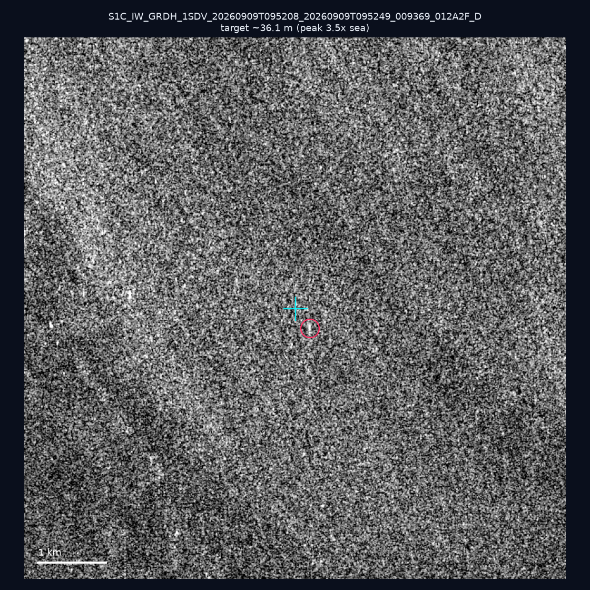
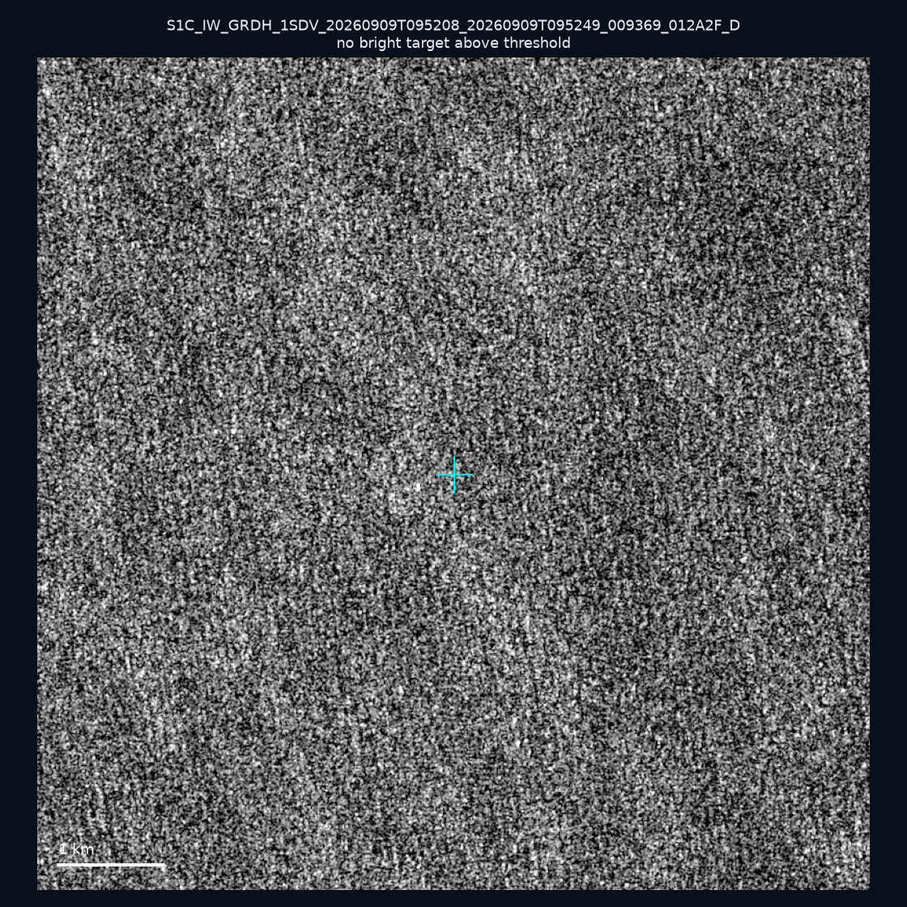
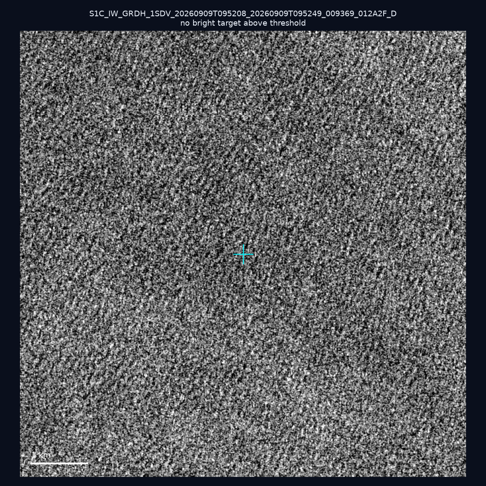
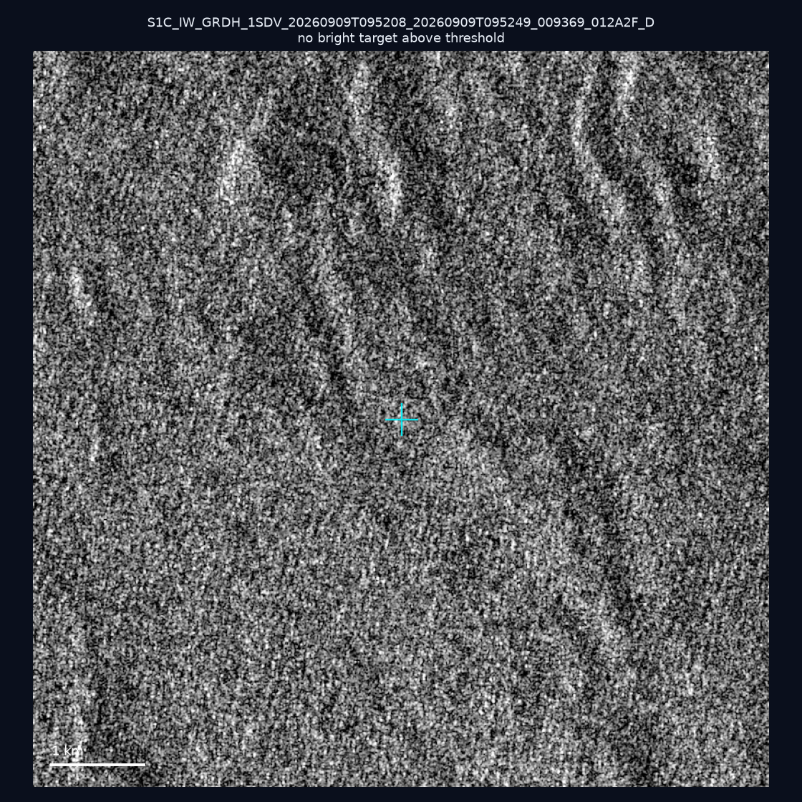
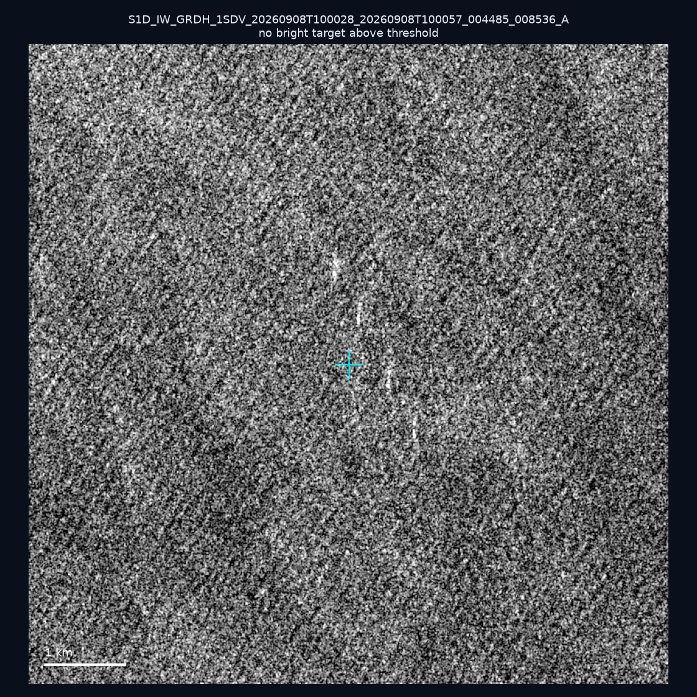
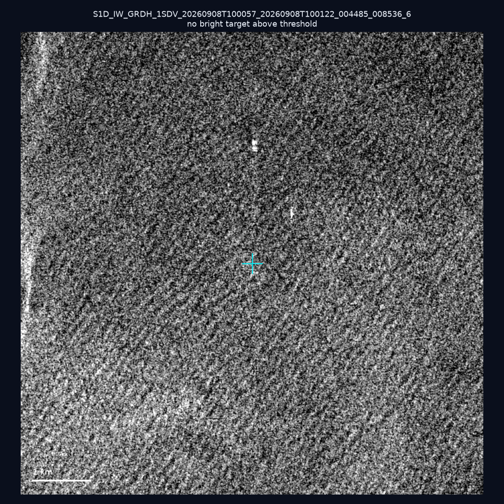
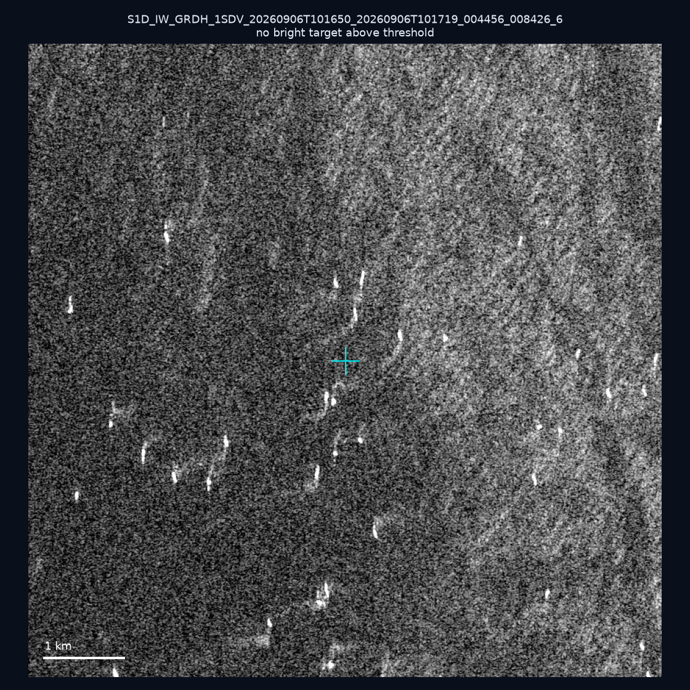
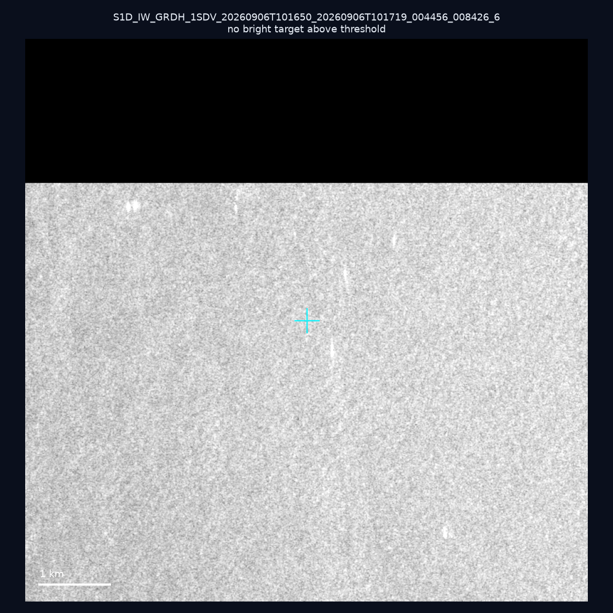
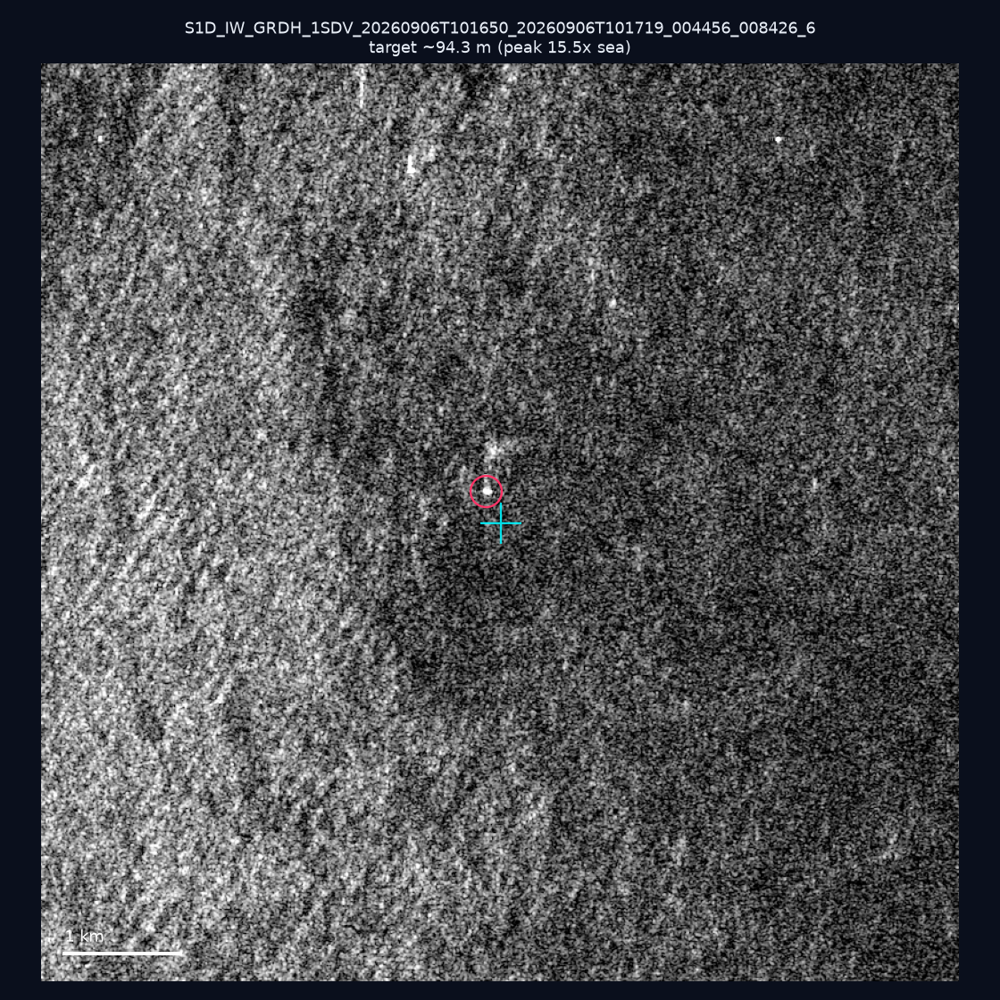
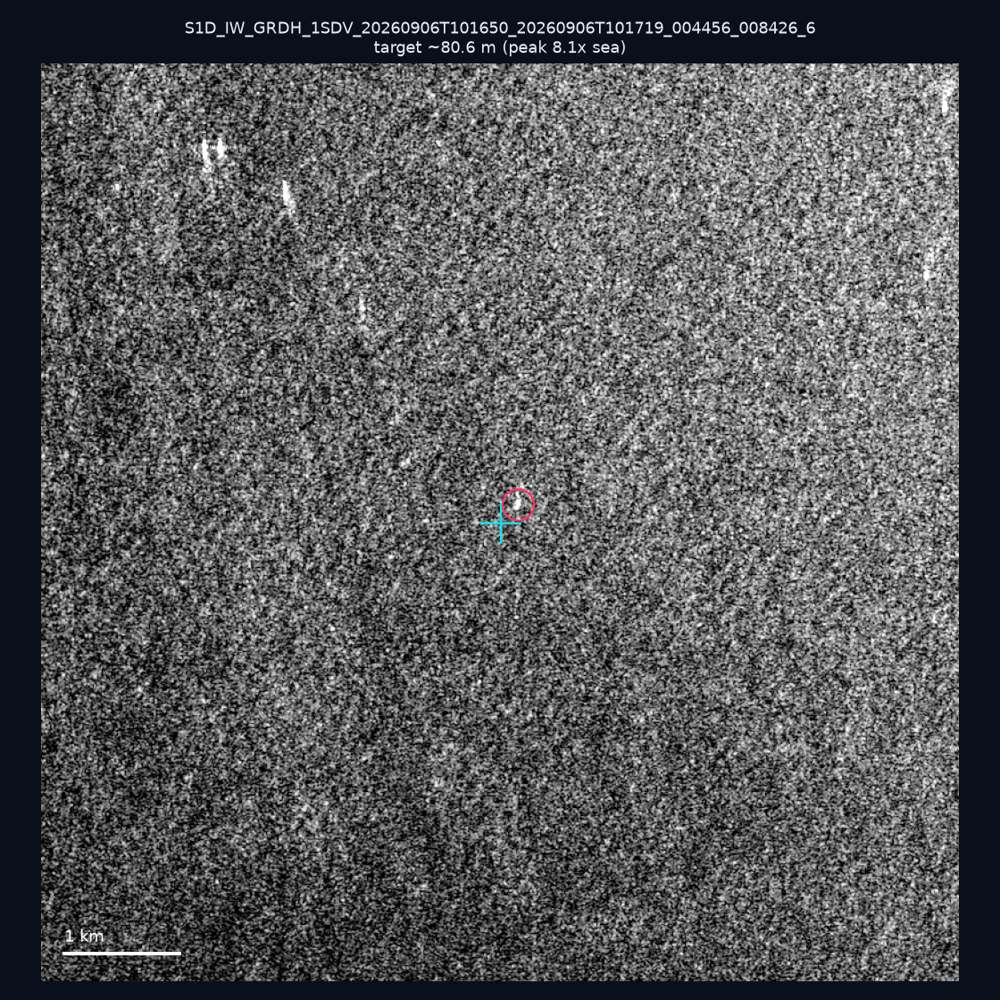

# 暗船 SAR 取證報告 — 2026-09-13

## 1. 總覽

- 執行時間：2026-09-13（GitHub Actions cron 自動執行）
- 線上比對摘要：暗偵測 14207 筆、殘餘暗船 11151 筆、假暗船剔除率 21.5%
- 本輪測試：10 筆
- 成功：10 筆
- 找到亮目標：3 筆
- 失敗：0 筆

## 2. 結果總表

| 日期 | 座標 | 海域 | 法域 | 成像時刻 | 判定 | 估計長度 | 峰值比 |
|------|------|------|------|----------|------|----------|--------|
| 2026-09-09 | 24.29, 124.19 | east | eez | 09:52:08 | 🟡 弱目標 | ~36.1 m | 3.5× |
| 2026-09-09 | 25.35, 123.65 | east | eez | 09:52:08 | ⚪ 無目標（雜訊或低RCS） | — | — |
| 2026-09-09 | 24.75, 122.22 | east | contiguous_zone | 09:52:08 | ⚪ 無目標（雜訊或低RCS） | — | — |
| 2026-09-09 | 25.48, 121.91 | east | internal_waters | 09:52:08 | ⚪ 無目標（雜訊或低RCS） | — | — |
| 2026-09-08 | 23.23, 121.53 | east | territorial_sea | 10:00:28 | ⚪ 無目標（雜訊或低RCS） | — | — |
| 2026-09-08 | 25.13, 121.97 | east | internal_waters | 10:00:57 | ⚪ 無目標（雜訊或低RCS） | — | — |
| 2026-09-06 | 23.27, 118.28 | southwest | eez | 10:16:50 | ⚪ 無目標（雜訊或低RCS） | — | — |
| 2026-09-06 | 22.94, 118.35 | southwest | eez | 10:16:50 | ⚪ 無目標（雜訊或低RCS） | — | — |
| 2026-09-06 | 23.04, 118.11 | southwest | eez | 10:16:50 | ✅ 確認實體目標 | ~94.3 m | 15.5× |
| 2026-09-06 | 23.02, 118.37 | southwest | eez | 10:16:50 | 🟡 弱目標 | ~80.6 m | 8.1× |

## 3. 逐目標段落

### 2026-09-09 (24.29, 124.19)

🟡 弱目標，估計長度 ~36.1 m，峰值 3.5× 海面背景（4 px）。

### 2026-09-09 (25.35, 123.65)

⚪ 無目標（雜訊或低RCS）。

### 2026-09-09 (24.75, 122.22)

⚪ 無目標（雜訊或低RCS）。

### 2026-09-09 (25.48, 121.91)

⚪ 無目標（雜訊或低RCS）。

### 2026-09-08 (23.23, 121.53)

⚪ 無目標（雜訊或低RCS）。

### 2026-09-08 (25.13, 121.97)

⚪ 無目標（雜訊或低RCS）。

### 2026-09-06 (23.27, 118.28)

⚪ 無目標（雜訊或低RCS）。

### 2026-09-06 (22.94, 118.35)

⚪ 無目標（雜訊或低RCS）。

### 2026-09-06 (23.04, 118.11)

✅ 確認實體目標，估計長度 ~94.3 m，峰值 15.5× 海面背景（28 px）。

### 2026-09-06 (23.02, 118.37)

🟡 弱目標，估計長度 ~80.6 m，峰值 8.1× 海面背景（20 px）。

## 4. 後續建議

- 值得人工深查（確認實體目標且長度 ≥ 50m）：
  - 2026-09-06 (23.04, 118.11) ~94.3 m — 建議比對周邊 AIS 船長
- 累積統計：全歷史 177 筆（有效 177 筆），確認實體目標 13 筆（7.3%）

> 所有結果是研判線索，不是法律認定；無目標 ≠ 誤報（小型木殼漁船 RCS 低，SAR 可能拍不到）。
