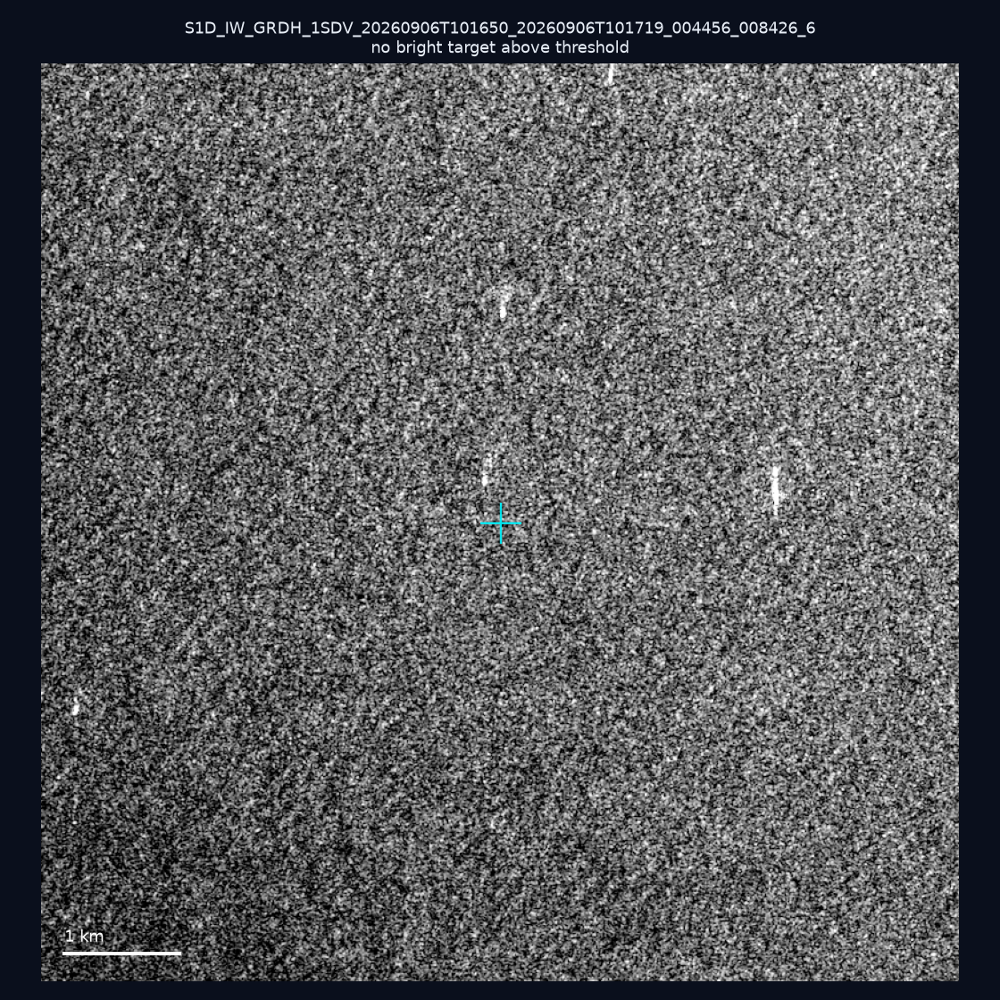
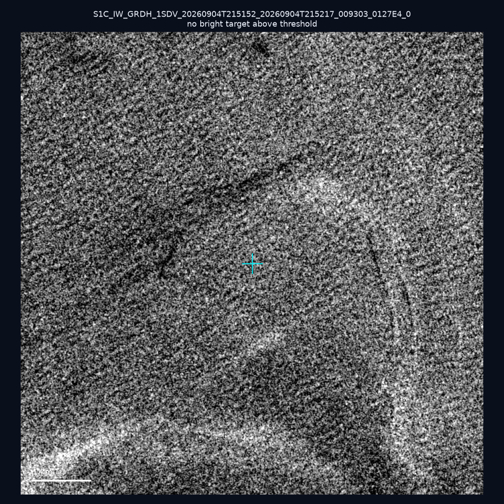
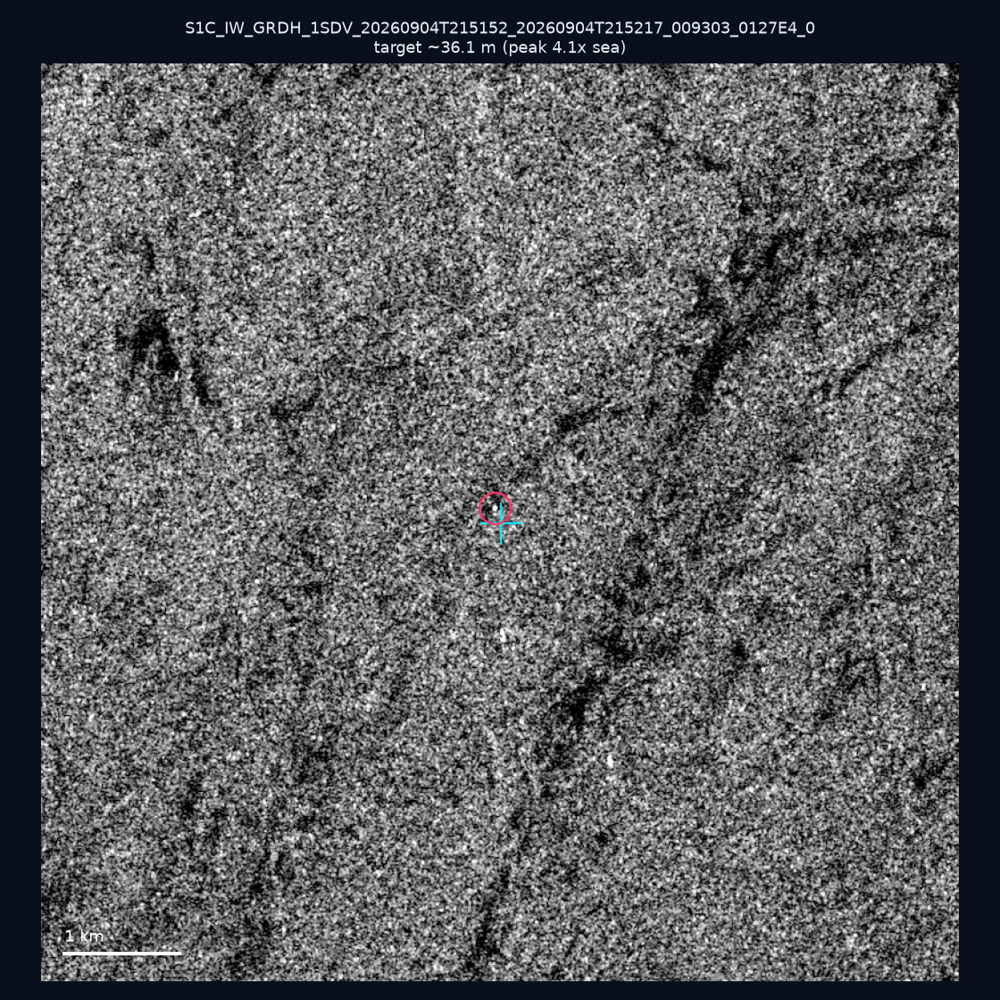
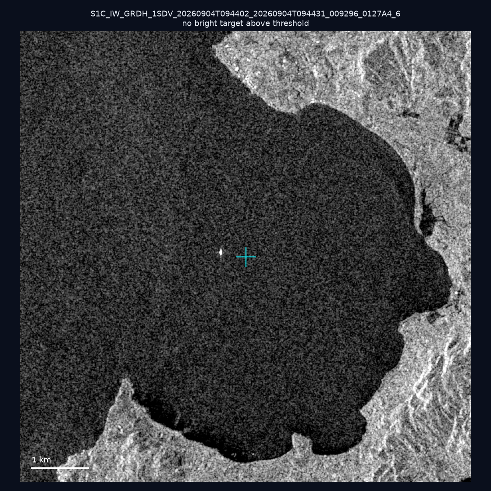
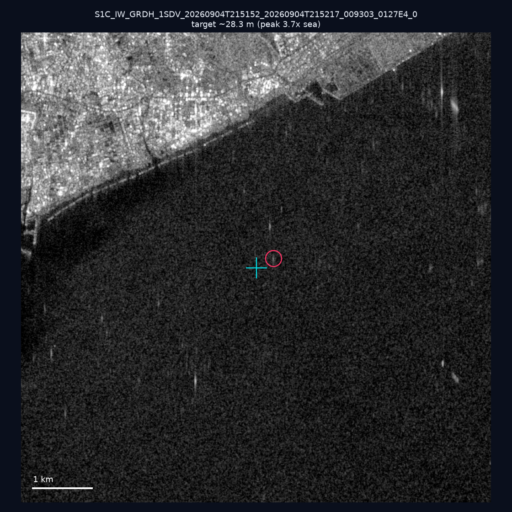
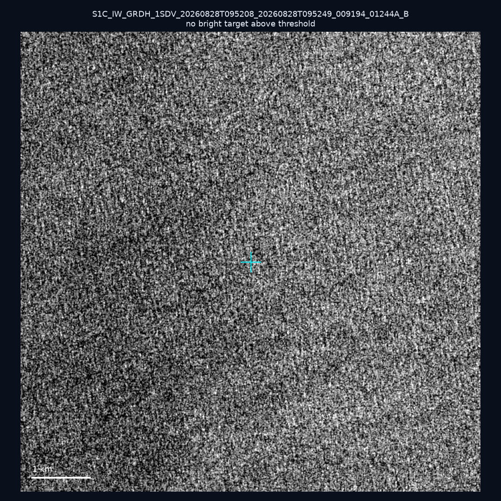
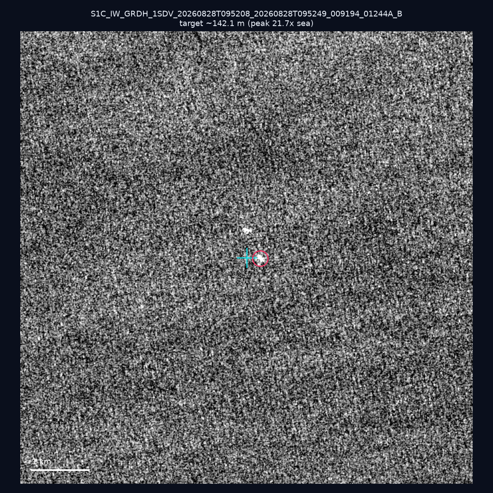
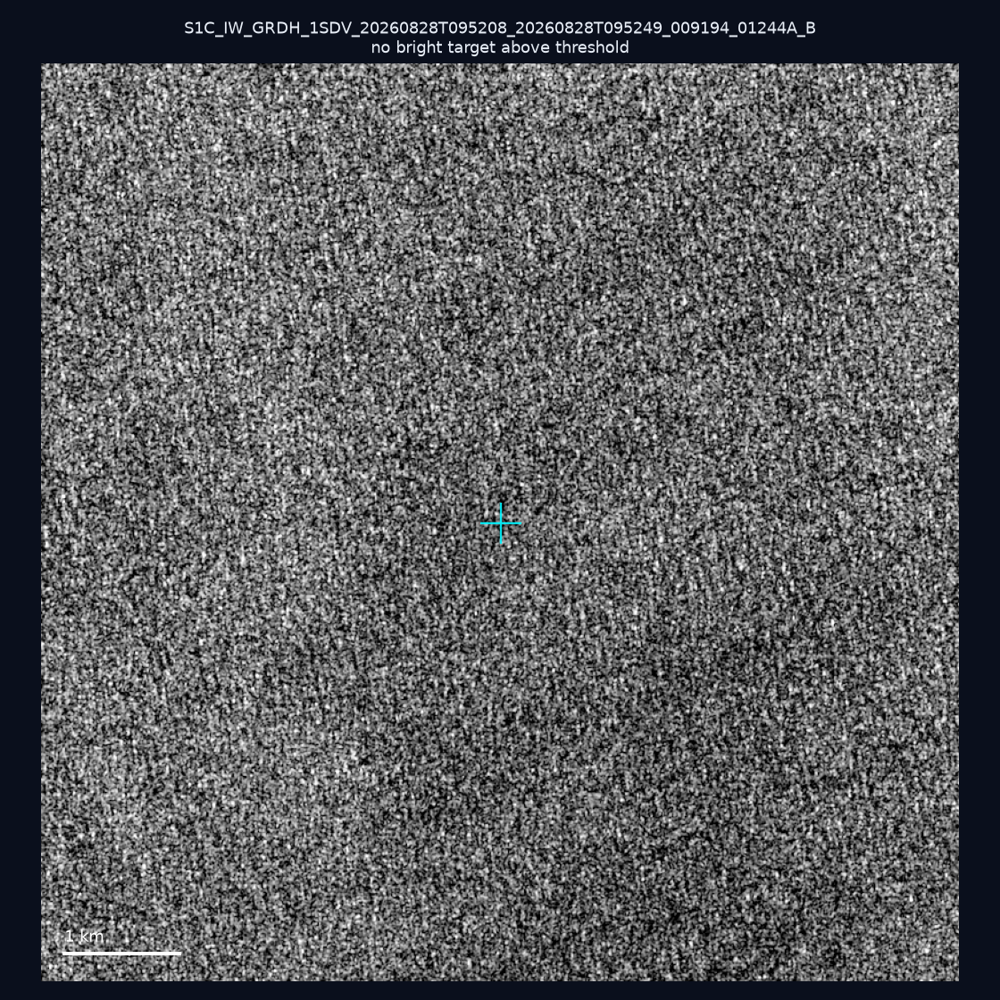
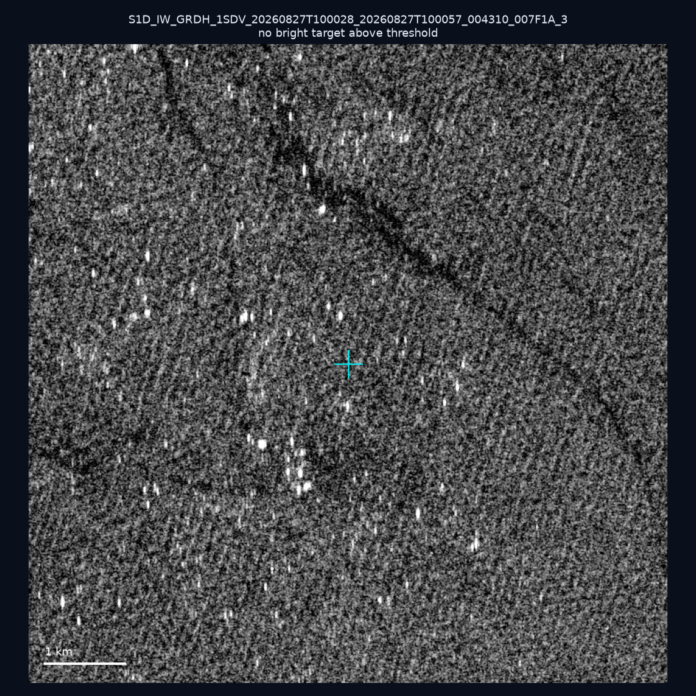
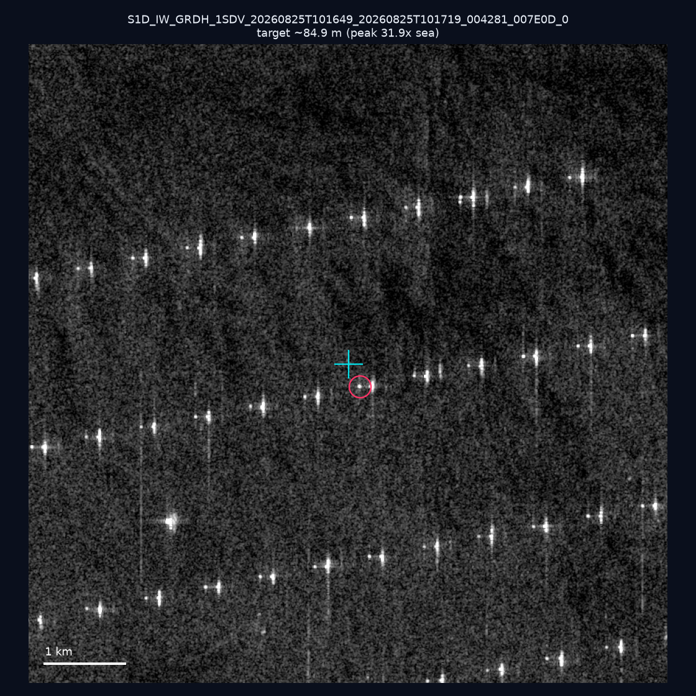

# 暗船 SAR 取證報告 — 2026-09-15

## 1. 總覽

- 執行時間：2026-09-15（GitHub Actions cron 自動執行）
- 線上比對摘要：暗偵測 14522 筆、殘餘暗船 11399 筆、假暗船剔除率 21.5%
- 本輪測試：10 筆
- 成功：10 筆
- 找到亮目標：4 筆
- 失敗：0 筆

## 2. 結果總表

| 日期 | 座標 | 海域 | 法域 | 成像時刻 | 判定 | 估計長度 | 峰值比 |
|------|------|------|------|----------|------|----------|--------|
| 2026-09-06 | 23.01, 118.41 | southwest | eez | 10:16:50 | ⚪ 無目標（雜訊或低RCS） | — | — |
| 2026-09-04 | 22.74, 121.59 | east | territorial_sea | 21:51:52 | ⚪ 無目標（雜訊或低RCS） | — | — |
| 2026-09-04 | 23.01, 119.69 | southwest | internal_waters | 21:51:52 | 🟡 弱目標 | ~36.1 m | 4.1× |
| 2026-09-04 | 24.4, 124.11 | east | eez | 09:44:02 | ⚪ 無目標（雜訊或低RCS） | — | — |
| 2026-09-04 | 22.48, 120.36 | southwest | internal_waters | 21:51:52 | 🟡 弱目標 | ~28.3 m | 3.7× |
| 2026-08-28 | 25.41, 123.16 | east | eez | 09:52:08 | ⚪ 無目標（雜訊或低RCS） | — | — |
| 2026-08-28 | 25.42, 123.6 | east | eez | 09:52:08 | ✅ 確認實體目標 | ~142.1 m | 21.7× |
| 2026-08-28 | 25.39, 123.12 | east | eez | 09:52:08 | ⚪ 無目標（雜訊或低RCS） | — | — |
| 2026-08-27 | 24.43, 122.04 | east | territorial_sea | 10:00:28 | ⚪ 無目標（雜訊或低RCS） | — | — |
| 2026-08-25 | 23.21, 117.01 | southwest | eez | 10:16:49 | ✅ 確認實體目標 | ~84.9 m | 31.9× |

## 3. 逐目標段落

### 2026-09-06 (23.01, 118.41)

⚪ 無目標（雜訊或低RCS）。

### 2026-09-04 (22.74, 121.59)

⚪ 無目標（雜訊或低RCS）。

### 2026-09-04 (23.01, 119.69)

🟡 弱目標，估計長度 ~36.1 m，峰值 4.1× 海面背景（6 px）。

### 2026-09-04 (24.4, 124.11)

⚪ 無目標（雜訊或低RCS）。

### 2026-09-04 (22.48, 120.36)

🟡 弱目標，估計長度 ~28.3 m，峰值 3.7× 海面背景（3 px）。

### 2026-08-28 (25.41, 123.16)

⚪ 無目標（雜訊或低RCS）。

### 2026-08-28 (25.42, 123.6)

✅ 確認實體目標，估計長度 ~142.1 m，峰值 21.7× 海面背景（58 px）。

### 2026-08-28 (25.39, 123.12)

⚪ 無目標（雜訊或低RCS）。

### 2026-08-27 (24.43, 122.04)

⚪ 無目標（雜訊或低RCS）。

### 2026-08-25 (23.21, 117.01)

✅ 確認實體目標，估計長度 ~84.9 m，峰值 31.9× 海面背景（26 px）。

## 4. 後續建議

- 值得人工深查（確認實體目標且長度 ≥ 50m）：
  - 2026-08-28 (25.42, 123.6) ~142.1 m — 建議比對周邊 AIS 船長
  - 2026-08-25 (23.21, 117.01) ~84.9 m — 建議比對周邊 AIS 船長
- 累積統計：全歷史 187 筆（有效 187 筆），確認實體目標 15 筆（8.0%）

> 所有結果是研判線索，不是法律認定；無目標 ≠ 誤報（小型木殼漁船 RCS 低，SAR 可能拍不到）。
