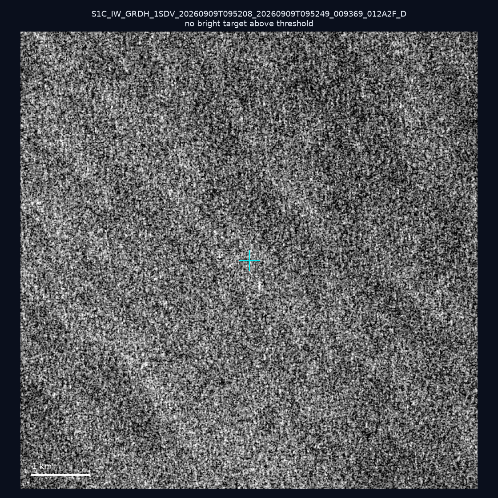
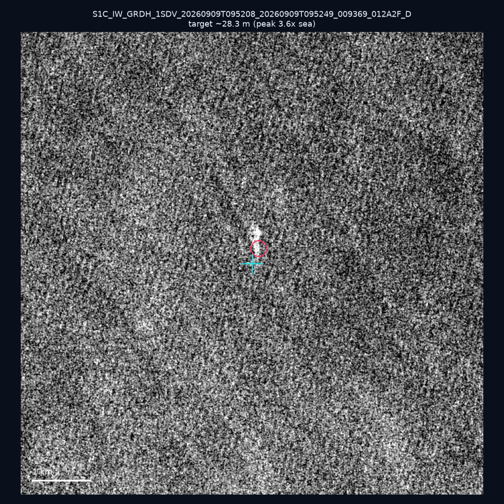
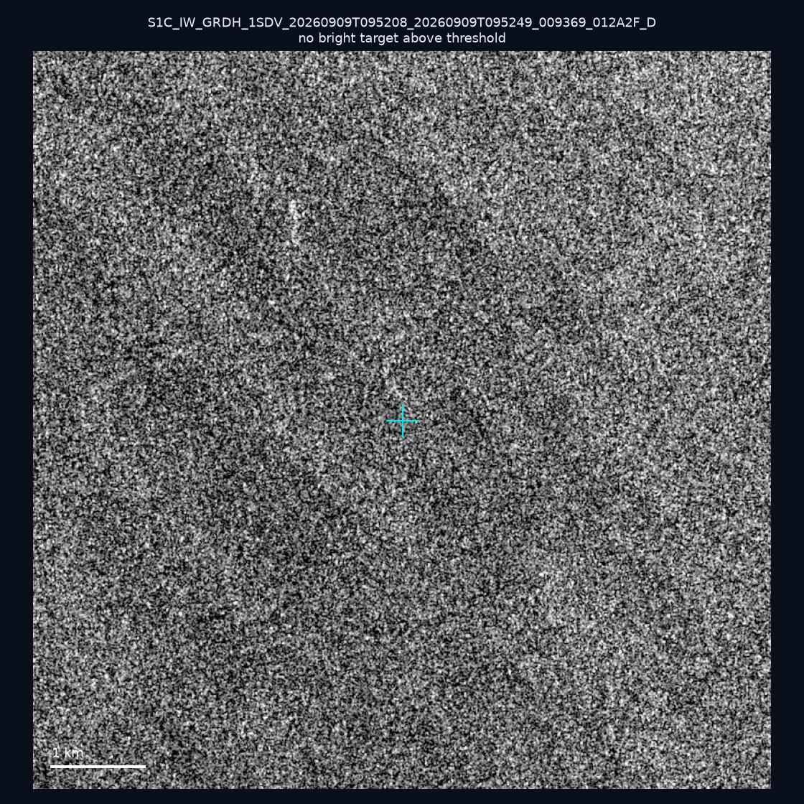
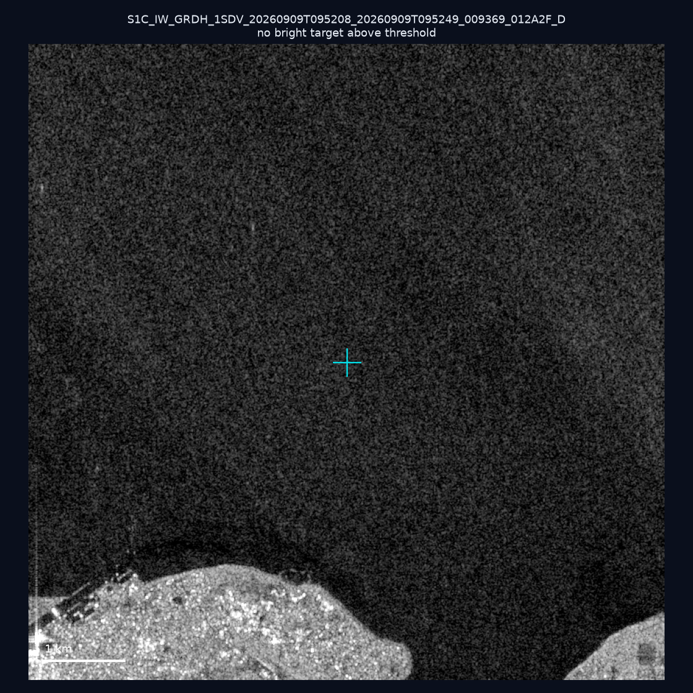
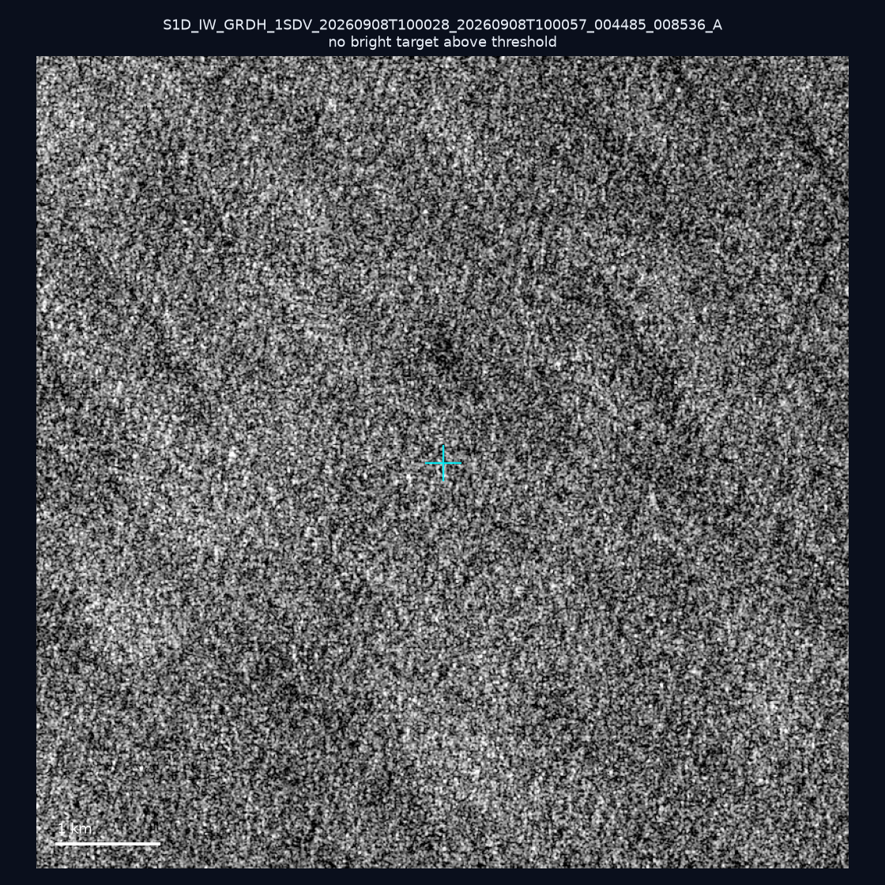
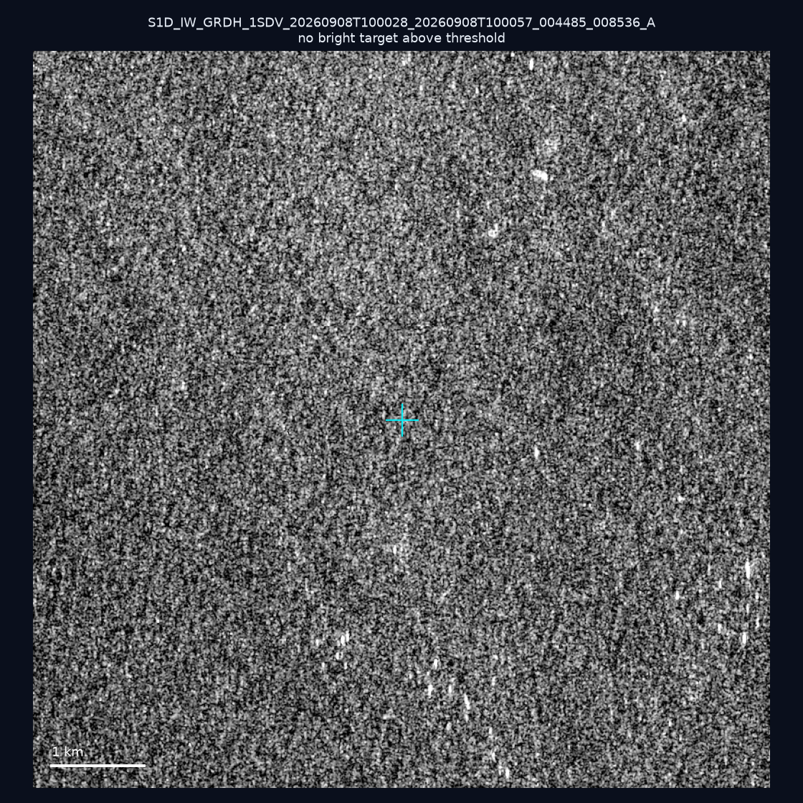
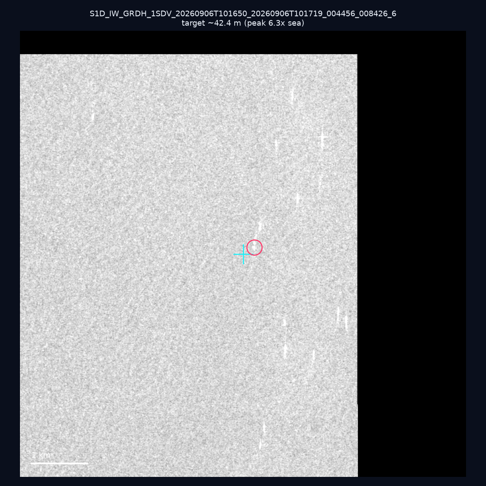
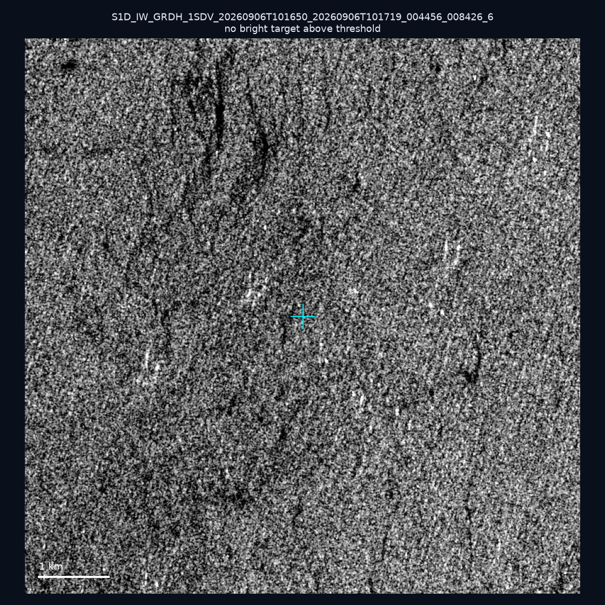
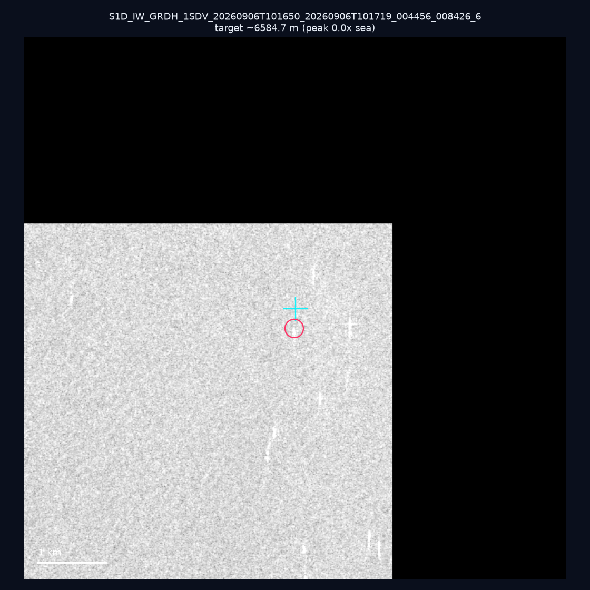
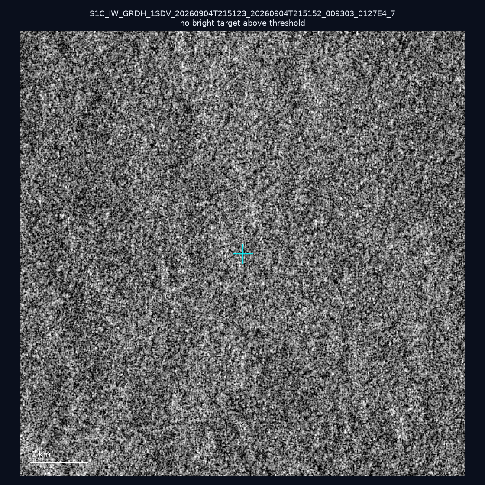

# 暗船 SAR 取證報告 — 2026-09-15

## 1. 總覽

- 執行時間：2026-09-15（GitHub Actions cron 自動執行）
- 線上比對摘要：暗偵測 14061 筆、殘餘暗船 11178 筆、假暗船剔除率 20.5%
- 本輪測試：10 筆
- 成功：10 筆
- 找到亮目標：3 筆
- 失敗：0 筆

## 2. 結果總表

| 日期 | 座標 | 海域 | 法域 | 成像時刻 | 判定 | 估計長度 | 峰值比 |
|------|------|------|------|----------|------|----------|--------|
| 2026-09-09 | 25.31, 123.84 | east | eez | 09:52:08 | ⚪ 無目標（雜訊或低RCS） | — | — |
| 2026-09-09 | 24.94, 123.77 | east | eez | 09:52:08 | 🟡 弱目標 | ~28.3 m | 3.6× |
| 2026-09-09 | 23.84, 124.27 | east | eez | 09:52:08 | ⚪ 無目標（雜訊或低RCS） | — | — |
| 2026-09-09 | 24.31, 124.2 | east | eez | 09:52:08 | ⚪ 無目標（雜訊或低RCS） | — | — |
| 2026-09-08 | 23.87, 121.72 | east | territorial_sea | 10:00:28 | ⚪ 無目標（雜訊或低RCS） | — | — |
| 2026-09-08 | 24.41, 121.96 | east | territorial_sea | 10:00:28 | ⚪ 無目標（雜訊或低RCS） | — | — |
| 2026-09-06 | 22.98, 118.5 | southwest | eez | 10:16:50 | 🟡 弱目標 | ~42.4 m | 6.3× |
| 2026-09-06 | 23.31, 117.2 | southwest | eez | 10:16:50 | ⚪ 無目標（雜訊或低RCS） | — | — |
| 2026-09-06 | 22.96, 118.51 | southwest | eez | 10:16:50 | ⚠️ 疑似陸地/固定結構 | ~6584.7 m | — |
| 2026-09-04 | 25.44, 121.78 | east | internal_waters | 21:51:23 | ⚪ 無目標（雜訊或低RCS） | — | — |

## 3. 逐目標段落

### 2026-09-09 (25.31, 123.84)

⚪ 無目標（雜訊或低RCS）。

### 2026-09-09 (24.94, 123.77)

🟡 弱目標，估計長度 ~28.3 m，峰值 3.6× 海面背景（3 px）。

### 2026-09-09 (23.84, 124.27)

⚪ 無目標（雜訊或低RCS）。

### 2026-09-09 (24.31, 124.2)

⚪ 無目標（雜訊或低RCS）。

### 2026-09-08 (23.87, 121.72)

⚪ 無目標（雜訊或低RCS）。

### 2026-09-08 (24.41, 121.96)

⚪ 無目標（雜訊或低RCS）。

### 2026-09-06 (22.98, 118.5)

🟡 弱目標，估計長度 ~42.4 m，峰值 6.3× 海面背景（7 px）。

### 2026-09-06 (23.31, 117.2)

⚪ 無目標（雜訊或低RCS）。

### 2026-09-06 (22.96, 118.51)

⚠️ 疑似陸地/固定結構，估計長度 ~6584.7 m，峰值 0.0× 海面背景（4001 px）。

### 2026-09-04 (25.44, 121.78)

⚪ 無目標（雜訊或低RCS）。

## 4. 後續建議

- 累積統計：全歷史 197 筆（有效 197 筆），確認實體目標 15 筆（7.6%）

> 所有結果是研判線索，不是法律認定；無目標 ≠ 誤報（小型木殼漁船 RCS 低，SAR 可能拍不到）。
