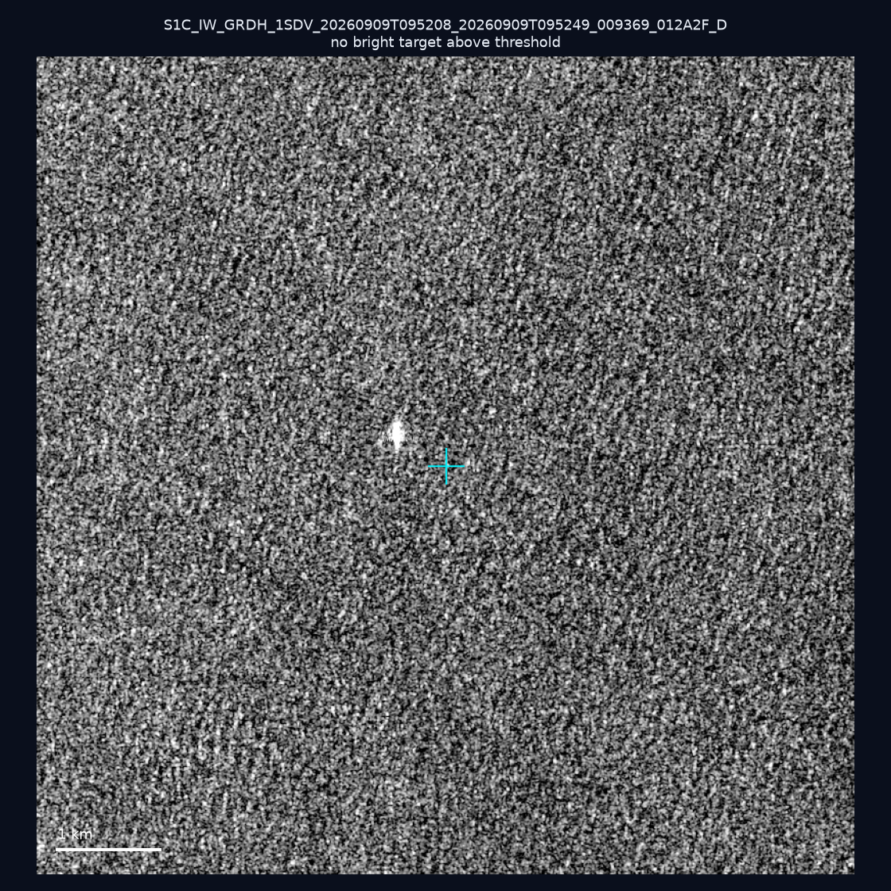
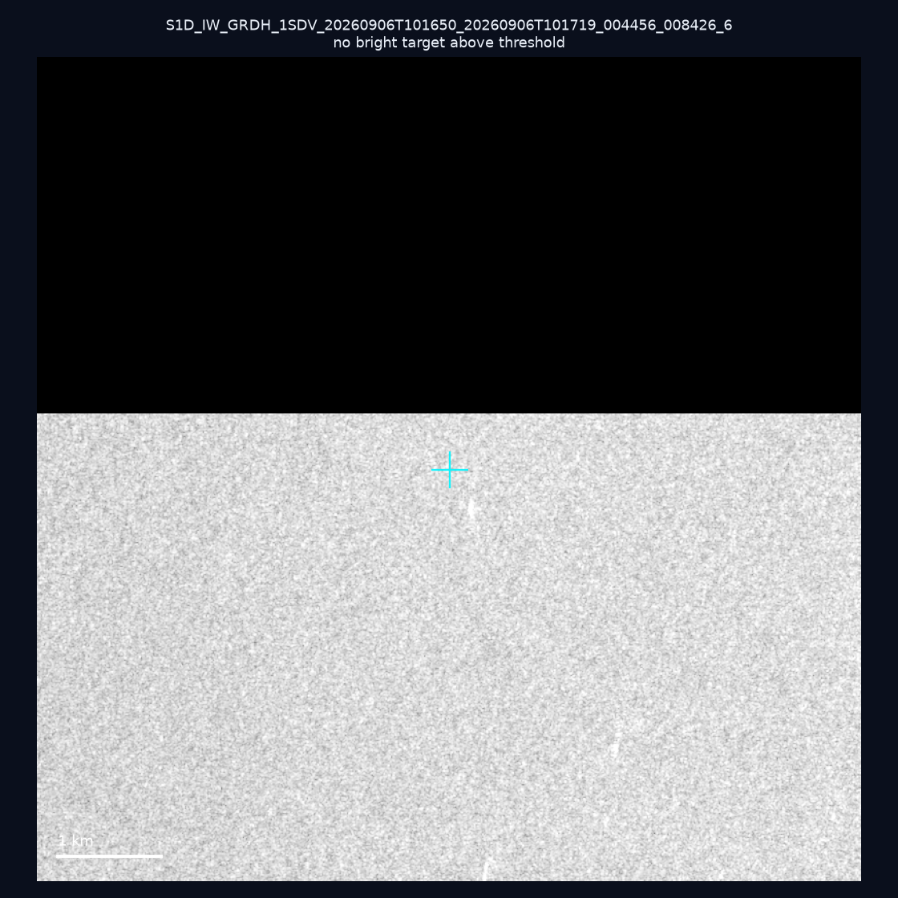
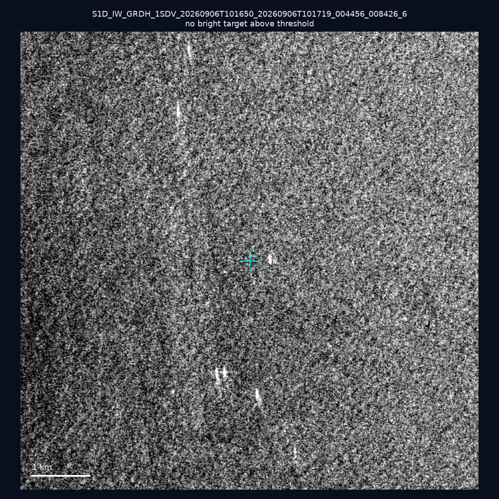
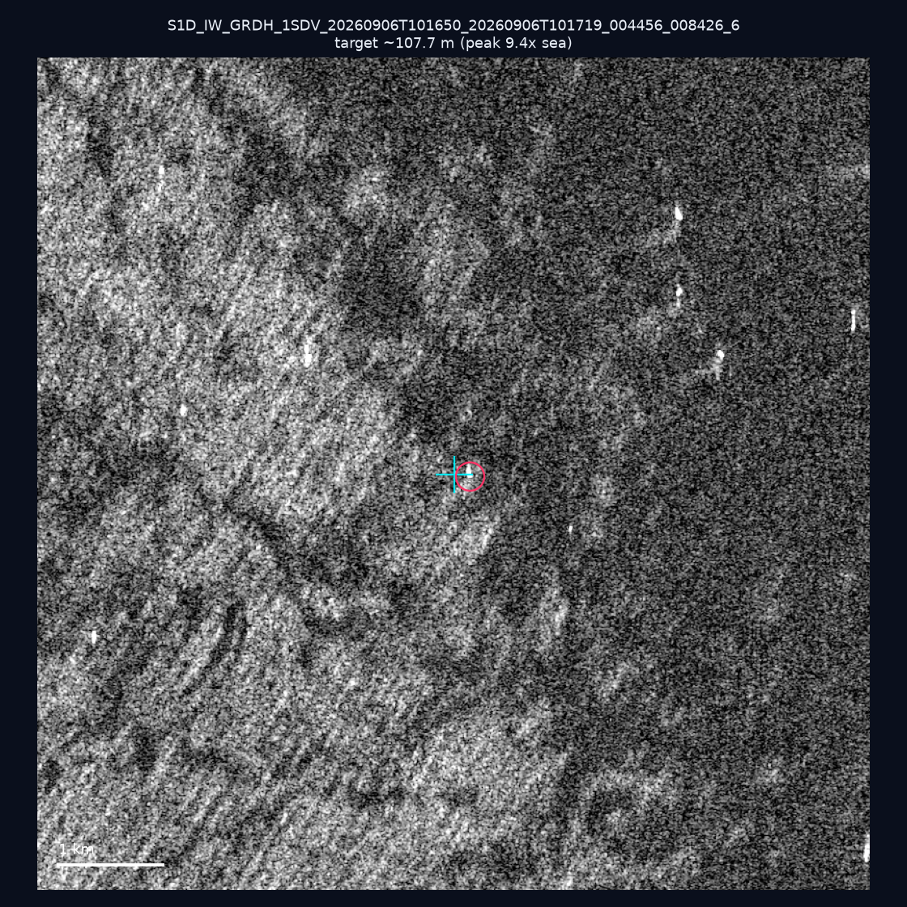
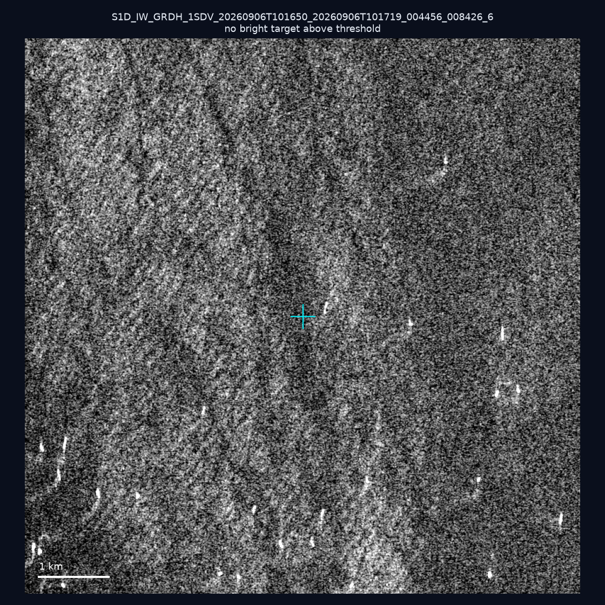
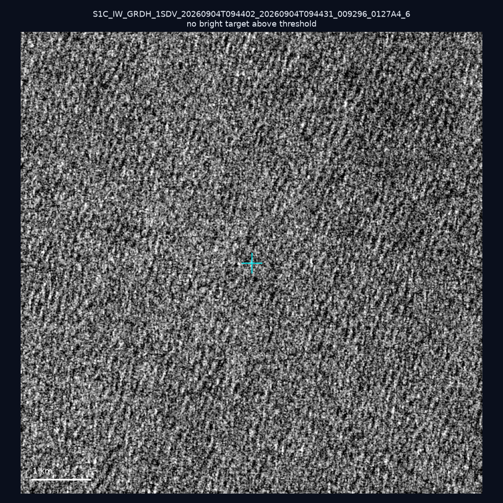
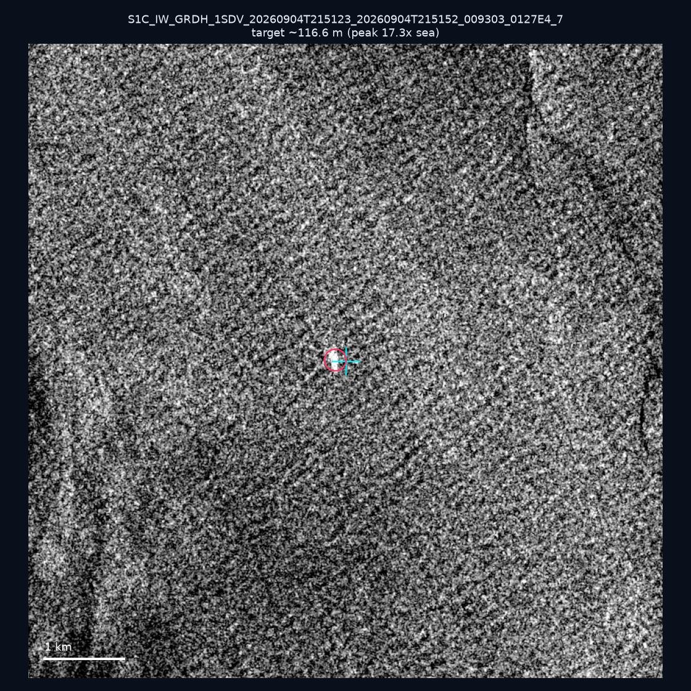
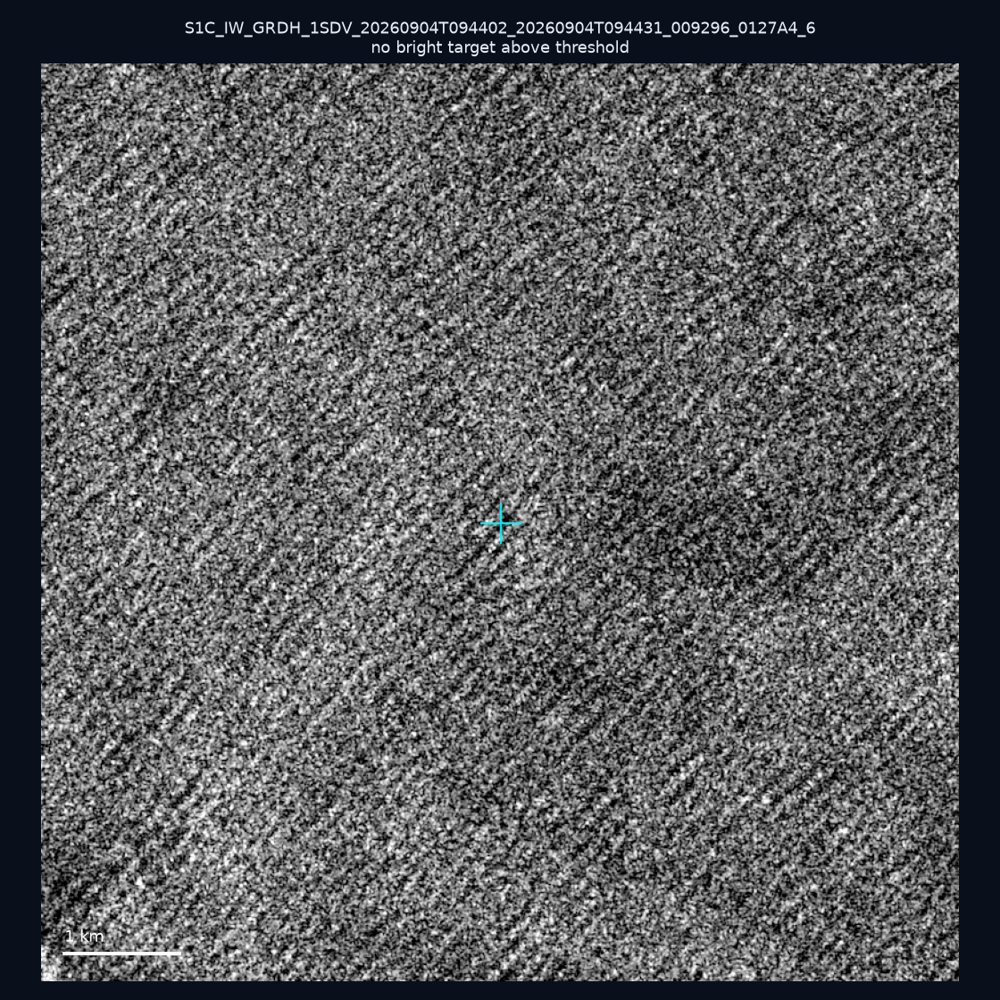
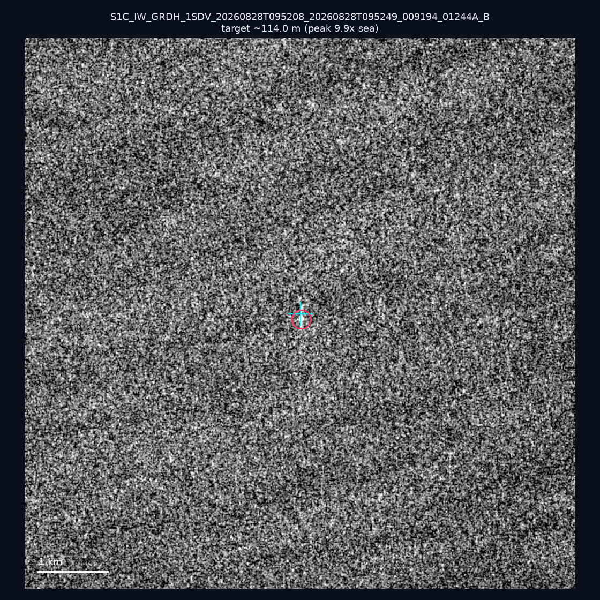
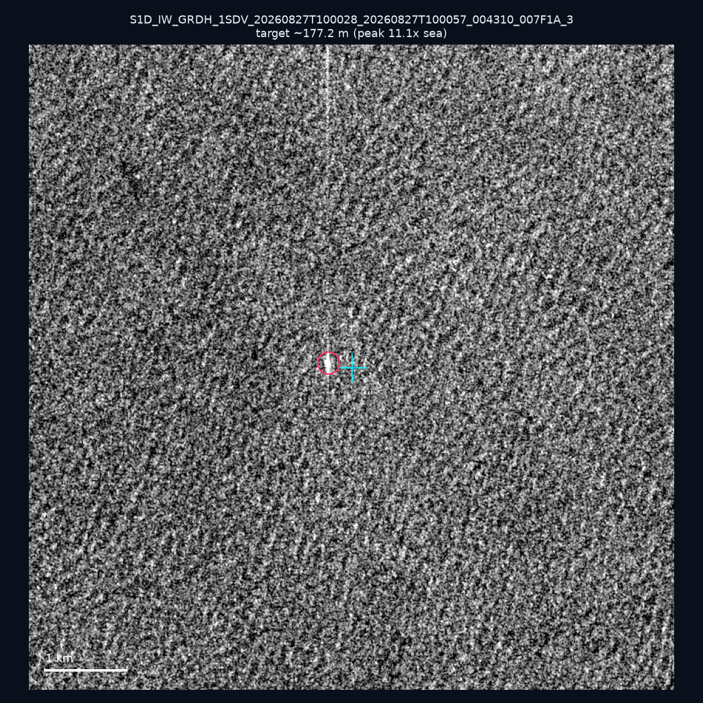

# 暗船 SAR 取證報告 — 2026-09-17

## 1. 總覽

- 執行時間：2026-09-17（GitHub Actions cron 自動執行）
- 線上比對摘要：暗偵測 12312 筆、殘餘暗船 9733 筆、假暗船剔除率 20.9%
- 本輪測試：10 筆
- 成功：10 筆
- 找到亮目標：4 筆
- 失敗：0 筆

## 2. 結果總表

| 日期 | 座標 | 海域 | 法域 | 成像時刻 | 判定 | 估計長度 | 峰值比 |
|------|------|------|------|----------|------|----------|--------|
| 2026-09-09 | 24.45, 121.94 | east | territorial_sea | 09:52:08 | ⚪ 無目標（雜訊或低RCS） | — | — |
| 2026-09-06 | 22.94, 118.43 | southwest | eez | 10:16:50 | ⚪ 無目標（雜訊或低RCS） | — | — |
| 2026-09-06 | 22.97, 118.36 | southwest | eez | 10:16:50 | ⚪ 無目標（雜訊或低RCS） | — | — |
| 2026-09-06 | 23.32, 118.22 | southwest | eez | 10:16:50 | 🟡 弱目標 | ~107.7 m | 9.4× |
| 2026-09-06 | 23.25, 118.32 | southwest | eez | 10:16:50 | ⚪ 無目標（雜訊或低RCS） | — | — |
| 2026-09-04 | 25.24, 123.92 | east | eez | 09:44:02 | ⚪ 無目標（雜訊或低RCS） | — | — |
| 2026-09-04 | 24.04, 121.75 | east | territorial_sea | 21:51:23 | ✅ 確認實體目標 | ~116.6 m | 17.3× |
| 2026-09-04 | 24.52, 124.08 | east | eez | 09:44:02 | ⚪ 無目標（雜訊或低RCS） | — | — |
| 2026-08-28 | 25.01, 123.68 | east | eez | 09:52:08 | 🟡 弱目標 | ~114.0 m | 9.9× |
| 2026-08-27 | 23.18, 121.6 | east | territorial_sea | 10:00:28 | ✅ 確認實體目標 | ~177.2 m | 11.1× |

## 3. 逐目標段落

### 2026-09-09 (24.45, 121.94)

⚪ 無目標（雜訊或低RCS）。

### 2026-09-06 (22.94, 118.43)

⚪ 無目標（雜訊或低RCS）。

### 2026-09-06 (22.97, 118.36)

⚪ 無目標（雜訊或低RCS）。

### 2026-09-06 (23.32, 118.22)

🟡 弱目標，估計長度 ~107.7 m，峰值 9.4× 海面背景（32 px）。

### 2026-09-06 (23.25, 118.32)

⚪ 無目標（雜訊或低RCS）。

### 2026-09-04 (25.24, 123.92)

⚪ 無目標（雜訊或低RCS）。

### 2026-09-04 (24.04, 121.75)

✅ 確認實體目標，估計長度 ~116.6 m，峰值 17.3× 海面背景（42 px）。

### 2026-09-04 (24.52, 124.08)

⚪ 無目標（雜訊或低RCS）。

### 2026-08-28 (25.01, 123.68)

🟡 弱目標，估計長度 ~114.0 m，峰值 9.9× 海面背景（36 px）。

### 2026-08-27 (23.18, 121.6)

✅ 確認實體目標，估計長度 ~177.2 m，峰值 11.1× 海面背景（52 px）。

## 4. 後續建議

- 值得人工深查（確認實體目標且長度 ≥ 50m）：
  - 2026-09-04 (24.04, 121.75) ~116.6 m — 建議比對周邊 AIS 船長
  - 2026-08-27 (23.18, 121.6) ~177.2 m — 建議比對周邊 AIS 船長
- 累積統計：全歷史 207 筆（有效 207 筆），確認實體目標 17 筆（8.2%）

> 所有結果是研判線索，不是法律認定；無目標 ≠ 誤報（小型木殼漁船 RCS 低，SAR 可能拍不到）。
