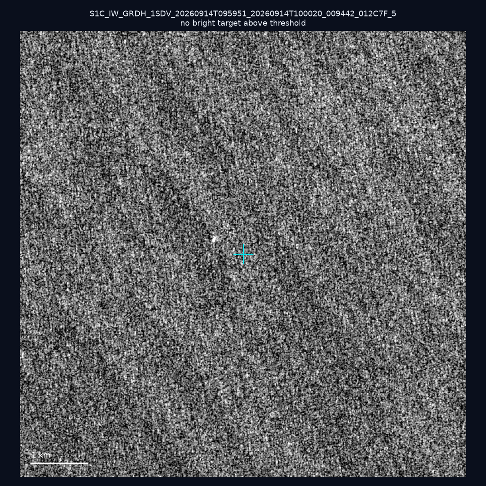
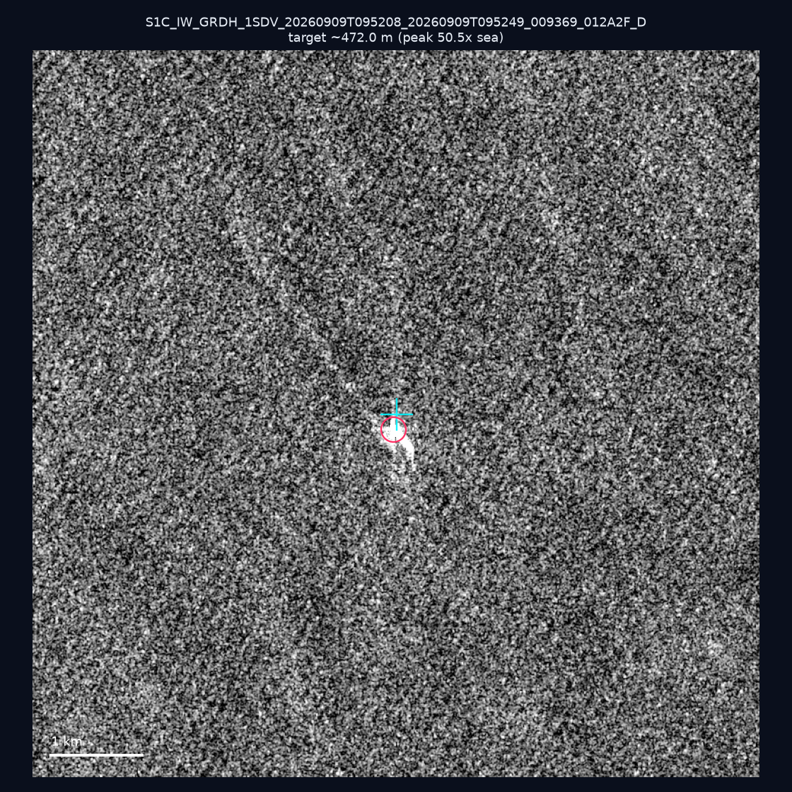
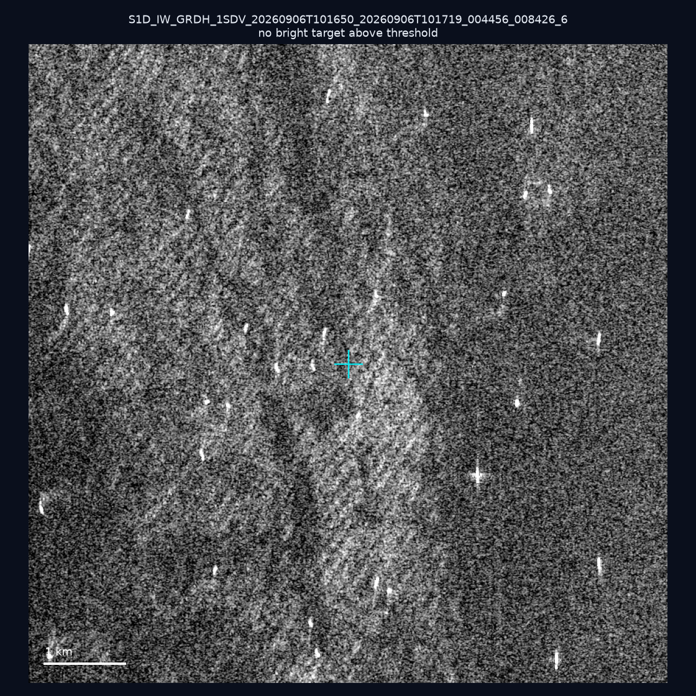
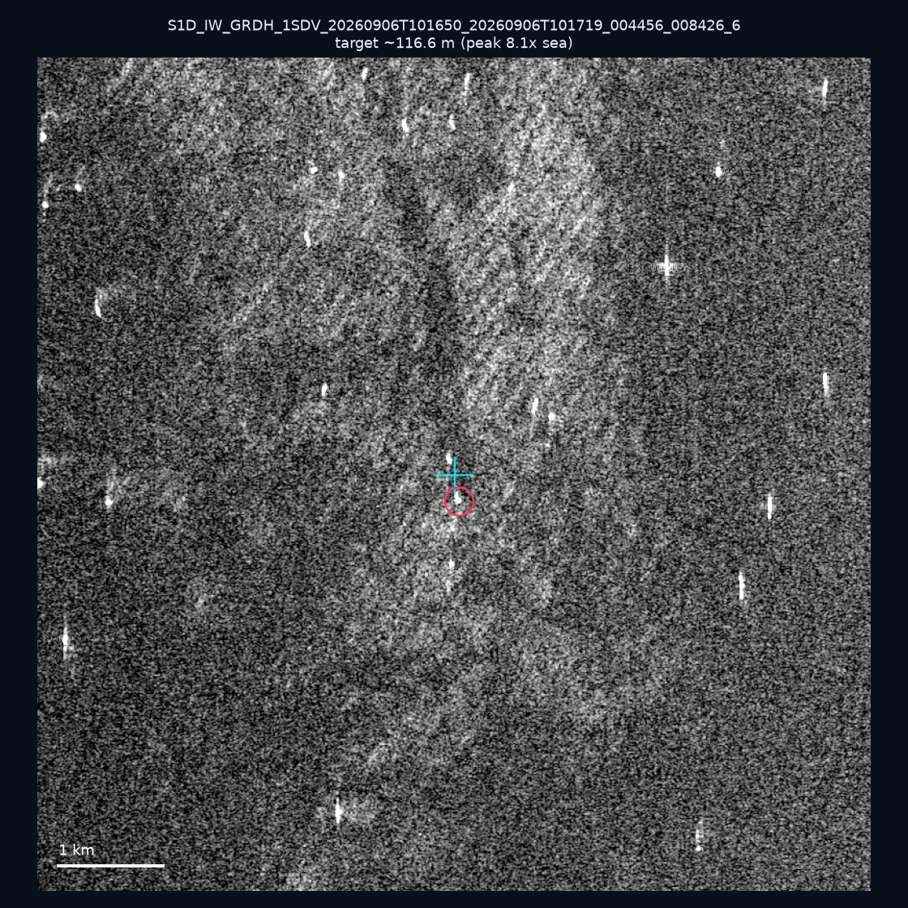
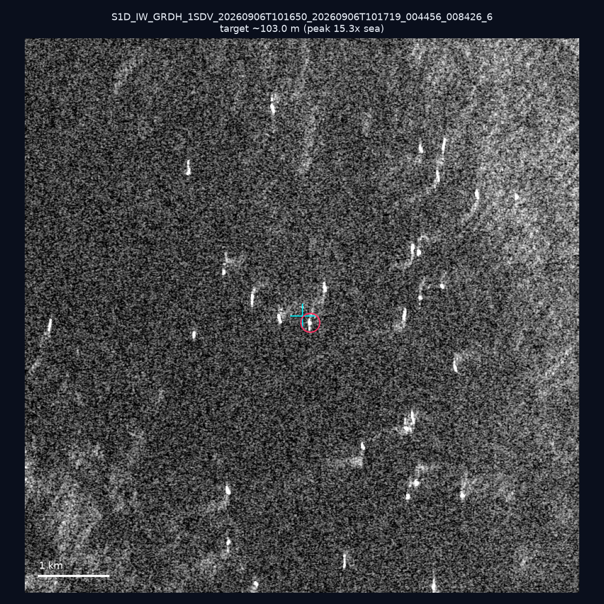
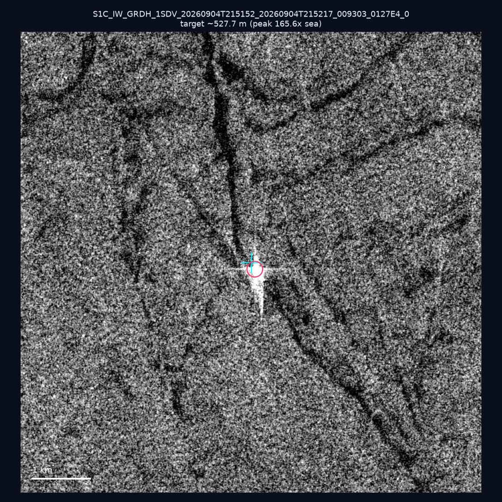
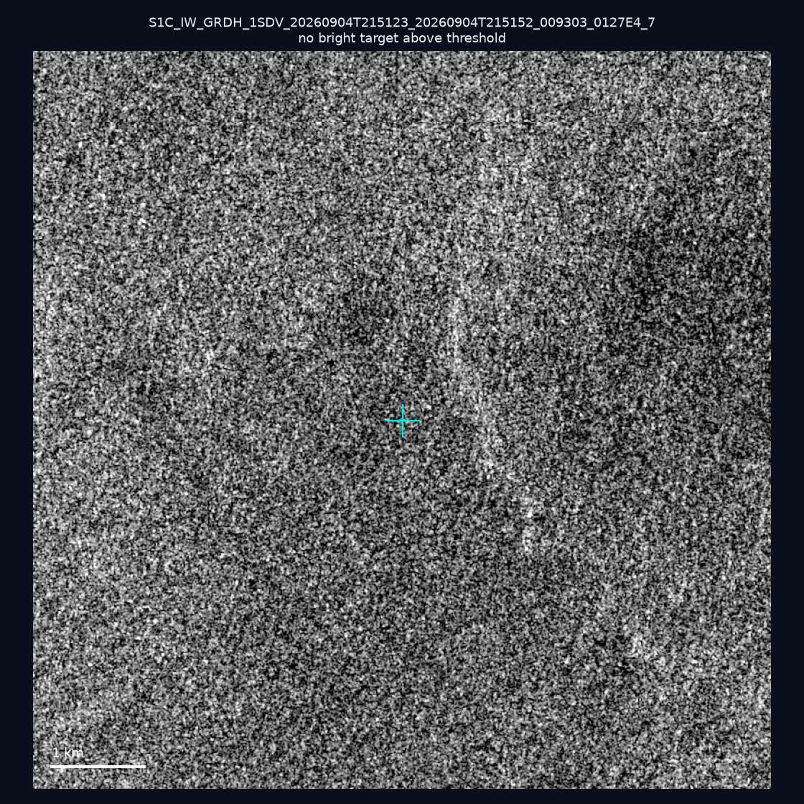
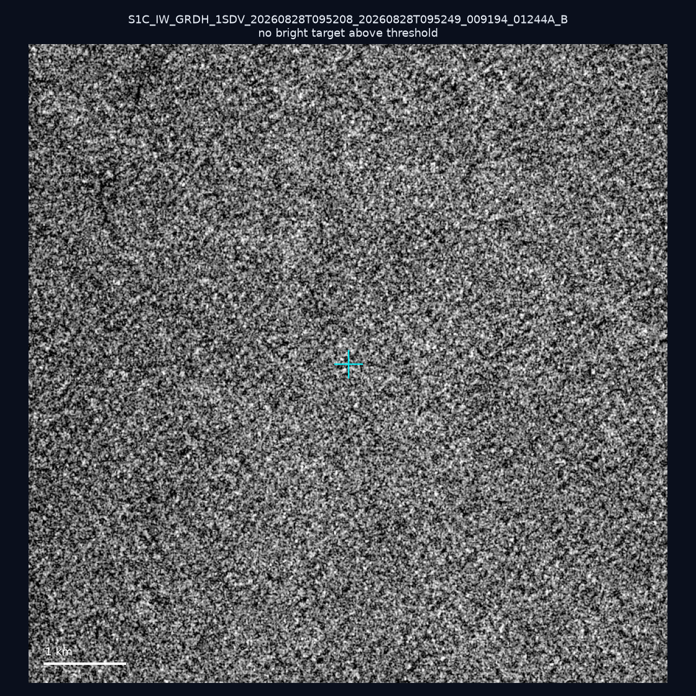
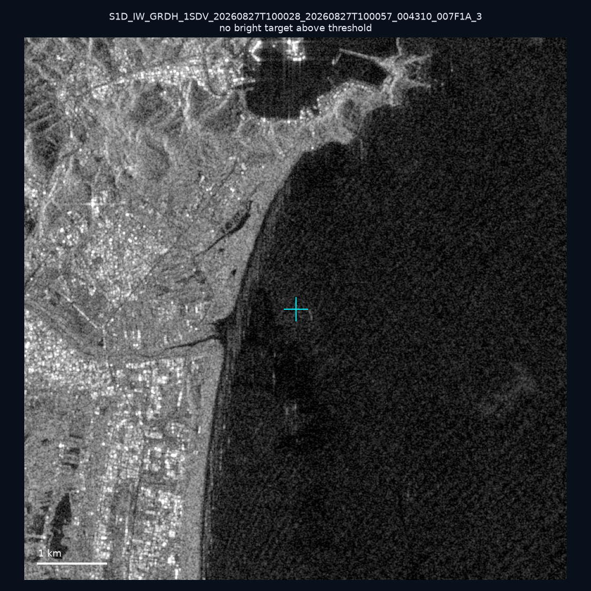
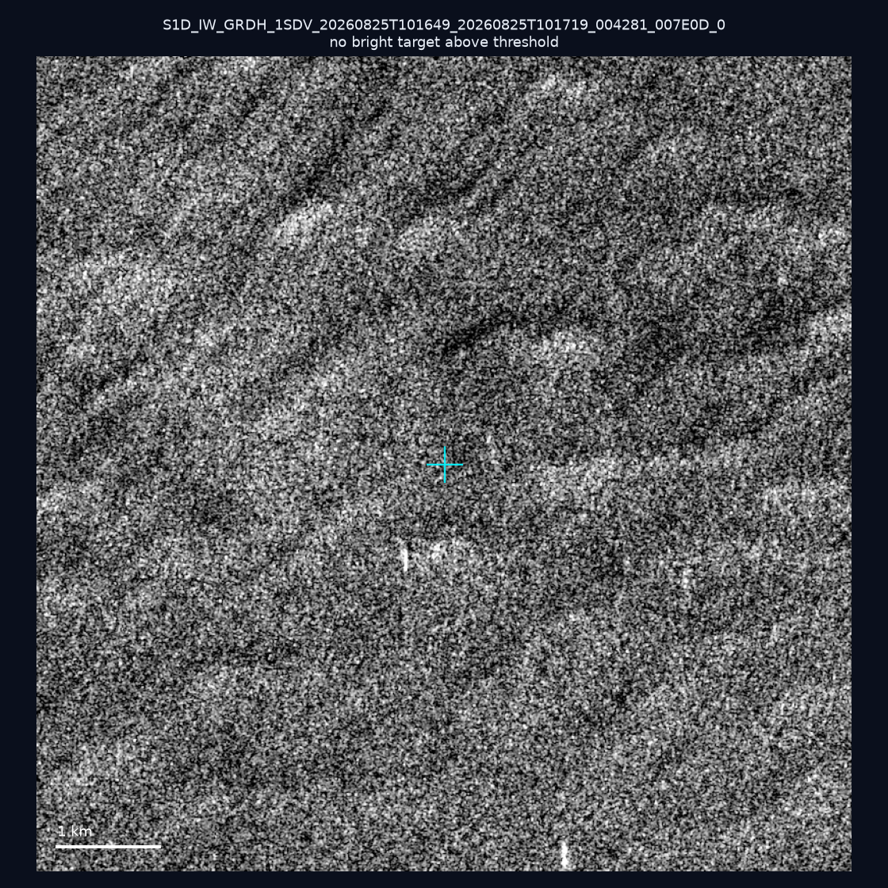

# 暗船 SAR 取證報告 — 2026-09-17

## 1. 總覽

- 執行時間：2026-09-17（GitHub Actions cron 自動執行）
- 線上比對摘要：暗偵測 12578 筆、殘餘暗船 9849 筆、假暗船剔除率 21.7%
- 本輪測試：10 筆
- 成功：10 筆
- 找到亮目標：4 筆
- 失敗：0 筆

## 2. 結果總表

| 日期 | 座標 | 海域 | 法域 | 成像時刻 | 判定 | 估計長度 | 峰值比 |
|------|------|------|------|----------|------|----------|--------|
| 2026-09-14 | 22.09, 122.0 | east | contiguous_zone | 09:59:51 | ⚪ 無目標（雜訊或低RCS） | — | — |
| 2026-09-09 | 24.06, 123.05 | east | eez | 09:52:08 | ✅ 確認實體目標 | ~472.0 m | 50.5× |
| 2026-09-06 | 23.28, 118.32 | southwest | eez | 10:16:50 | ⚪ 無目標（雜訊或低RCS） | — | — |
| 2026-09-06 | 23.31, 118.31 | southwest | eez | 10:16:50 | 🟡 弱目標 | ~116.6 m | 8.1× |
| 2026-09-06 | 23.28, 118.26 | southwest | eez | 10:16:50 | ✅ 確認實體目標 | ~103.0 m | 15.3× |
| 2026-09-04 | 23.12, 119.74 | southwest | internal_waters | 21:51:52 | ✅ 確認實體目標 | ~527.7 m | 165.6× |
| 2026-09-04 | 24.94, 122.07 | east | territorial_sea | 21:51:23 | ⚪ 無目標（雜訊或低RCS） | — | — |
| 2026-08-28 | 24.28, 122.68 | east | eez | 09:52:08 | ⚪ 無目標（雜訊或低RCS） | — | — |
| 2026-08-27 | 24.63, 121.86 | east | internal_waters | 10:00:28 | ⚪ 無目標（雜訊或低RCS） | — | — |
| 2026-08-25 | 22.93, 117.88 | southwest | eez | 10:16:49 | ⚪ 無目標（雜訊或低RCS） | — | — |

## 3. 逐目標段落

### 2026-09-14 (22.09, 122.0)

⚪ 無目標（雜訊或低RCS）。

### 2026-09-09 (24.06, 123.05)

✅ 確認實體目標，估計長度 ~472.0 m，峰值 50.5× 海面背景（310 px）。

### 2026-09-06 (23.28, 118.32)

⚪ 無目標（雜訊或低RCS）。

### 2026-09-06 (23.31, 118.31)

🟡 弱目標，估計長度 ~116.6 m，峰值 8.1× 海面背景（34 px）。

### 2026-09-06 (23.28, 118.26)

✅ 確認實體目標，估計長度 ~103.0 m，峰值 15.3× 海面背景（28 px）。

### 2026-09-04 (23.12, 119.74)

✅ 確認實體目標，估計長度 ~527.7 m，峰值 165.6× 海面背景（504 px）。

### 2026-09-04 (24.94, 122.07)

⚪ 無目標（雜訊或低RCS）。

### 2026-08-28 (24.28, 122.68)

⚪ 無目標（雜訊或低RCS）。

### 2026-08-27 (24.63, 121.86)

⚪ 無目標（雜訊或低RCS）。

### 2026-08-25 (22.93, 117.88)

⚪ 無目標（雜訊或低RCS）。

## 4. 後續建議

- 值得人工深查（確認實體目標且長度 ≥ 50m）：
  - 2026-09-09 (24.06, 123.05) ~472.0 m — 建議比對周邊 AIS 船長
  - 2026-09-06 (23.28, 118.26) ~103.0 m — 建議比對周邊 AIS 船長
  - 2026-09-04 (23.12, 119.74) ~527.7 m — 建議比對周邊 AIS 船長
- 累積統計：全歷史 217 筆（有效 217 筆），確認實體目標 20 筆（9.2%）

> 所有結果是研判線索，不是法律認定；無目標 ≠ 誤報（小型木殼漁船 RCS 低，SAR 可能拍不到）。
