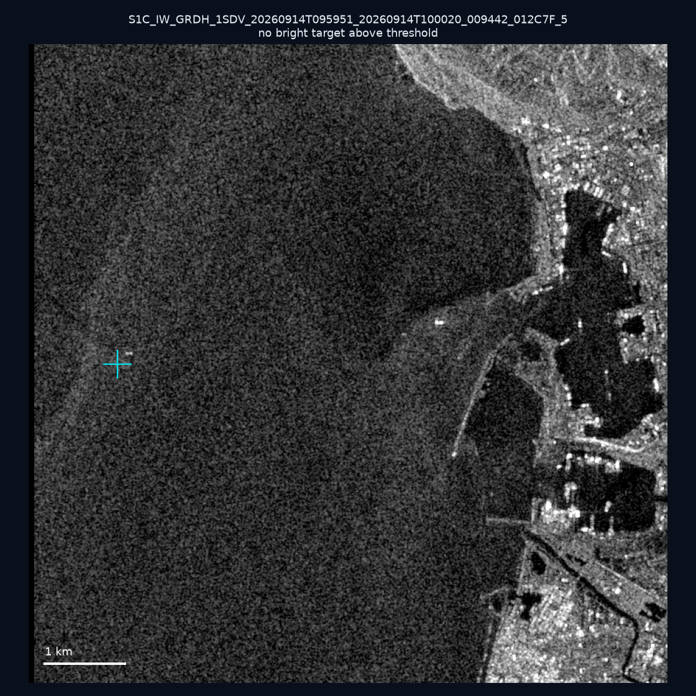
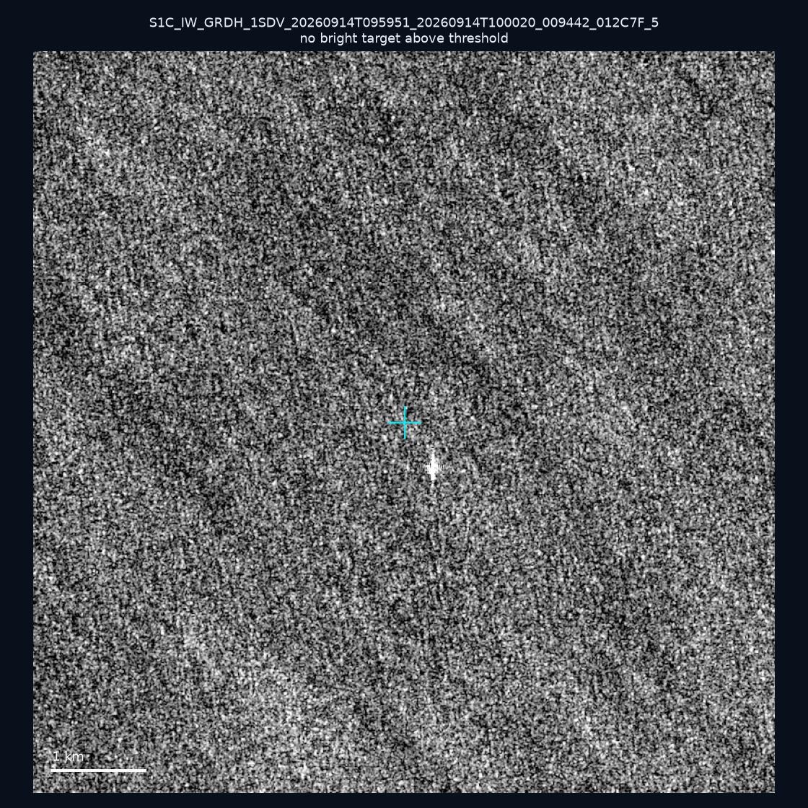
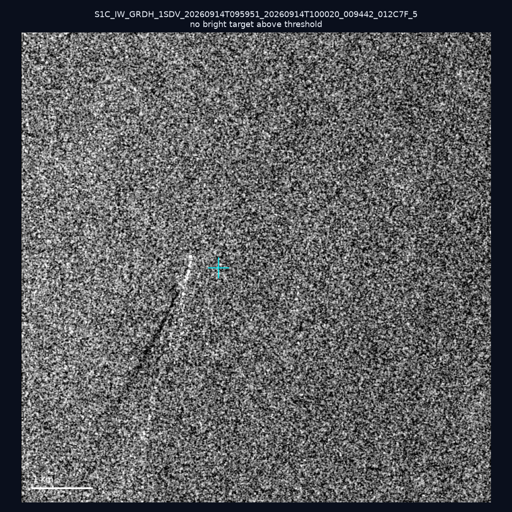
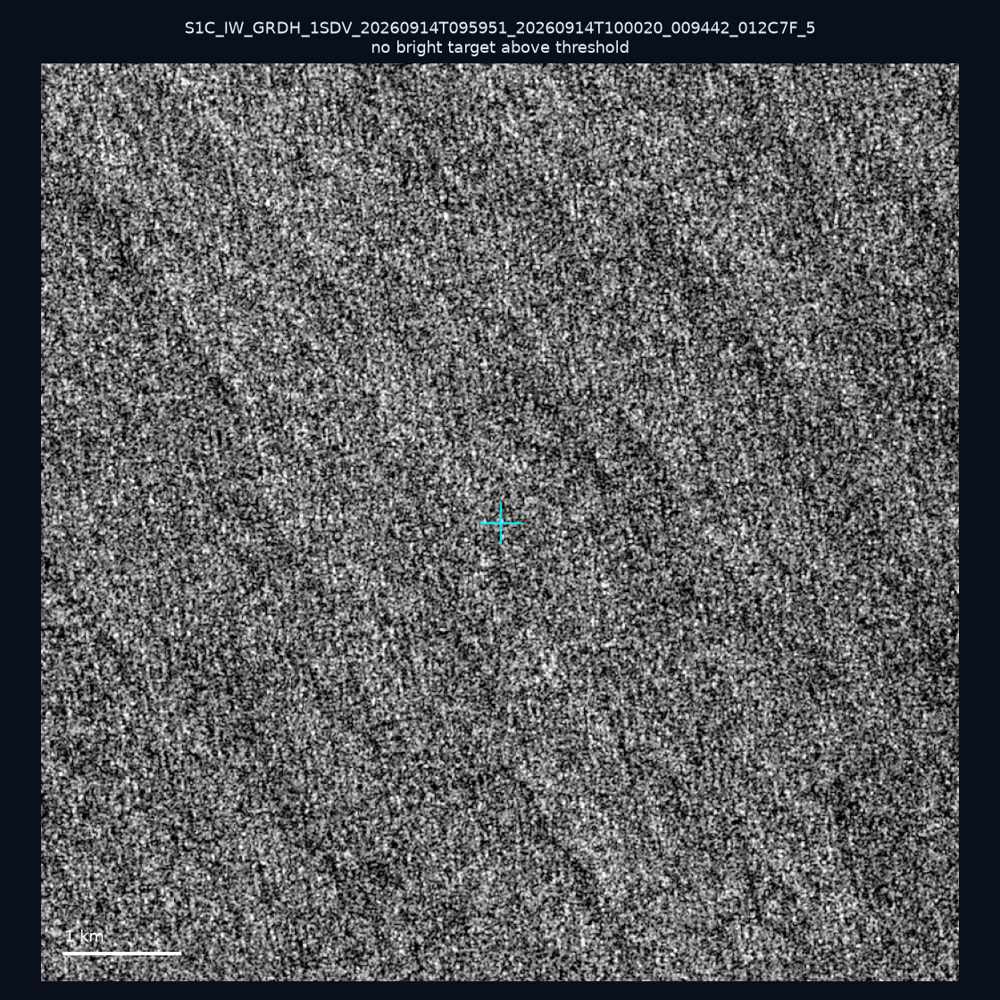
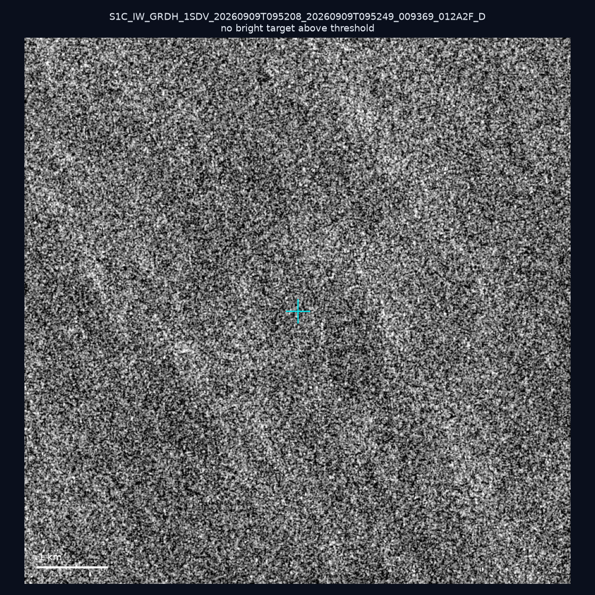
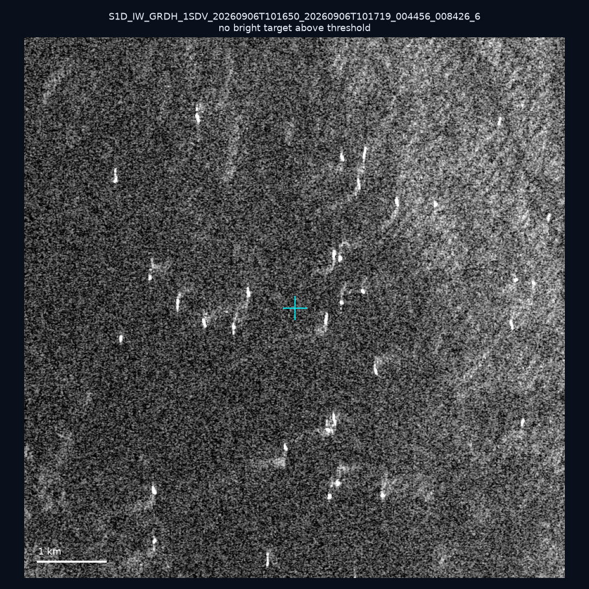
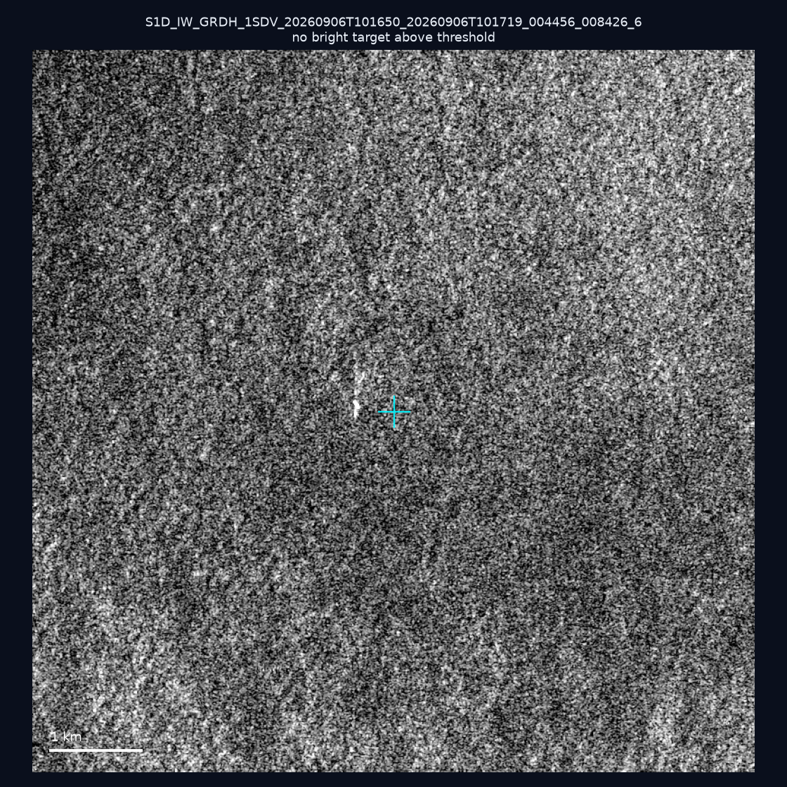
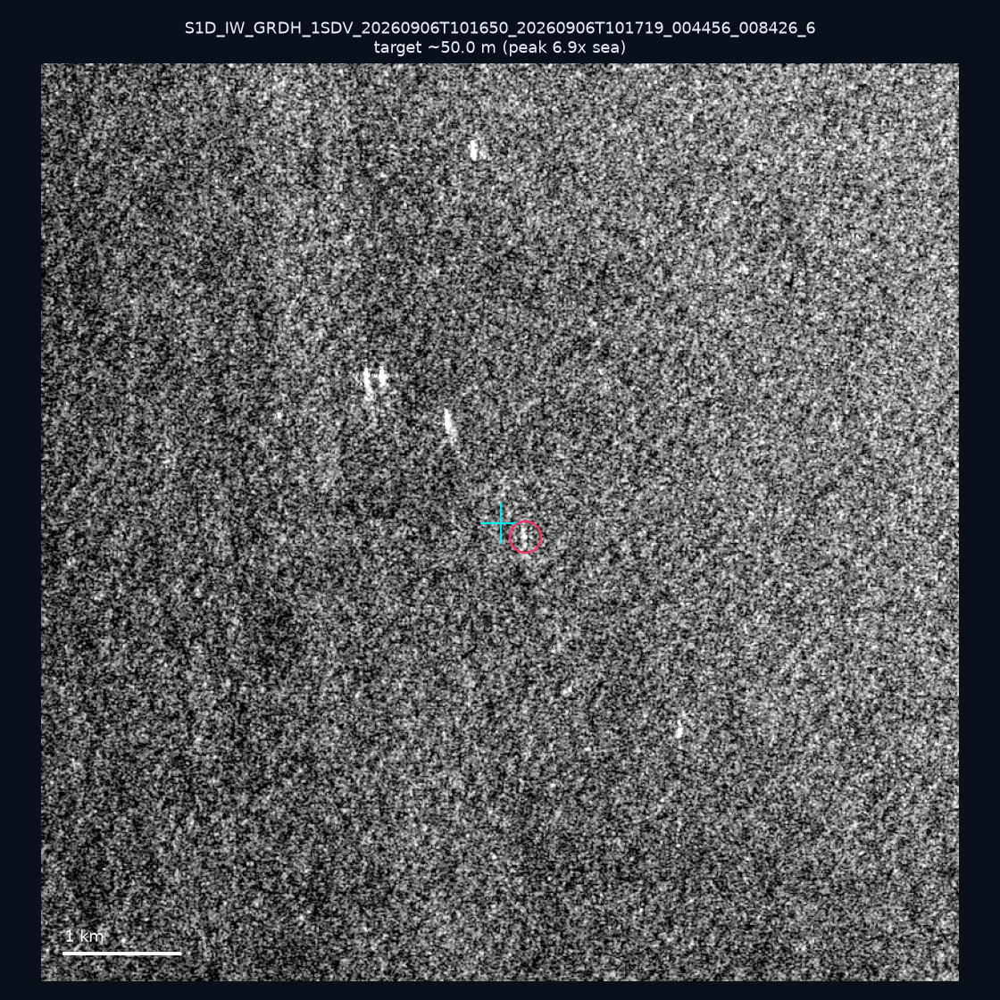
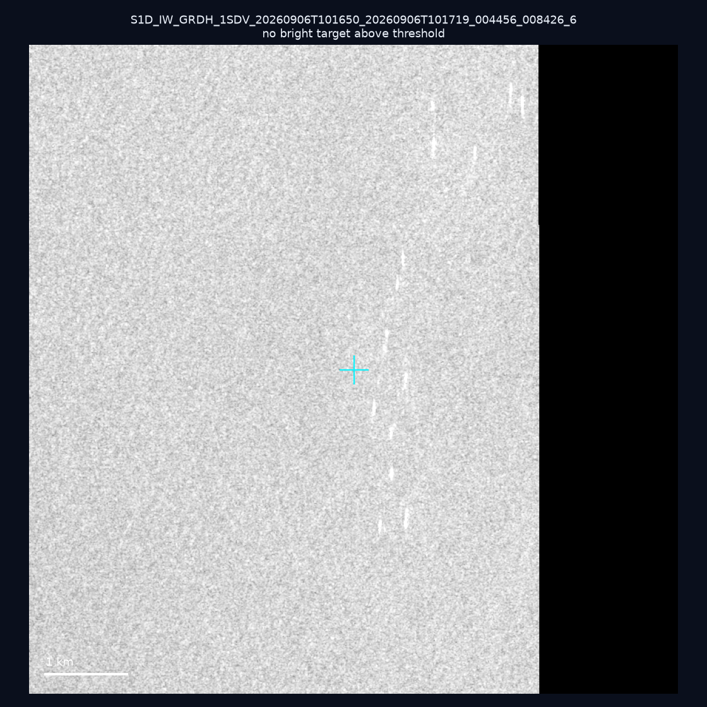
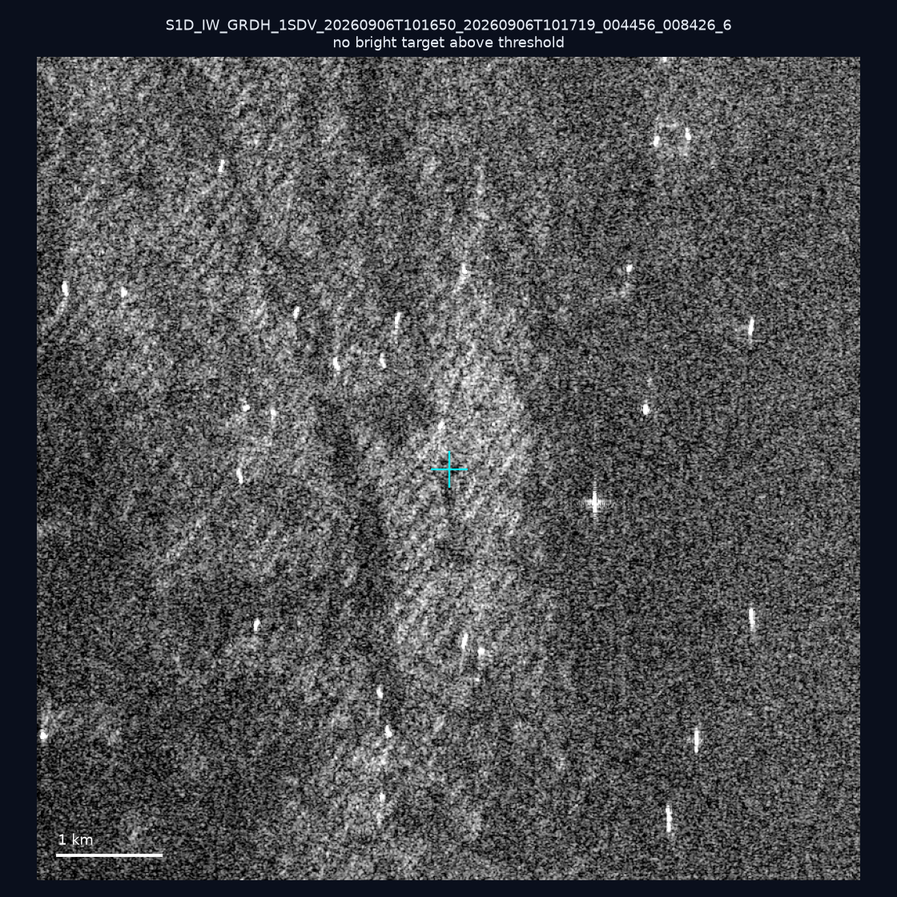

# 暗船 SAR 取證報告 — 2026-09-18

## 1. 總覽

- 執行時間：2026-09-18（GitHub Actions cron 自動執行）
- 線上比對摘要：暗偵測 14562 筆、殘餘暗船 11380 筆、假暗船剔除率 21.9%
- 本輪測試：10 筆
- 成功：10 筆
- 找到亮目標：1 筆
- 失敗：0 筆

## 2. 結果總表

| 日期 | 座標 | 海域 | 法域 | 成像時刻 | 判定 | 估計長度 | 峰值比 |
|------|------|------|------|----------|------|----------|--------|
| 2026-09-14 | 22.69, 120.21 | southwest | internal_waters | 09:59:51 | ⚪ 無目標（雜訊或低RCS） | — | — |
| 2026-09-14 | 22.53, 121.99 | east | eez | 09:59:51 | ⚪ 無目標（雜訊或低RCS） | — | — |
| 2026-09-14 | 22.04, 120.37 | southwest | territorial_sea | 09:59:51 | ⚪ 無目標（雜訊或低RCS） | — | — |
| 2026-09-14 | 22.45, 122.21 | east | eez | 09:59:51 | ⚪ 無目標（雜訊或低RCS） | — | — |
| 2026-09-09 | 24.24, 124.21 | east | eez | 09:52:08 | ⚪ 無目標（雜訊或低RCS） | — | — |
| 2026-09-06 | 23.28, 118.27 | southwest | eez | 10:16:50 | ⚪ 無目標（雜訊或低RCS） | — | — |
| 2026-09-06 | 23.04, 118.32 | southwest | eez | 10:16:50 | ⚪ 無目標（雜訊或低RCS） | — | — |
| 2026-09-06 | 23.0, 118.36 | southwest | eez | 10:16:50 | 🟡 弱目標 | ~50.0 m | 6.9× |
| 2026-09-06 | 23.02, 118.49 | southwest | eez | 10:16:50 | ⚪ 無目標（雜訊或低RCS） | — | — |
| 2026-09-06 | 23.29, 118.32 | southwest | eez | 10:16:50 | ⚪ 無目標（雜訊或低RCS） | — | — |

## 3. 逐目標段落

### 2026-09-14 (22.69, 120.21)

⚪ 無目標（雜訊或低RCS）。

### 2026-09-14 (22.53, 121.99)

⚪ 無目標（雜訊或低RCS）。

### 2026-09-14 (22.04, 120.37)

⚪ 無目標（雜訊或低RCS）。

### 2026-09-14 (22.45, 122.21)

⚪ 無目標（雜訊或低RCS）。

### 2026-09-09 (24.24, 124.21)

⚪ 無目標（雜訊或低RCS）。

### 2026-09-06 (23.28, 118.27)

⚪ 無目標（雜訊或低RCS）。

### 2026-09-06 (23.04, 118.32)

⚪ 無目標（雜訊或低RCS）。

### 2026-09-06 (23.0, 118.36)

🟡 弱目標，估計長度 ~50.0 m，峰值 6.9× 海面背景（10 px）。

### 2026-09-06 (23.02, 118.49)

⚪ 無目標（雜訊或低RCS）。

### 2026-09-06 (23.29, 118.32)

⚪ 無目標（雜訊或低RCS）。

## 4. 後續建議

- 累積統計：全歷史 227 筆（有效 227 筆），確認實體目標 20 筆（8.8%）

> 所有結果是研判線索，不是法律認定；無目標 ≠ 誤報（小型木殼漁船 RCS 低，SAR 可能拍不到）。
