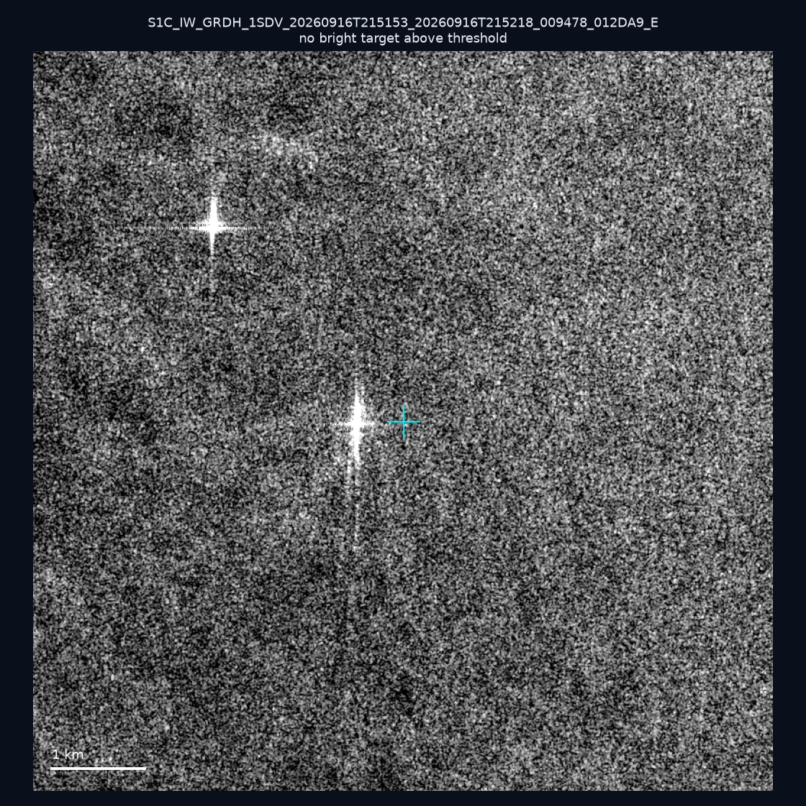
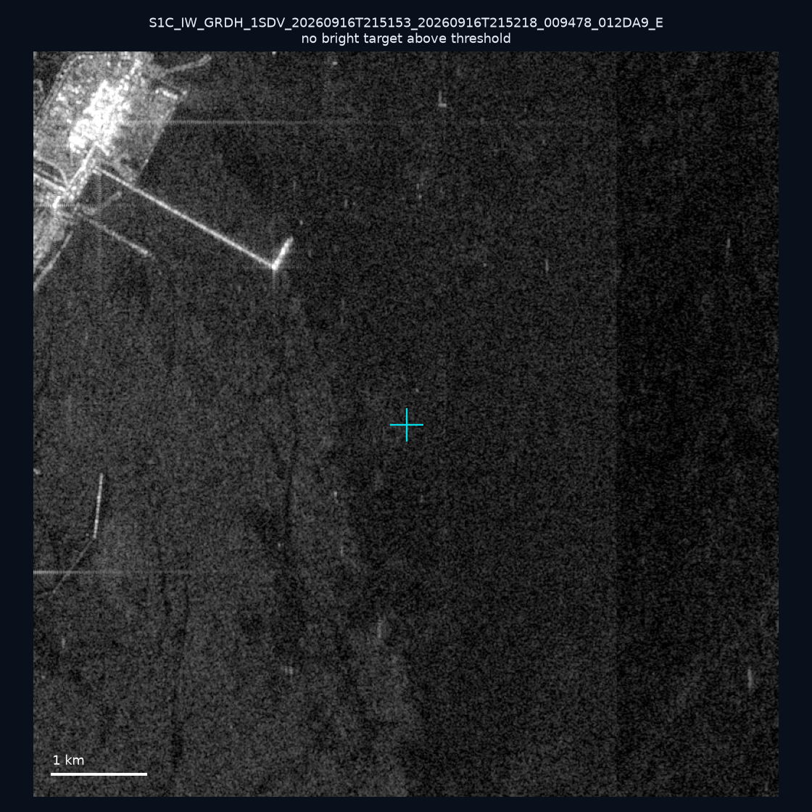
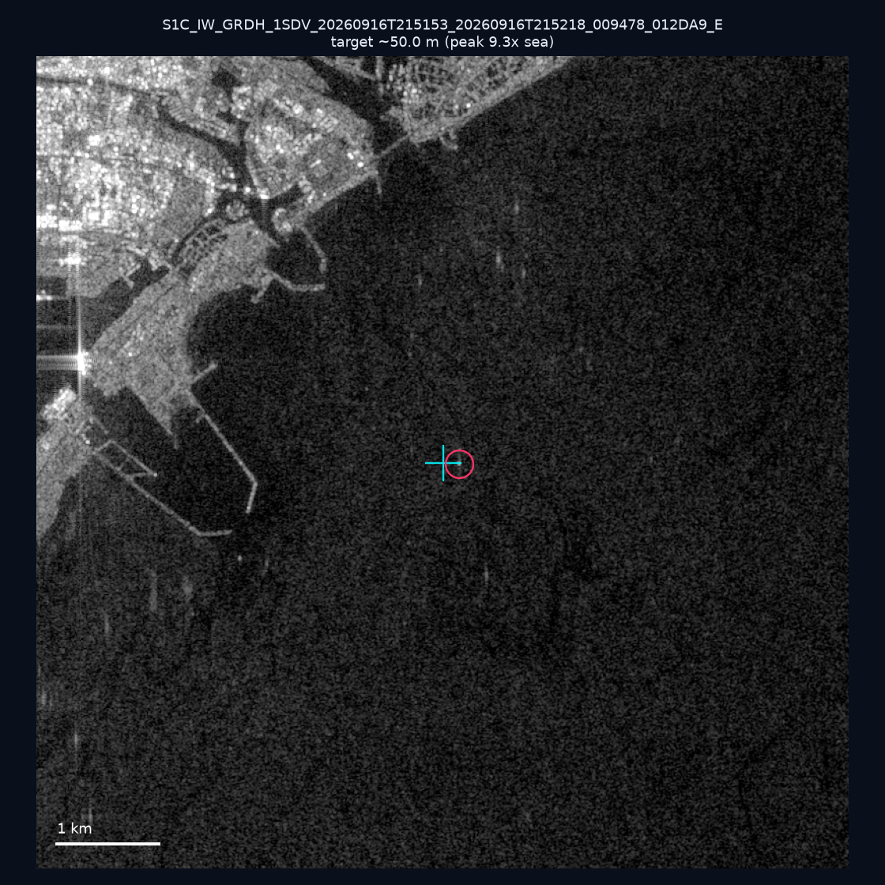
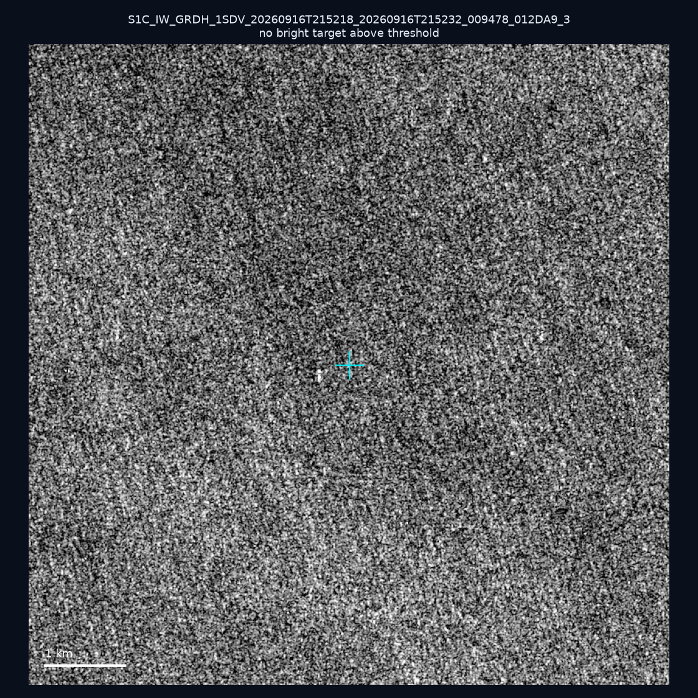
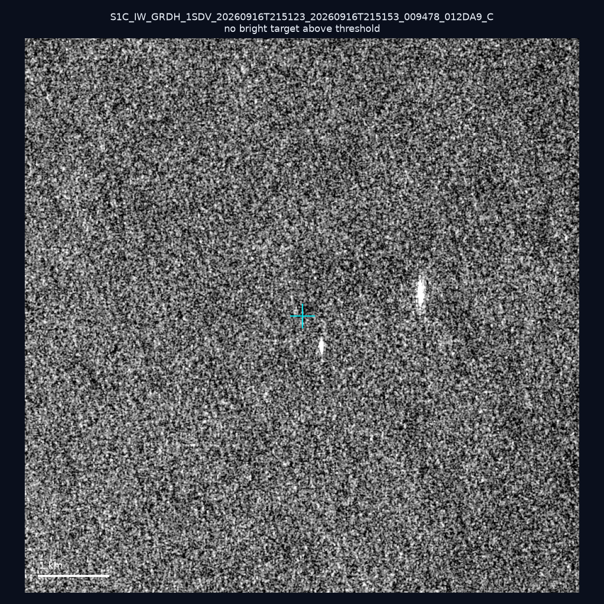
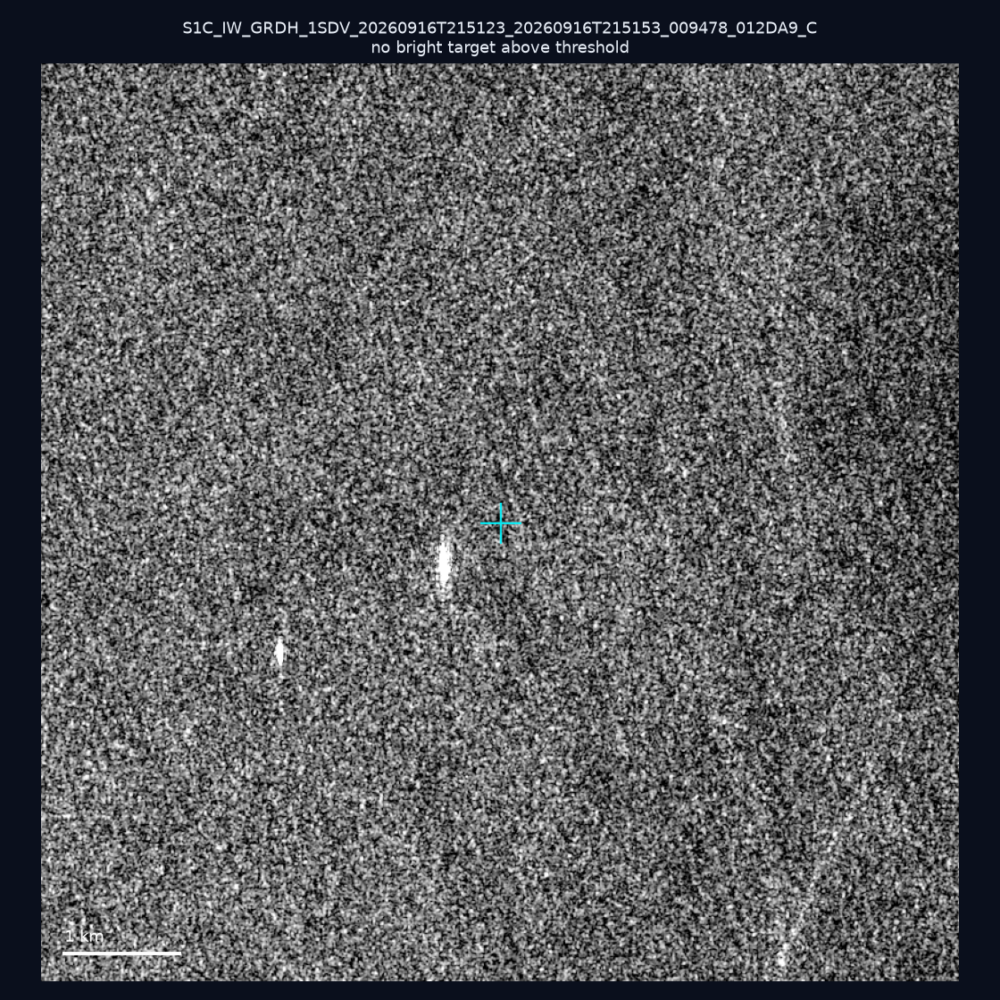
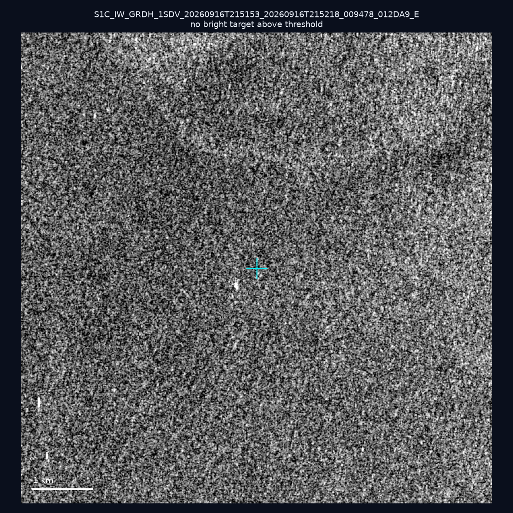
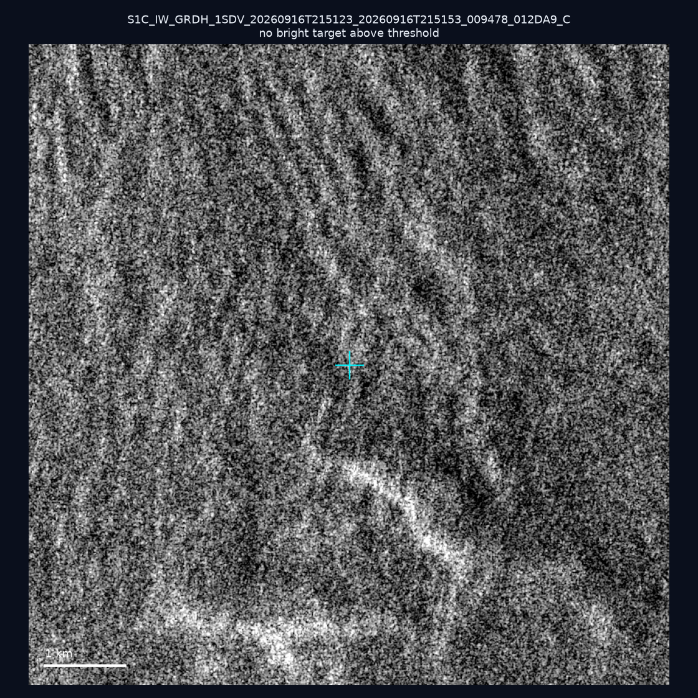
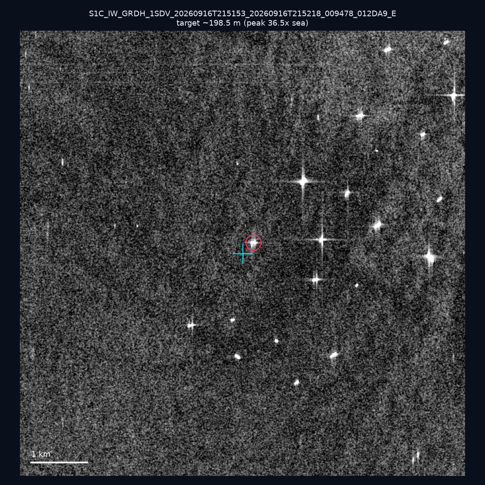
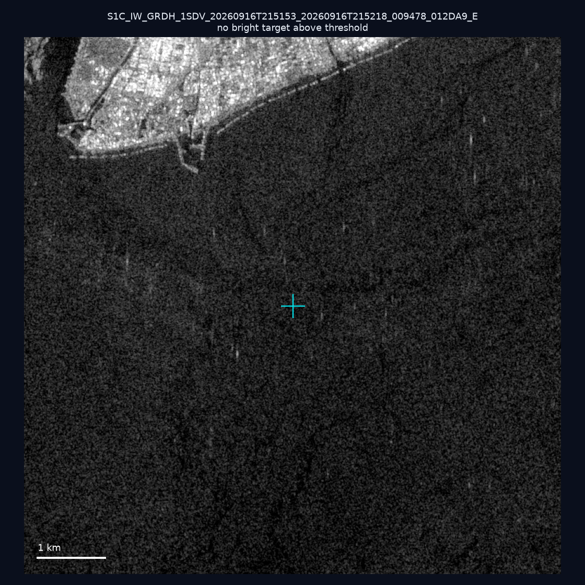

# 暗船 SAR 取證報告 — 2026-09-20

## 1. 總覽

- 執行時間：2026-09-20（GitHub Actions cron 自動執行）
- 線上比對摘要：暗偵測 16147 筆、殘餘暗船 12919 筆、假暗船剔除率 20.0%
- 本輪測試：10 筆
- 成功：10 筆
- 找到亮目標：2 筆
- 失敗：0 筆

## 2. 結果總表

| 日期 | 座標 | 海域 | 法域 | 成像時刻 | 判定 | 估計長度 | 峰值比 |
|------|------|------|------|----------|------|----------|--------|
| 2026-09-16 | 23.37, 119.86 | southwest | internal_waters | 21:51:53 | ⚪ 無目標（雜訊或低RCS） | — | — |
| 2026-09-16 | 22.83, 120.16 | southwest | internal_waters | 21:51:53 | ⚪ 無目標（雜訊或低RCS） | — | — |
| 2026-09-16 | 22.97, 120.13 | southwest | internal_waters | 21:51:53 | 🟡 弱目標 | ~50.0 m | 9.3× |
| 2026-09-16 | 21.96, 119.78 | southwest | eez | 21:52:18 | ⚪ 無目標（雜訊或低RCS） | — | — |
| 2026-09-16 | 24.29, 121.87 | east | territorial_sea | 21:51:23 | ⚪ 無目標（雜訊或低RCS） | — | — |
| 2026-09-16 | 24.3, 121.85 | east | territorial_sea | 21:51:23 | ⚪ 無目標（雜訊或低RCS） | — | — |
| 2026-09-16 | 22.87, 121.53 | east | territorial_sea | 21:51:53 | ⚪ 無目標（雜訊或低RCS） | — | — |
| 2026-09-16 | 25.21, 121.94 | east | internal_waters | 21:51:23 | ⚪ 無目標（雜訊或低RCS） | — | — |
| 2026-09-16 | 22.7, 120.19 | southwest | internal_waters | 21:51:53 | ✅ 確認實體目標 | ~198.5 m | 36.5× |
| 2026-09-16 | 22.46, 120.38 | southwest | internal_waters | 21:51:53 | ⚪ 無目標（雜訊或低RCS） | — | — |

## 3. 逐目標段落

### 2026-09-16 (23.37, 119.86)

⚪ 無目標（雜訊或低RCS）。

### 2026-09-16 (22.83, 120.16)

⚪ 無目標（雜訊或低RCS）。

### 2026-09-16 (22.97, 120.13)

🟡 弱目標，估計長度 ~50.0 m，峰值 9.3× 海面背景（12 px）。

### 2026-09-16 (21.96, 119.78)

⚪ 無目標（雜訊或低RCS）。

### 2026-09-16 (24.29, 121.87)

⚪ 無目標（雜訊或低RCS）。

### 2026-09-16 (24.3, 121.85)

⚪ 無目標（雜訊或低RCS）。

### 2026-09-16 (22.87, 121.53)

⚪ 無目標（雜訊或低RCS）。

### 2026-09-16 (25.21, 121.94)

⚪ 無目標（雜訊或低RCS）。

### 2026-09-16 (22.7, 120.19)

✅ 確認實體目標，估計長度 ~198.5 m，峰值 36.5× 海面背景（83 px）。

### 2026-09-16 (22.46, 120.38)

⚪ 無目標（雜訊或低RCS）。

## 4. 後續建議

- 值得人工深查（確認實體目標且長度 ≥ 50m）：
  - 2026-09-16 (22.7, 120.19) ~198.5 m — 建議比對周邊 AIS 船長
- 累積統計：全歷史 264 筆（有效 264 筆），確認實體目標 26 筆（9.8%）

> 所有結果是研判線索，不是法律認定；無目標 ≠ 誤報（小型木殼漁船 RCS 低，SAR 可能拍不到）。
