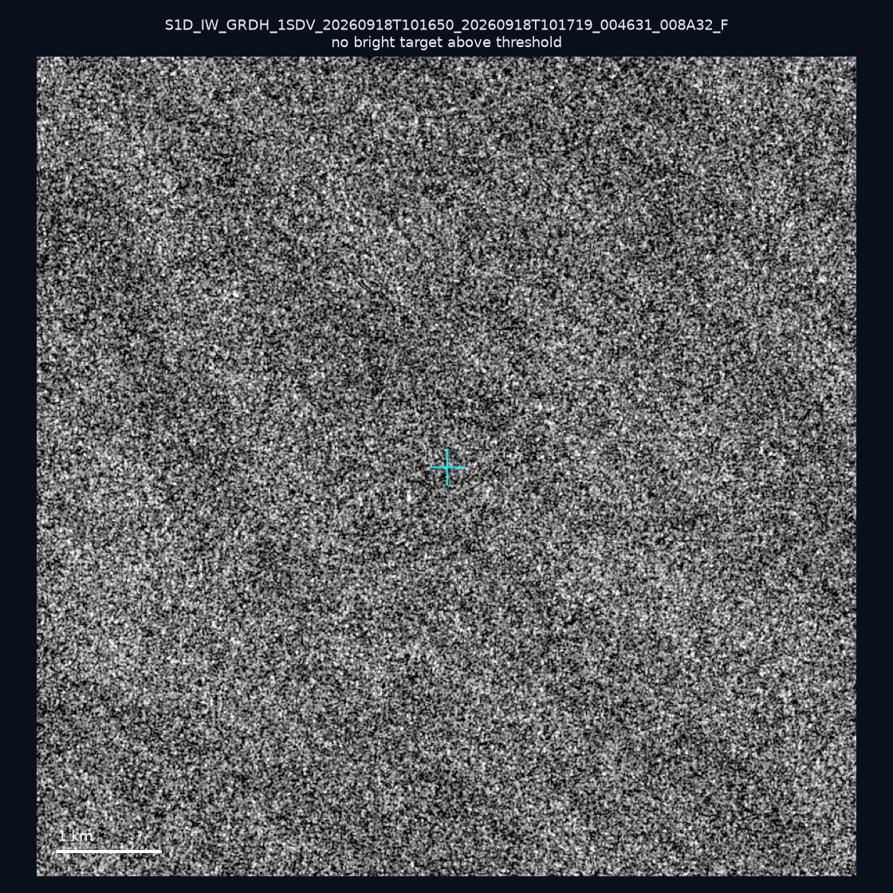
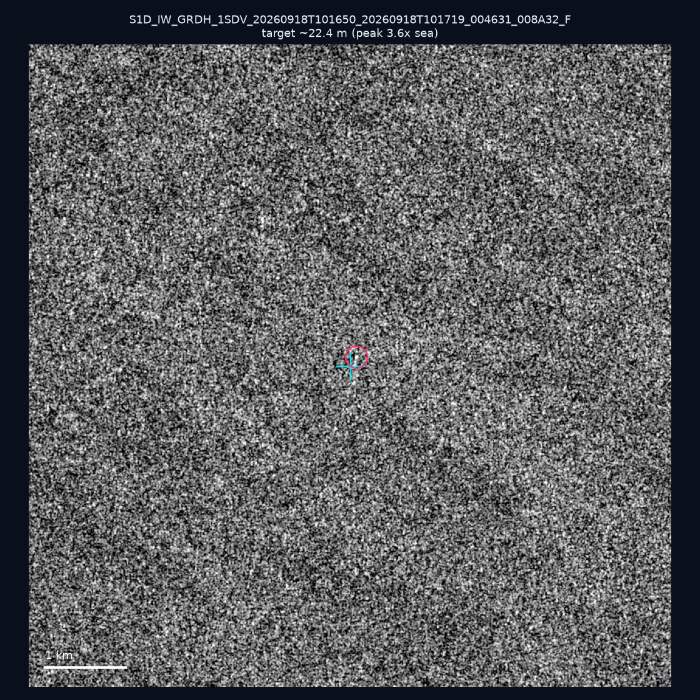
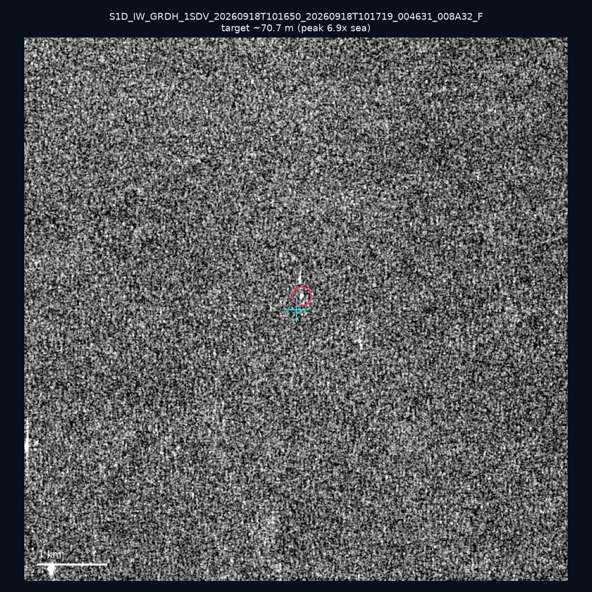
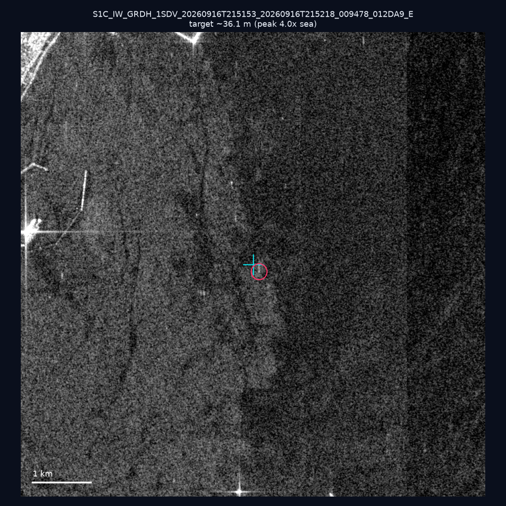
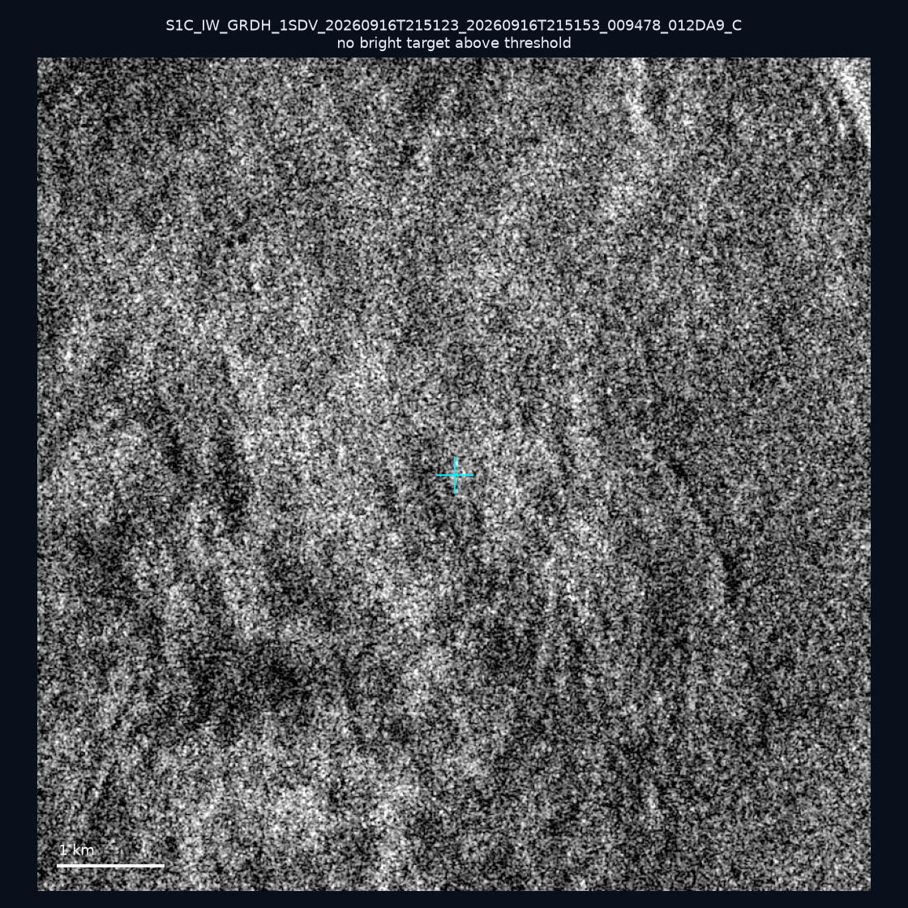
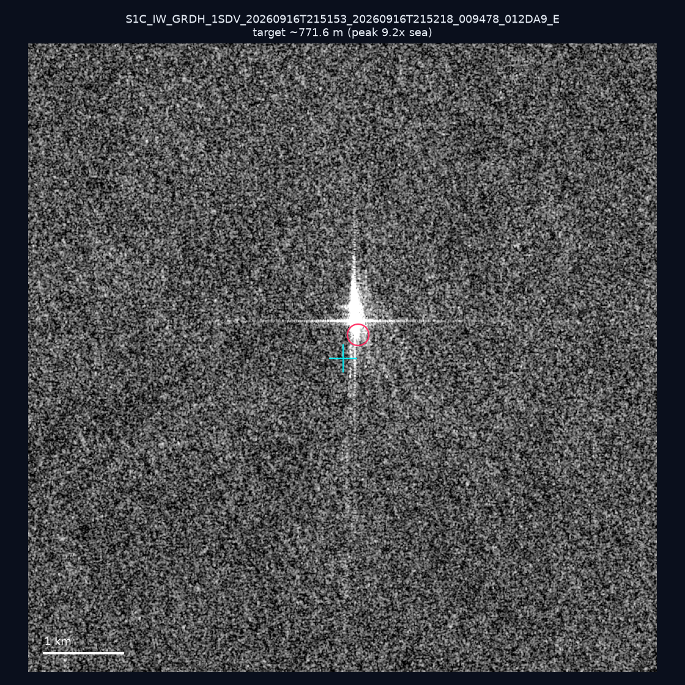
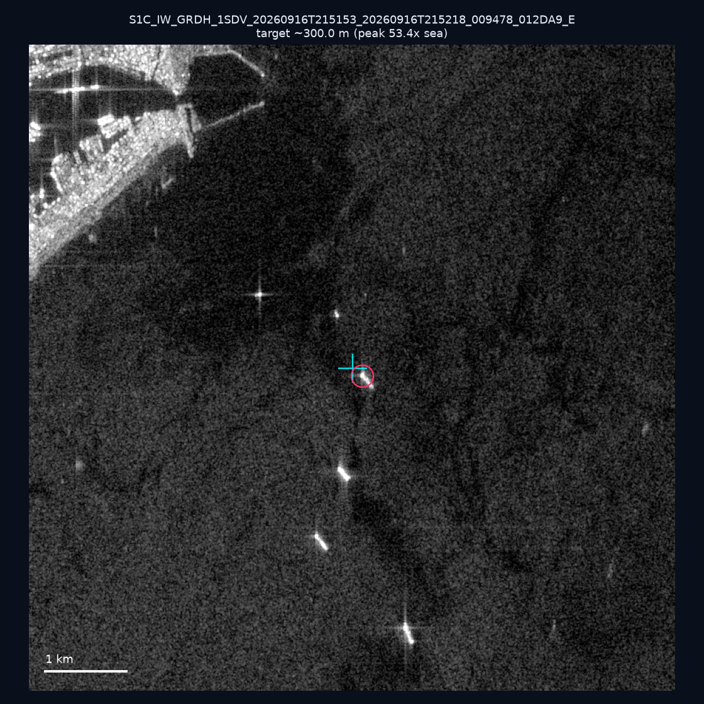
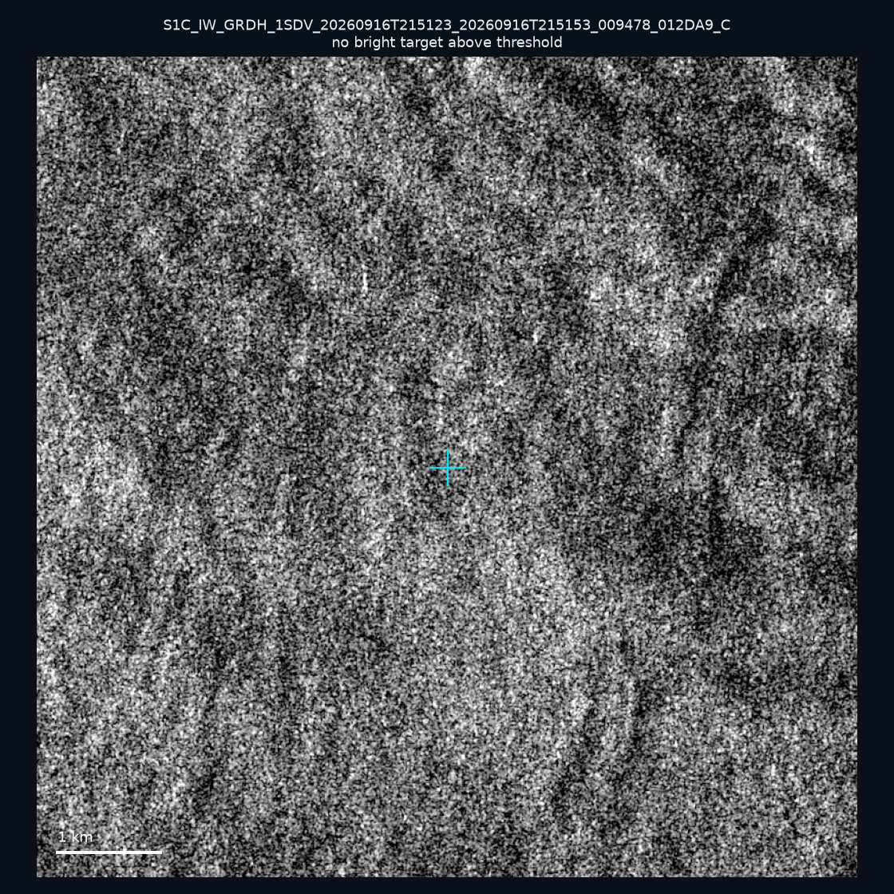
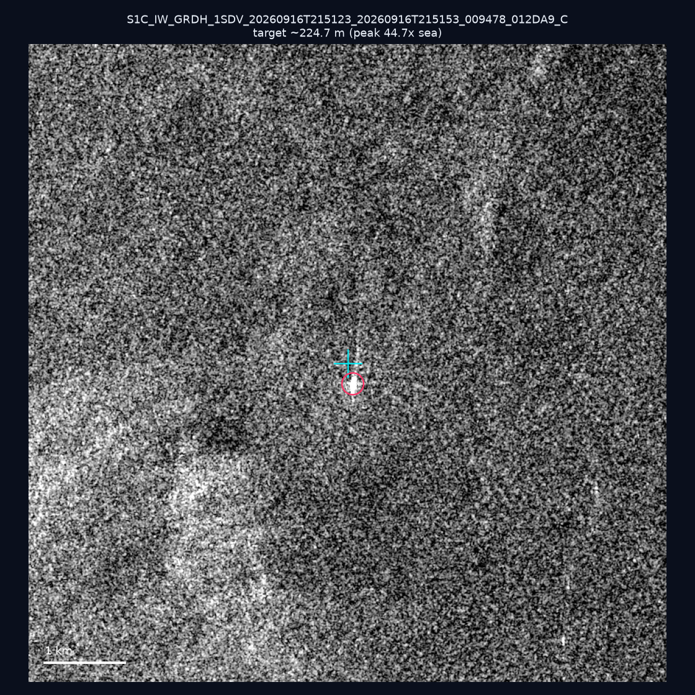
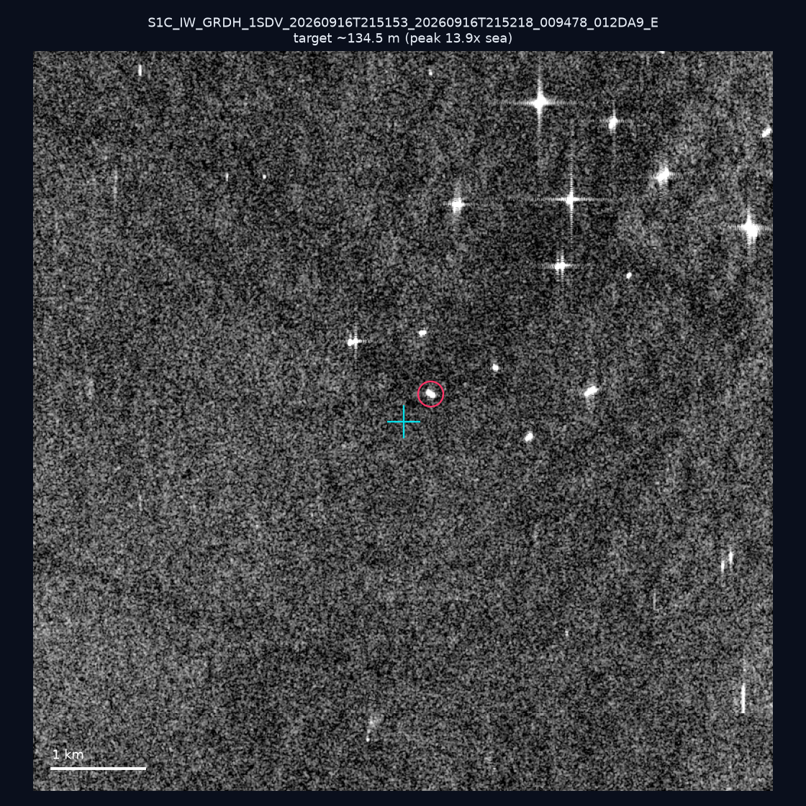

# 暗船 SAR 取證報告 — 2026-09-22

## 1. 總覽

- 執行時間：2026-09-22（GitHub Actions cron 自動執行）
- 線上比對摘要：暗偵測 16566 筆、殘餘暗船 13205 筆、假暗船剔除率 20.3%
- 本輪測試：10 筆
- 成功：10 筆
- 找到亮目標：7 筆
- 失敗：0 筆

## 2. 結果總表

| 日期 | 座標 | 海域 | 法域 | 成像時刻 | 判定 | 估計長度 | 峰值比 |
|------|------|------|------|----------|------|----------|--------|
| 2026-09-18 | 23.25, 118.39 | southwest | eez | 10:16:50 | ⚪ 無目標（雜訊或低RCS） | — | — |
| 2026-09-18 | 23.12, 118.13 | southwest | eez | 10:16:50 | 🟡 弱目標 | ~22.4 m | 3.6× |
| 2026-09-18 | 23.27, 117.13 | southwest | eez | 10:16:50 | 🟡 弱目標 | ~70.7 m | 6.9× |
| 2026-09-16 | 22.81, 120.16 | southwest | internal_waters | 21:51:53 | 🟡 弱目標 | ~36.1 m | 4.0× |
| 2026-09-16 | 24.73, 122.18 | east | contiguous_zone | 21:51:23 | ⚪ 無目標（雜訊或低RCS） | — | — |
| 2026-09-16 | 22.61, 119.51 | southwest | contiguous_zone | 21:51:53 | 🟡 弱目標 | ~771.6 m | 9.2× |
| 2026-09-16 | 22.59, 120.24 | southwest | internal_waters | 21:51:53 | ✅ 確認實體目標 | ~300.0 m | 53.4× |
| 2026-09-16 | 25.35, 122.18 | east | territorial_sea | 21:51:23 | ⚪ 無目標（雜訊或低RCS） | — | — |
| 2026-09-16 | 24.86, 122.07 | east | territorial_sea | 21:51:23 | ✅ 確認實體目標 | ~224.7 m | 44.7× |
| 2026-09-16 | 22.68, 120.19 | southwest | internal_waters | 21:51:53 | ✅ 確認實體目標 | ~134.5 m | 13.9× |

## 3. 逐目標段落

### 2026-09-18 (23.25, 118.39)

⚪ 無目標（雜訊或低RCS）。

### 2026-09-18 (23.12, 118.13)

🟡 弱目標，估計長度 ~22.4 m，峰值 3.6× 海面背景（2 px）。

### 2026-09-18 (23.27, 117.13)

🟡 弱目標，估計長度 ~70.7 m，峰值 6.9× 海面背景（16 px）。

### 2026-09-16 (22.81, 120.16)

🟡 弱目標，估計長度 ~36.1 m，峰值 4.0× 海面背景（4 px）。

### 2026-09-16 (24.73, 122.18)

⚪ 無目標（雜訊或低RCS）。

### 2026-09-16 (22.61, 119.51)

🟡 弱目標，估計長度 ~771.6 m，峰值 9.2× 海面背景（794 px）。

### 2026-09-16 (22.59, 120.24)

✅ 確認實體目標，估計長度 ~300.0 m，峰值 53.4× 海面背景（182 px）。

### 2026-09-16 (25.35, 122.18)

⚪ 無目標（雜訊或低RCS）。

### 2026-09-16 (24.86, 122.07)

✅ 確認實體目標，估計長度 ~224.7 m，峰值 44.7× 海面背景（107 px）。

### 2026-09-16 (22.68, 120.19)

✅ 確認實體目標，估計長度 ~134.5 m，峰值 13.9× 海面背景（55 px）。

## 4. 後續建議

- 值得人工深查（確認實體目標且長度 ≥ 50m）：
  - 2026-09-16 (22.59, 120.24) ~300.0 m — 建議比對周邊 AIS 船長
  - 2026-09-16 (24.86, 122.07) ~224.7 m — 建議比對周邊 AIS 船長
  - 2026-09-16 (22.68, 120.19) ~134.5 m — 建議比對周邊 AIS 船長
- 累積統計：全歷史 274 筆（有效 274 筆），確認實體目標 29 筆（10.6%）

> 所有結果是研判線索，不是法律認定；無目標 ≠ 誤報（小型木殼漁船 RCS 低，SAR 可能拍不到）。
