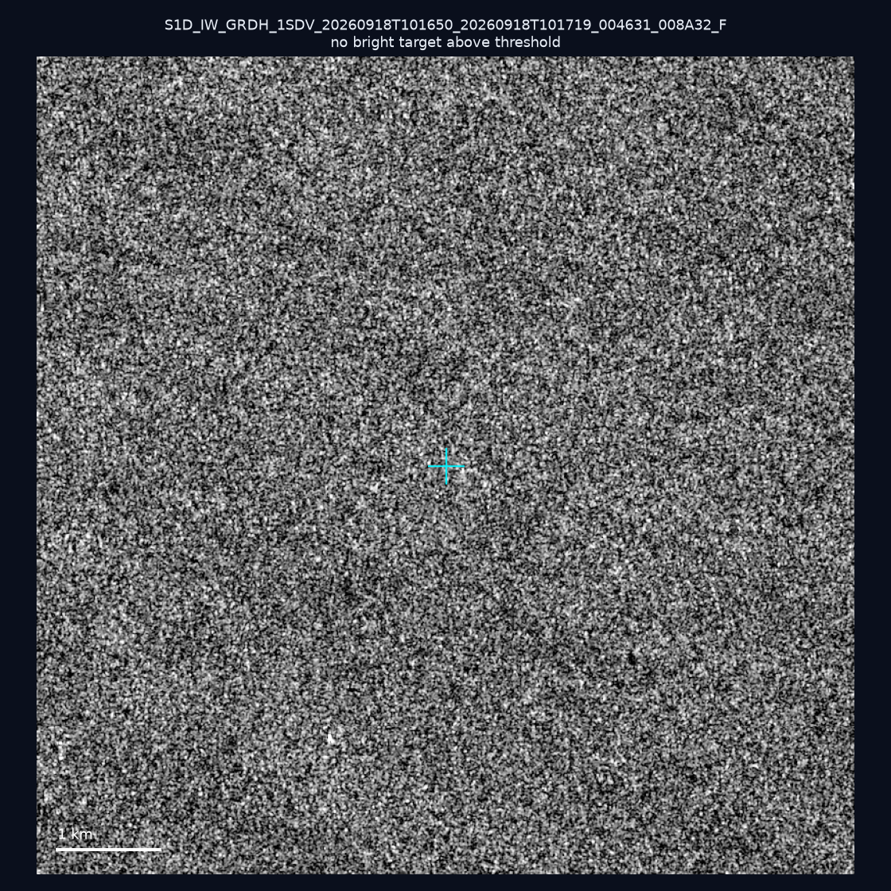
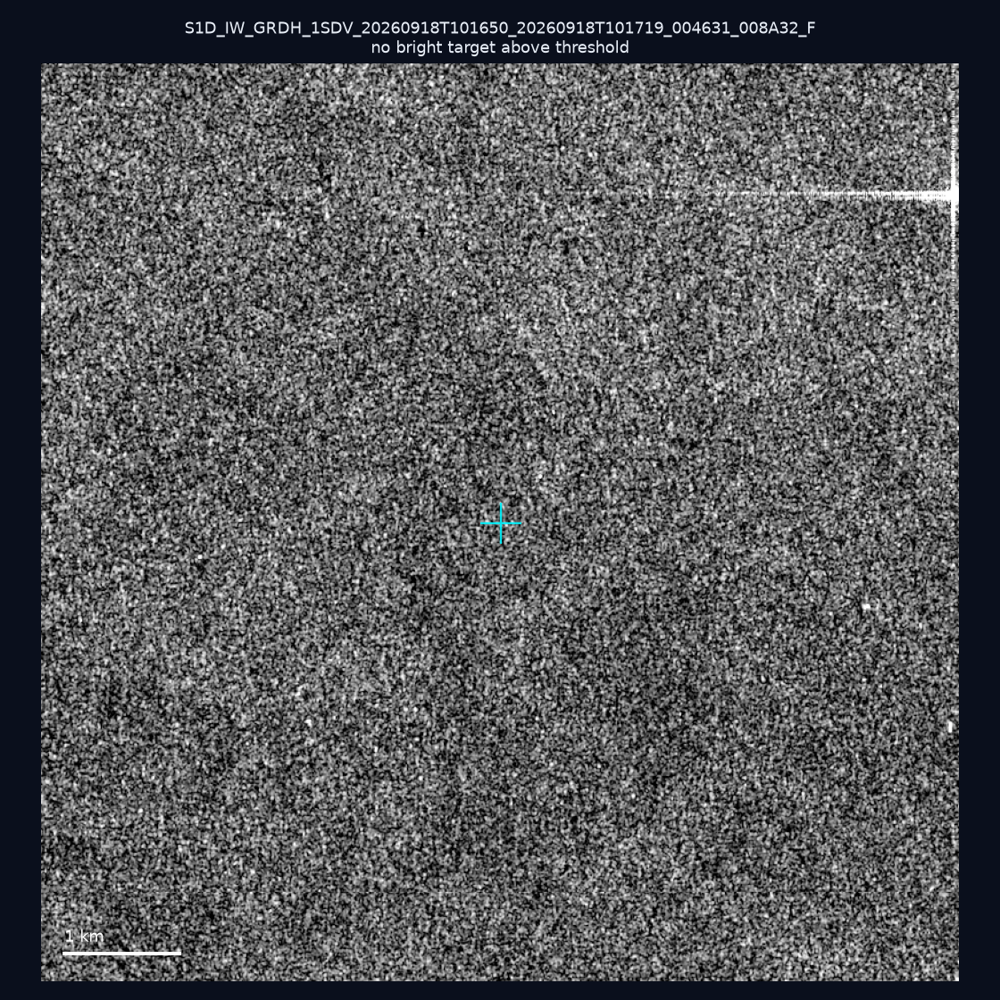
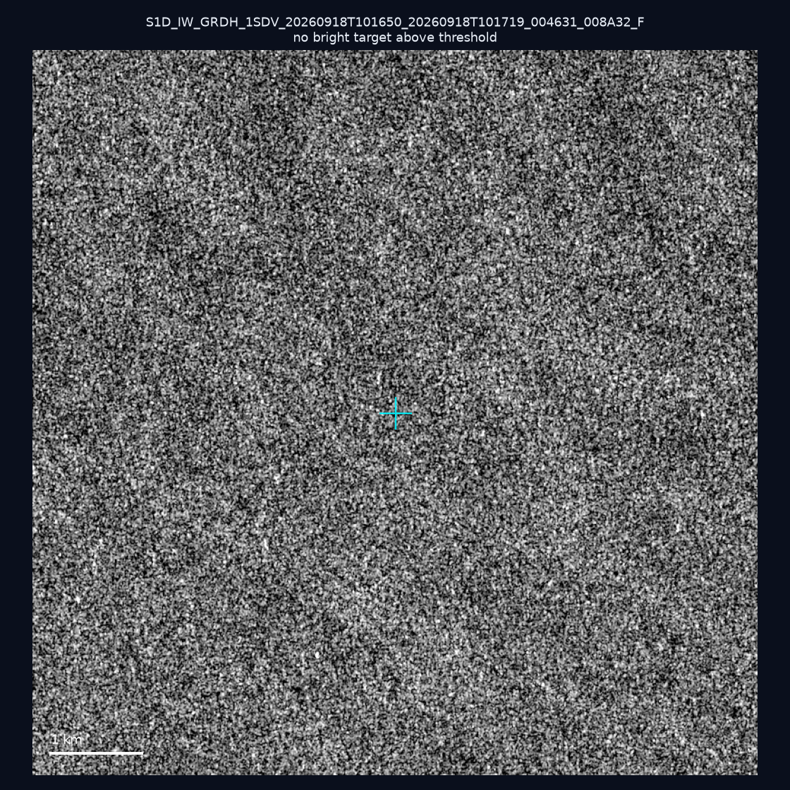
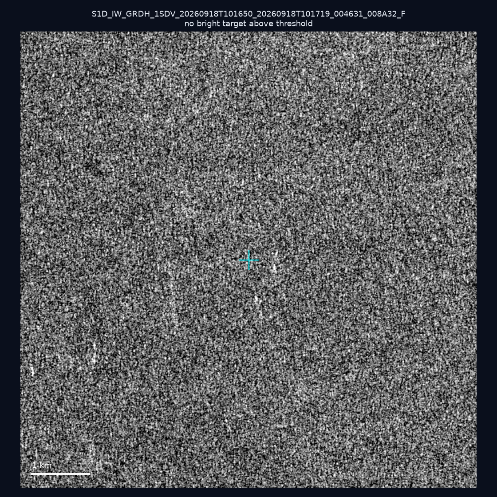
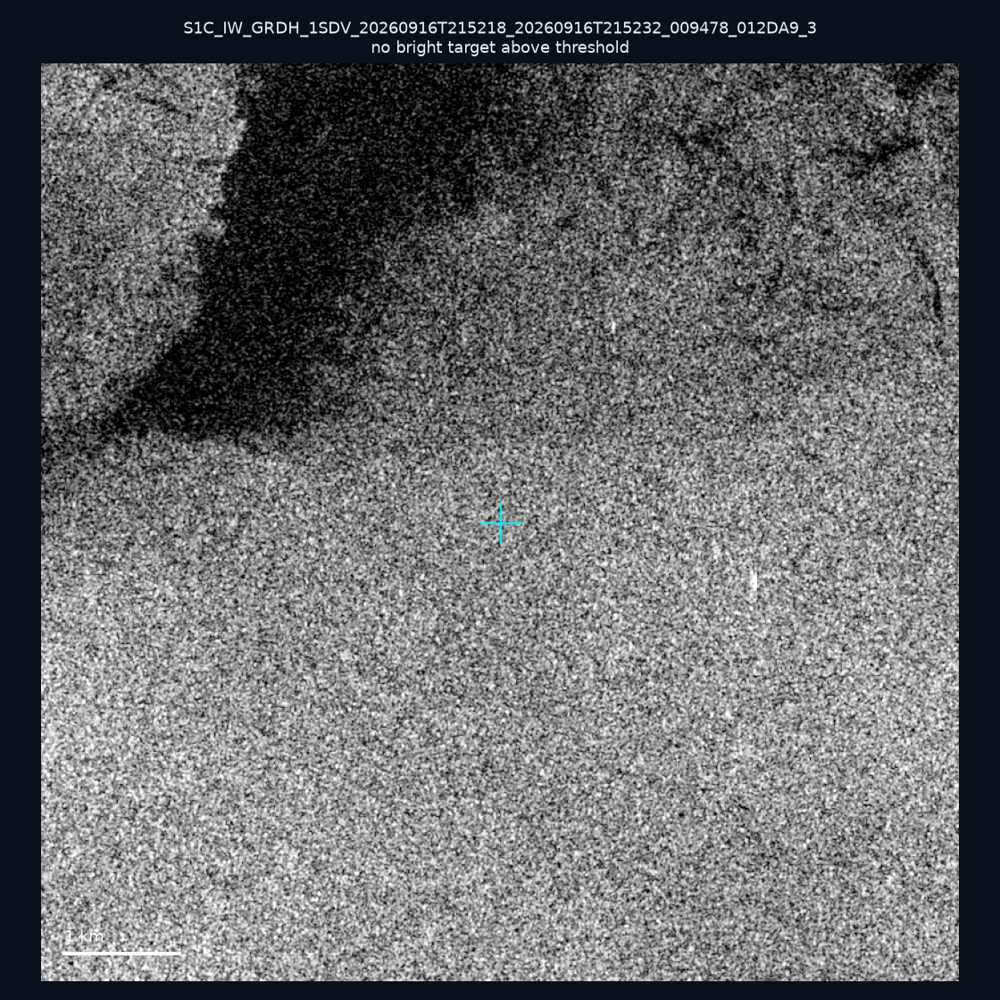
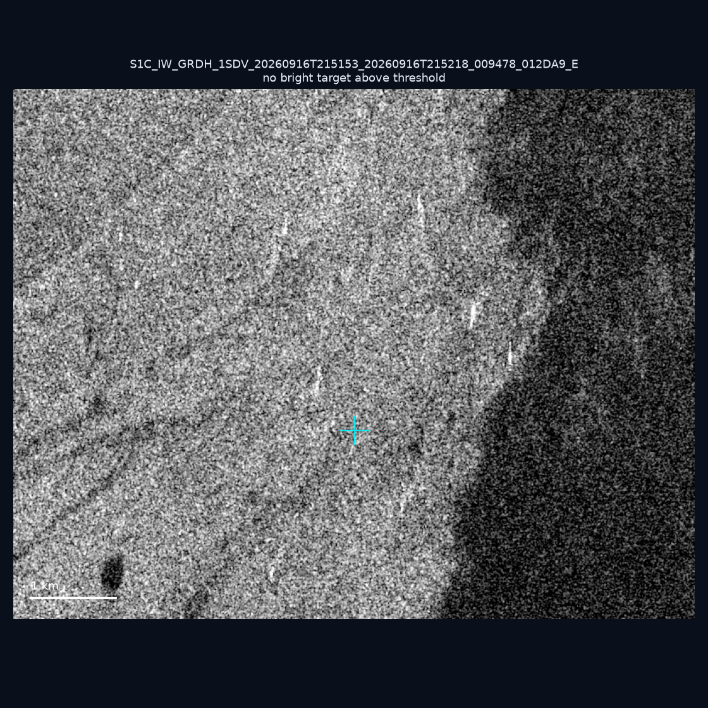
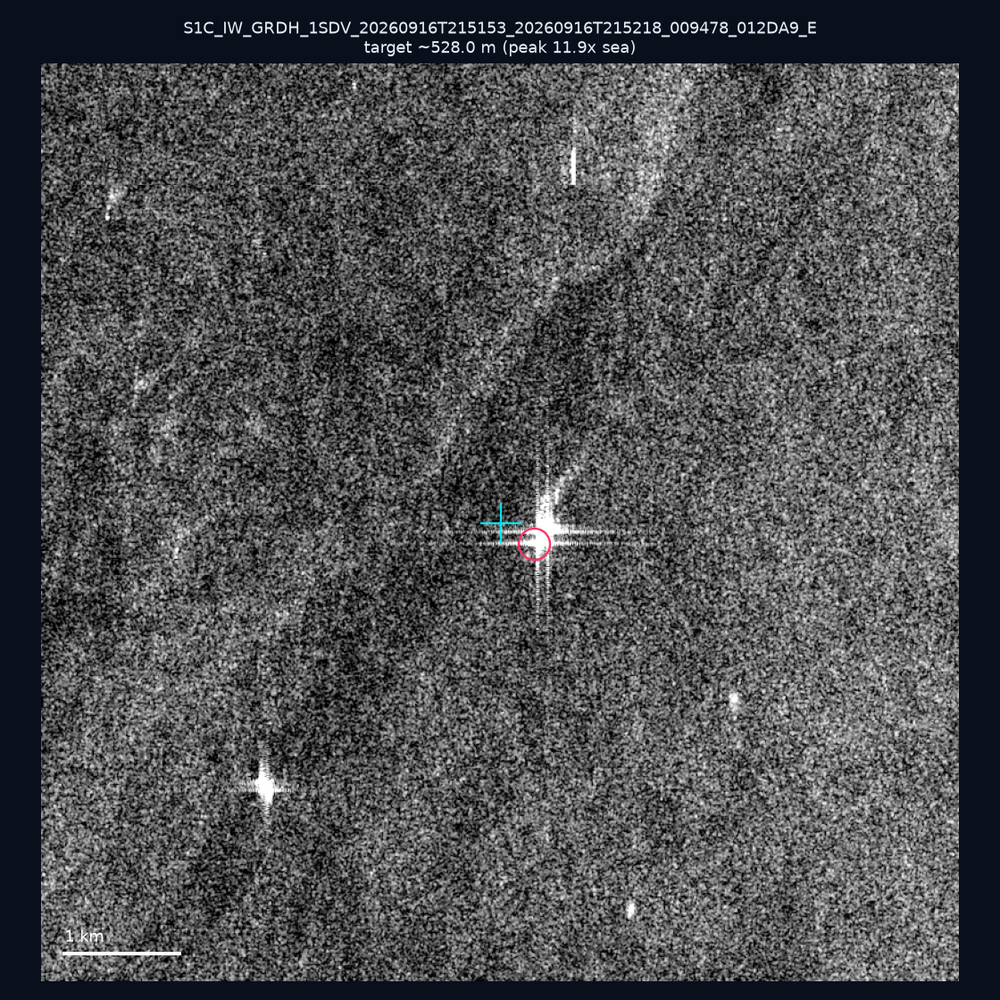
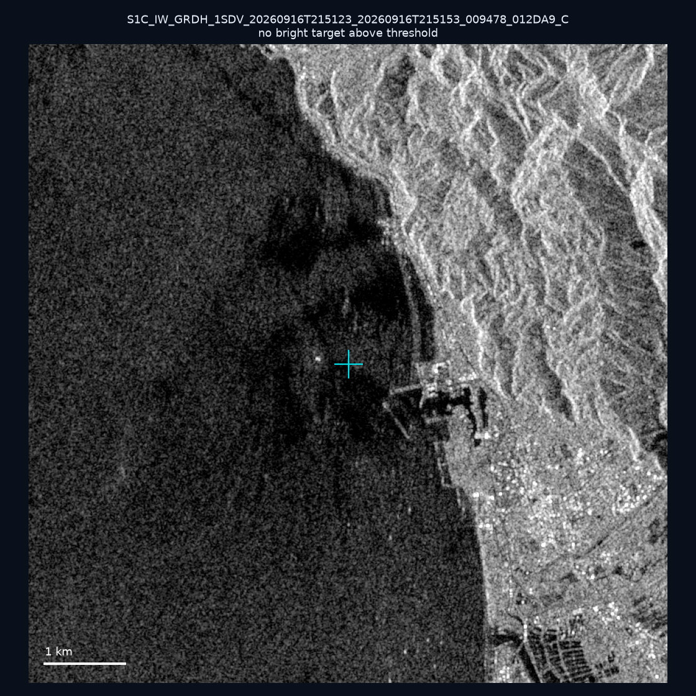
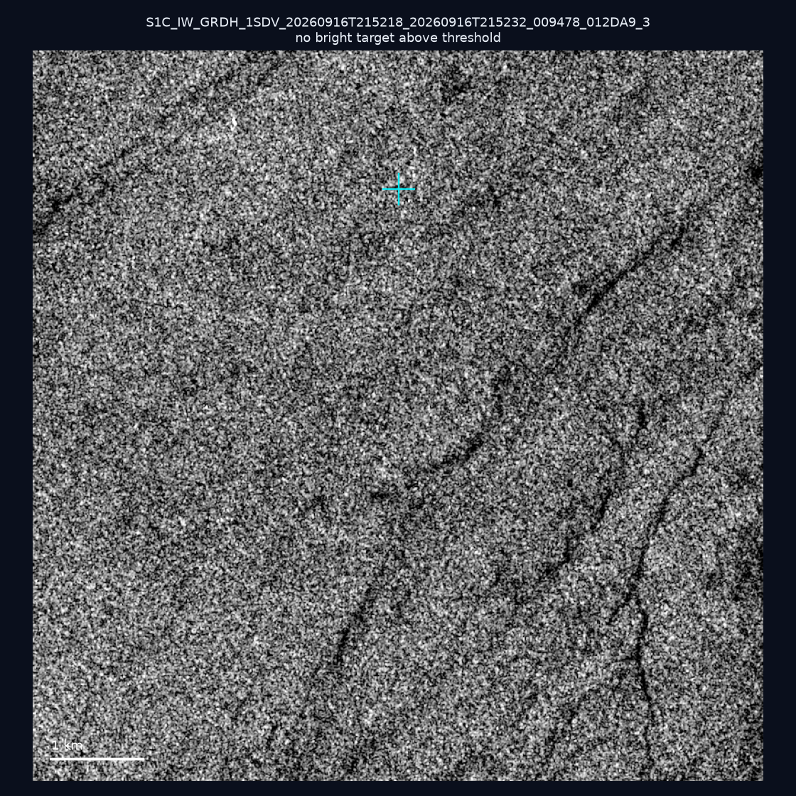
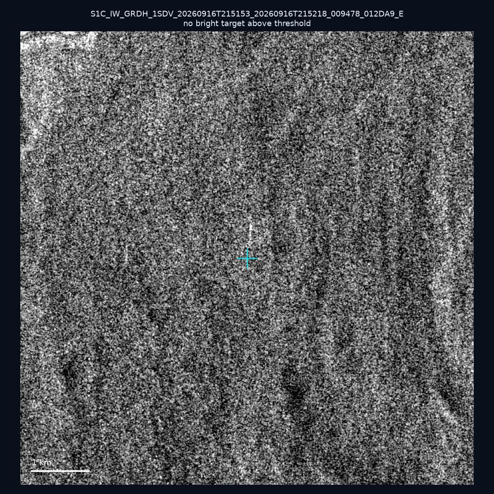

# 暗船 SAR 取證報告 — 2026-09-23

## 1. 總覽

- 執行時間：2026-09-23（GitHub Actions cron 自動執行）
- 線上比對摘要：暗偵測 14745 筆、殘餘暗船 11620 筆、假暗船剔除率 21.2%
- 本輪測試：10 筆
- 成功：10 筆
- 找到亮目標：1 筆
- 失敗：0 筆

## 2. 結果總表

| 日期 | 座標 | 海域 | 法域 | 成像時刻 | 判定 | 估計長度 | 峰值比 |
|------|------|------|------|----------|------|----------|--------|
| 2026-09-18 | 23.17, 117.91 | southwest | eez | 10:16:50 | ⚪ 無目標（雜訊或低RCS） | — | — |
| 2026-09-18 | 22.86, 117.49 | southwest | eez | 10:16:50 | ⚪ 無目標（雜訊或低RCS） | — | — |
| 2026-09-18 | 22.83, 117.62 | southwest | eez | 10:16:50 | ⚪ 無目標（雜訊或低RCS） | — | — |
| 2026-09-18 | 23.35, 117.21 | southwest | eez | 10:16:50 | ⚪ 無目標（雜訊或低RCS） | — | — |
| 2026-09-16 | 22.28, 120.58 | southwest | internal_waters | 21:52:18 | ⚪ 無目標（雜訊或低RCS） | — | — |
| 2026-09-16 | 22.44, 120.25 | southwest | internal_waters | 21:51:53 | ⚪ 無目標（雜訊或低RCS） | — | — |
| 2026-09-16 | 22.63, 120.15 | southwest | internal_waters | 21:51:53 | ✅ 確認實體目標 | ~528.0 m | 11.9× |
| 2026-09-16 | 24.87, 121.85 | east | internal_waters | 21:51:23 | ⚪ 無目標（雜訊或低RCS） | — | — |
| 2026-09-16 | 22.4, 120.28 | southwest | internal_waters | 21:52:18 | ⚪ 無目標（雜訊或低RCS） | — | — |
| 2026-09-16 | 23.02, 120.01 | southwest | internal_waters | 21:51:53 | ⚪ 無目標（雜訊或低RCS） | — | — |

## 3. 逐目標段落

### 2026-09-18 (23.17, 117.91)

⚪ 無目標（雜訊或低RCS）。

### 2026-09-18 (22.86, 117.49)

⚪ 無目標（雜訊或低RCS）。

### 2026-09-18 (22.83, 117.62)

⚪ 無目標（雜訊或低RCS）。

### 2026-09-18 (23.35, 117.21)

⚪ 無目標（雜訊或低RCS）。

### 2026-09-16 (22.28, 120.58)

⚪ 無目標（雜訊或低RCS）。

### 2026-09-16 (22.44, 120.25)

⚪ 無目標（雜訊或低RCS）。

### 2026-09-16 (22.63, 120.15)

✅ 確認實體目標，估計長度 ~528.0 m，峰值 11.9× 海面背景（483 px）。

### 2026-09-16 (24.87, 121.85)

⚪ 無目標（雜訊或低RCS）。

### 2026-09-16 (22.4, 120.28)

⚪ 無目標（雜訊或低RCS）。

### 2026-09-16 (23.02, 120.01)

⚪ 無目標（雜訊或低RCS）。

## 4. 後續建議

- 值得人工深查（確認實體目標且長度 ≥ 50m）：
  - 2026-09-16 (22.63, 120.15) ~528.0 m — 建議比對周邊 AIS 船長
- 累積統計：全歷史 284 筆（有效 284 筆），確認實體目標 30 筆（10.6%）

> 所有結果是研判線索，不是法律認定；無目標 ≠ 誤報（小型木殼漁船 RCS 低，SAR 可能拍不到）。
