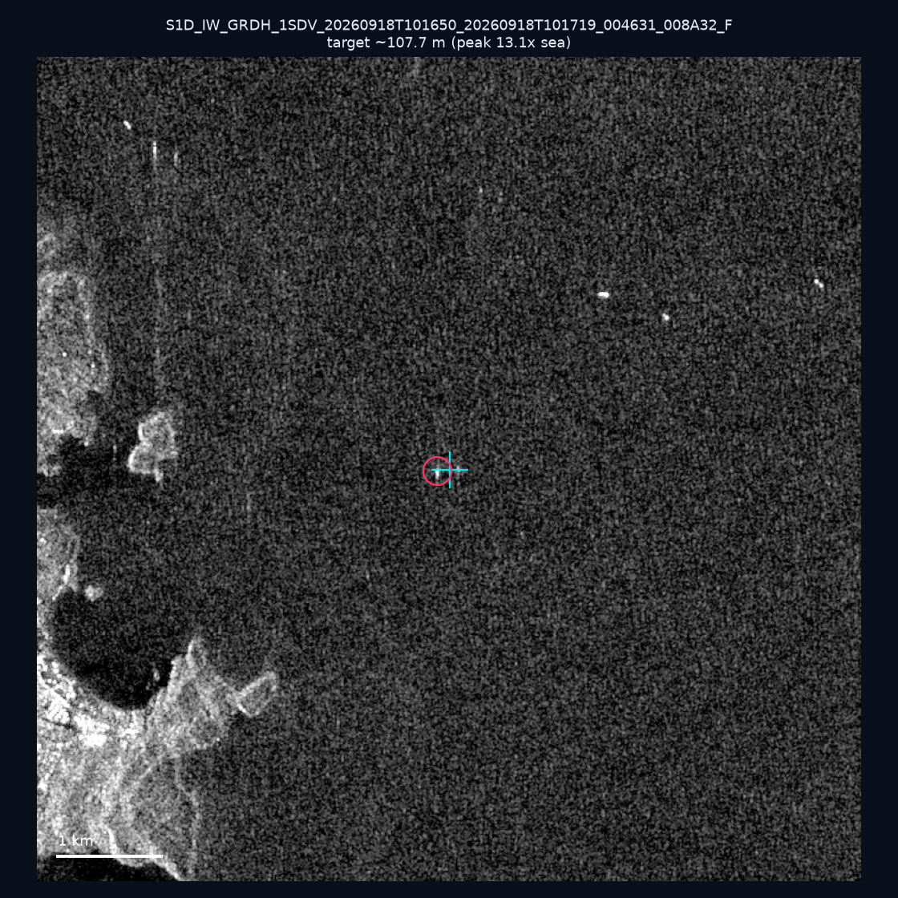
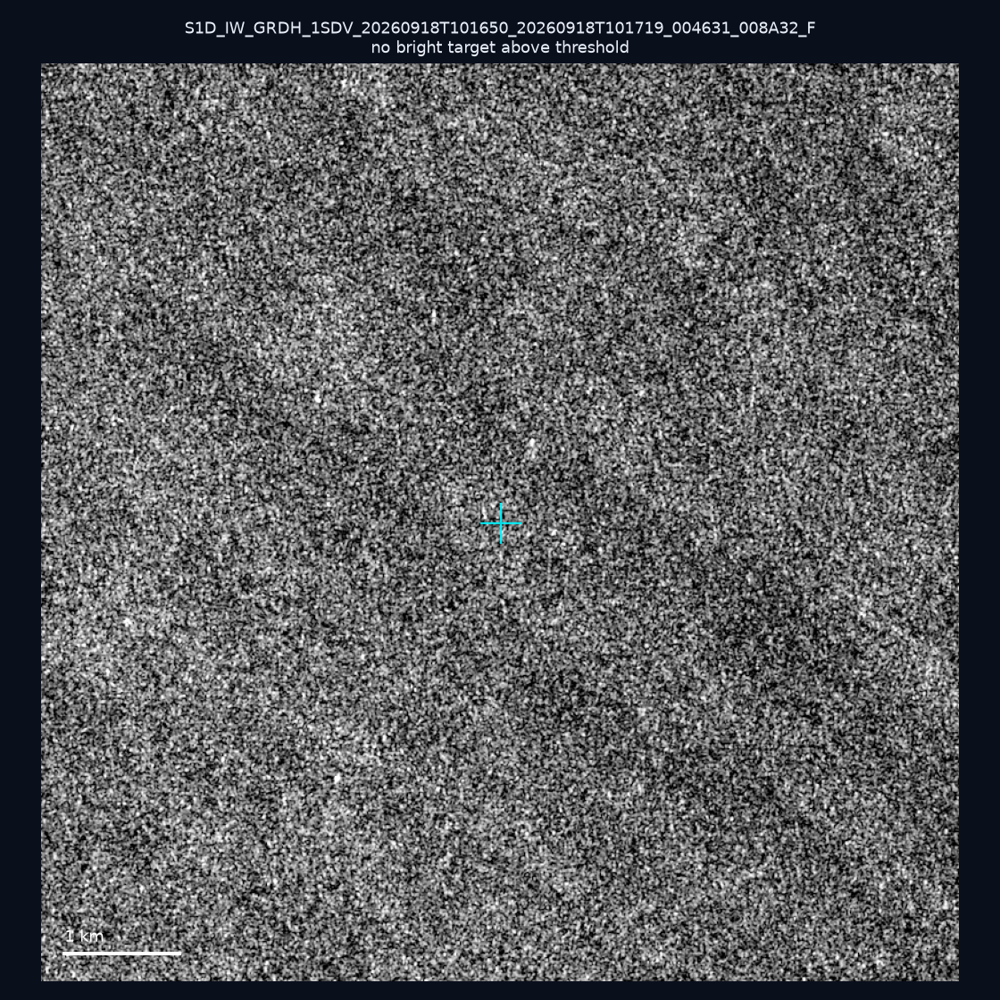
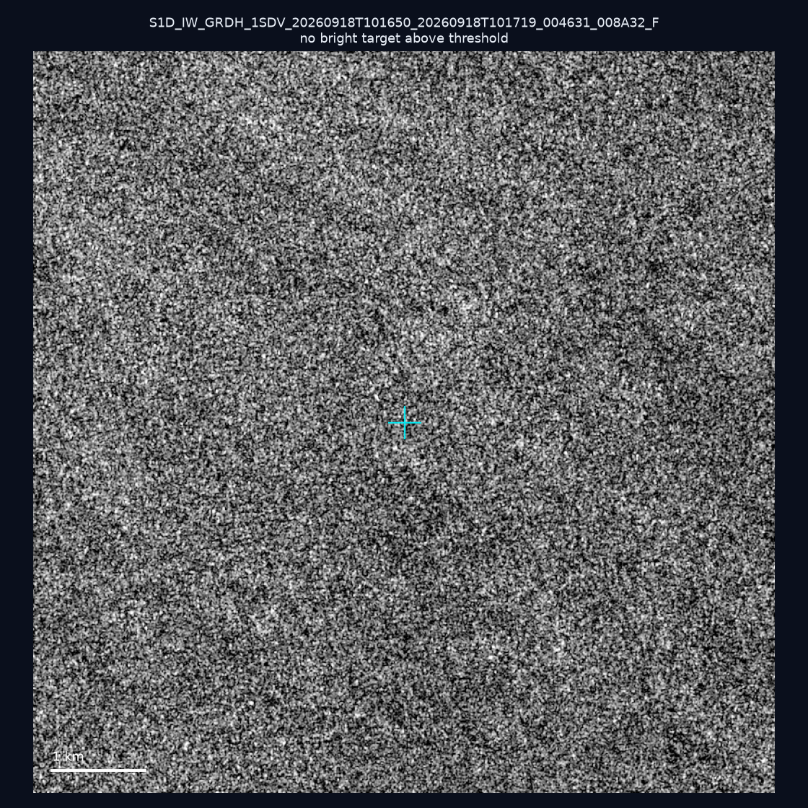
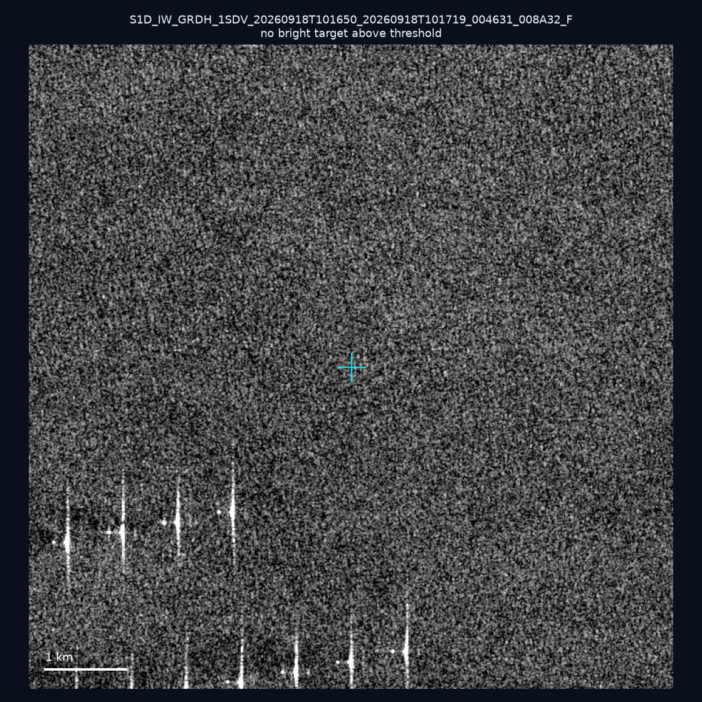
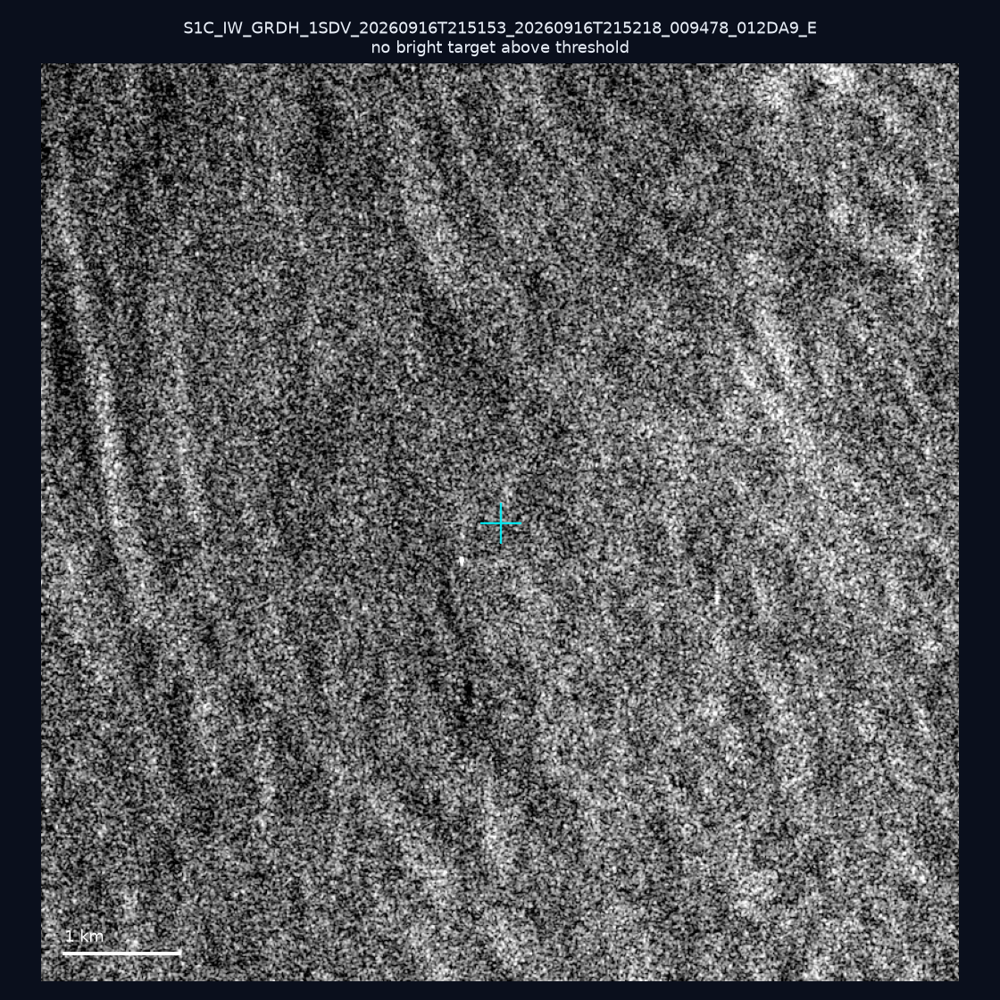
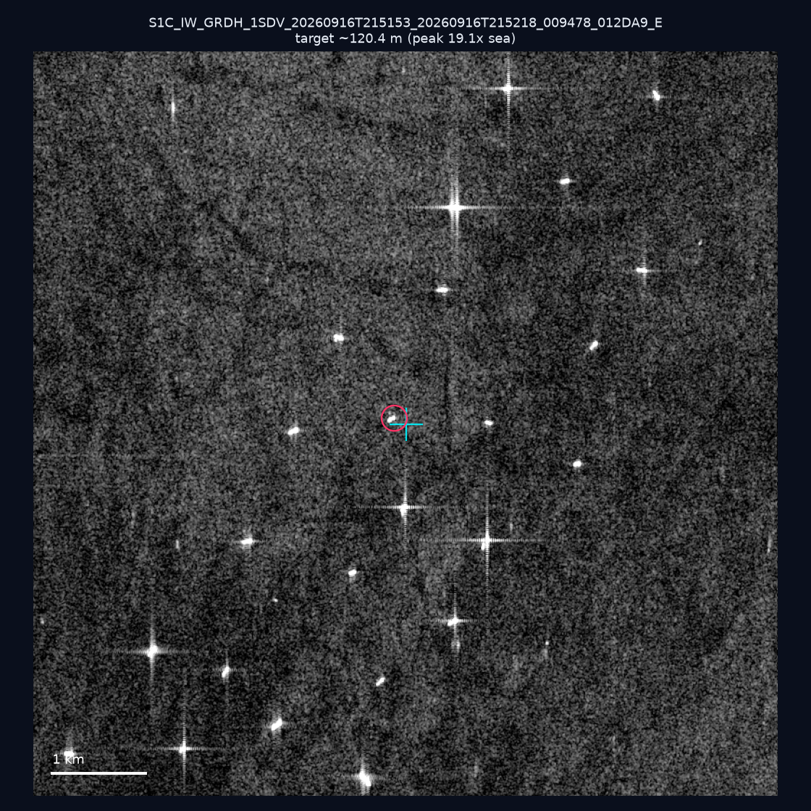
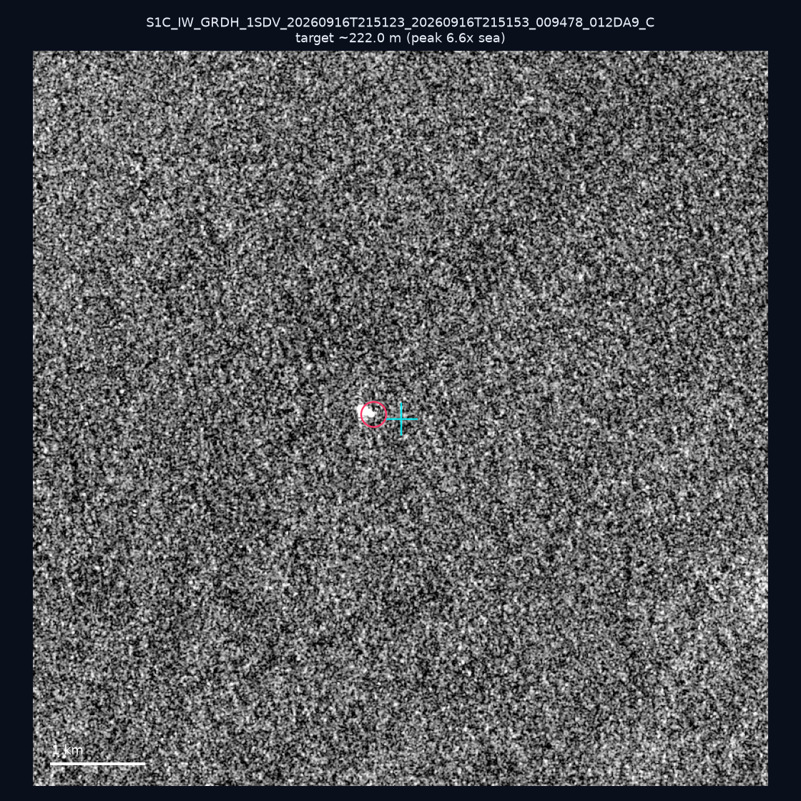
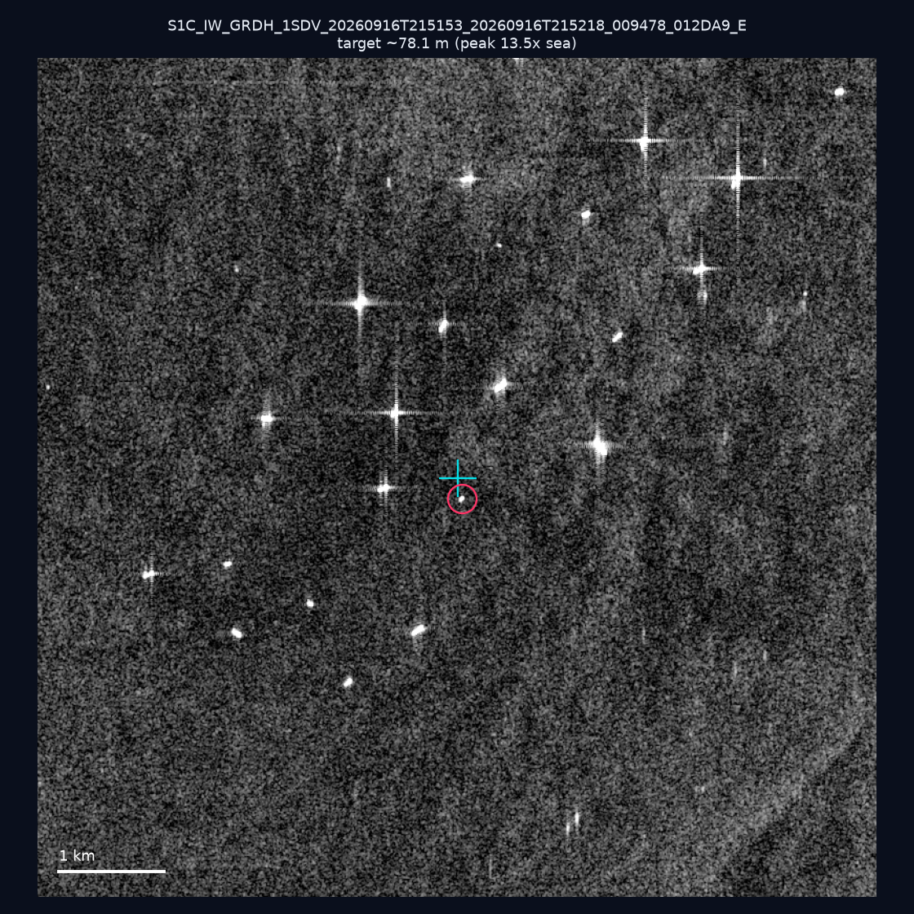
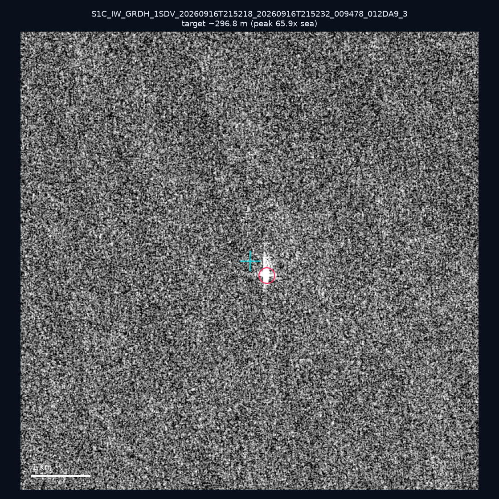
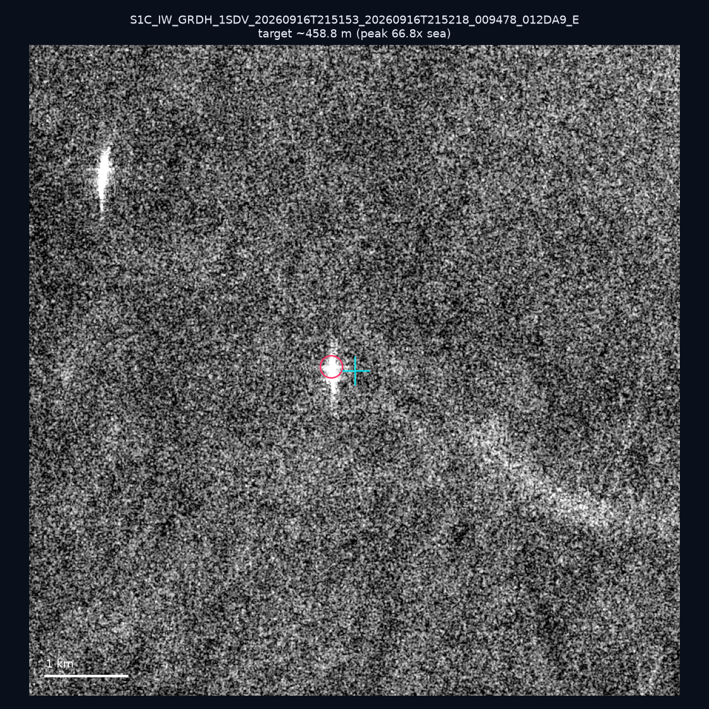

# 暗船 SAR 取證報告 — 2026-09-24

## 1. 總覽

- 執行時間：2026-09-24（GitHub Actions cron 自動執行）
- 線上比對摘要：暗偵測 15088 筆、殘餘暗船 11505 筆、假暗船剔除率 23.7%
- 本輪測試：10 筆
- 成功：10 筆
- 找到亮目標：6 筆
- 失敗：0 筆

## 2. 結果總表

| 日期 | 座標 | 海域 | 法域 | 成像時刻 | 判定 | 估計長度 | 峰值比 |
|------|------|------|------|----------|------|----------|--------|
| 2026-09-18 | 23.43, 117.17 | southwest | eez | 10:16:50 | ✅ 確認實體目標 | ~107.7 m | 13.1× |
| 2026-09-18 | 22.92, 117.97 | southwest | eez | 10:16:50 | ⚪ 無目標（雜訊或低RCS） | — | — |
| 2026-09-18 | 23.16, 118.18 | southwest | eez | 10:16:50 | ⚪ 無目標（雜訊或低RCS） | — | — |
| 2026-09-18 | 23.18, 117.06 | southwest | eez | 10:16:50 | ⚪ 無目標（雜訊或低RCS） | — | — |
| 2026-09-16 | 22.93, 119.98 | southwest | internal_waters | 21:51:53 | ⚪ 無目標（雜訊或低RCS） | — | — |
| 2026-09-16 | 22.74, 120.16 | southwest | internal_waters | 21:51:53 | ✅ 確認實體目標 | ~120.4 m | 19.1× |
| 2026-09-16 | 24.55, 121.96 | east | territorial_sea | 21:51:23 | 🟡 弱目標 | ~222.0 m | 6.6× |
| 2026-09-16 | 22.7, 120.17 | southwest | internal_waters | 21:51:53 | ✅ 確認實體目標 | ~78.1 m | 13.5× |
| 2026-09-16 | 21.76, 119.33 | southwest | eez | 21:52:18 | ✅ 確認實體目標 | ~296.8 m | 65.9× |
| 2026-09-16 | 23.28, 119.78 | southwest | internal_waters | 21:51:53 | ✅ 確認實體目標 | ~458.8 m | 66.8× |

## 3. 逐目標段落

### 2026-09-18 (23.43, 117.17)

✅ 確認實體目標，估計長度 ~107.7 m，峰值 13.1× 海面背景（28 px）。

### 2026-09-18 (22.92, 117.97)

⚪ 無目標（雜訊或低RCS）。

### 2026-09-18 (23.16, 118.18)

⚪ 無目標（雜訊或低RCS）。

### 2026-09-18 (23.18, 117.06)

⚪ 無目標（雜訊或低RCS）。

### 2026-09-16 (22.93, 119.98)

⚪ 無目標（雜訊或低RCS）。

### 2026-09-16 (22.74, 120.16)

✅ 確認實體目標，估計長度 ~120.4 m，峰值 19.1× 海面背景（47 px）。

### 2026-09-16 (24.55, 121.96)

🟡 弱目標，估計長度 ~222.0 m，峰值 6.6× 海面背景（145 px）。

### 2026-09-16 (22.7, 120.17)

✅ 確認實體目標，估計長度 ~78.1 m，峰值 13.5× 海面背景（20 px）。

### 2026-09-16 (21.76, 119.33)

✅ 確認實體目標，估計長度 ~296.8 m，峰值 65.9× 海面背景（190 px）。

### 2026-09-16 (23.28, 119.78)

✅ 確認實體目標，估計長度 ~458.8 m，峰值 66.8× 海面背景（281 px）。

## 4. 後續建議

- 值得人工深查（確認實體目標且長度 ≥ 50m）：
  - 2026-09-18 (23.43, 117.17) ~107.7 m — 建議比對周邊 AIS 船長
  - 2026-09-16 (22.74, 120.16) ~120.4 m — 建議比對周邊 AIS 船長
  - 2026-09-16 (22.7, 120.17) ~78.1 m — 建議比對周邊 AIS 船長
  - 2026-09-16 (21.76, 119.33) ~296.8 m — 建議比對周邊 AIS 船長
  - 2026-09-16 (23.28, 119.78) ~458.8 m — 建議比對周邊 AIS 船長
- 累積統計：全歷史 294 筆（有效 294 筆），確認實體目標 35 筆（11.9%）

> 所有結果是研判線索，不是法律認定；無目標 ≠ 誤報（小型木殼漁船 RCS 低，SAR 可能拍不到）。
