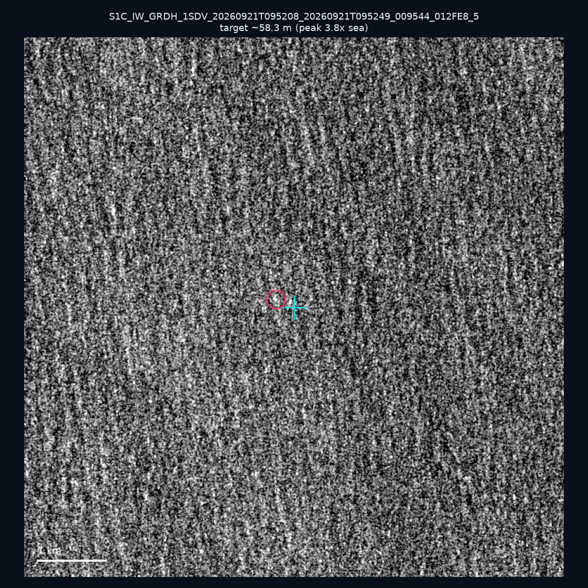
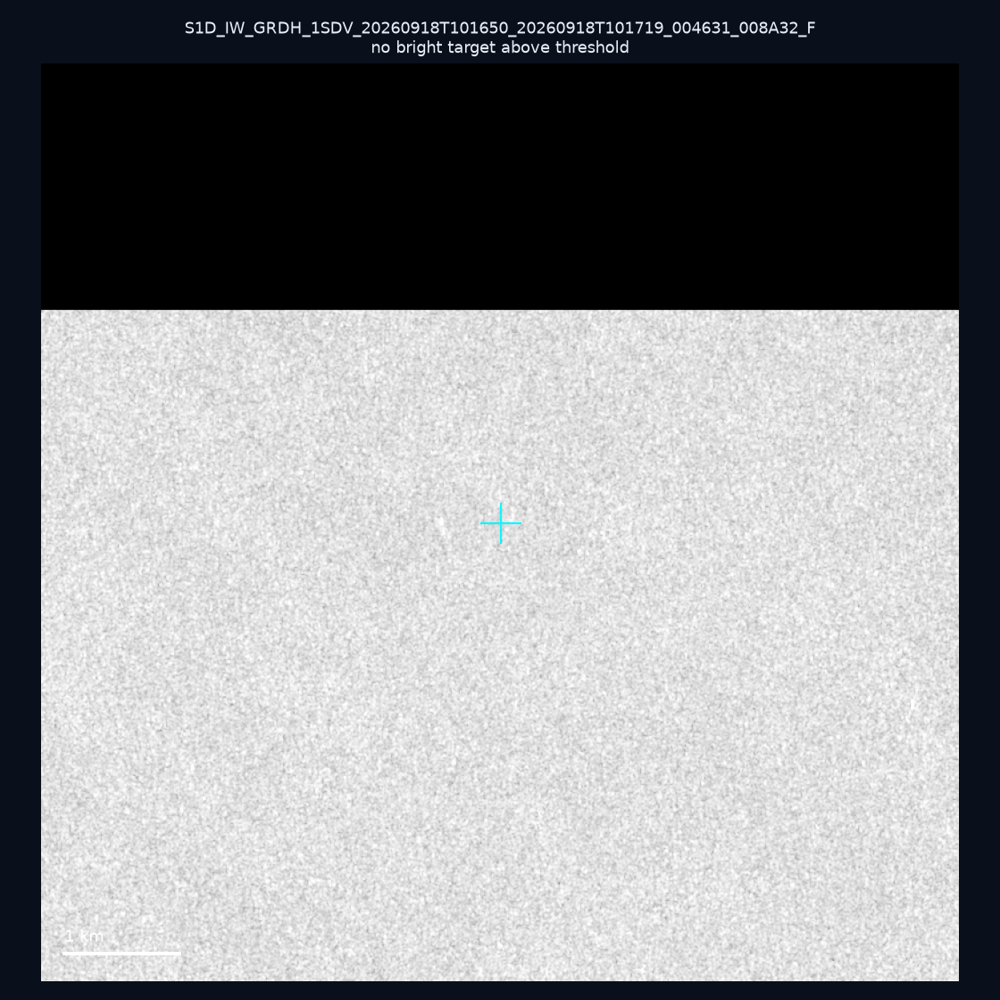
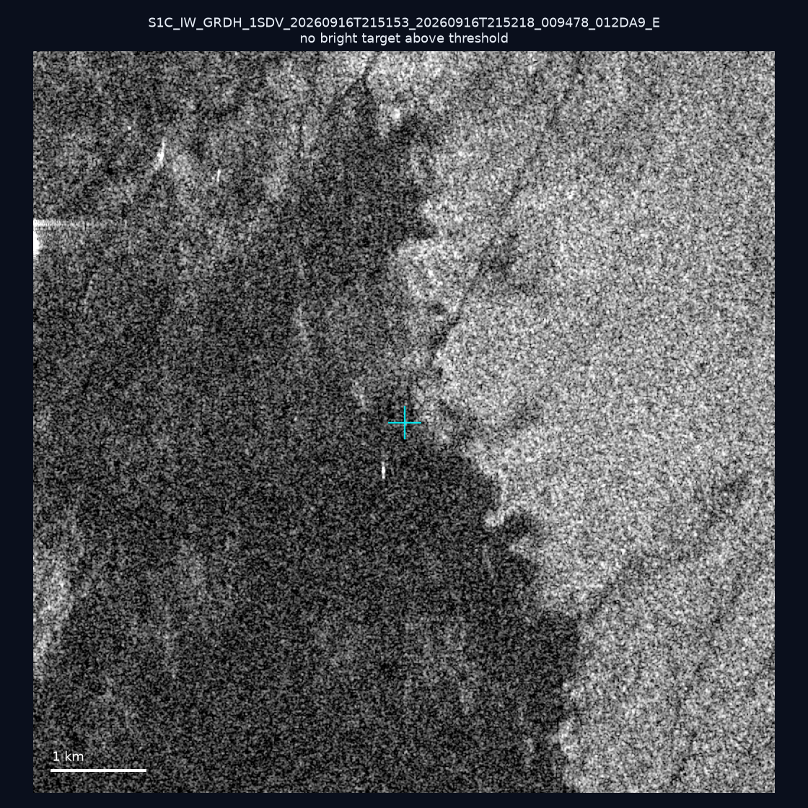
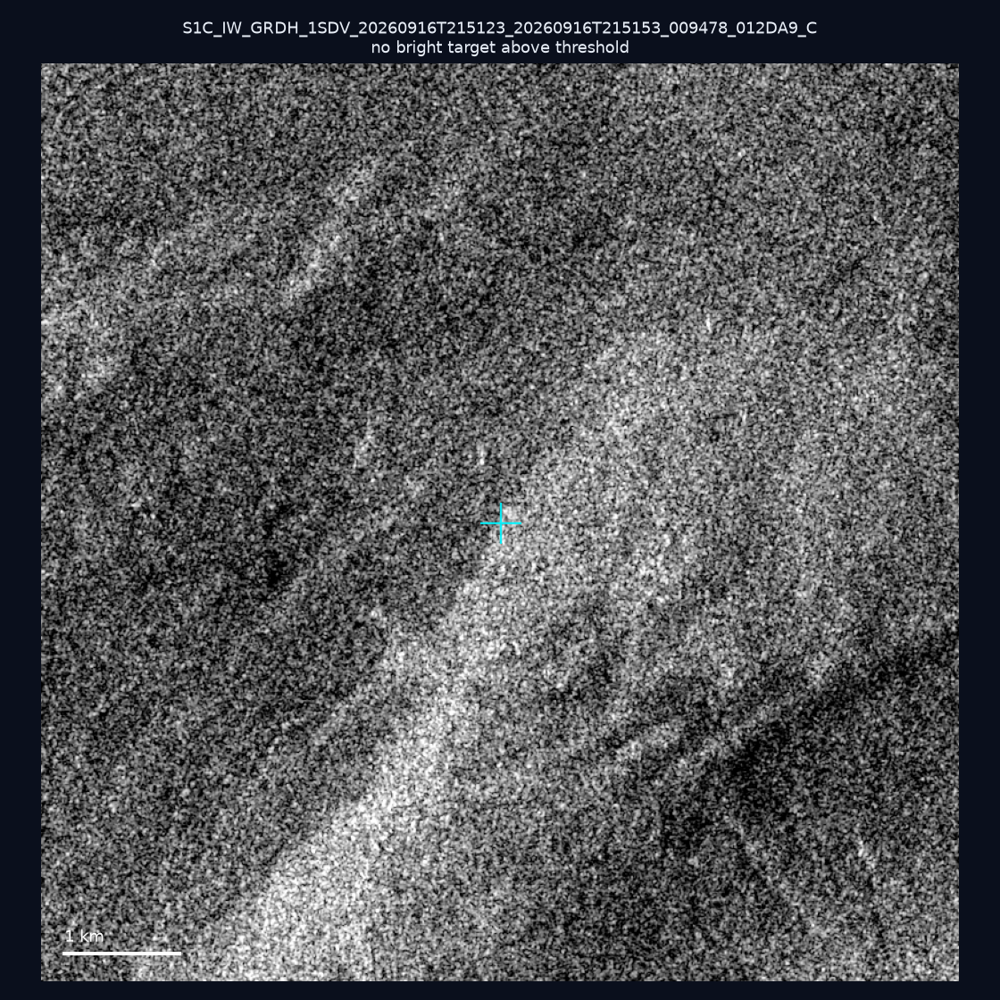
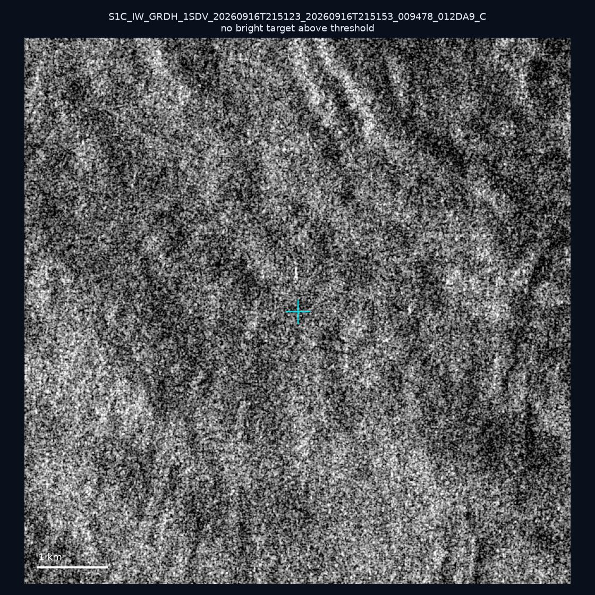
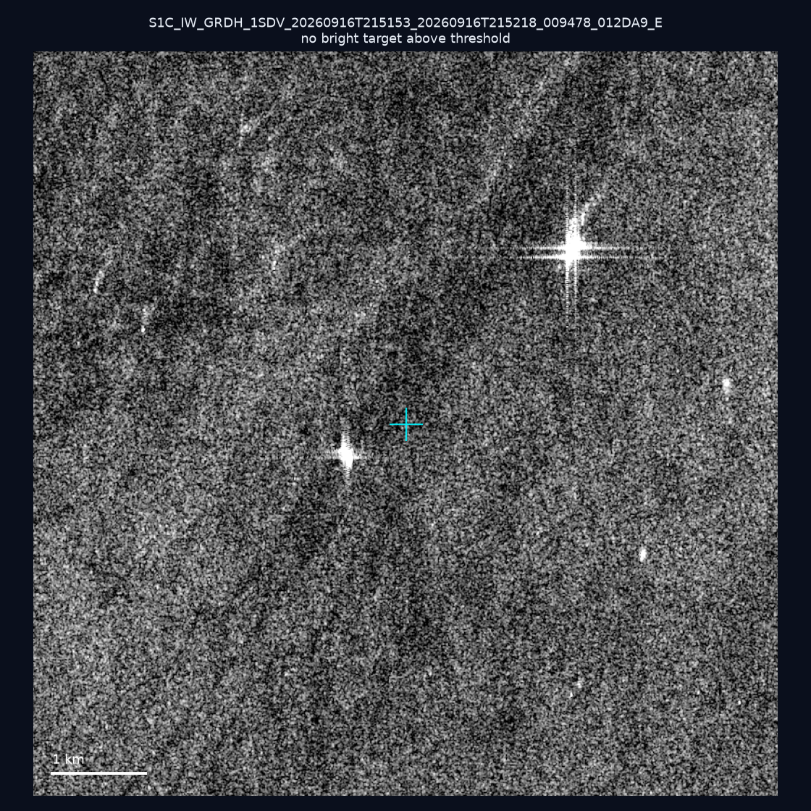
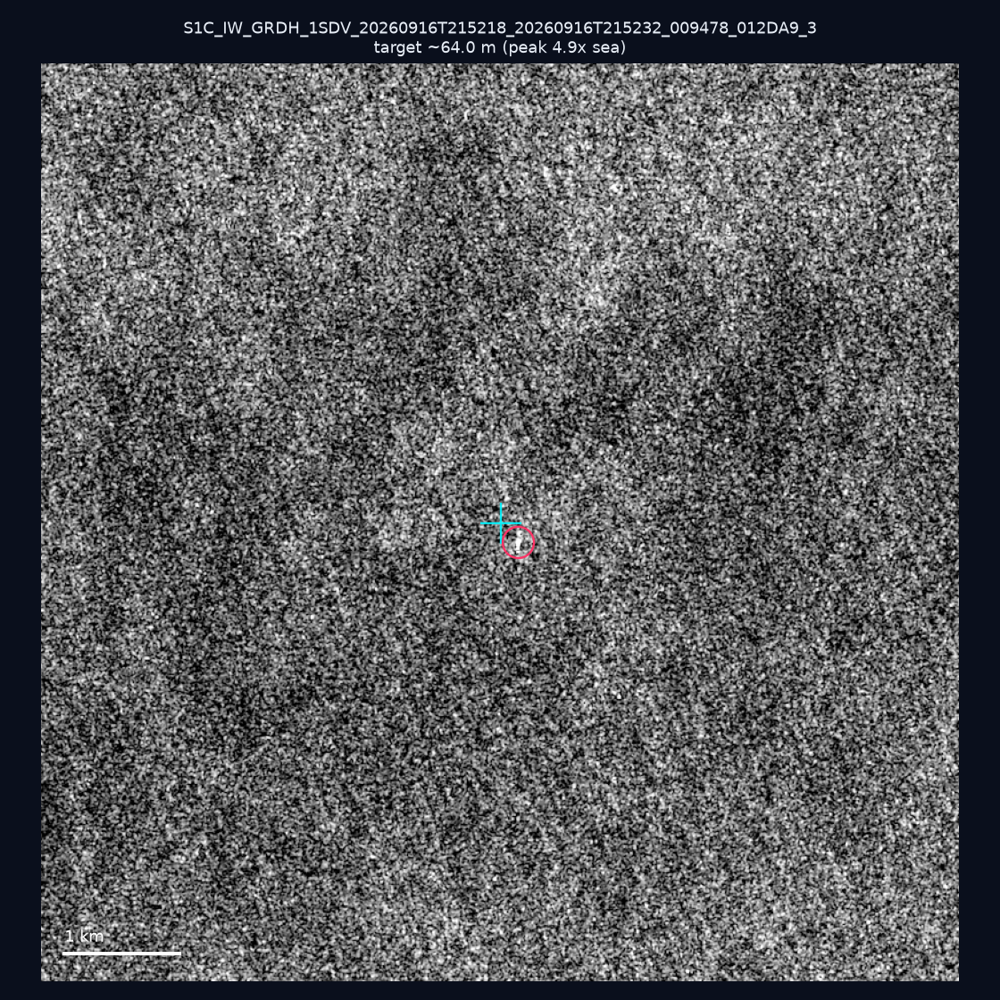
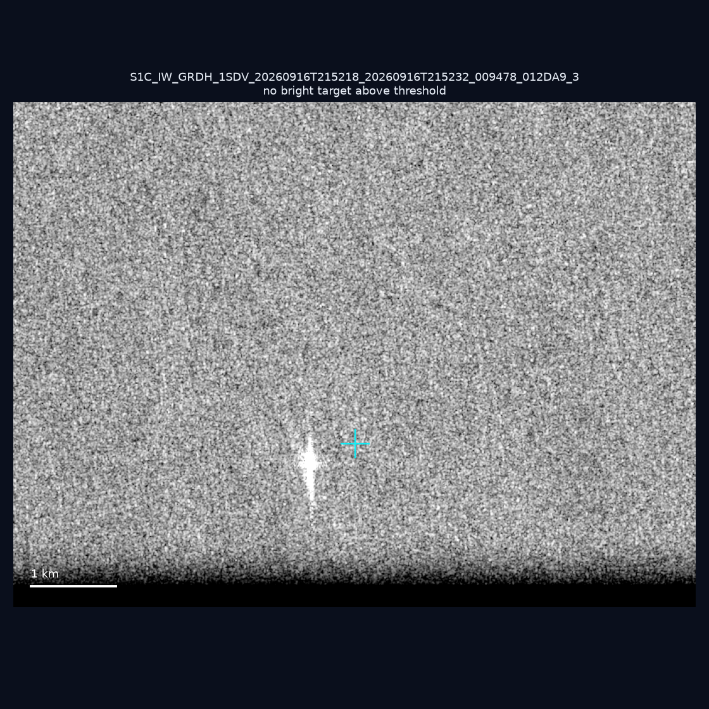
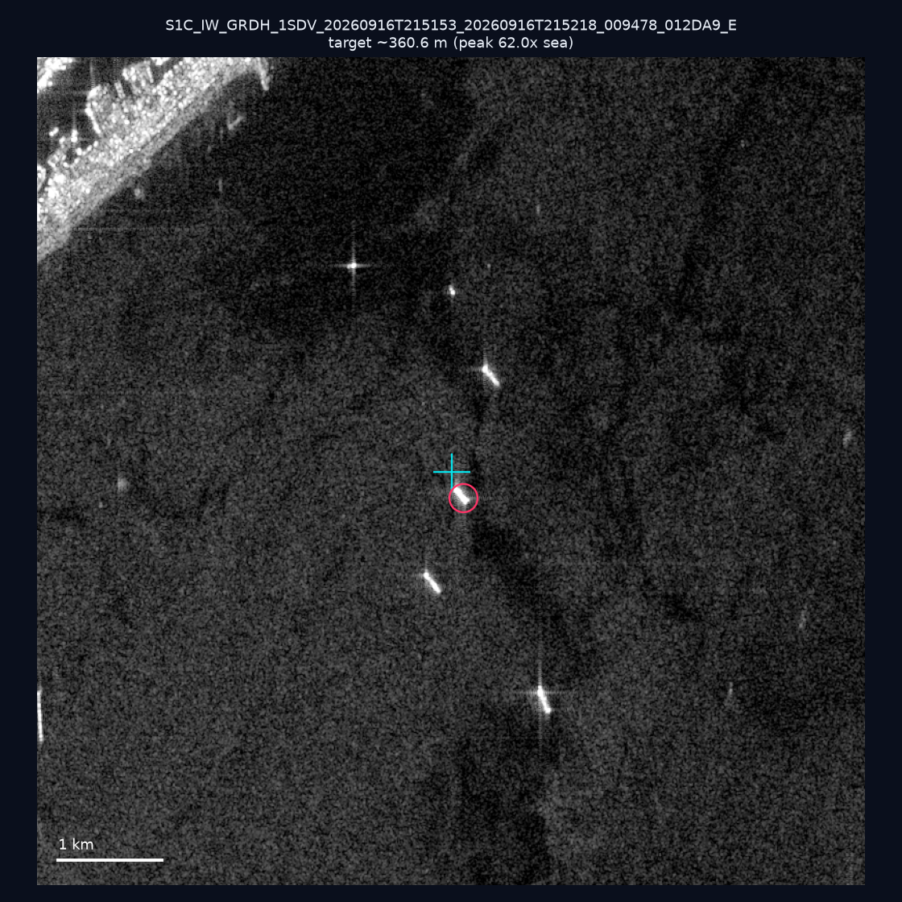
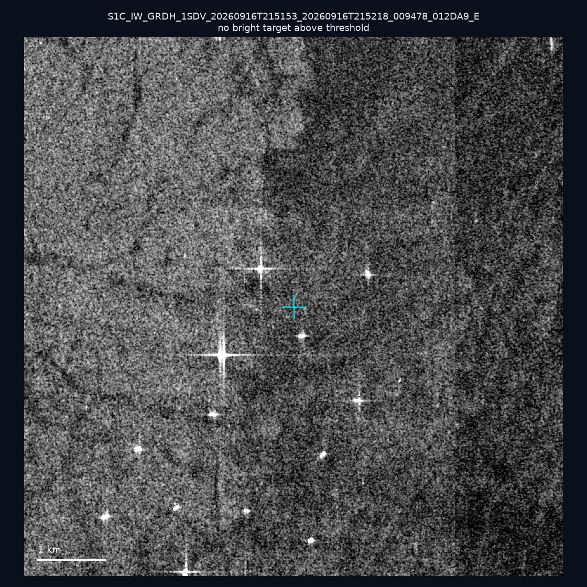

# 暗船 SAR 取證報告 — 2026-09-25

## 1. 總覽

- 執行時間：2026-09-25（GitHub Actions cron 自動執行）
- 線上比對摘要：暗偵測 16653 筆、殘餘暗船 12595 筆、假暗船剔除率 24.4%
- 本輪測試：10 筆
- 成功：10 筆
- 找到亮目標：3 筆
- 失敗：0 筆

## 2. 結果總表

| 日期 | 座標 | 海域 | 法域 | 成像時刻 | 判定 | 估計長度 | 峰值比 |
|------|------|------|------|----------|------|----------|--------|
| 2026-09-21 | 23.42, 122.22 | east | eez | 09:52:08 | 🟡 弱目標 | ~58.3 m | 3.8× |
| 2026-09-18 | 22.72, 117.41 | southwest | eez | 10:16:50 | ⚪ 無目標（雜訊或低RCS） | — | — |
| 2026-09-16 | 22.48, 120.2 | southwest | internal_waters | 21:51:53 | ⚪ 無目標（雜訊或低RCS） | — | — |
| 2026-09-16 | 24.92, 122.0 | east | territorial_sea | 21:51:23 | ⚪ 無目標（雜訊或低RCS） | — | — |
| 2026-09-16 | 25.36, 122.19 | east | territorial_sea | 21:51:23 | ⚪ 無目標（雜訊或低RCS） | — | — |
| 2026-09-16 | 22.61, 120.16 | southwest | internal_waters | 21:51:53 | ⚪ 無目標（雜訊或低RCS） | — | — |
| 2026-09-16 | 22.24, 119.84 | southwest | contiguous_zone | 21:52:18 | 🟡 弱目標 | ~64.0 m | 4.9× |
| 2026-09-16 | 21.71, 119.35 | southwest | eez | 21:52:18 | ⚪ 無目標（雜訊或低RCS） | — | — |
| 2026-09-16 | 22.58, 120.24 | southwest | internal_waters | 21:51:53 | ✅ 確認實體目標 | ~360.6 m | 62.0× |
| 2026-09-16 | 22.77, 120.15 | southwest | internal_waters | 21:51:53 | ⚪ 無目標（雜訊或低RCS） | — | — |

## 3. 逐目標段落

### 2026-09-21 (23.42, 122.22)

🟡 弱目標，估計長度 ~58.3 m，峰值 3.8× 海面背景（8 px）。

### 2026-09-18 (22.72, 117.41)

⚪ 無目標（雜訊或低RCS）。

### 2026-09-16 (22.48, 120.2)

⚪ 無目標（雜訊或低RCS）。

### 2026-09-16 (24.92, 122.0)

⚪ 無目標（雜訊或低RCS）。

### 2026-09-16 (25.36, 122.19)

⚪ 無目標（雜訊或低RCS）。

### 2026-09-16 (22.61, 120.16)

⚪ 無目標（雜訊或低RCS）。

### 2026-09-16 (22.24, 119.84)

🟡 弱目標，估計長度 ~64.0 m，峰值 4.9× 海面背景（12 px）。

### 2026-09-16 (21.71, 119.35)

⚪ 無目標（雜訊或低RCS）。

### 2026-09-16 (22.58, 120.24)

✅ 確認實體目標，估計長度 ~360.6 m，峰值 62.0× 海面背景（247 px）。

### 2026-09-16 (22.77, 120.15)

⚪ 無目標（雜訊或低RCS）。

## 4. 後續建議

- 值得人工深查（確認實體目標且長度 ≥ 50m）：
  - 2026-09-16 (22.58, 120.24) ~360.6 m — 建議比對周邊 AIS 船長
- 累積統計：全歷史 336 筆（有效 336 筆），確認實體目標 40 筆（11.9%）

> 所有結果是研判線索，不是法律認定；無目標 ≠ 誤報（小型木殼漁船 RCS 低，SAR 可能拍不到）。
