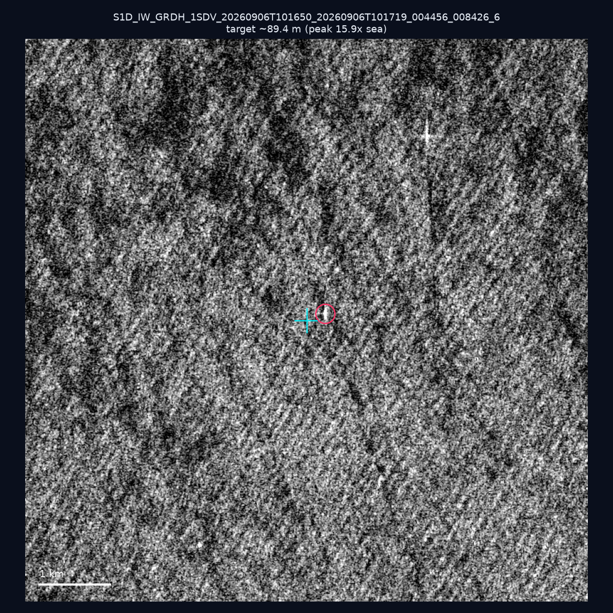
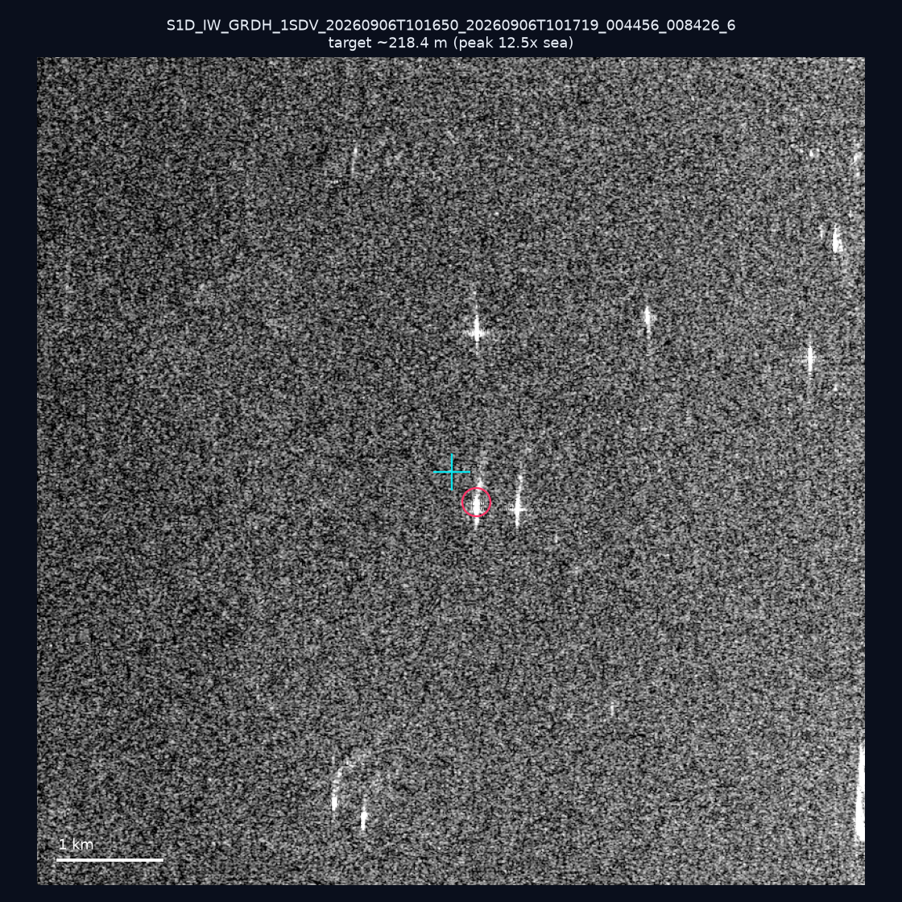
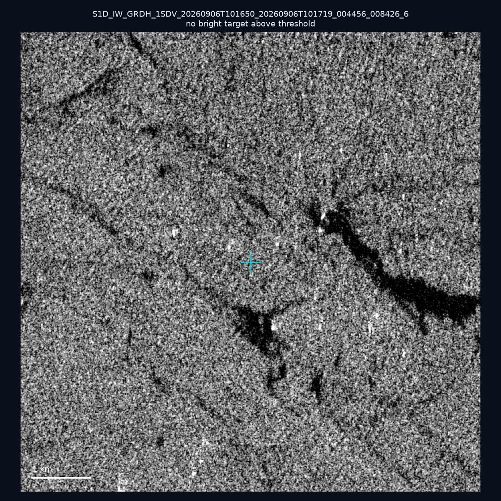

# 暗船 SAR 取證報告 — 2026-09-26

## 1. 總覽

- 執行時間：2026-09-26（GitHub Actions cron 自動執行）
- 線上比對摘要：暗偵測 16320 筆、殘餘暗船 12329 筆、假暗船剔除率 24.5%
- 本輪測試：3 筆
- 成功：3 筆
- 找到亮目標：2 筆
- 失敗：0 筆

## 2. 結果總表

| 日期 | 座標 | 海域 | 法域 | 成像時刻 | 判定 | 估計長度 | 峰值比 |
|------|------|------|------|----------|------|----------|--------|
| 2026-09-06 | 23.15, 118.11 | southwest | eez | 10:16:50 | ✅ 確認實體目標 | ~89.4 m | 15.9× |
| 2026-09-06 | 23.4, 118.38 | southwest | eez | 10:16:50 | ✅ 確認實體目標 | ~218.4 m | 12.5× |
| 2026-09-06 | 23.18, 117.17 | southwest | eez | 10:16:50 | ⚪ 無目標（雜訊或低RCS） | — | — |

## 3. 逐目標段落

### 2026-09-06 (23.15, 118.11)

✅ 確認實體目標，估計長度 ~89.4 m，峰值 15.9× 海面背景（30 px）。

### 2026-09-06 (23.4, 118.38)

✅ 確認實體目標，估計長度 ~218.4 m，峰值 12.5× 海面背景（73 px）。

### 2026-09-06 (23.18, 117.17)

⚪ 無目標（雜訊或低RCS）。

## 4. 後續建議

- 值得人工深查（確認實體目標且長度 ≥ 50m）：
  - 2026-09-06 (23.15, 118.11) ~89.4 m — 建議比對周邊 AIS 船長
  - 2026-09-06 (23.4, 118.38) ~218.4 m — 建議比對周邊 AIS 船長
- 累積統計：全歷史 339 筆（有效 339 筆），確認實體目標 42 筆（12.4%）

> 所有結果是研判線索，不是法律認定；無目標 ≠ 誤報（小型木殼漁船 RCS 低，SAR 可能拍不到）。
