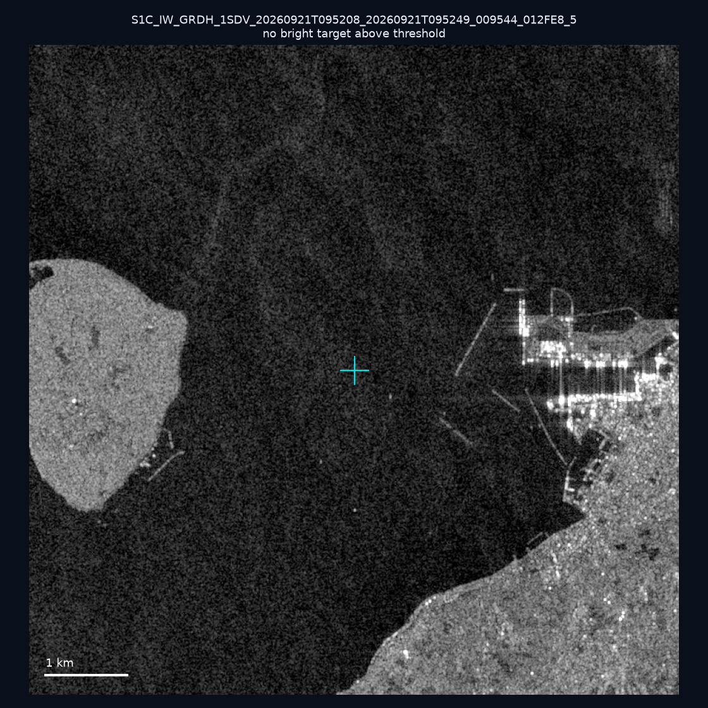
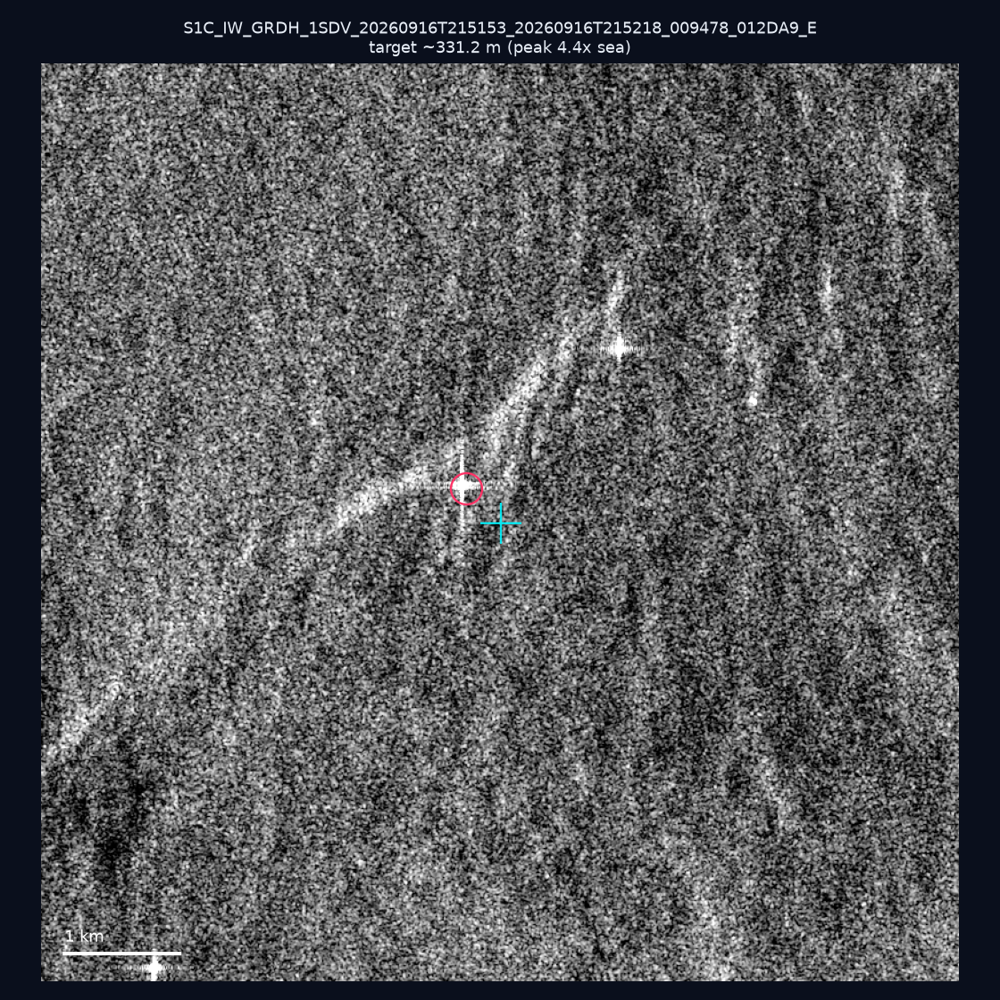
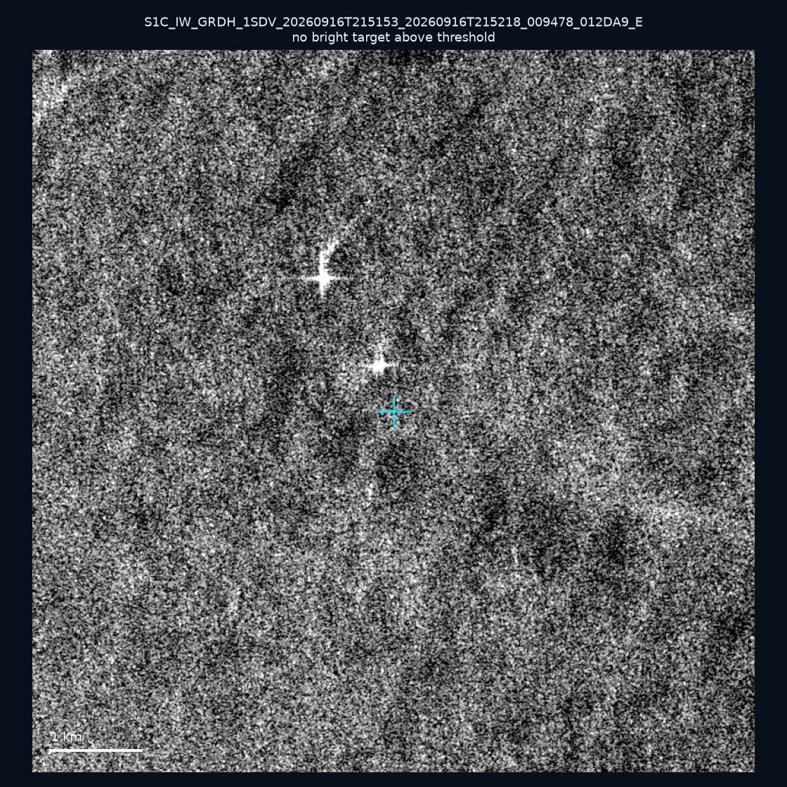
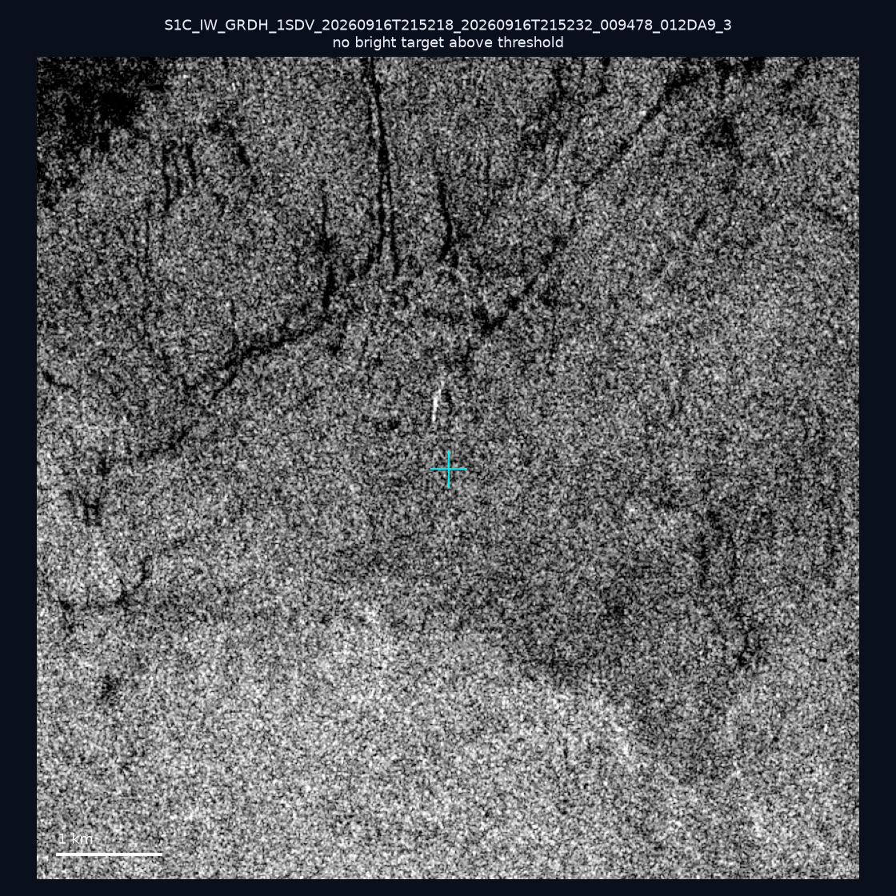
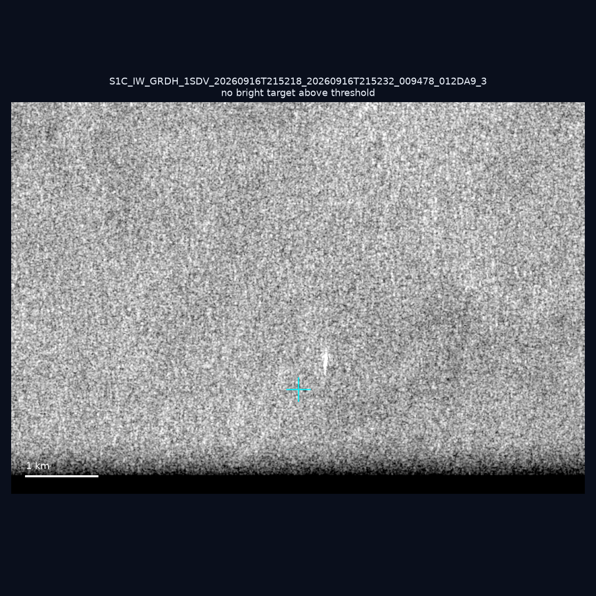
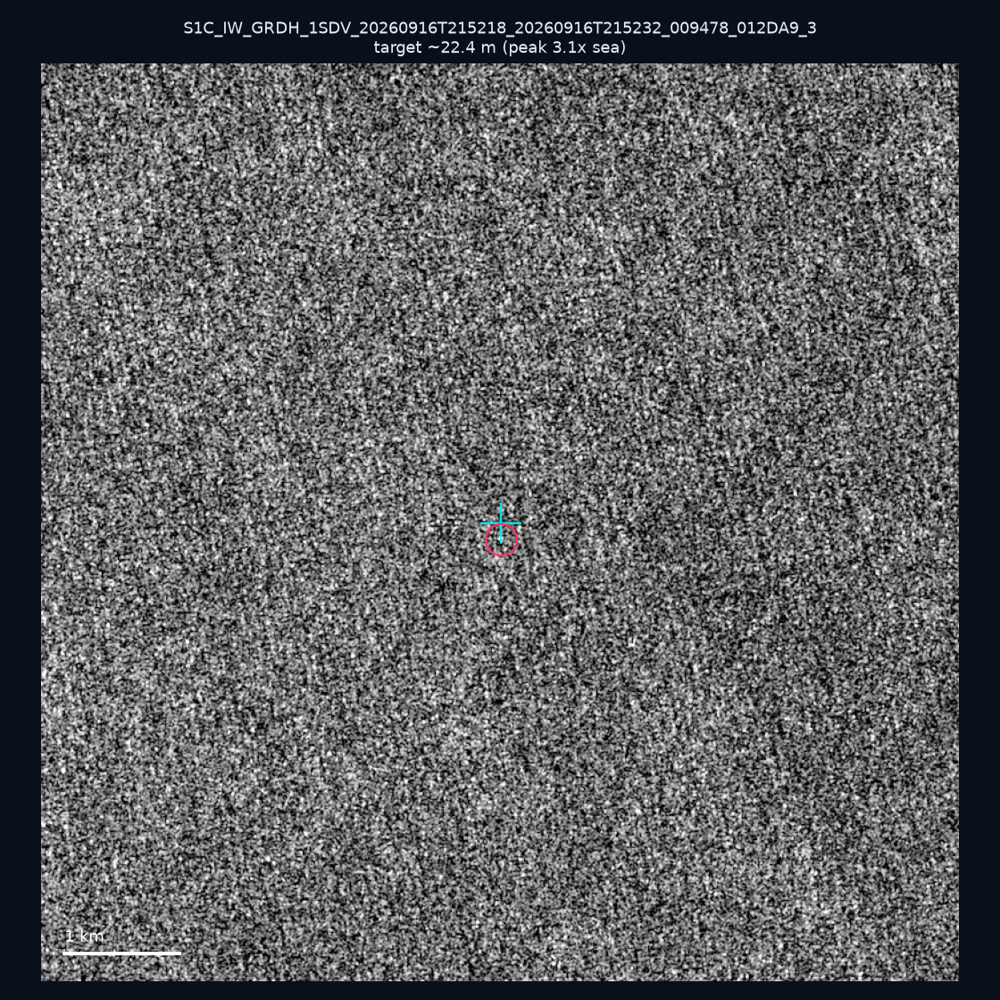
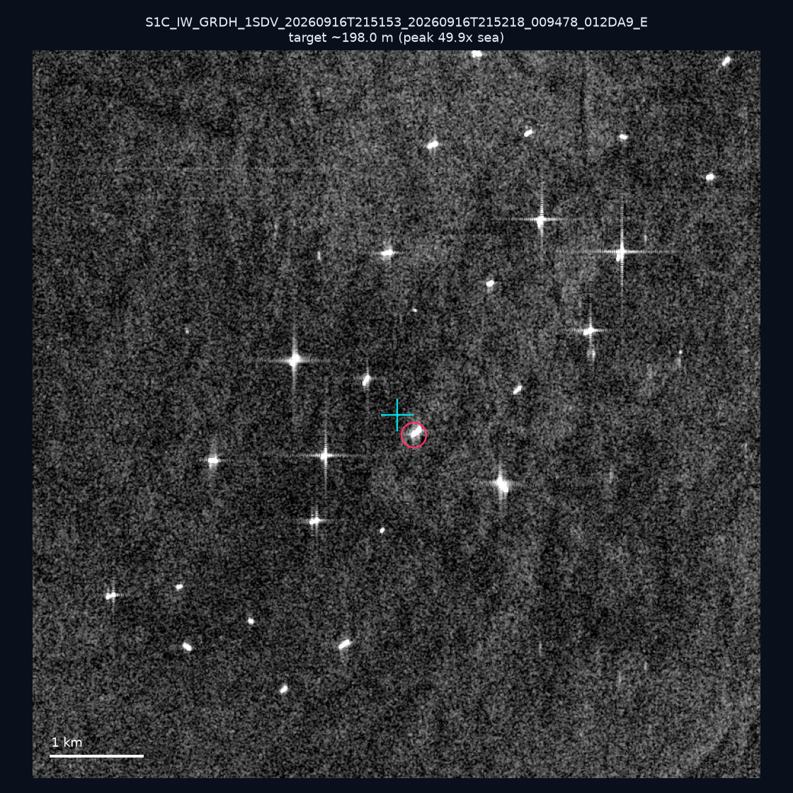
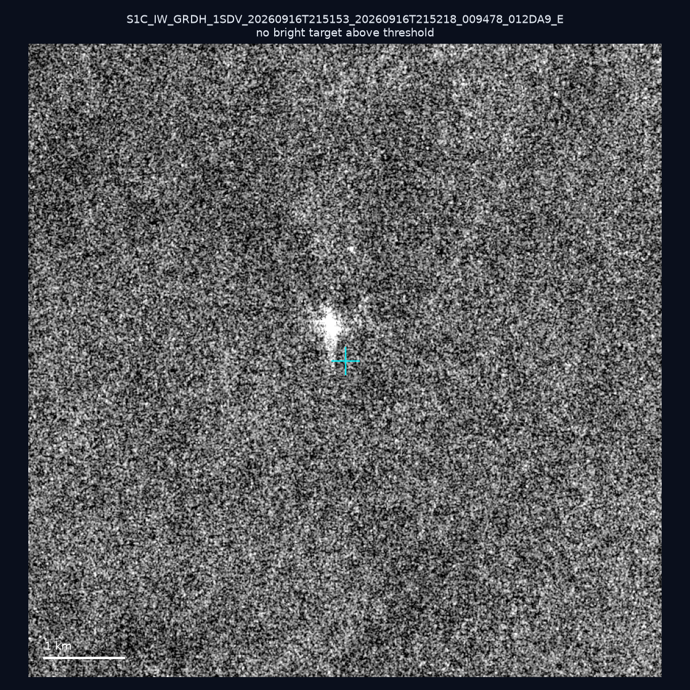
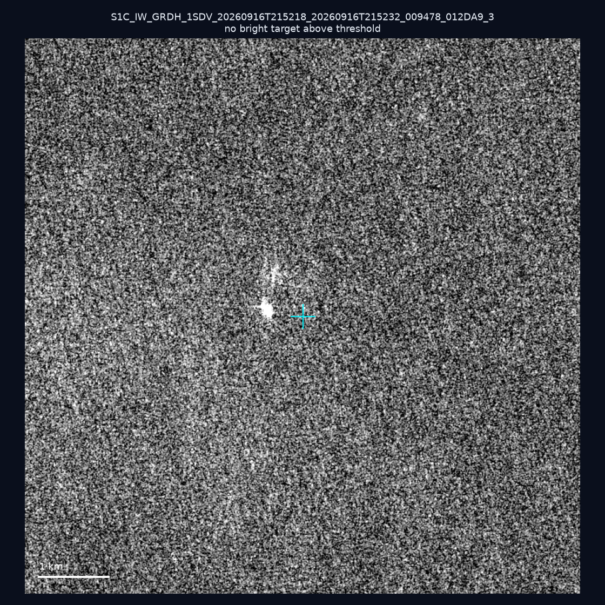
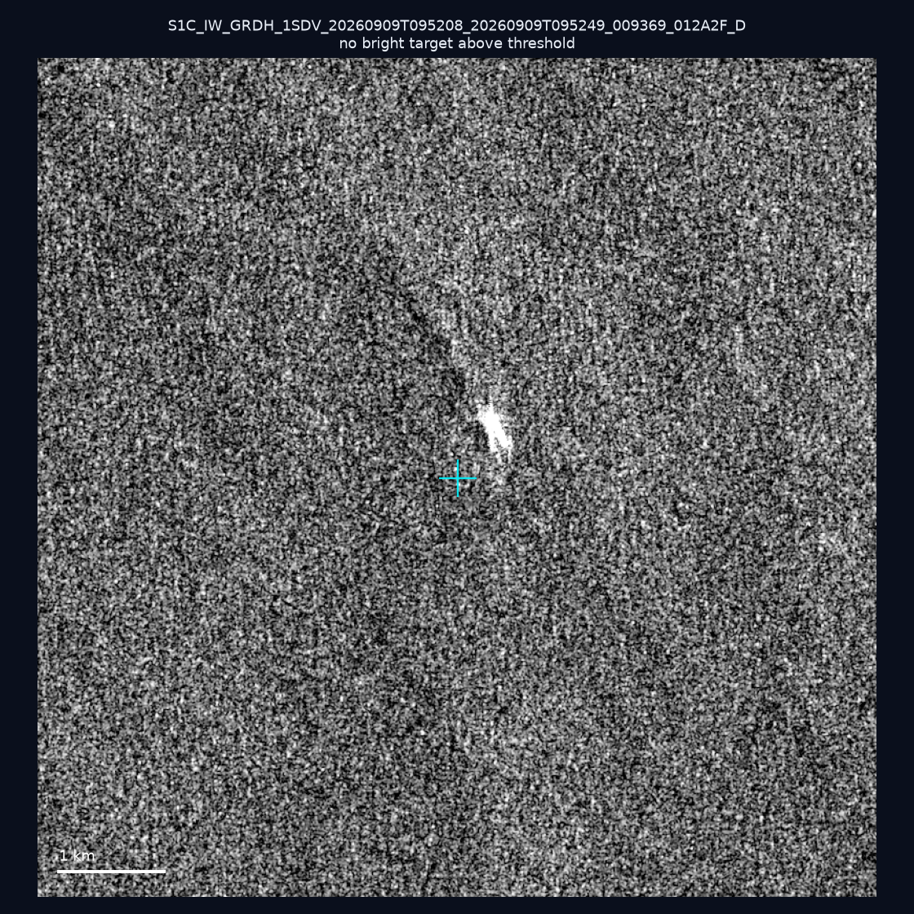

# 暗船 SAR 取證報告 — 2026-09-27

## 1. 總覽

- 執行時間：2026-09-27（GitHub Actions cron 自動執行）
- 線上比對摘要：暗偵測 16303 筆、殘餘暗船 12346 筆、假暗船剔除率 24.3%
- 本輪測試：10 筆
- 成功：10 筆
- 找到亮目標：3 筆
- 失敗：0 筆

## 2. 結果總表

| 日期 | 座標 | 海域 | 法域 | 成像時刻 | 判定 | 估計長度 | 峰值比 |
|------|------|------|------|----------|------|----------|--------|
| 2026-09-21 | 24.33, 124.12 | east | eez | 09:52:08 | ⚪ 無目標（雜訊或低RCS） | — | — |
| 2026-09-16 | 22.86, 120.07 | southwest | internal_waters | 21:51:53 | 🟡 弱目標 | ~331.2 m | 4.4× |
| 2026-09-16 | 22.69, 120.06 | southwest | internal_waters | 21:51:53 | ⚪ 無目標（雜訊或低RCS） | — | — |
| 2026-09-16 | 22.32, 120.47 | southwest | internal_waters | 21:52:18 | ⚪ 無目標（雜訊或低RCS） | — | — |
| 2026-09-16 | 21.62, 119.85 | southwest | eez | 21:52:18 | ⚪ 無目標（雜訊或低RCS） | — | — |
| 2026-09-16 | 21.87, 119.68 | southwest | eez | 21:52:18 | 🟡 弱目標 | ~22.4 m | 3.1× |
| 2026-09-16 | 22.71, 120.17 | southwest | internal_waters | 21:51:53 | ✅ 確認實體目標 | ~198.0 m | 49.9× |
| 2026-09-16 | 23.18, 119.74 | southwest | internal_waters | 21:51:53 | ⚪ 無目標（雜訊或低RCS） | — | — |
| 2026-09-16 | 22.4, 119.47 | southwest | eez | 21:52:18 | ⚪ 無目標（雜訊或低RCS） | — | — |
| 2026-09-09 | 25.35, 122.73 | east | eez | 09:52:08 | ⚪ 無目標（雜訊或低RCS） | — | — |

## 3. 逐目標段落

### 2026-09-21 (24.33, 124.12)

⚪ 無目標（雜訊或低RCS）。

### 2026-09-16 (22.86, 120.07)

🟡 弱目標，估計長度 ~331.2 m，峰值 4.4× 海面背景（148 px）。

### 2026-09-16 (22.69, 120.06)

⚪ 無目標（雜訊或低RCS）。

### 2026-09-16 (22.32, 120.47)

⚪ 無目標（雜訊或低RCS）。

### 2026-09-16 (21.62, 119.85)

⚪ 無目標（雜訊或低RCS）。

### 2026-09-16 (21.87, 119.68)

🟡 弱目標，估計長度 ~22.4 m，峰值 3.1× 海面背景（2 px）。

### 2026-09-16 (22.71, 120.17)

✅ 確認實體目標，估計長度 ~198.0 m，峰值 49.9× 海面背景（102 px）。

### 2026-09-16 (23.18, 119.74)

⚪ 無目標（雜訊或低RCS）。

### 2026-09-16 (22.4, 119.47)

⚪ 無目標（雜訊或低RCS）。

### 2026-09-09 (25.35, 122.73)

⚪ 無目標（雜訊或低RCS）。

## 4. 後續建議

- 值得人工深查（確認實體目標且長度 ≥ 50m）：
  - 2026-09-16 (22.71, 120.17) ~198.0 m — 建議比對周邊 AIS 船長
- 累積統計：全歷史 349 筆（有效 349 筆），確認實體目標 43 筆（12.3%）

> 所有結果是研判線索，不是法律認定；無目標 ≠ 誤報（小型木殼漁船 RCS 低，SAR 可能拍不到）。
