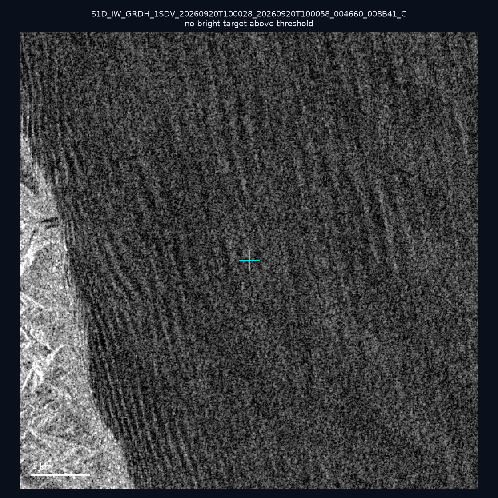
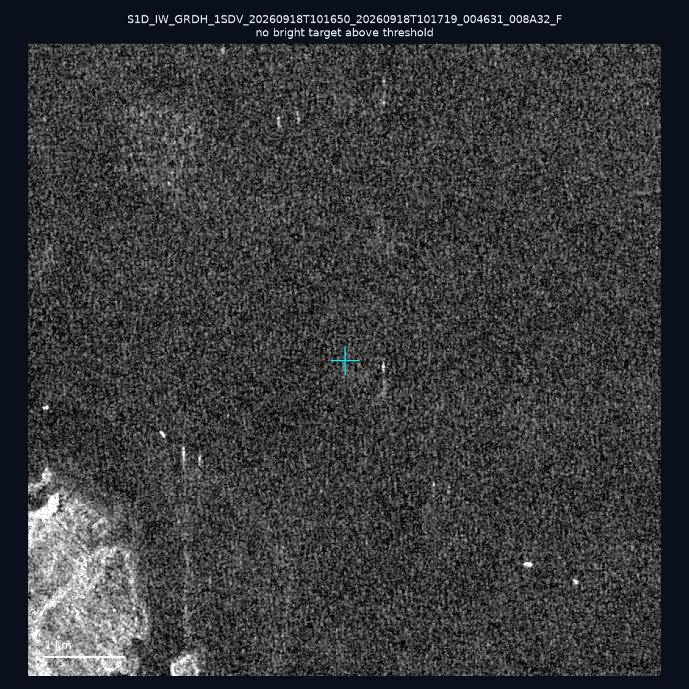
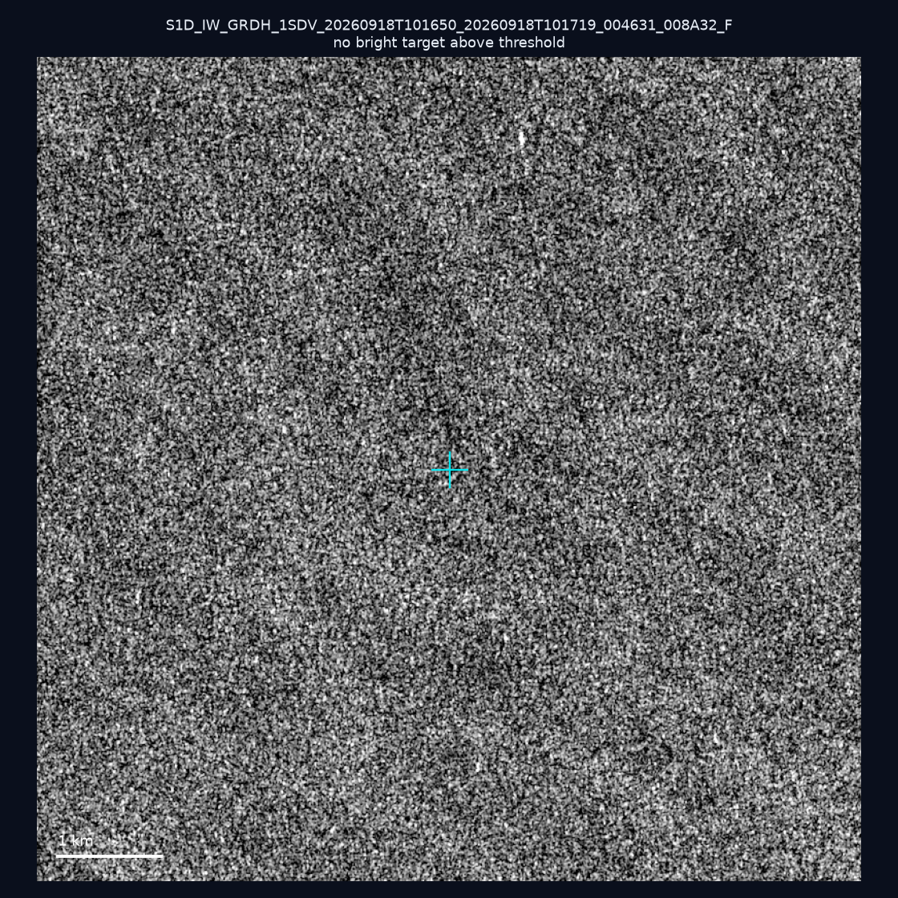
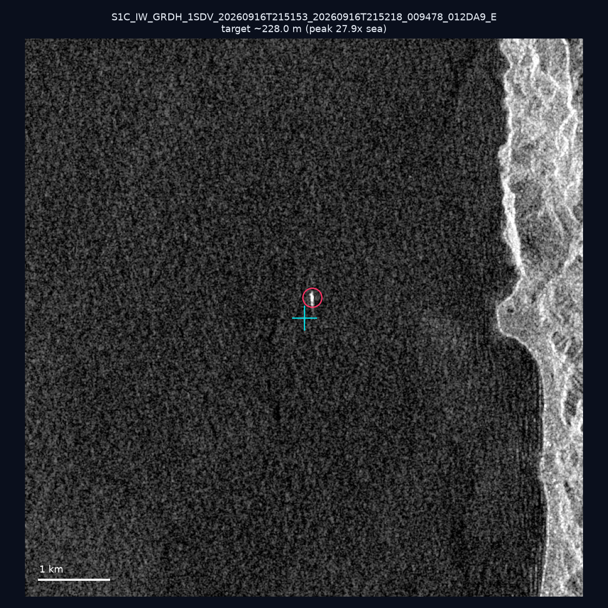
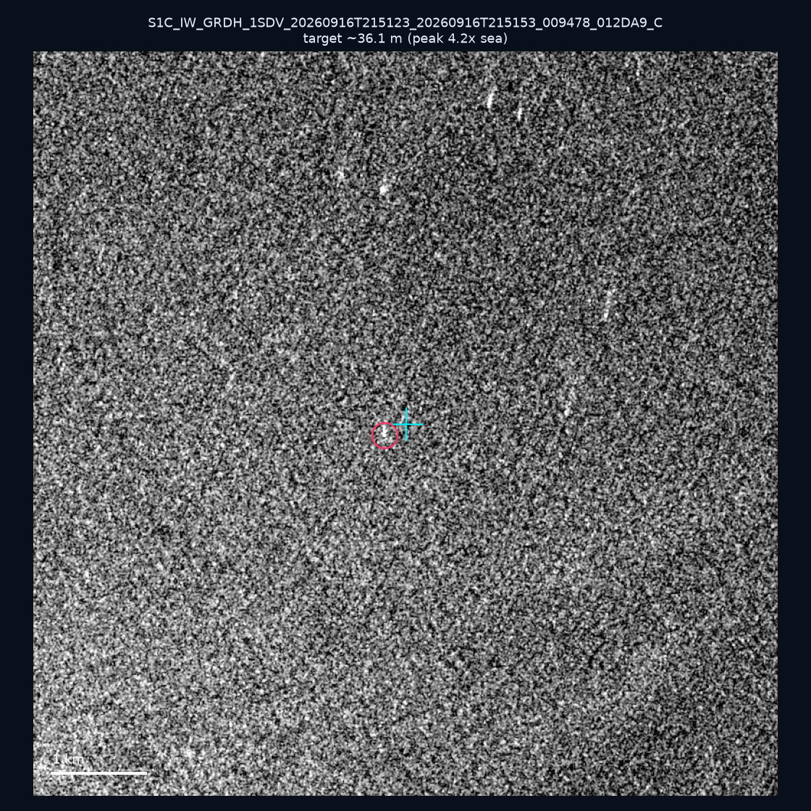
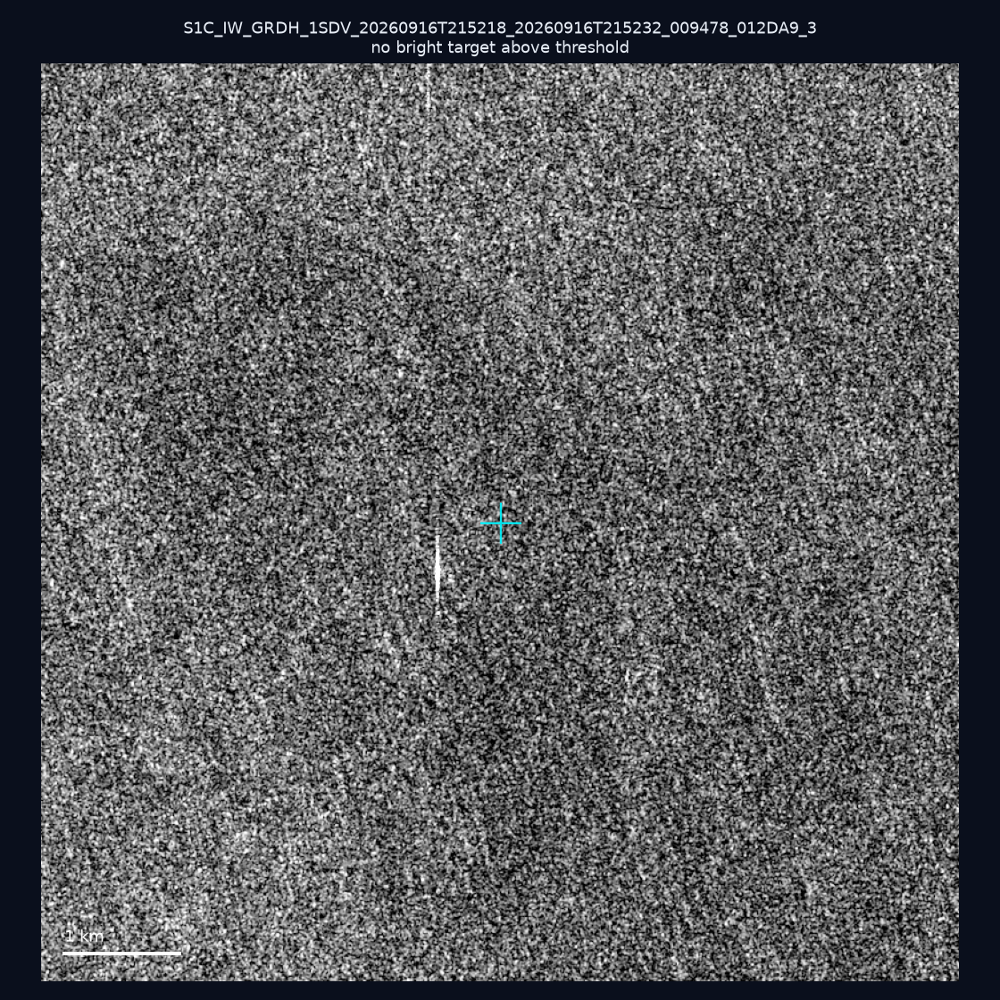
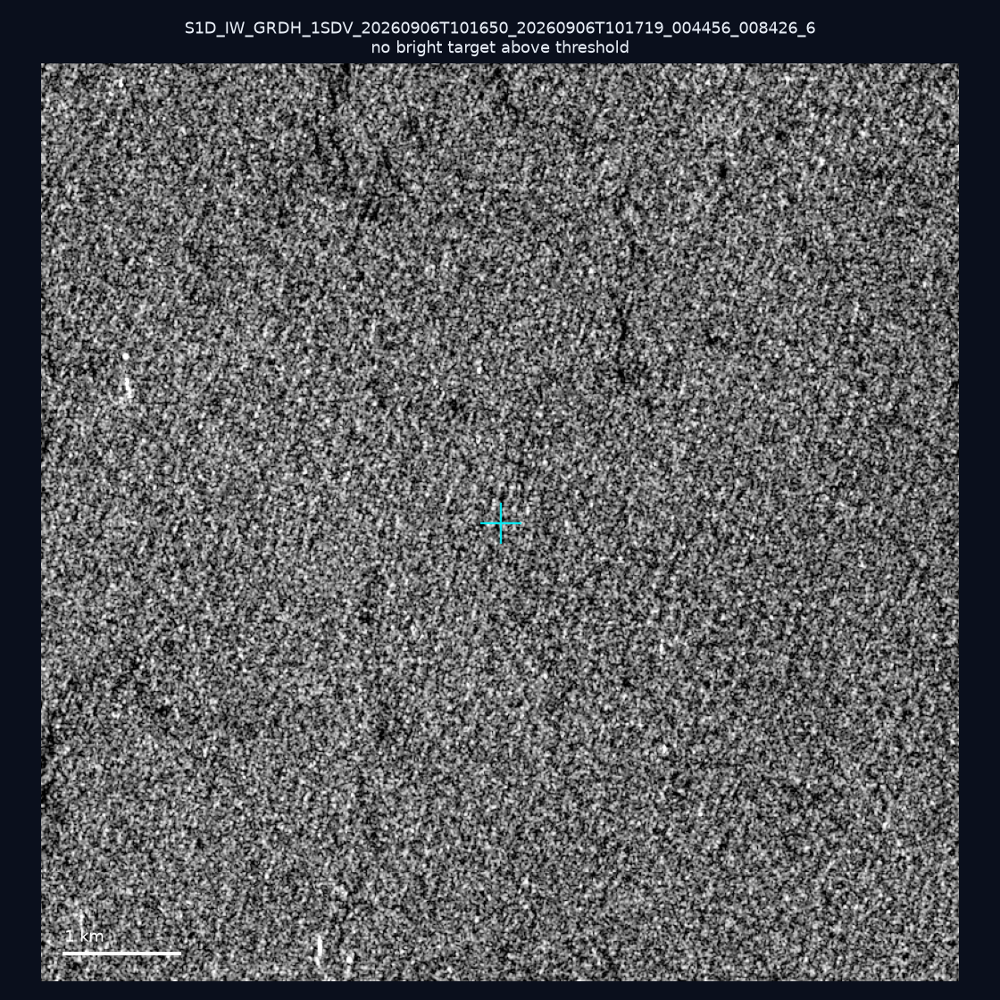
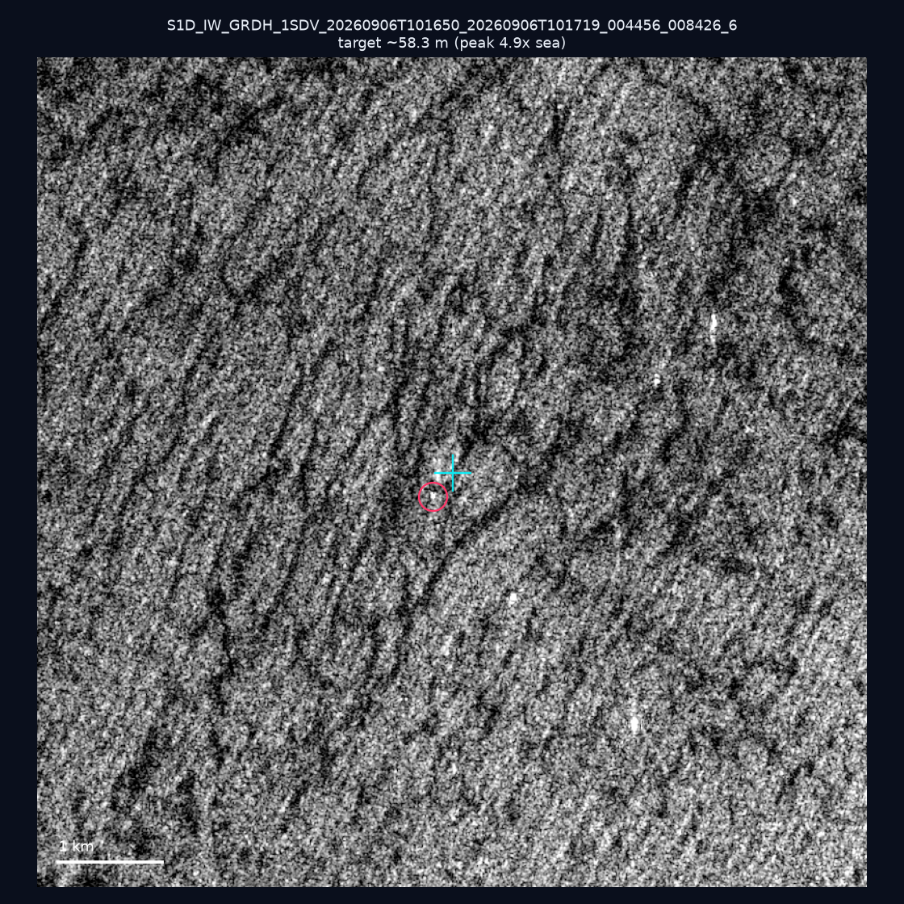
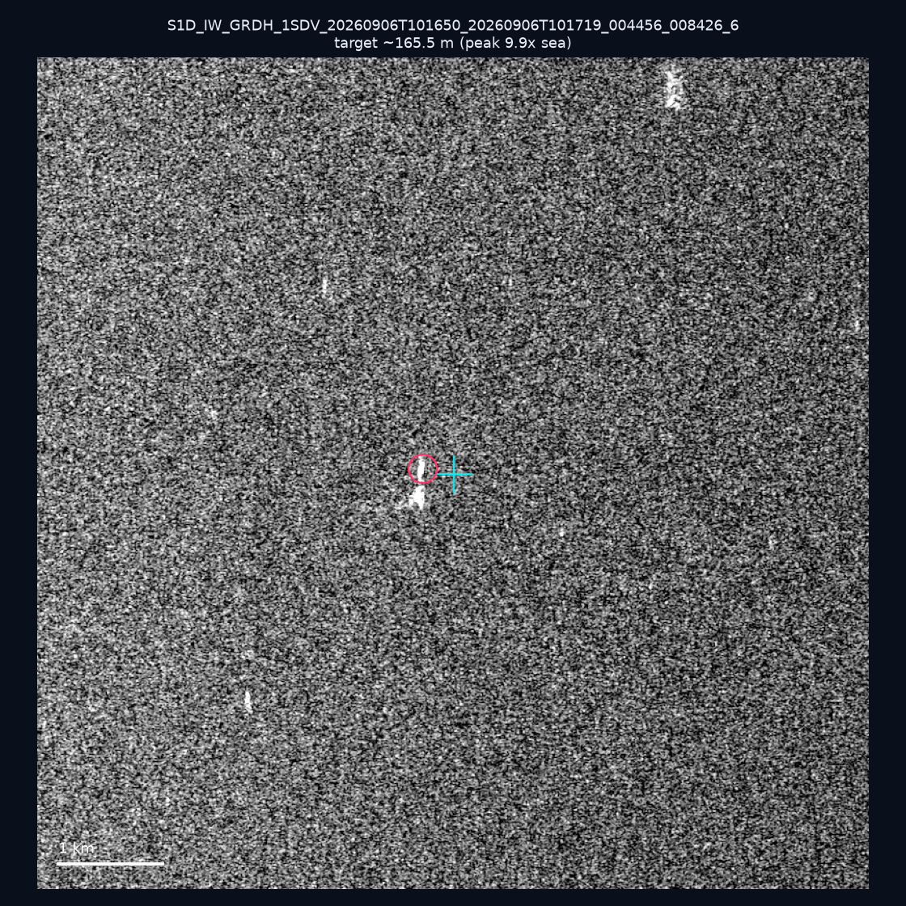
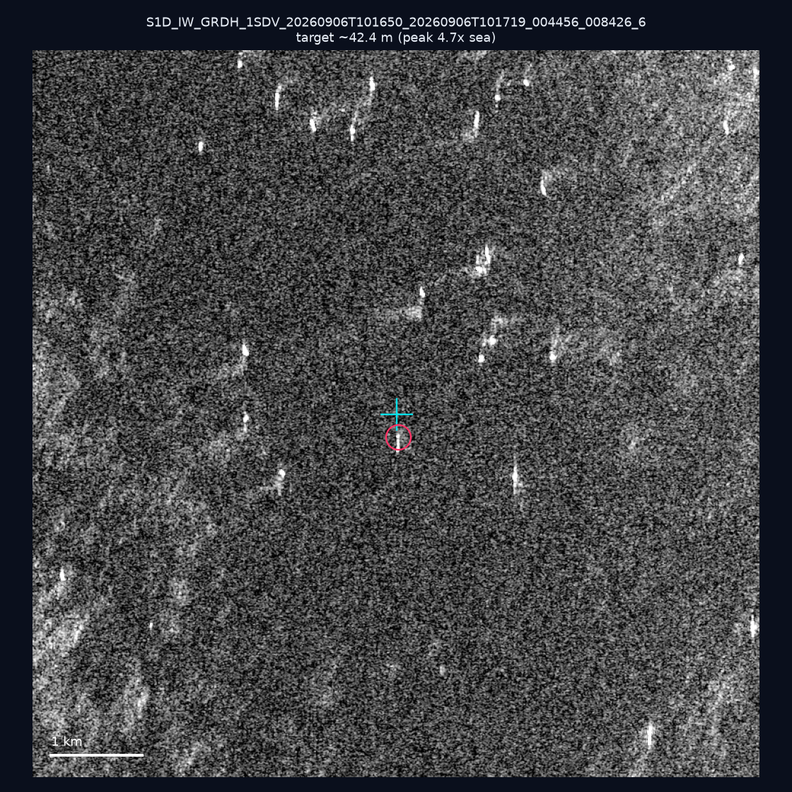

# 暗船 SAR 取證報告 — 2026-09-28

## 1. 總覽

- 執行時間：2026-09-28（GitHub Actions cron 自動執行）
- 線上比對摘要：暗偵測 16426 筆、殘餘暗船 12454 筆、假暗船剔除率 24.2%
- 本輪測試：10 筆
- 成功：10 筆
- 找到亮目標：5 筆
- 失敗：0 筆

## 2. 結果總表

| 日期 | 座標 | 海域 | 法域 | 成像時刻 | 判定 | 估計長度 | 峰值比 |
|------|------|------|------|----------|------|----------|--------|
| 2026-09-20 | 23.61, 121.56 | east | internal_waters | 10:00:28 | ⚪ 無目標（雜訊或低RCS） | — | — |
| 2026-09-18 | 23.39, 117.17 | southwest | eez | 10:16:50 | ⚪ 無目標（雜訊或低RCS） | — | — |
| 2026-09-18 | 22.82, 117.65 | southwest | eez | 10:16:50 | ⚪ 無目標（雜訊或低RCS） | — | — |
| 2026-09-16 | 23.65, 121.57 | east | internal_waters | 21:51:53 | ✅ 確認實體目標 | ~228.0 m | 27.9× |
| 2026-09-16 | 24.76, 121.89 | east | internal_waters | 21:51:23 | 🟡 弱目標 | ~36.1 m | 4.2× |
| 2026-09-16 | 22.34, 119.51 | southwest | eez | 21:52:18 | ⚪ 無目標（雜訊或低RCS） | — | — |
| 2026-09-06 | 23.34, 117.27 | southwest | eez | 10:16:50 | ⚪ 無目標（雜訊或低RCS） | — | — |
| 2026-09-06 | 22.96, 117.24 | southwest | eez | 10:16:50 | 🟡 弱目標 | ~58.3 m | 4.9× |
| 2026-09-06 | 22.91, 117.87 | southwest | eez | 10:16:50 | 🟡 弱目標 | ~165.5 m | 9.9× |
| 2026-09-06 | 23.31, 118.26 | southwest | eez | 10:16:50 | 🟡 弱目標 | ~42.4 m | 4.7× |

## 3. 逐目標段落

### 2026-09-20 (23.61, 121.56)

⚪ 無目標（雜訊或低RCS）。

### 2026-09-18 (23.39, 117.17)

⚪ 無目標（雜訊或低RCS）。

### 2026-09-18 (22.82, 117.65)

⚪ 無目標（雜訊或低RCS）。

### 2026-09-16 (23.65, 121.57)

✅ 確認實體目標，估計長度 ~228.0 m，峰值 27.9× 海面背景（83 px）。

### 2026-09-16 (24.76, 121.89)

🟡 弱目標，估計長度 ~36.1 m，峰值 4.2× 海面背景（5 px）。

### 2026-09-16 (22.34, 119.51)

⚪ 無目標（雜訊或低RCS）。

### 2026-09-06 (23.34, 117.27)

⚪ 無目標（雜訊或低RCS）。

### 2026-09-06 (22.96, 117.24)

🟡 弱目標，估計長度 ~58.3 m，峰值 4.9× 海面背景（10 px）。

### 2026-09-06 (22.91, 117.87)

🟡 弱目標，估計長度 ~165.5 m，峰值 9.9× 海面背景（49 px）。

### 2026-09-06 (23.31, 118.26)

🟡 弱目標，估計長度 ~42.4 m，峰值 4.7× 海面背景（7 px）。

## 4. 後續建議

- 值得人工深查（確認實體目標且長度 ≥ 50m）：
  - 2026-09-16 (23.65, 121.57) ~228.0 m — 建議比對周邊 AIS 船長
- 累積統計：全歷史 359 筆（有效 359 筆），確認實體目標 44 筆（12.3%）

> 所有結果是研判線索，不是法律認定；無目標 ≠ 誤報（小型木殼漁船 RCS 低，SAR 可能拍不到）。
