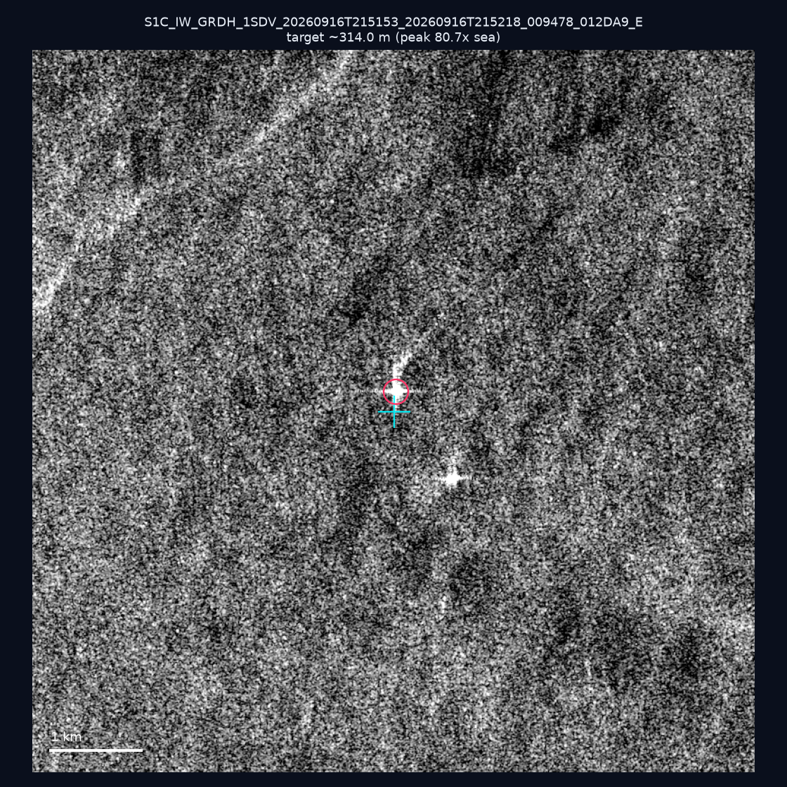
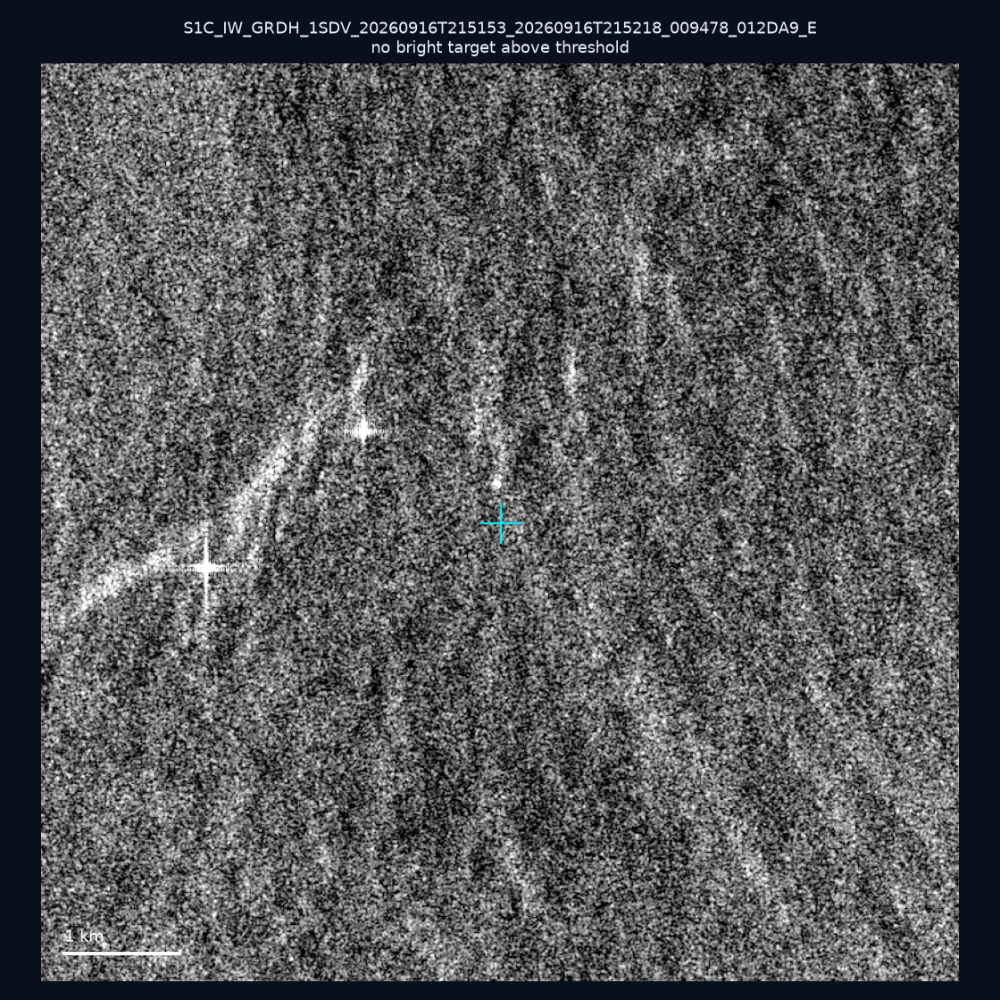
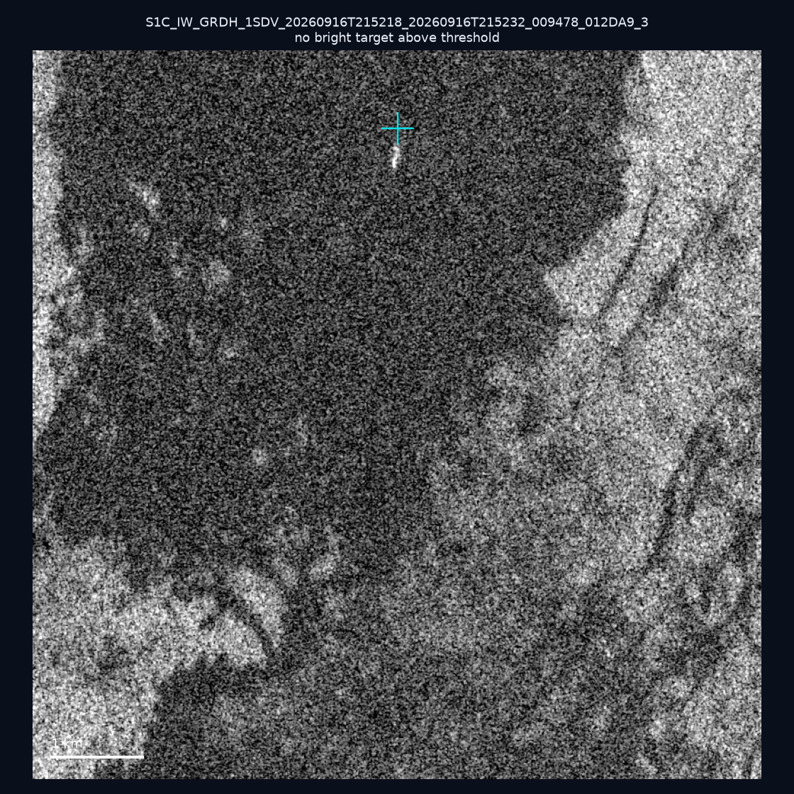
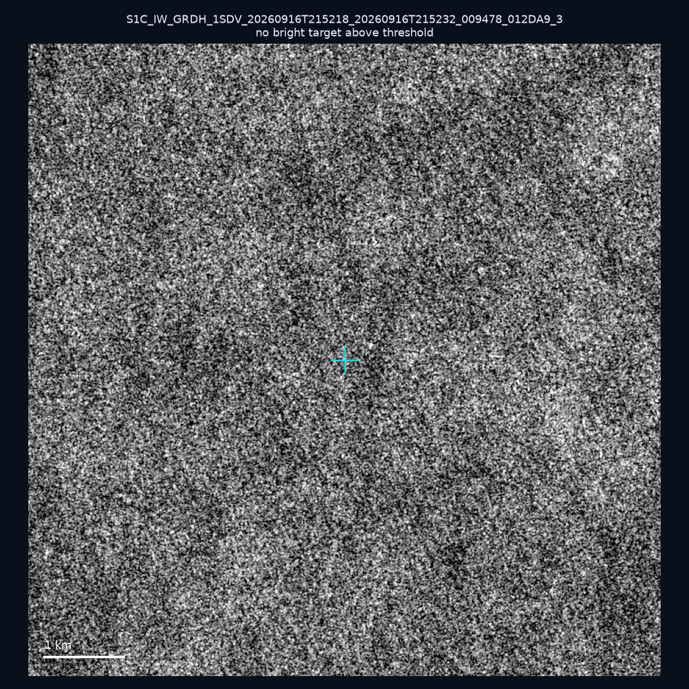
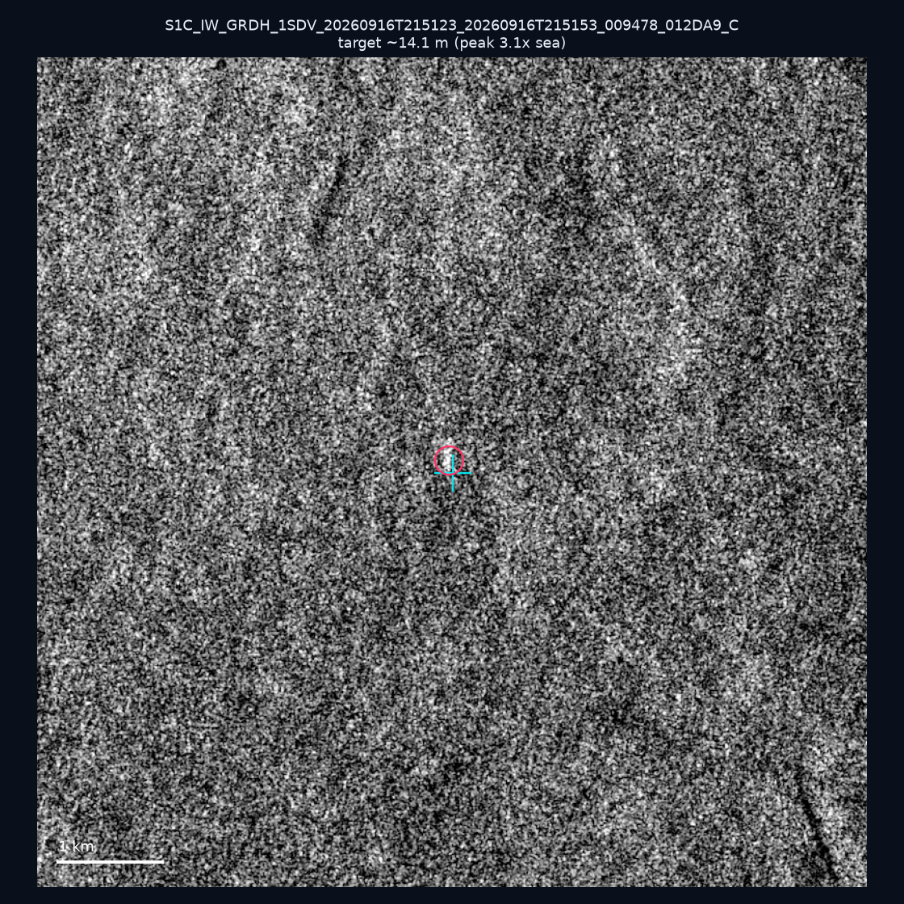
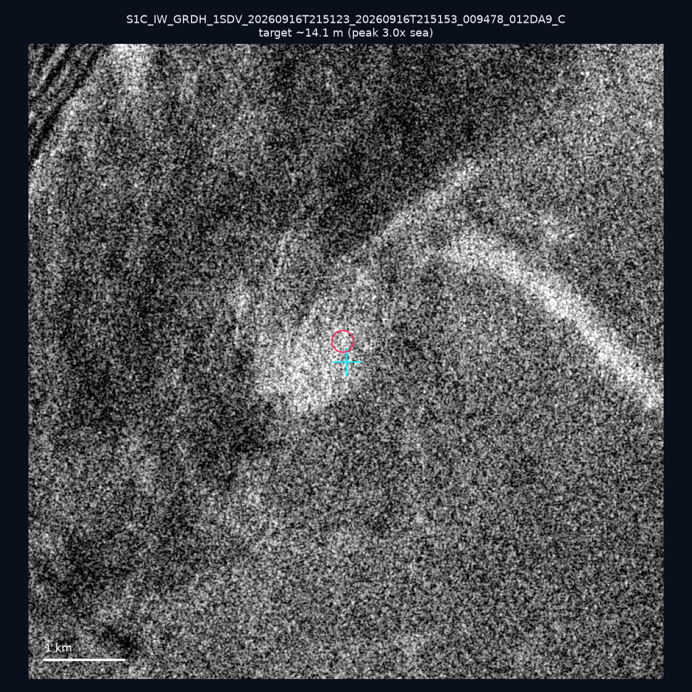
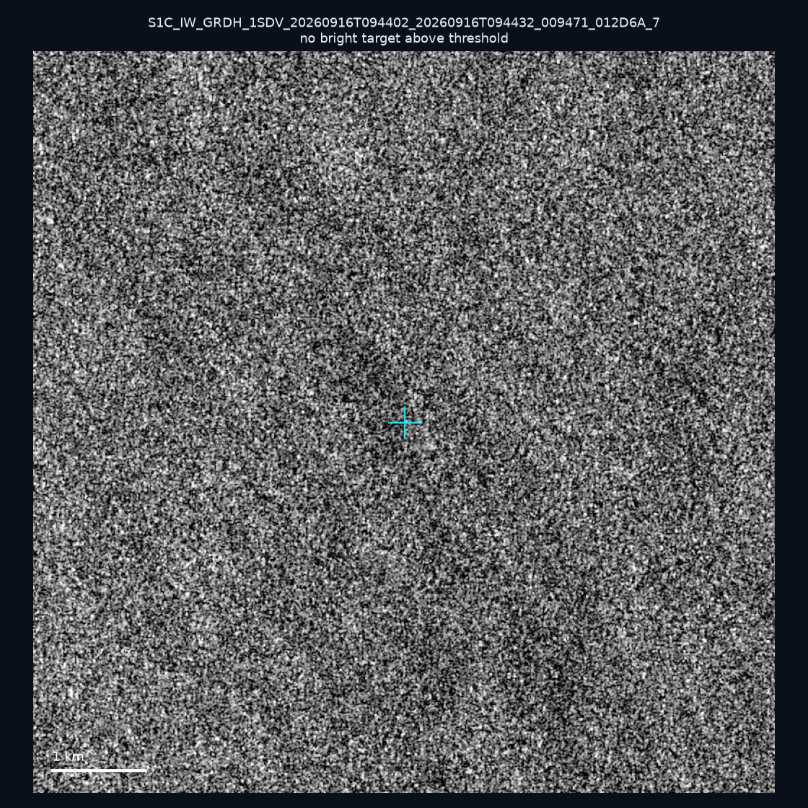
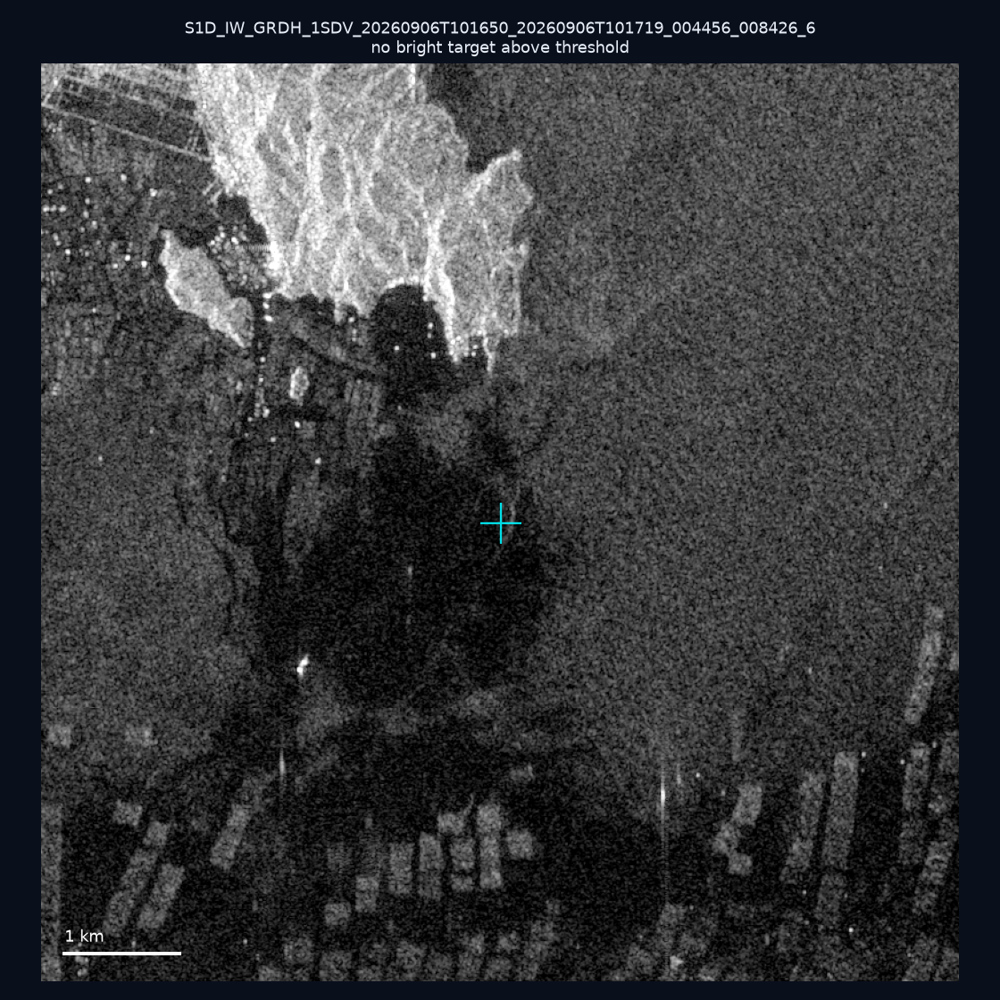
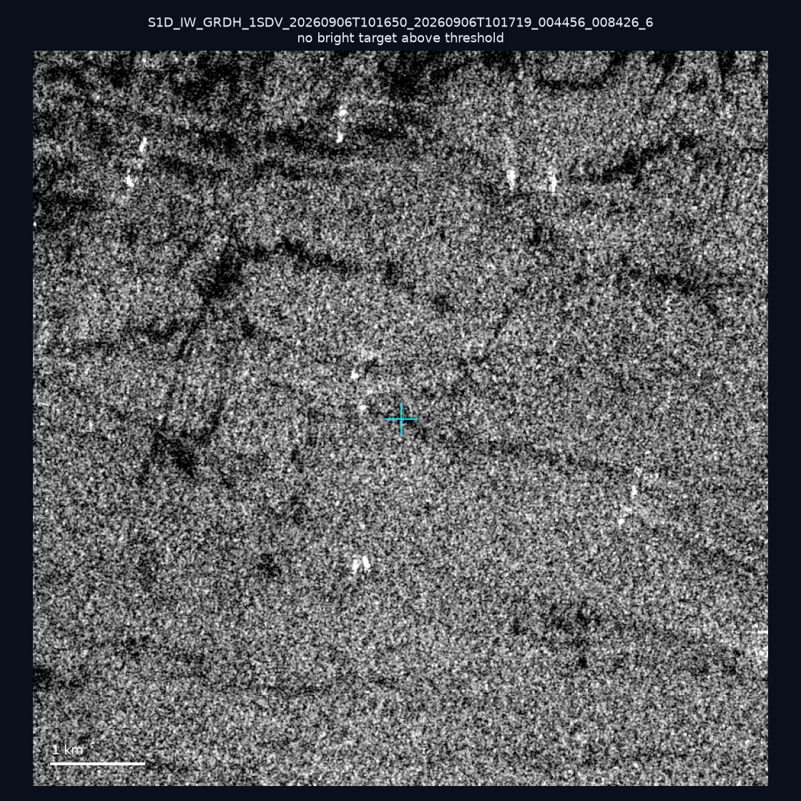
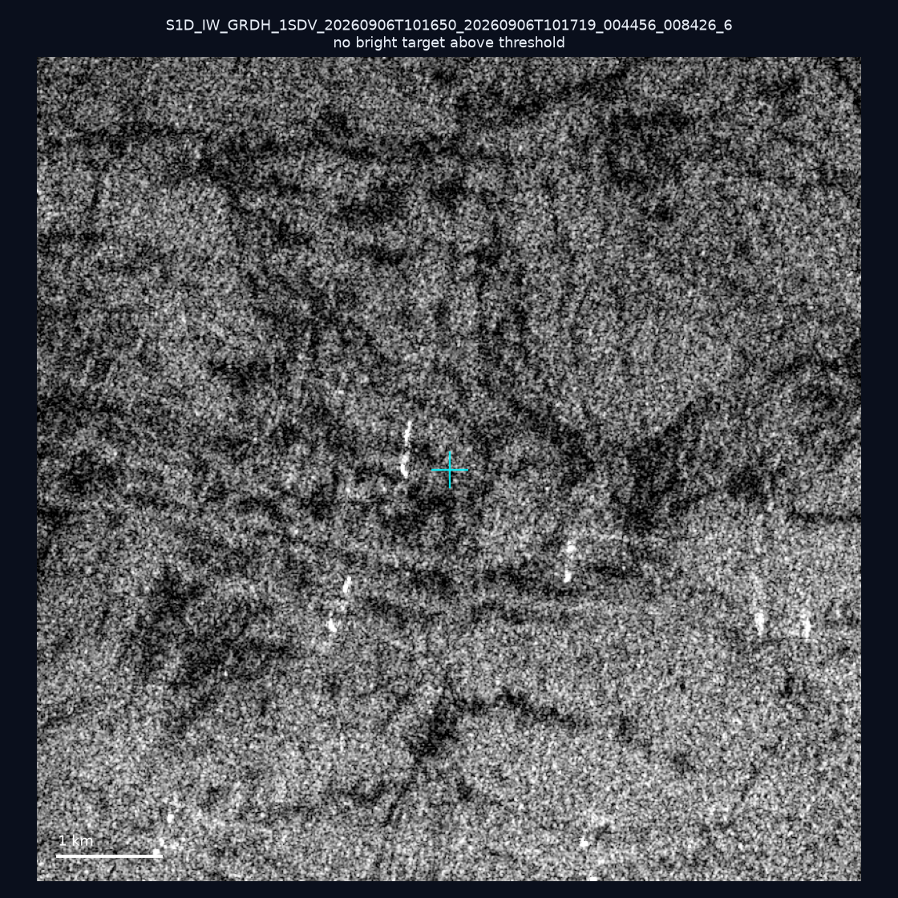

# 暗船 SAR 取證報告 — 2026-09-29

## 1. 總覽

- 執行時間：2026-09-29（GitHub Actions cron 自動執行）
- 線上比對摘要：暗偵測 15308 筆、殘餘暗船 11564 筆、假暗船剔除率 24.5%
- 本輪測試：10 筆
- 成功：10 筆
- 找到亮目標：3 筆
- 失敗：0 筆

## 2. 結果總表

| 日期 | 座標 | 海域 | 法域 | 成像時刻 | 判定 | 估計長度 | 峰值比 |
|------|------|------|------|----------|------|----------|--------|
| 2026-09-16 | 22.7, 120.07 | southwest | internal_waters | 21:51:53 | ✅ 確認實體目標 | ~314.0 m | 80.7× |
| 2026-09-16 | 22.87, 120.05 | southwest | internal_waters | 21:51:53 | ⚪ 無目標（雜訊或低RCS） | — | — |
| 2026-09-16 | 22.42, 120.2 | southwest | territorial_sea | 21:52:18 | ⚪ 無目標（雜訊或低RCS） | — | — |
| 2026-09-16 | 22.26, 119.91 | southwest | contiguous_zone | 21:52:18 | ⚪ 無目標（雜訊或低RCS） | — | — |
| 2026-09-16 | 25.26, 122.11 | east | territorial_sea | 21:51:23 | 🟡 弱目標 | ~14.1 m | 3.1× |
| 2026-09-16 | 24.95, 122.11 | east | territorial_sea | 21:51:23 | 🟡 弱目標 | ~14.1 m | 3.0× |
| 2026-09-16 | 24.91, 124.16 | east | eez | 09:44:02 | ⚪ 無目標（雜訊或低RCS） | — | — |
| 2026-09-06 | 23.5, 117.12 | southwest | eez | 10:16:50 | ⚪ 無目標（雜訊或低RCS） | — | — |
| 2026-09-06 | 23.13, 117.05 | southwest | eez | 10:16:50 | ⚪ 無目標（雜訊或低RCS） | — | — |
| 2026-09-06 | 23.09, 117.04 | southwest | eez | 10:16:50 | ⚪ 無目標（雜訊或低RCS） | — | — |

## 3. 逐目標段落

### 2026-09-16 (22.7, 120.07)

✅ 確認實體目標，估計長度 ~314.0 m，峰值 80.7× 海面背景（147 px）。

### 2026-09-16 (22.87, 120.05)

⚪ 無目標（雜訊或低RCS）。

### 2026-09-16 (22.42, 120.2)

⚪ 無目標（雜訊或低RCS）。

### 2026-09-16 (22.26, 119.91)

⚪ 無目標（雜訊或低RCS）。

### 2026-09-16 (25.26, 122.11)

🟡 弱目標，估計長度 ~14.1 m，峰值 3.1× 海面背景（1 px）。

### 2026-09-16 (24.95, 122.11)

🟡 弱目標，估計長度 ~14.1 m，峰值 3.0× 海面背景（1 px）。

### 2026-09-16 (24.91, 124.16)

⚪ 無目標（雜訊或低RCS）。

### 2026-09-06 (23.5, 117.12)

⚪ 無目標（雜訊或低RCS）。

### 2026-09-06 (23.13, 117.05)

⚪ 無目標（雜訊或低RCS）。

### 2026-09-06 (23.09, 117.04)

⚪ 無目標（雜訊或低RCS）。

## 4. 後續建議

- 值得人工深查（確認實體目標且長度 ≥ 50m）：
  - 2026-09-16 (22.7, 120.07) ~314.0 m — 建議比對周邊 AIS 船長
- 累積統計：全歷史 369 筆（有效 369 筆），確認實體目標 45 筆（12.2%）

> 所有結果是研判線索，不是法律認定；無目標 ≠ 誤報（小型木殼漁船 RCS 低，SAR 可能拍不到）。
