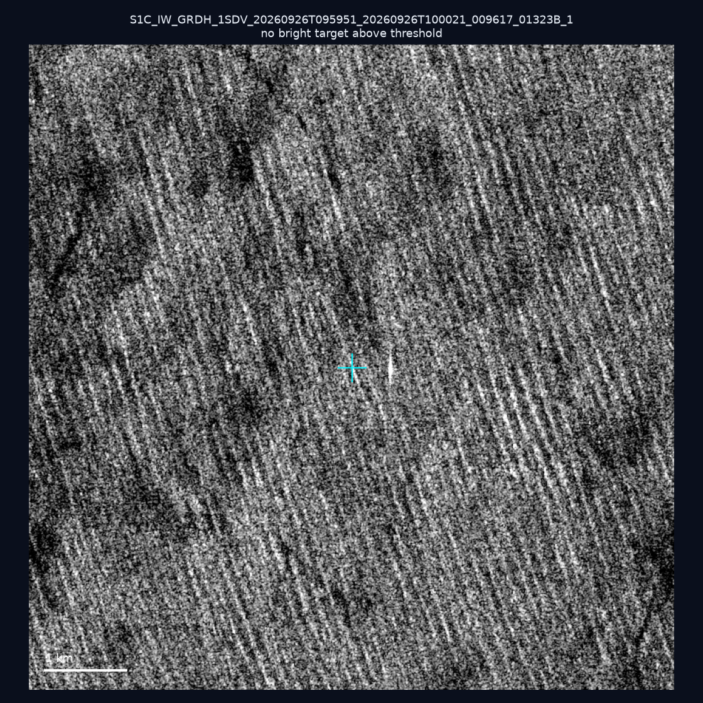
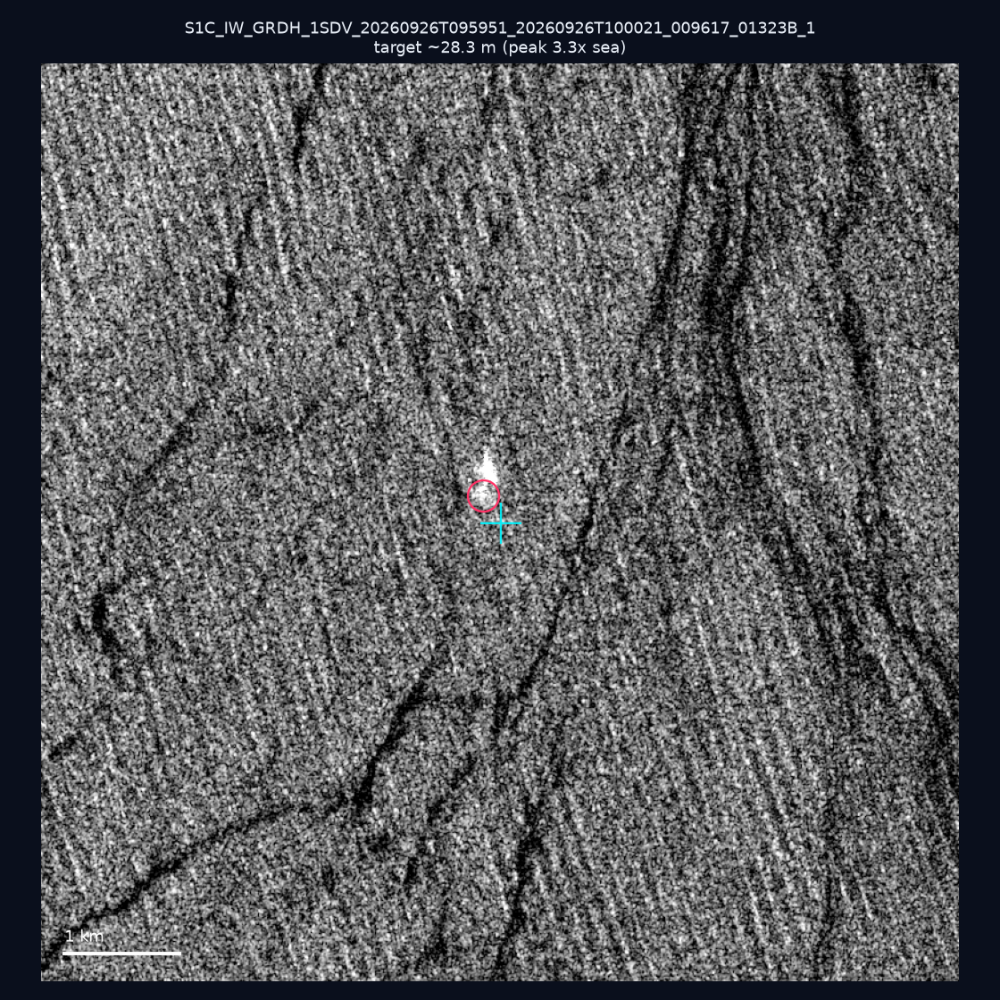
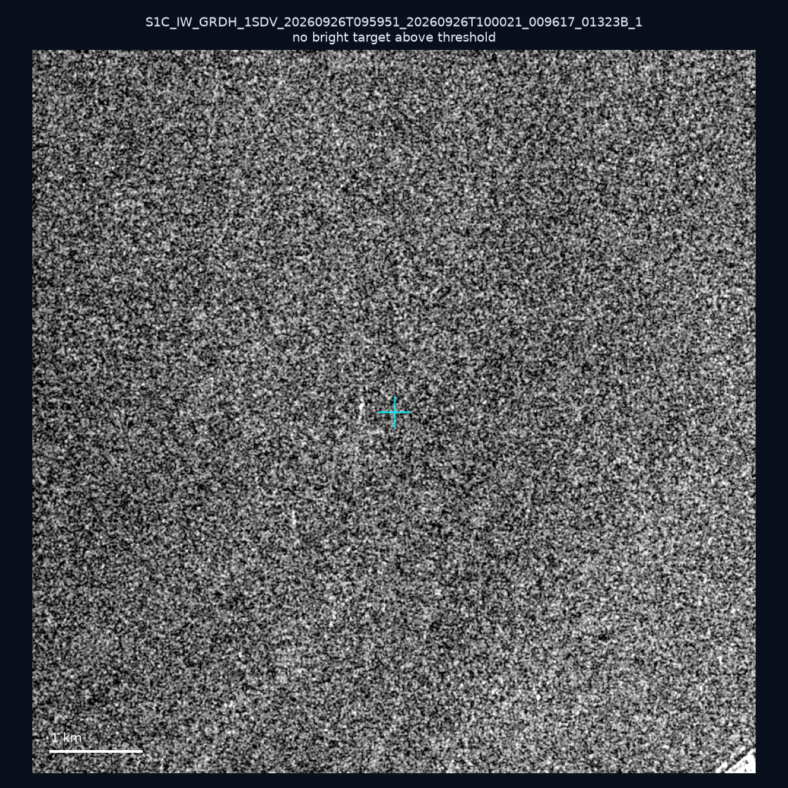
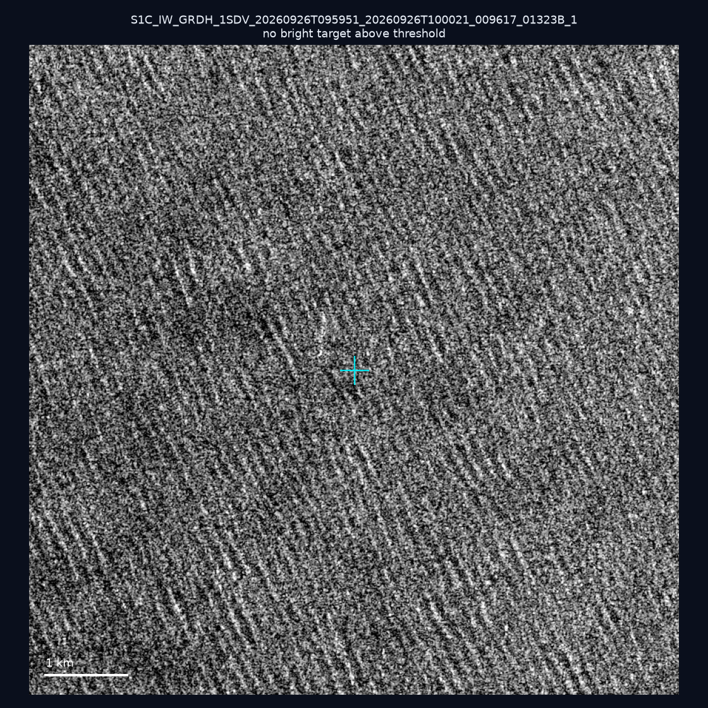
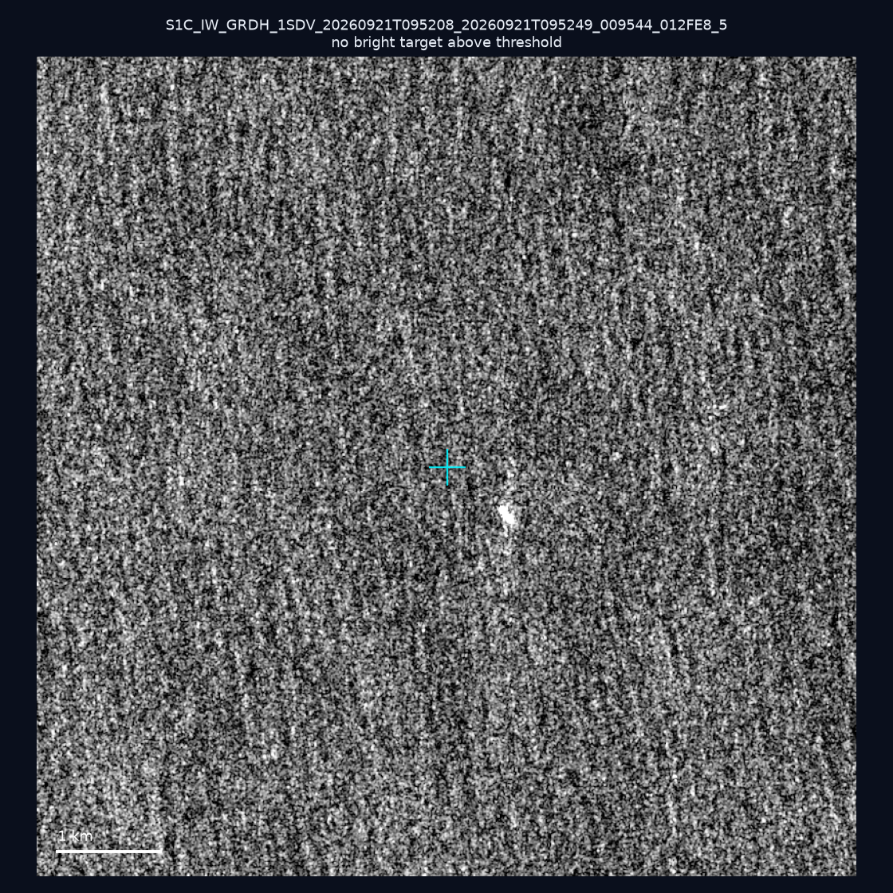
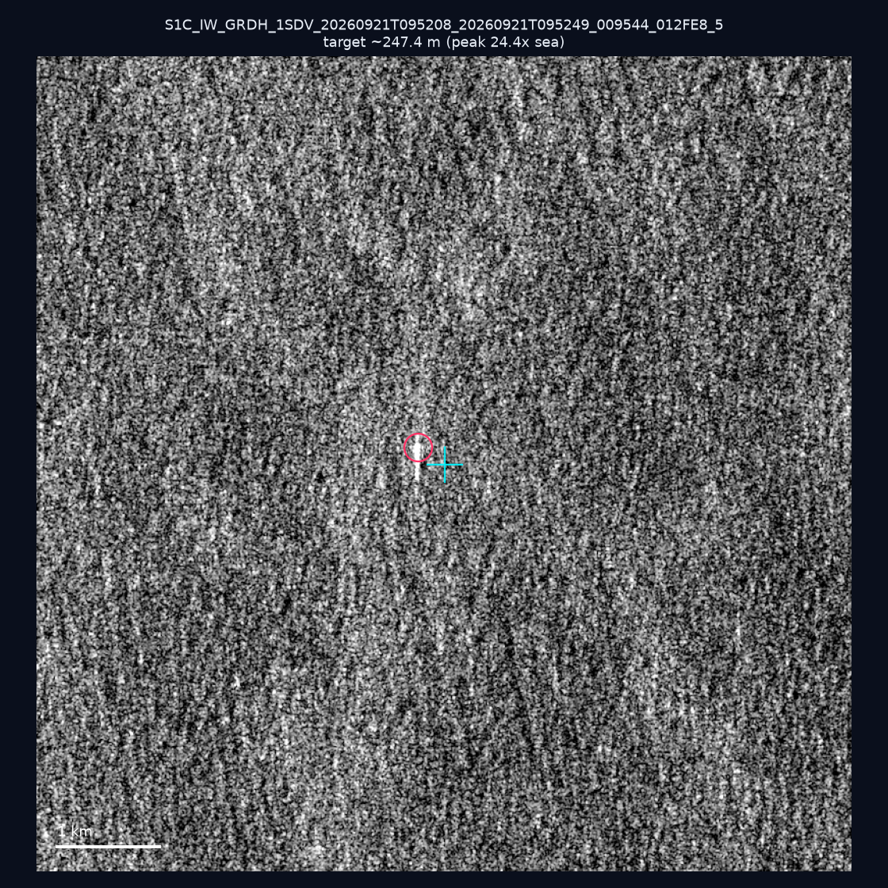
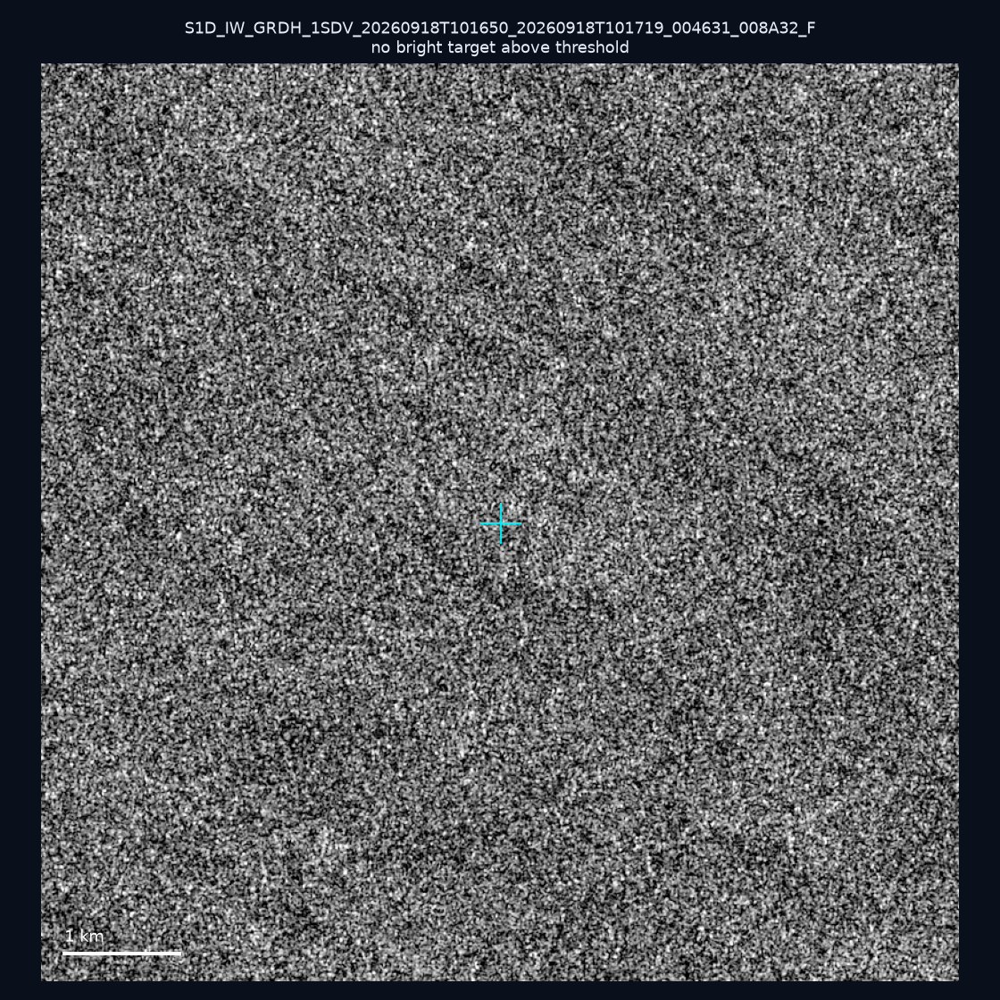
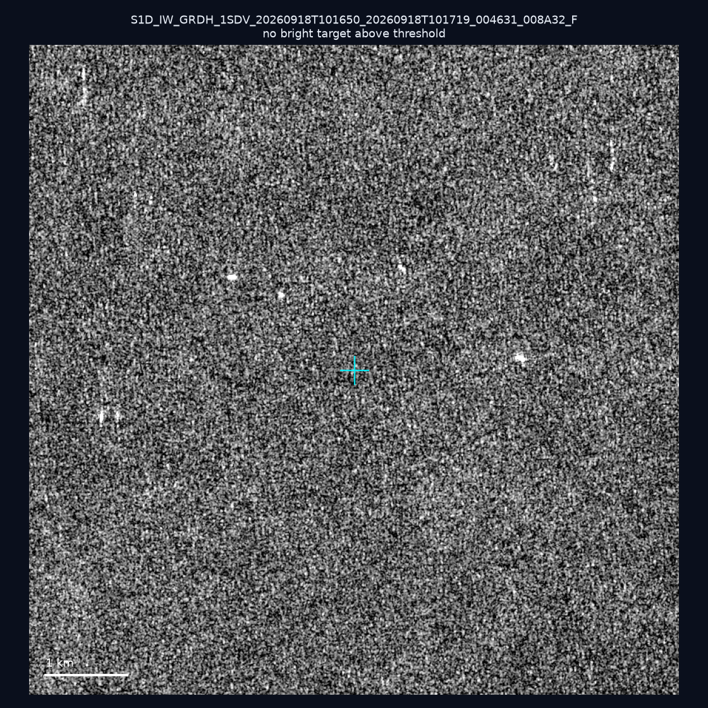
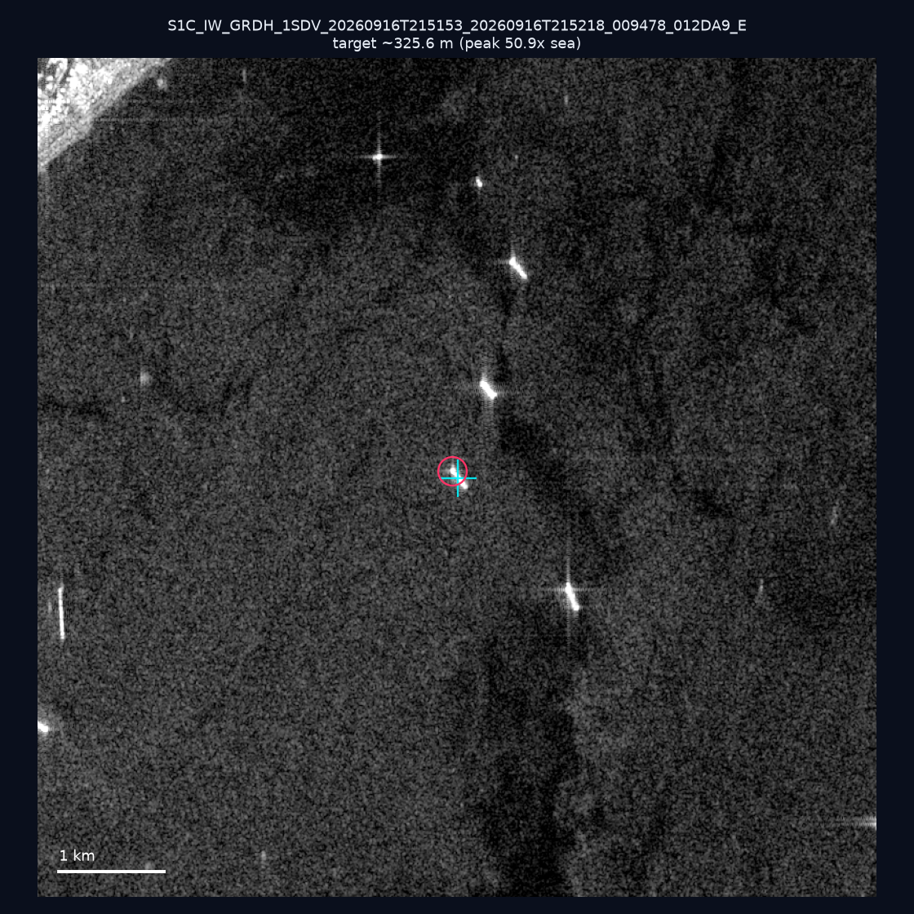
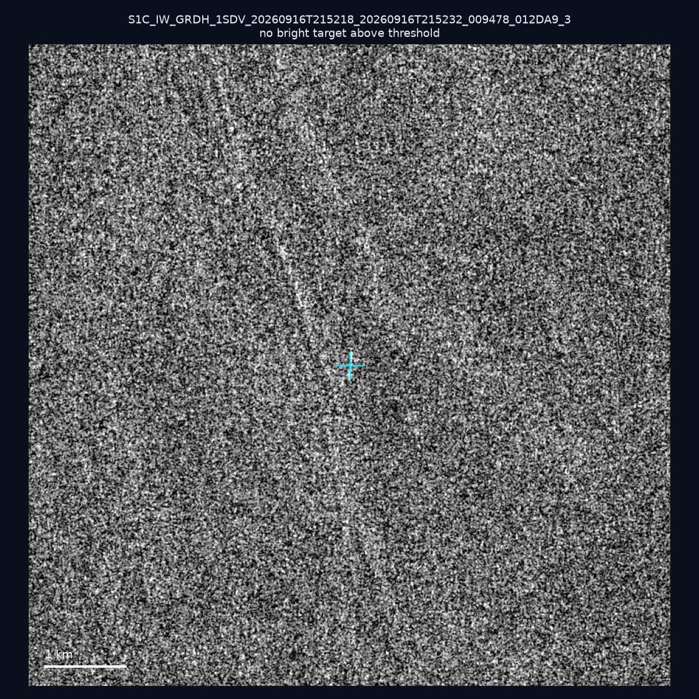

# 暗船 SAR 取證報告 — 2026-09-30

## 1. 總覽

- 執行時間：2026-09-30（GitHub Actions cron 自動執行）
- 線上比對摘要：暗偵測 15596 筆、殘餘暗船 11787 筆、假暗船剔除率 24.4%
- 本輪測試：10 筆
- 成功：10 筆
- 找到亮目標：3 筆
- 失敗：0 筆

## 2. 結果總表

| 日期 | 座標 | 海域 | 法域 | 成像時刻 | 判定 | 估計長度 | 峰值比 |
|------|------|------|------|----------|------|----------|--------|
| 2026-09-26 | 22.65, 122.35 | east | eez | 09:59:51 | ⚪ 無目標（雜訊或低RCS） | — | — |
| 2026-09-26 | 22.77, 121.75 | east | contiguous_zone | 09:59:51 | 🟡 弱目標 | ~28.3 m | 3.3× |
| 2026-09-26 | 22.39, 120.45 | southwest | internal_waters | 09:59:51 | ⚪ 無目標（雜訊或低RCS） | — | — |
| 2026-09-26 | 23.02, 122.5 | east | eez | 09:59:51 | ⚪ 無目標（雜訊或低RCS） | — | — |
| 2026-09-21 | 23.56, 122.47 | east | eez | 09:52:08 | ⚪ 無目標（雜訊或低RCS） | — | — |
| 2026-09-21 | 25.33, 123.66 | east | eez | 09:52:08 | ✅ 確認實體目標 | ~247.4 m | 24.4× |
| 2026-09-18 | 23.16, 118.08 | southwest | eez | 10:16:50 | ⚪ 無目標（雜訊或低RCS） | — | — |
| 2026-09-18 | 23.43, 117.2 | southwest | eez | 10:16:50 | ⚪ 無目標（雜訊或低RCS） | — | — |
| 2026-09-16 | 22.57, 120.24 | southwest | internal_waters | 21:51:53 | ✅ 確認實體目標 | ~325.6 m | 50.9× |
| 2026-09-16 | 21.72, 119.52 | southwest | eez | 21:52:18 | ⚪ 無目標（雜訊或低RCS） | — | — |

## 3. 逐目標段落

### 2026-09-26 (22.65, 122.35)

⚪ 無目標（雜訊或低RCS）。

### 2026-09-26 (22.77, 121.75)

🟡 弱目標，估計長度 ~28.3 m，峰值 3.3× 海面背景（4 px）。

### 2026-09-26 (22.39, 120.45)

⚪ 無目標（雜訊或低RCS）。

### 2026-09-26 (23.02, 122.5)

⚪ 無目標（雜訊或低RCS）。

### 2026-09-21 (23.56, 122.47)

⚪ 無目標（雜訊或低RCS）。

### 2026-09-21 (25.33, 123.66)

✅ 確認實體目標，估計長度 ~247.4 m，峰值 24.4× 海面背景（92 px）。

### 2026-09-18 (23.16, 118.08)

⚪ 無目標（雜訊或低RCS）。

### 2026-09-18 (23.43, 117.2)

⚪ 無目標（雜訊或低RCS）。

### 2026-09-16 (22.57, 120.24)

✅ 確認實體目標，估計長度 ~325.6 m，峰值 50.9× 海面背景（205 px）。

### 2026-09-16 (21.72, 119.52)

⚪ 無目標（雜訊或低RCS）。

## 4. 後續建議

- 值得人工深查（確認實體目標且長度 ≥ 50m）：
  - 2026-09-21 (25.33, 123.66) ~247.4 m — 建議比對周邊 AIS 船長
  - 2026-09-16 (22.57, 120.24) ~325.6 m — 建議比對周邊 AIS 船長
- 累積統計：全歷史 379 筆（有效 379 筆），確認實體目標 47 筆（12.4%）

> 所有結果是研判線索，不是法律認定；無目標 ≠ 誤報（小型木殼漁船 RCS 低，SAR 可能拍不到）。
