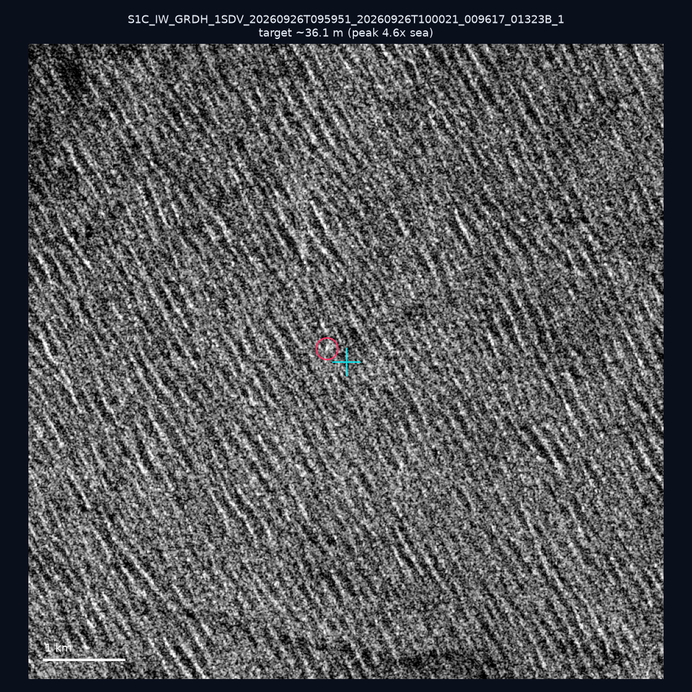
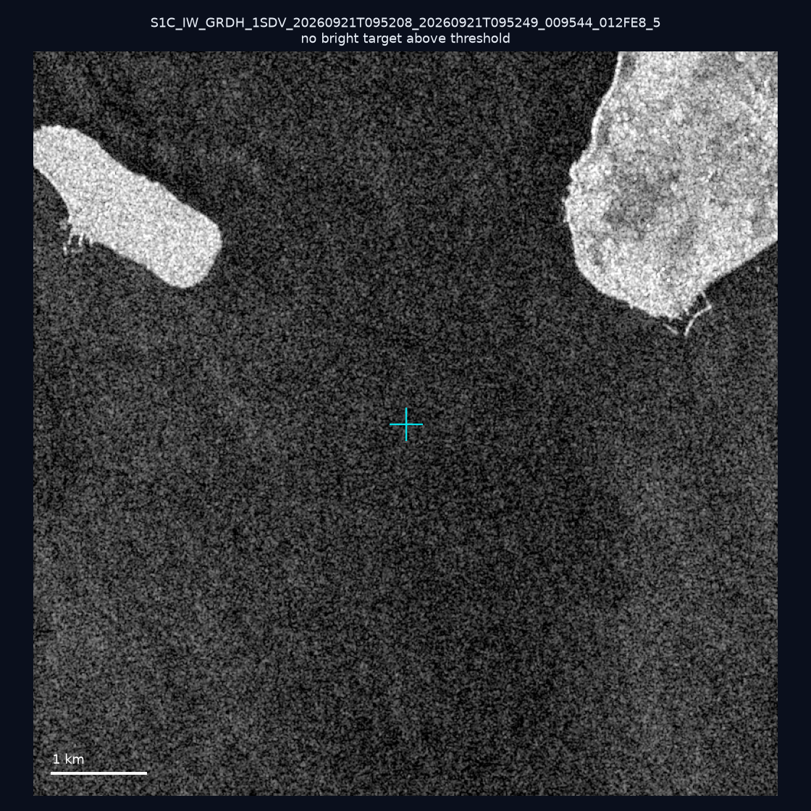
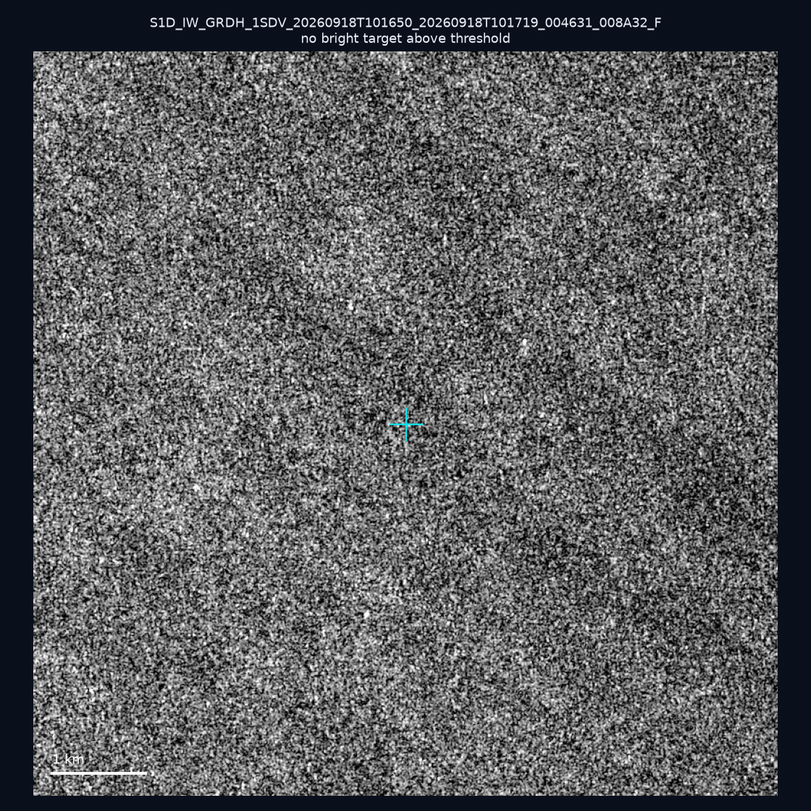
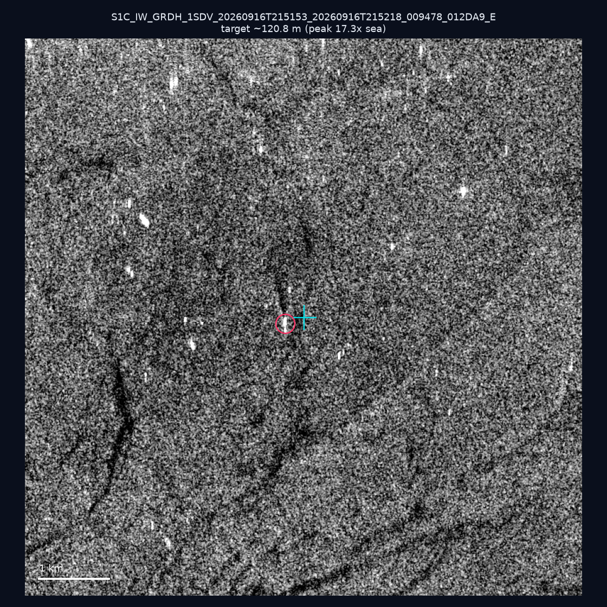
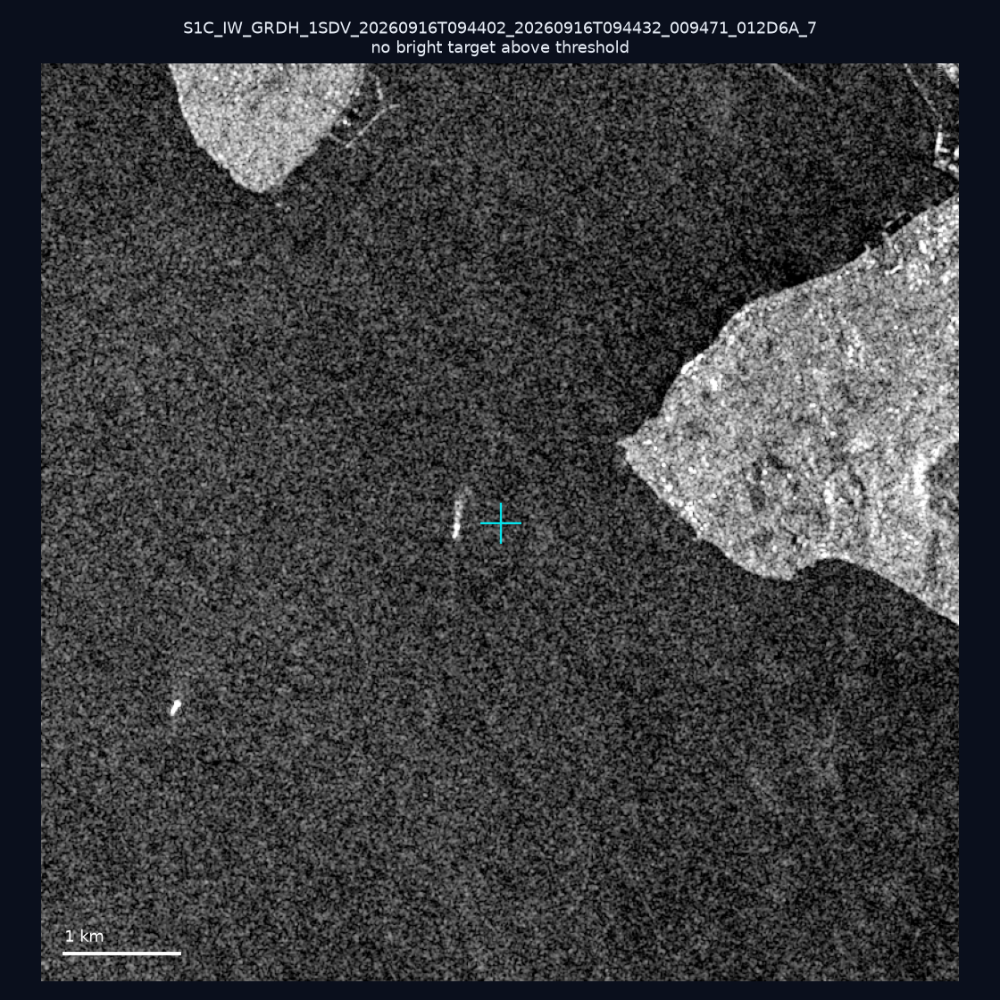
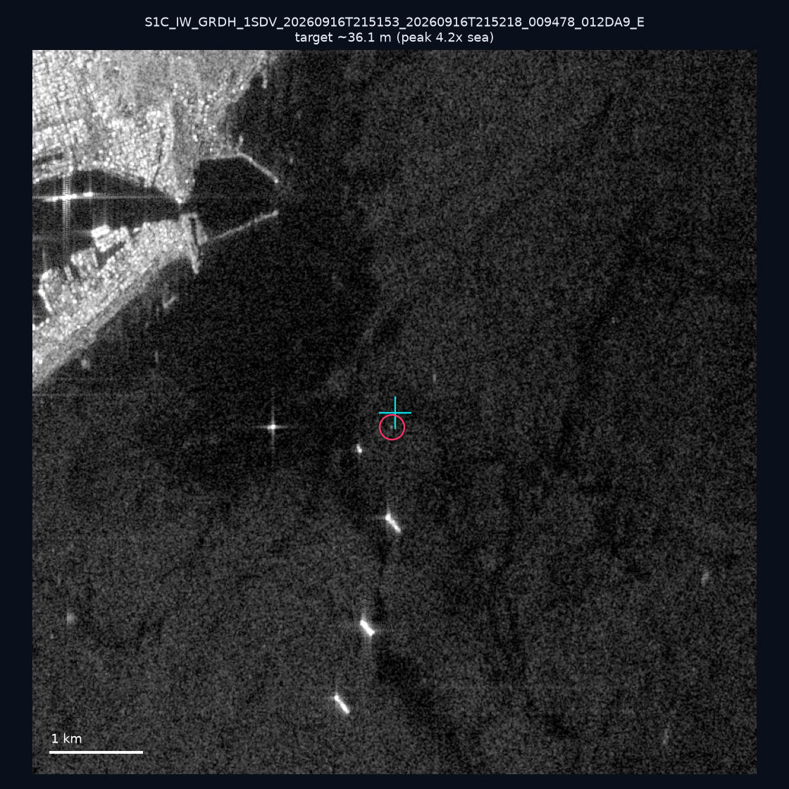
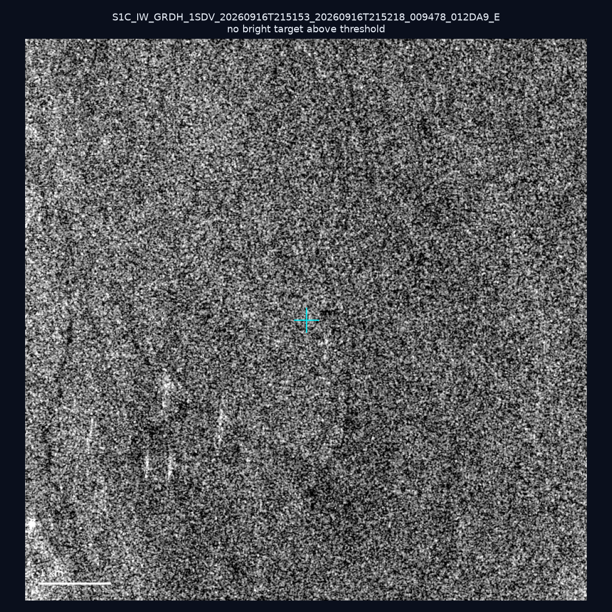
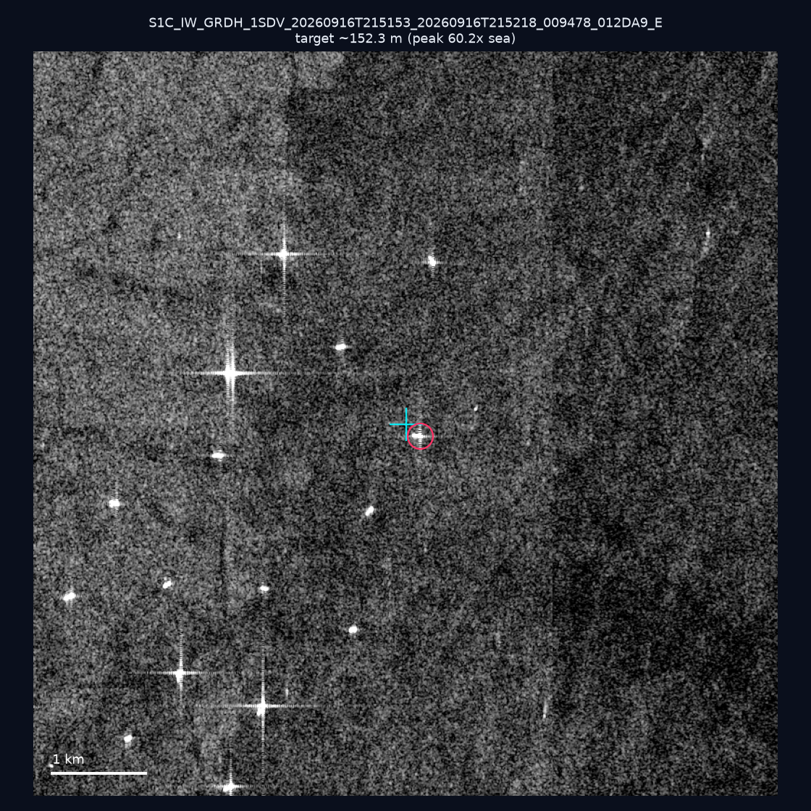
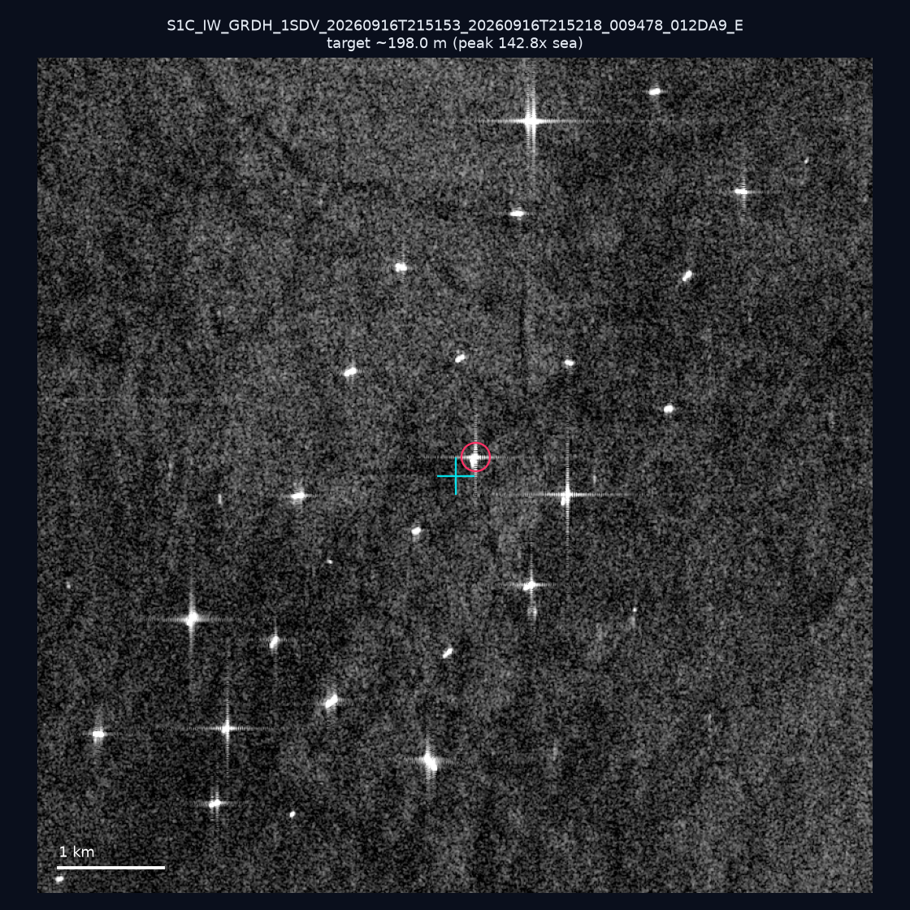
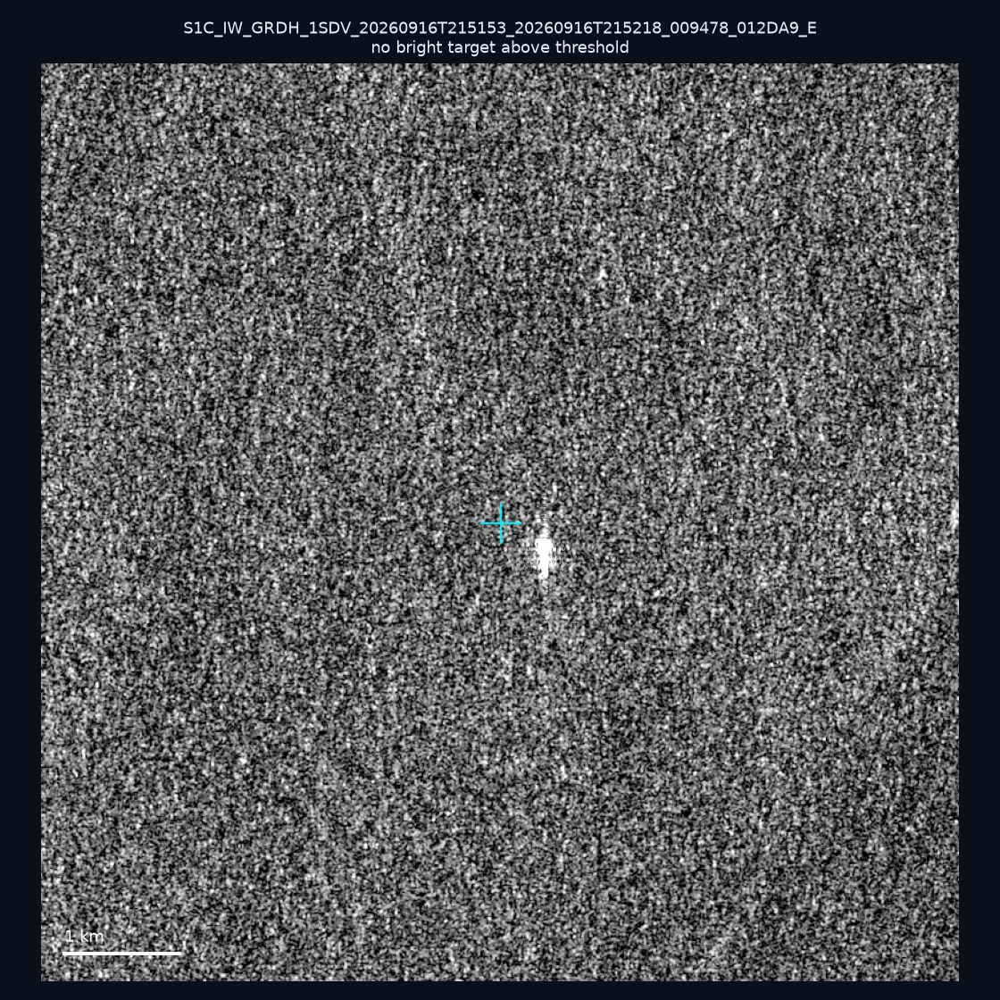

# 暗船 SAR 取證報告 — 2026-10-01

## 1. 總覽

- 執行時間：2026-10-01（GitHub Actions cron 自動執行）
- 線上比對摘要：暗偵測 17795 筆、殘餘暗船 13396 筆、假暗船剔除率 24.7%
- 本輪測試：10 筆
- 成功：10 筆
- 找到亮目標：5 筆
- 失敗：0 筆

## 2. 結果總表

| 日期 | 座標 | 海域 | 法域 | 成像時刻 | 判定 | 估計長度 | 峰值比 |
|------|------|------|------|----------|------|----------|--------|
| 2026-09-26 | 23.28, 122.15 | east | eez | 09:59:51 | 🟡 弱目標 | ~36.1 m | 4.6× |
| 2026-09-21 | 24.26, 123.97 | east | eez | 09:52:08 | ⚪ 無目標（雜訊或低RCS） | — | — |
| 2026-09-18 | 22.92, 117.96 | southwest | eez | 10:16:50 | ⚪ 無目標（雜訊或低RCS） | — | — |
| 2026-09-16 | 22.46, 120.3 | southwest | internal_waters | 21:51:53 | ✅ 確認實體目標 | ~120.8 m | 17.3× |
| 2026-09-16 | 24.37, 124.1 | east | eez | 09:44:02 | ⚪ 無目標（雜訊或低RCS） | — | — |
| 2026-09-16 | 22.6, 120.24 | southwest | internal_waters | 21:51:53 | 🟡 弱目標 | ~36.1 m | 4.2× |
| 2026-09-16 | 23.22, 120.03 | southwest | internal_waters | 21:51:53 | ⚪ 無目標（雜訊或低RCS） | — | — |
| 2026-09-16 | 22.76, 120.14 | southwest | internal_waters | 21:51:53 | ✅ 確認實體目標 | ~152.3 m | 60.2× |
| 2026-09-16 | 22.73, 120.16 | southwest | internal_waters | 21:51:53 | ✅ 確認實體目標 | ~198.0 m | 142.8× |
| 2026-09-16 | 23.23, 121.83 | east | contiguous_zone | 21:51:53 | ⚪ 無目標（雜訊或低RCS） | — | — |

## 3. 逐目標段落

### 2026-09-26 (23.28, 122.15)

🟡 弱目標，估計長度 ~36.1 m，峰值 4.6× 海面背景（6 px）。

### 2026-09-21 (24.26, 123.97)

⚪ 無目標（雜訊或低RCS）。

### 2026-09-18 (22.92, 117.96)

⚪ 無目標（雜訊或低RCS）。

### 2026-09-16 (22.46, 120.3)

✅ 確認實體目標，估計長度 ~120.8 m，峰值 17.3× 海面背景（39 px）。

### 2026-09-16 (24.37, 124.1)

⚪ 無目標（雜訊或低RCS）。

### 2026-09-16 (22.6, 120.24)

🟡 弱目標，估計長度 ~36.1 m，峰值 4.2× 海面背景（4 px）。

### 2026-09-16 (23.22, 120.03)

⚪ 無目標（雜訊或低RCS）。

### 2026-09-16 (22.76, 120.14)

✅ 確認實體目標，估計長度 ~152.3 m，峰值 60.2× 海面背景（61 px）。

### 2026-09-16 (22.73, 120.16)

✅ 確認實體目標，估計長度 ~198.0 m，峰值 142.8× 海面背景（110 px）。

### 2026-09-16 (23.23, 121.83)

⚪ 無目標（雜訊或低RCS）。

## 4. 後續建議

- 值得人工深查（確認實體目標且長度 ≥ 50m）：
  - 2026-09-16 (22.46, 120.3) ~120.8 m — 建議比對周邊 AIS 船長
  - 2026-09-16 (22.76, 120.14) ~152.3 m — 建議比對周邊 AIS 船長
  - 2026-09-16 (22.73, 120.16) ~198.0 m — 建議比對周邊 AIS 船長
- 累積統計：全歷史 389 筆（有效 389 筆），確認實體目標 50 筆（12.9%）

> 所有結果是研判線索，不是法律認定；無目標 ≠ 誤報（小型木殼漁船 RCS 低，SAR 可能拍不到）。
