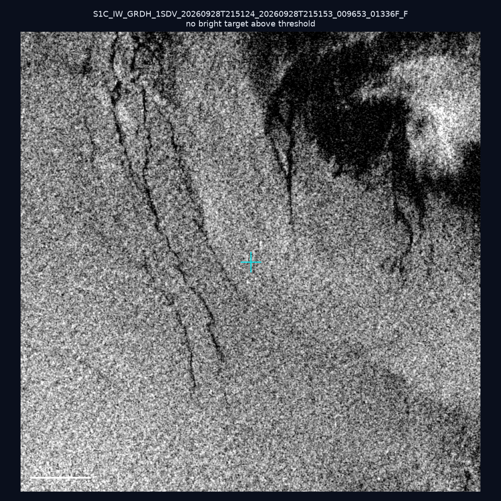
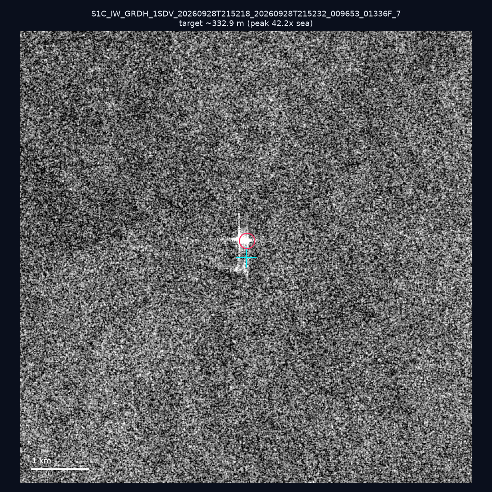
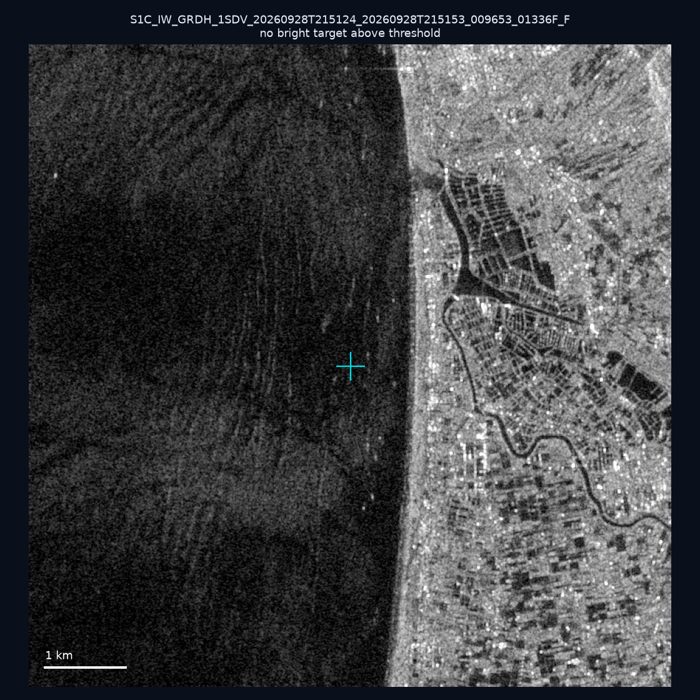
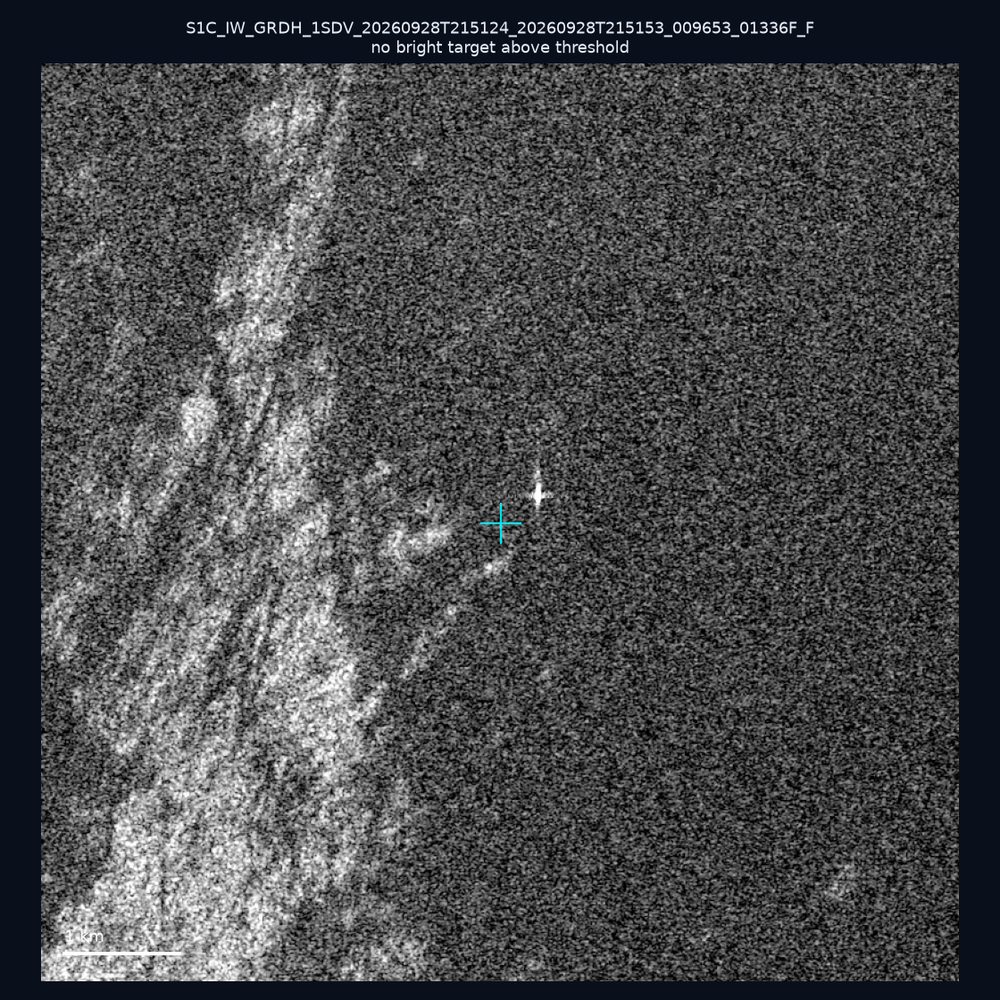
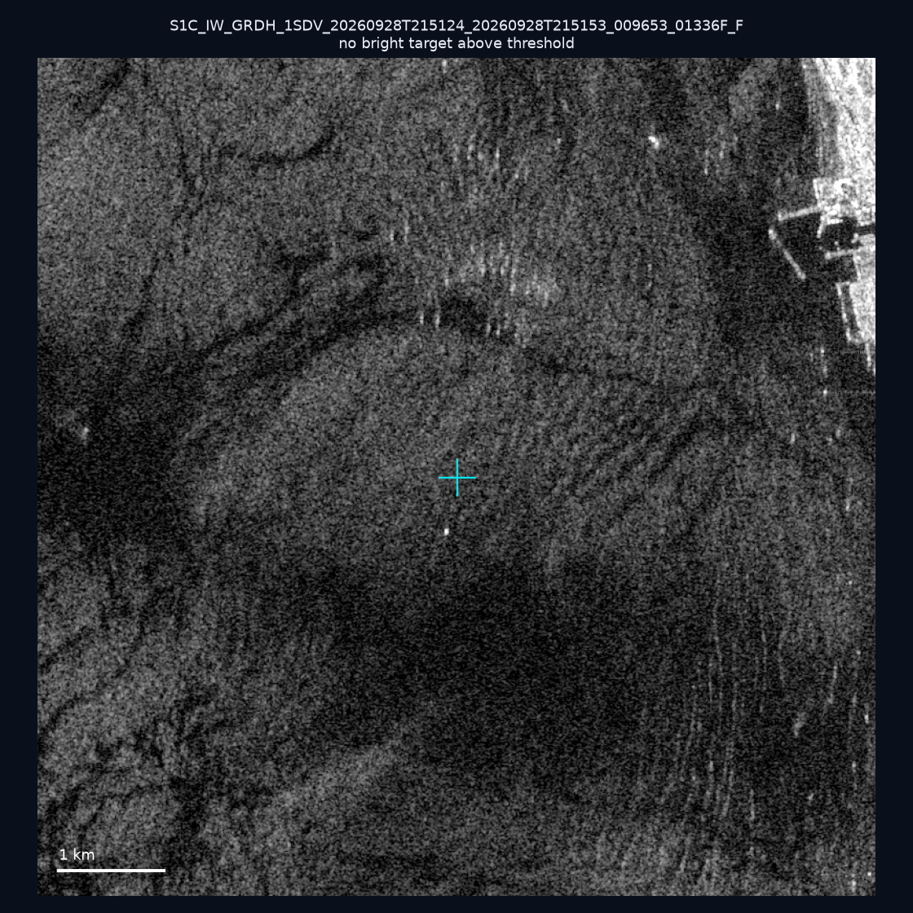
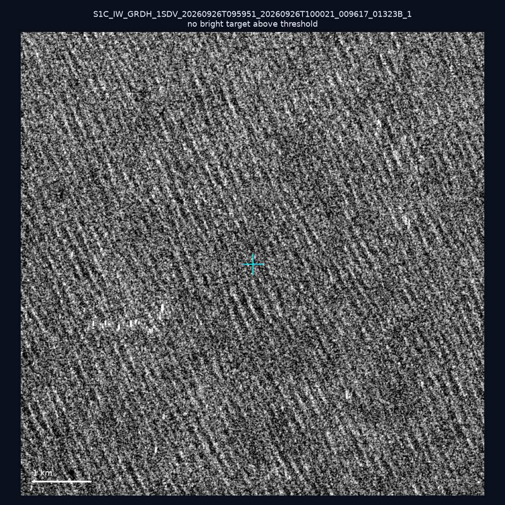
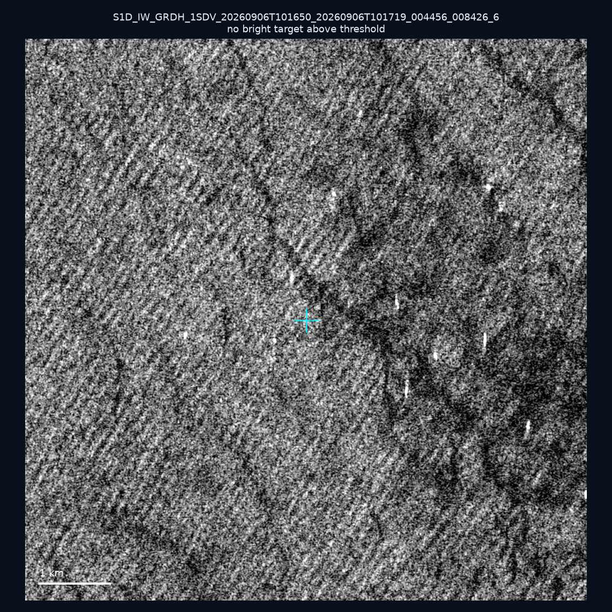
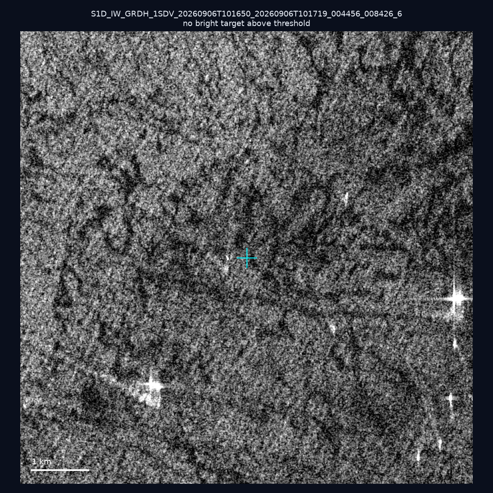
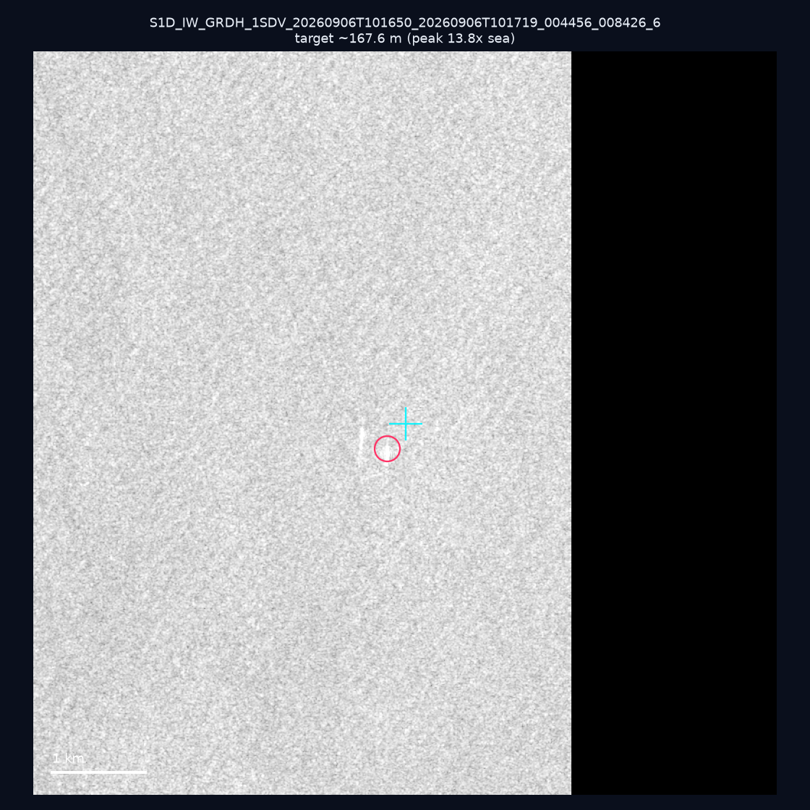
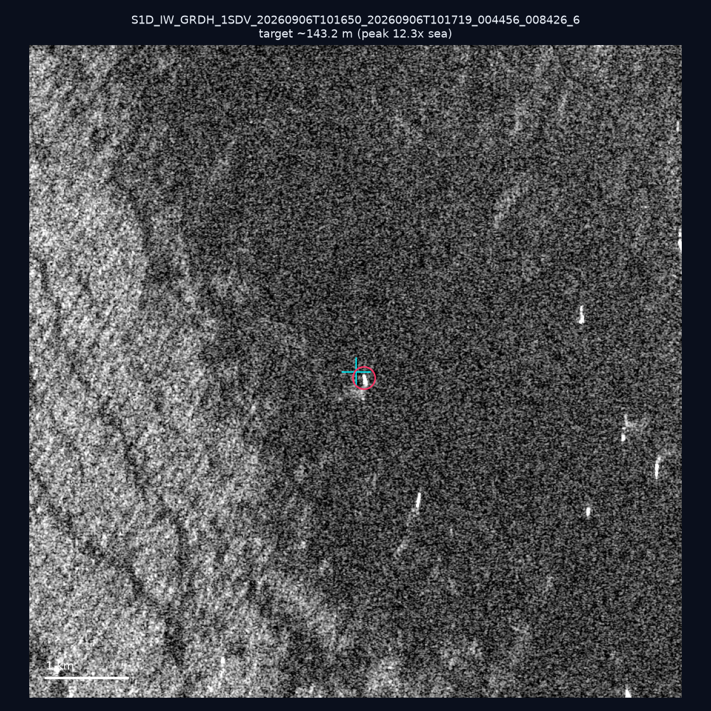

# 暗船 SAR 取證報告 — 2026-10-02

## 1. 總覽

- 執行時間：2026-10-02（GitHub Actions cron 自動執行）
- 線上比對摘要：暗偵測 18926 筆、殘餘暗船 13869 筆、假暗船剔除率 26.7%
- 本輪測試：10 筆
- 成功：10 筆
- 找到亮目標：3 筆
- 失敗：0 筆

## 2. 結果總表

| 日期 | 座標 | 海域 | 法域 | 成像時刻 | 判定 | 估計長度 | 峰值比 |
|------|------|------|------|----------|------|----------|--------|
| 2026-09-28 | 25.09, 121.98 | east | internal_waters | 21:51:24 | ⚪ 無目標（雜訊或低RCS） | — | — |
| 2026-09-28 | 22.2, 119.37 | southwest | eez | 21:52:18 | ✅ 確認實體目標 | ~332.9 m | 42.2× |
| 2026-09-28 | 24.82, 121.83 | east | internal_waters | 21:51:24 | ⚪ 無目標（雜訊或低RCS） | — | — |
| 2026-09-28 | 24.27, 122.0 | east | territorial_sea | 21:51:24 | ⚪ 無目標（雜訊或低RCS） | — | — |
| 2026-09-28 | 24.84, 121.87 | east | internal_waters | 21:51:24 | ⚪ 無目標（雜訊或低RCS） | — | — |
| 2026-09-26 | 22.99, 122.41 | east | eez | 09:59:51 | ⚪ 無目標（雜訊或低RCS） | — | — |
| 2026-09-06 | 23.3, 118.15 | southwest | eez | 10:16:50 | ⚪ 無目標（雜訊或低RCS） | — | — |
| 2026-09-06 | 22.87, 117.17 | southwest | eez | 10:16:50 | ⚪ 無目標（雜訊或低RCS） | — | — |
| 2026-09-06 | 23.2, 118.46 | southwest | eez | 10:16:50 | ✅ 確認實體目標 | ~167.6 m | 13.8× |
| 2026-09-06 | 23.26, 118.22 | southwest | eez | 10:16:50 | ✅ 確認實體目標 | ~143.2 m | 12.3× |

## 3. 逐目標段落

### 2026-09-28 (25.09, 121.98)

⚪ 無目標（雜訊或低RCS）。

### 2026-09-28 (22.2, 119.37)

✅ 確認實體目標，估計長度 ~332.9 m，峰值 42.2× 海面背景（214 px）。

### 2026-09-28 (24.82, 121.83)

⚪ 無目標（雜訊或低RCS）。

### 2026-09-28 (24.27, 122.0)

⚪ 無目標（雜訊或低RCS）。

### 2026-09-28 (24.84, 121.87)

⚪ 無目標（雜訊或低RCS）。

### 2026-09-26 (22.99, 122.41)

⚪ 無目標（雜訊或低RCS）。

### 2026-09-06 (23.3, 118.15)

⚪ 無目標（雜訊或低RCS）。

### 2026-09-06 (22.87, 117.17)

⚪ 無目標（雜訊或低RCS）。

### 2026-09-06 (23.2, 118.46)

✅ 確認實體目標，估計長度 ~167.6 m，峰值 13.8× 海面背景（56 px）。

### 2026-09-06 (23.26, 118.22)

✅ 確認實體目標，估計長度 ~143.2 m，峰值 12.3× 海面背景（50 px）。

## 4. 後續建議

- 值得人工深查（確認實體目標且長度 ≥ 50m）：
  - 2026-09-28 (22.2, 119.37) ~332.9 m — 建議比對周邊 AIS 船長
  - 2026-09-06 (23.2, 118.46) ~167.6 m — 建議比對周邊 AIS 船長
  - 2026-09-06 (23.26, 118.22) ~143.2 m — 建議比對周邊 AIS 船長
- 累積統計：全歷史 399 筆（有效 399 筆），確認實體目標 53 筆（13.3%）

> 所有結果是研判線索，不是法律認定；無目標 ≠ 誤報（小型木殼漁船 RCS 低，SAR 可能拍不到）。
