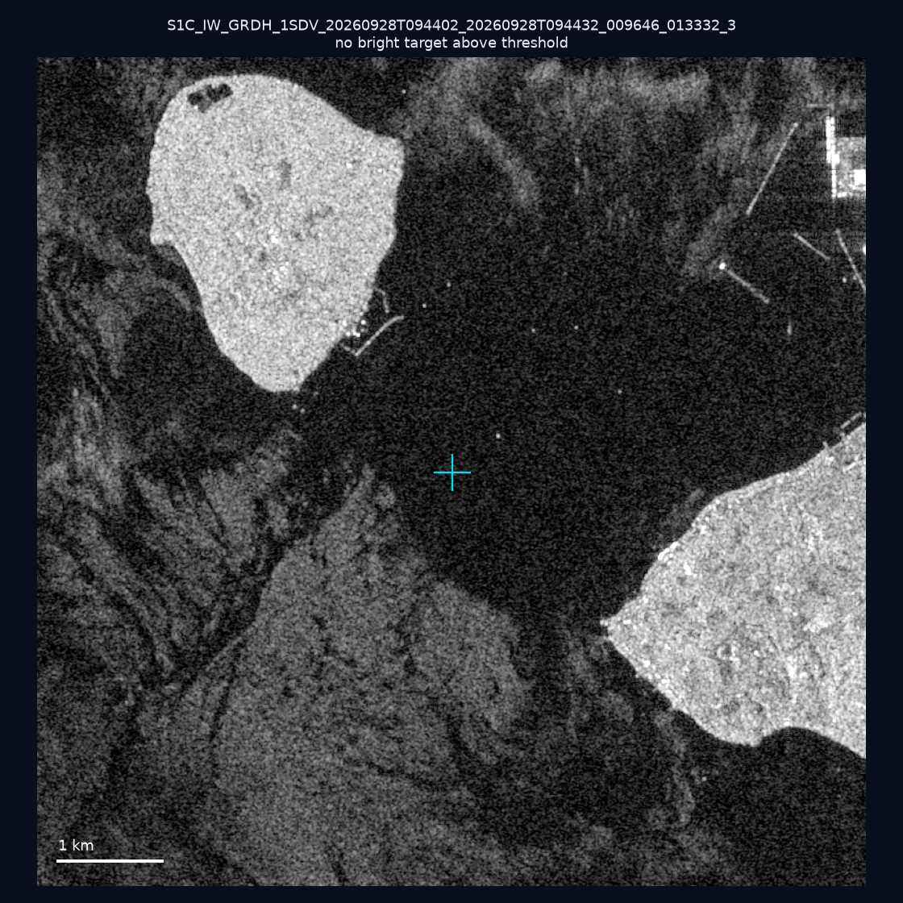
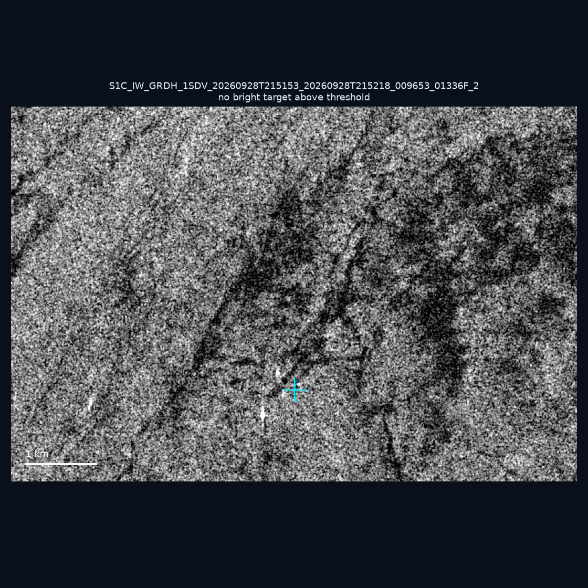
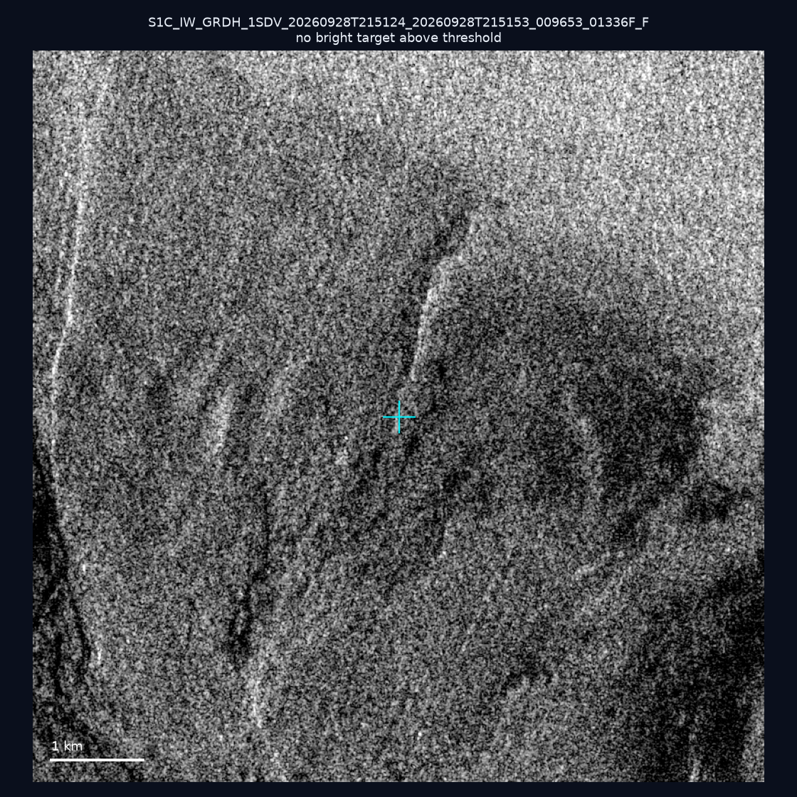
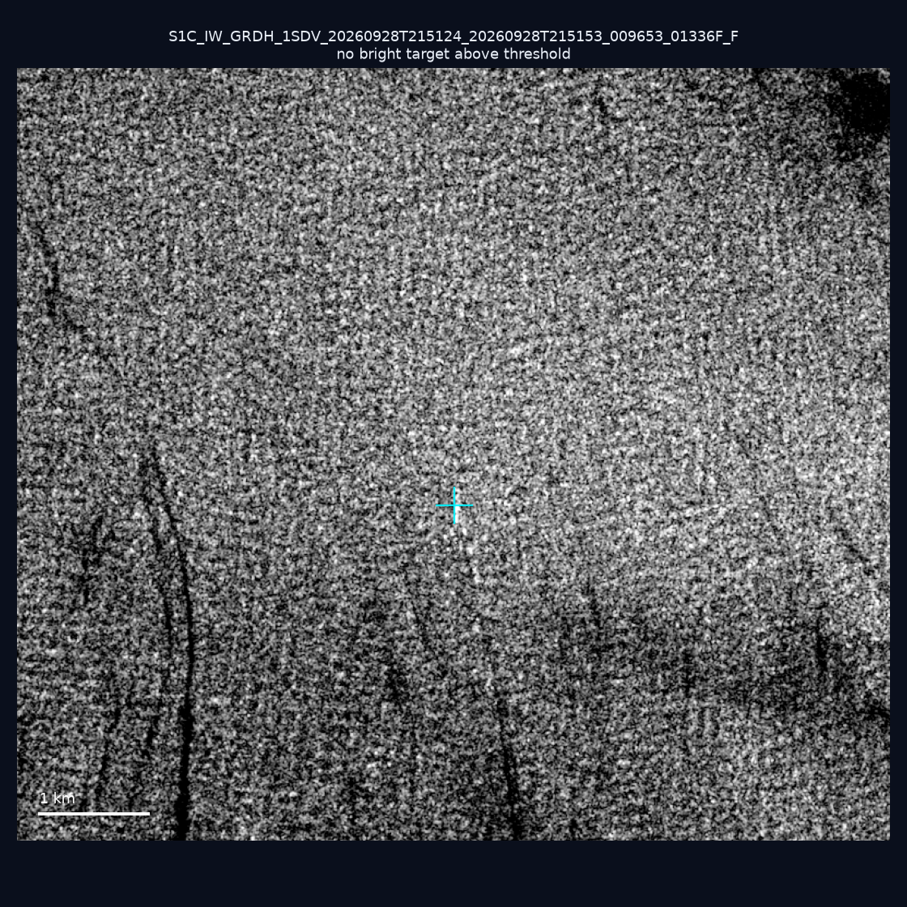
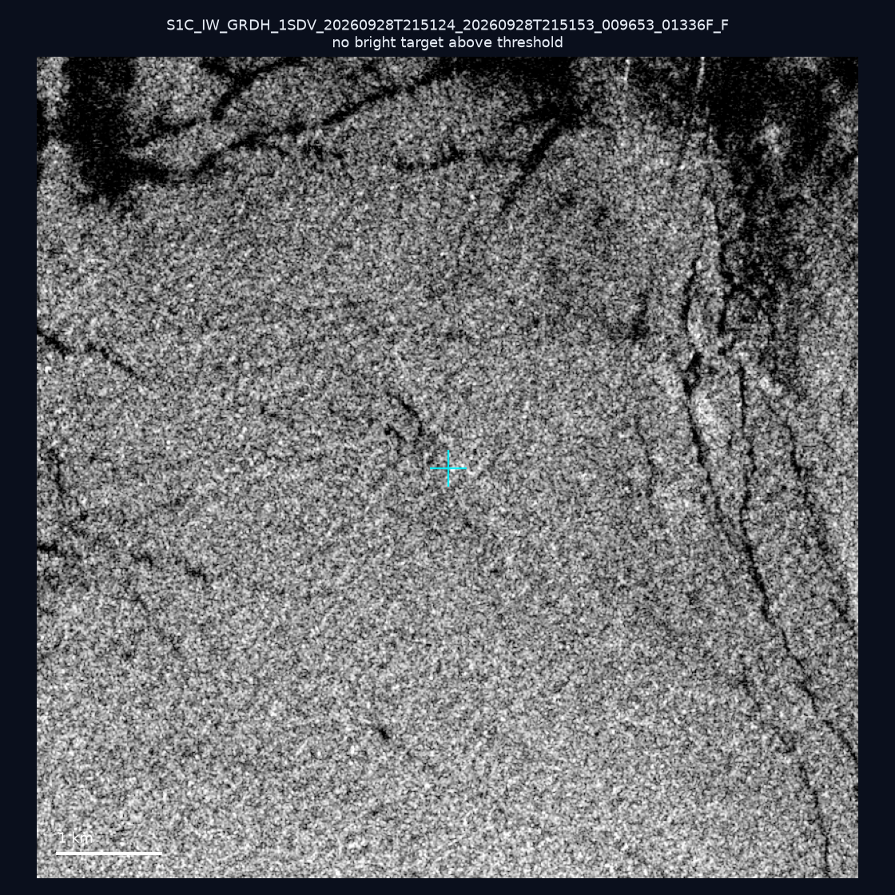
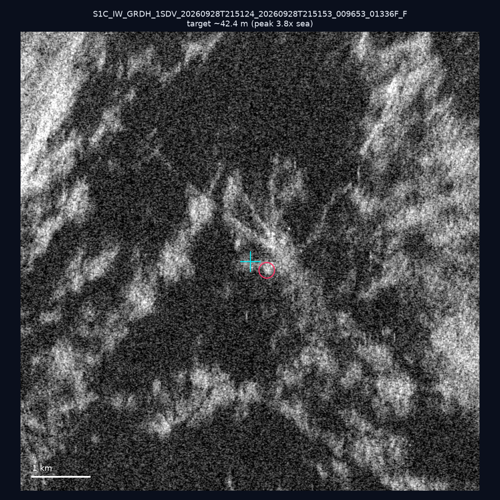
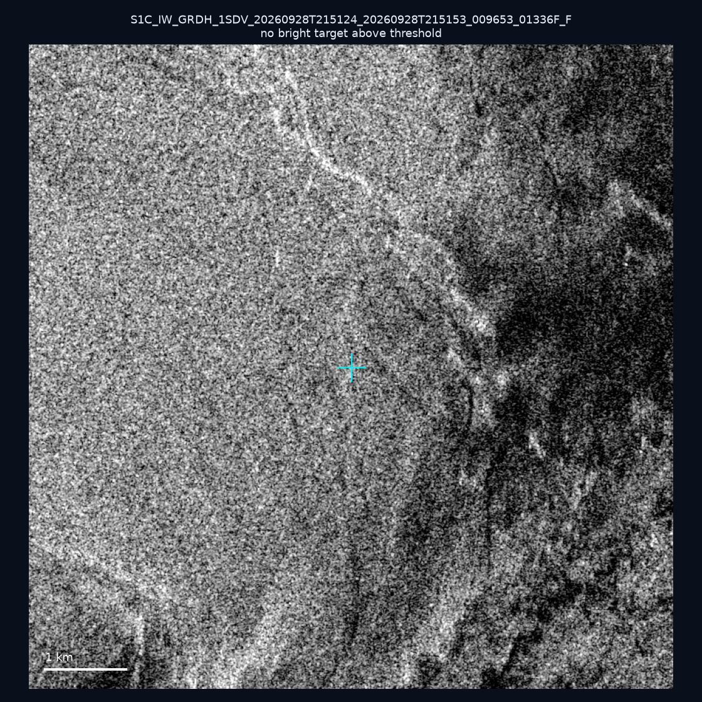
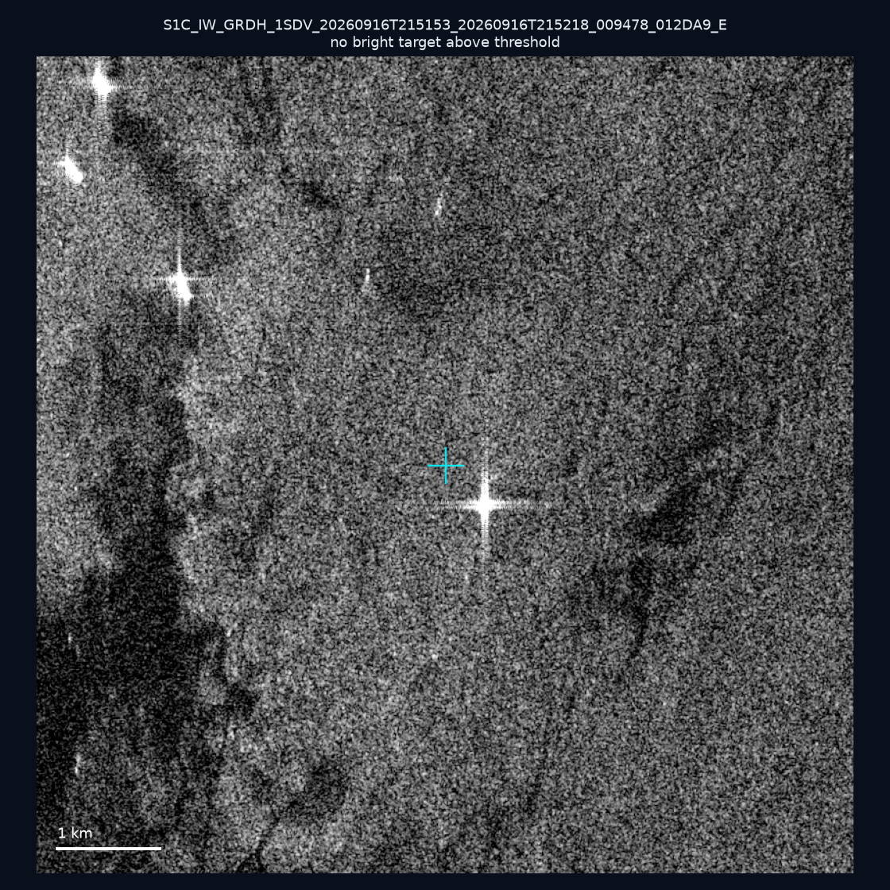
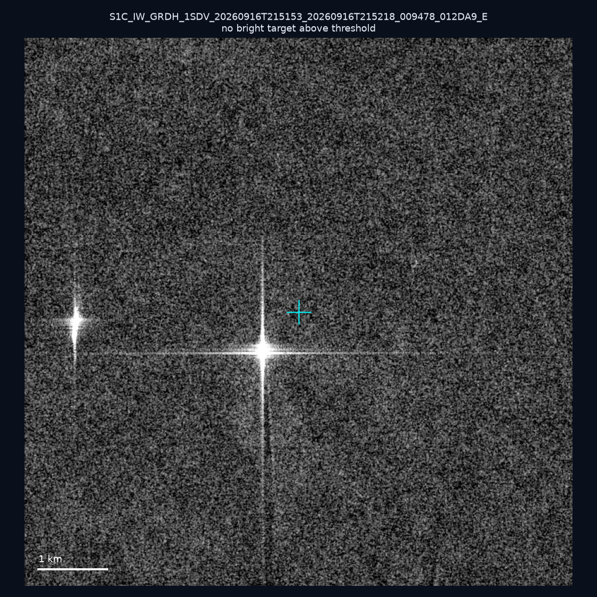
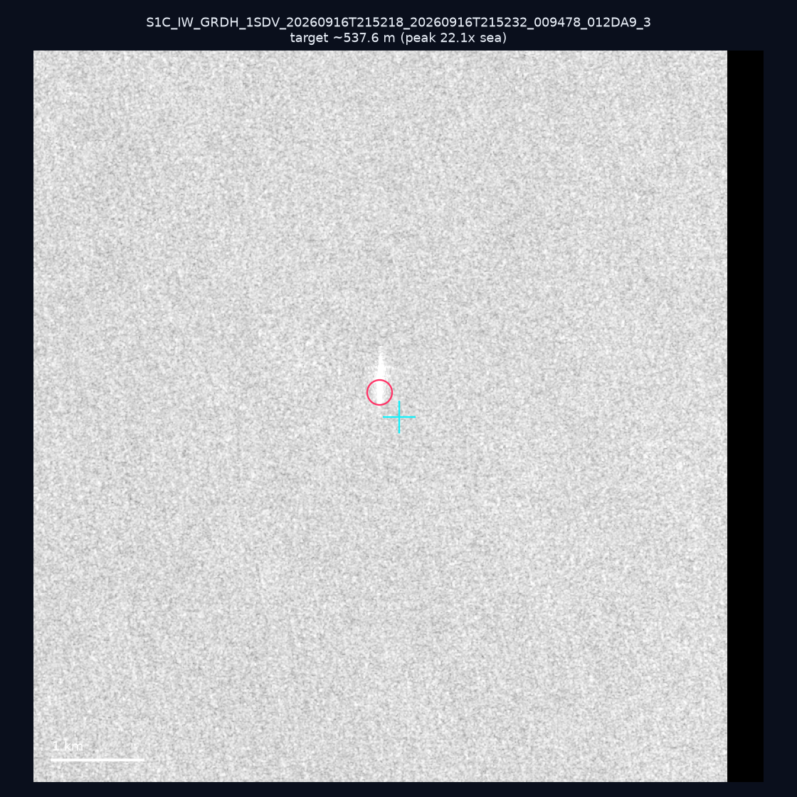

# 暗船 SAR 取證報告 — 2026-10-03

## 1. 總覽

- 執行時間：2026-10-03（GitHub Actions cron 自動執行）
- 線上比對摘要：暗偵測 18732 筆、殘餘暗船 13814 筆、假暗船剔除率 26.3%
- 本輪測試：10 筆
- 成功：10 筆
- 找到亮目標：2 筆
- 失敗：0 筆

## 2. 結果總表

| 日期 | 座標 | 海域 | 法域 | 成像時刻 | 判定 | 估計長度 | 峰值比 |
|------|------|------|------|----------|------|----------|--------|
| 2026-09-28 | 24.35, 124.1 | east | eez | 09:44:02 | ⚪ 無目標（雜訊或低RCS） | — | — |
| 2026-09-28 | 22.44, 120.2 | southwest | territorial_sea | 21:51:53 | ⚪ 無目標（雜訊或低RCS） | — | — |
| 2026-09-28 | 25.29, 121.68 | east | internal_waters | 21:51:24 | ⚪ 無目標（雜訊或低RCS） | — | — |
| 2026-09-28 | 23.77, 121.63 | east | territorial_sea | 21:51:24 | ⚪ 無目標（雜訊或低RCS） | — | — |
| 2026-09-28 | 25.1, 122.03 | east | territorial_sea | 21:51:24 | ⚪ 無目標（雜訊或低RCS） | — | — |
| 2026-09-28 | 25.27, 122.01 | east | internal_waters | 21:51:24 | 🟡 弱目標 | ~42.4 m | 3.8× |
| 2026-09-28 | 24.91, 122.02 | east | territorial_sea | 21:51:24 | ⚪ 無目標（雜訊或低RCS） | — | — |
| 2026-09-16 | 22.55, 120.2 | southwest | internal_waters | 21:51:53 | ⚪ 無目標（雜訊或低RCS） | — | — |
| 2026-09-16 | 22.82, 119.79 | southwest | territorial_sea | 21:51:53 | ⚪ 無目標（雜訊或低RCS） | — | — |
| 2026-09-16 | 22.08, 119.25 | southwest | eez | 21:52:18 | ✅ 確認實體目標 | ~537.6 m | 22.1× |

## 3. 逐目標段落

### 2026-09-28 (24.35, 124.1)

⚪ 無目標（雜訊或低RCS）。

### 2026-09-28 (22.44, 120.2)

⚪ 無目標（雜訊或低RCS）。

### 2026-09-28 (25.29, 121.68)

⚪ 無目標（雜訊或低RCS）。

### 2026-09-28 (23.77, 121.63)

⚪ 無目標（雜訊或低RCS）。

### 2026-09-28 (25.1, 122.03)

⚪ 無目標（雜訊或低RCS）。

### 2026-09-28 (25.27, 122.01)

🟡 弱目標，估計長度 ~42.4 m，峰值 3.8× 海面背景（7 px）。

### 2026-09-28 (24.91, 122.02)

⚪ 無目標（雜訊或低RCS）。

### 2026-09-16 (22.55, 120.2)

⚪ 無目標（雜訊或低RCS）。

### 2026-09-16 (22.82, 119.79)

⚪ 無目標（雜訊或低RCS）。

### 2026-09-16 (22.08, 119.25)

✅ 確認實體目標，估計長度 ~537.6 m，峰值 22.1× 海面背景（252 px）。

## 4. 後續建議

- 值得人工深查（確認實體目標且長度 ≥ 50m）：
  - 2026-09-16 (22.08, 119.25) ~537.6 m — 建議比對周邊 AIS 船長
- 累積統計：全歷史 409 筆（有效 409 筆），確認實體目標 54 筆（13.2%）

> 所有結果是研判線索，不是法律認定；無目標 ≠ 誤報（小型木殼漁船 RCS 低，SAR 可能拍不到）。
