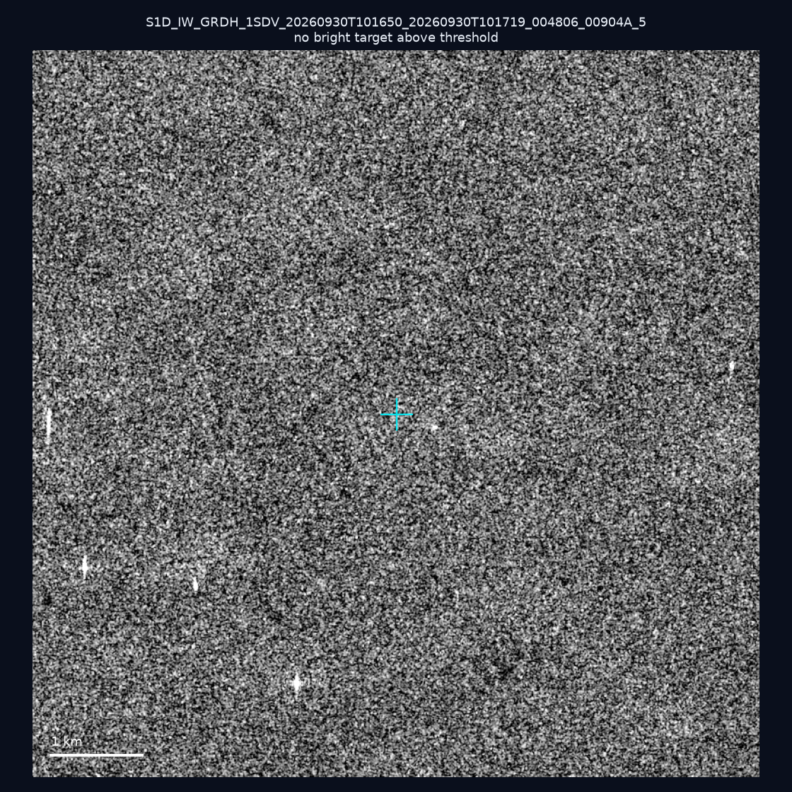
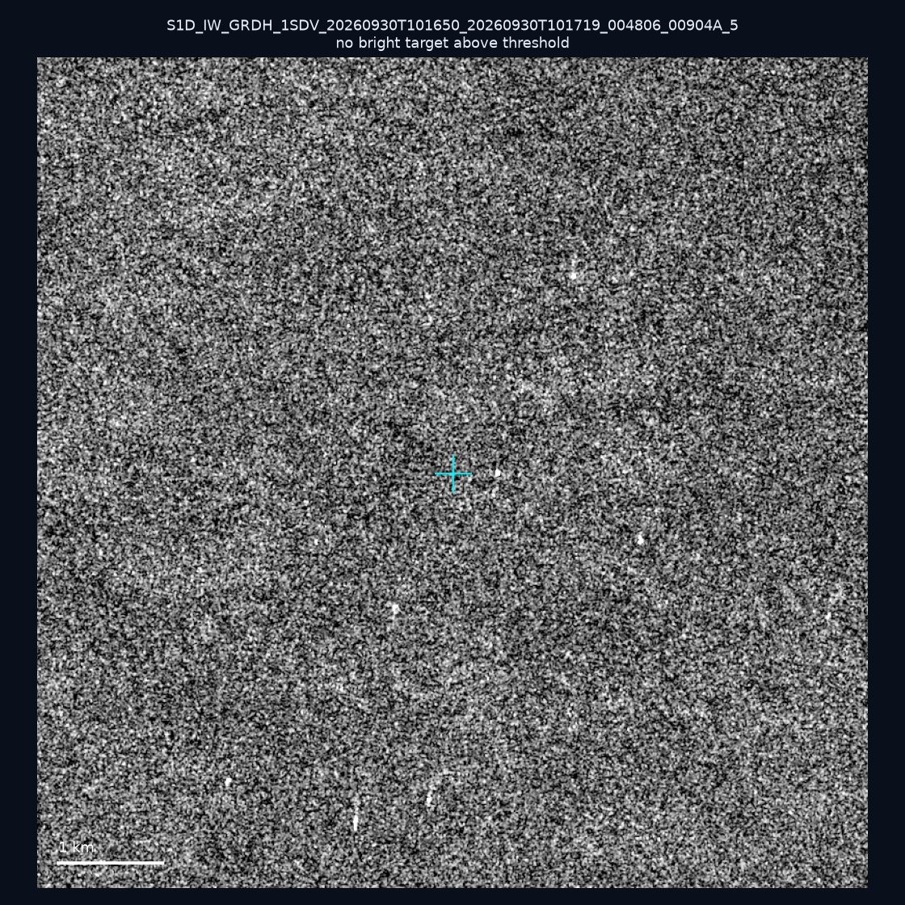
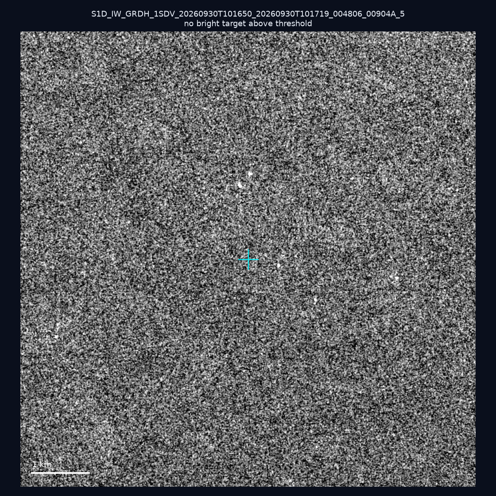
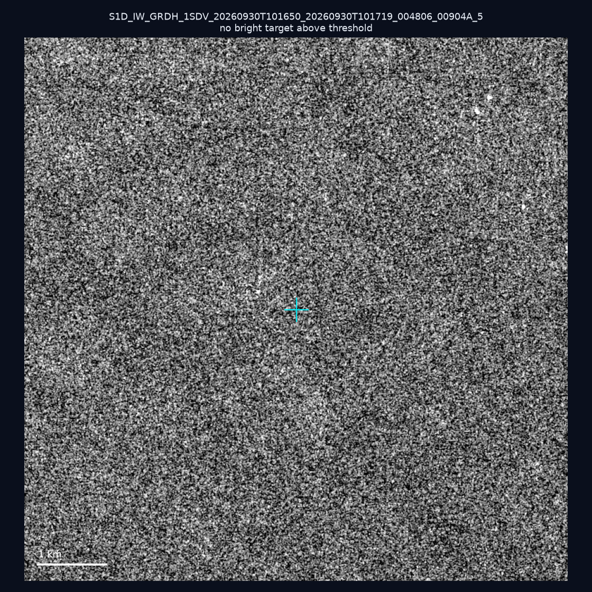
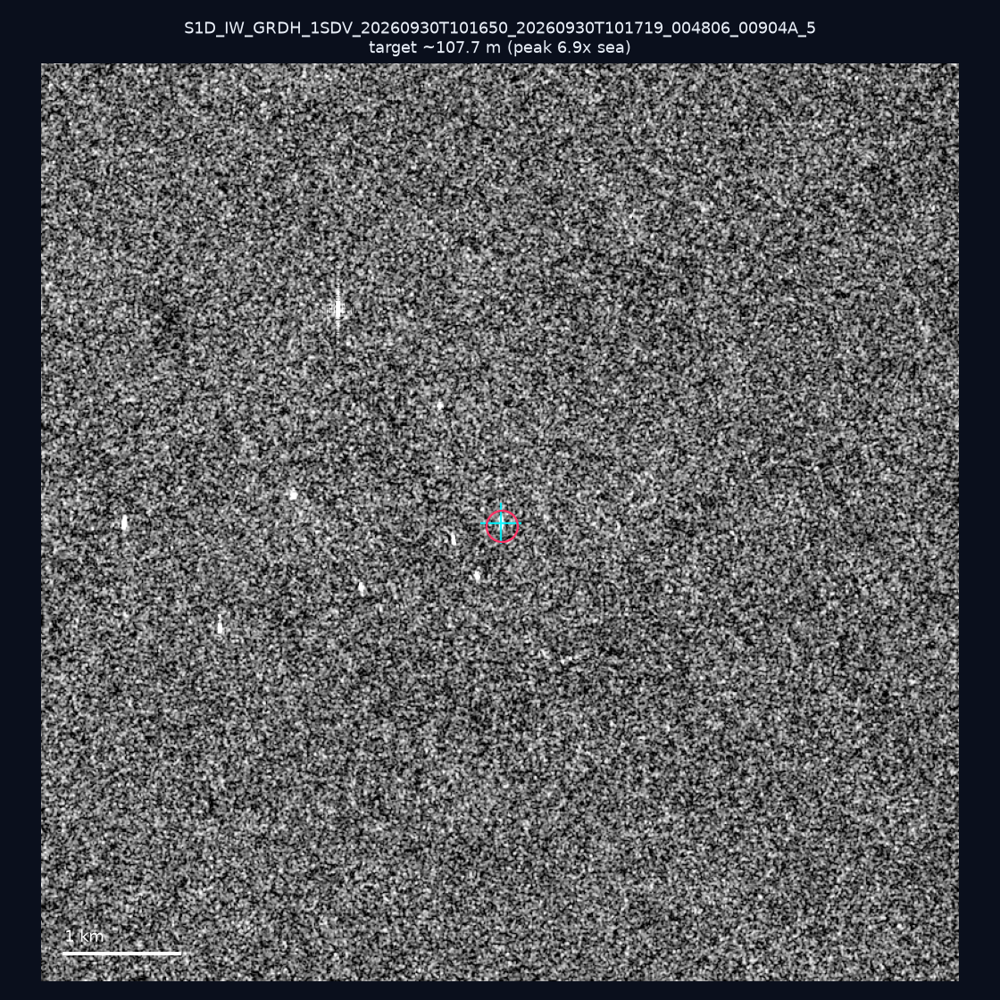
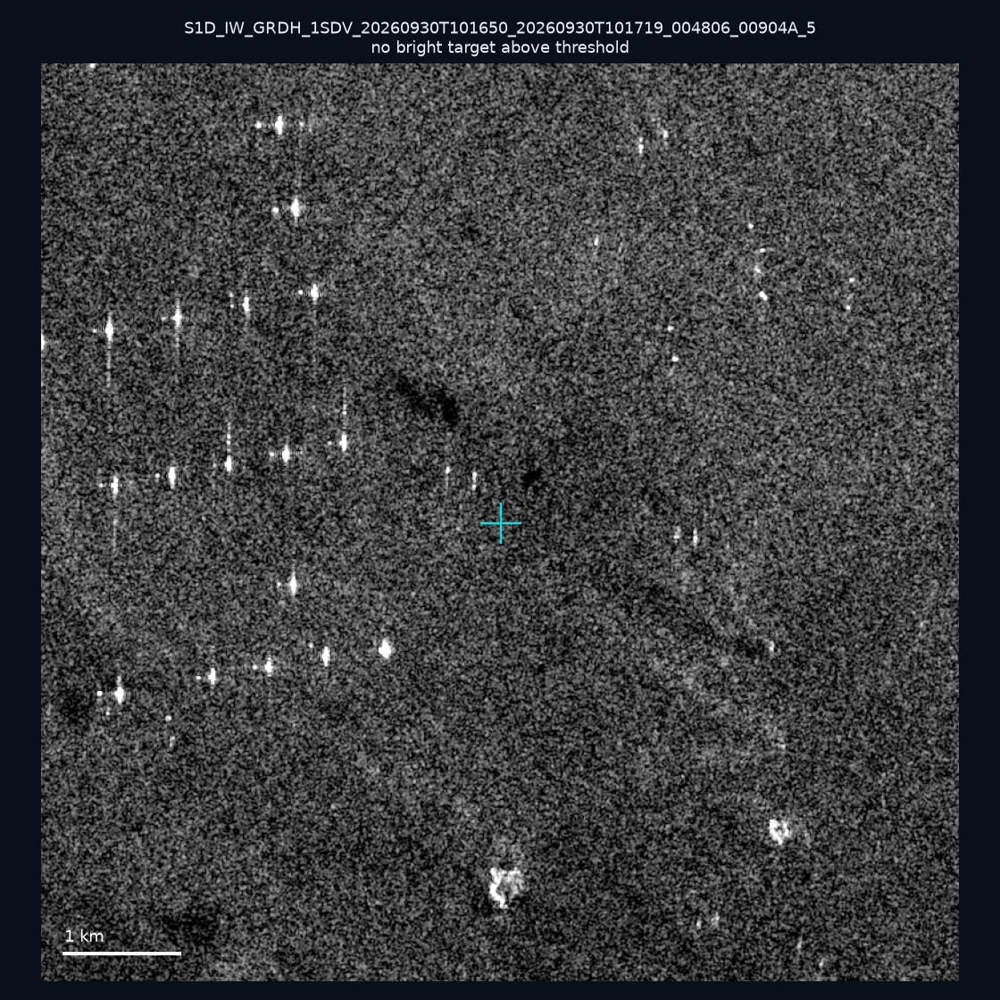
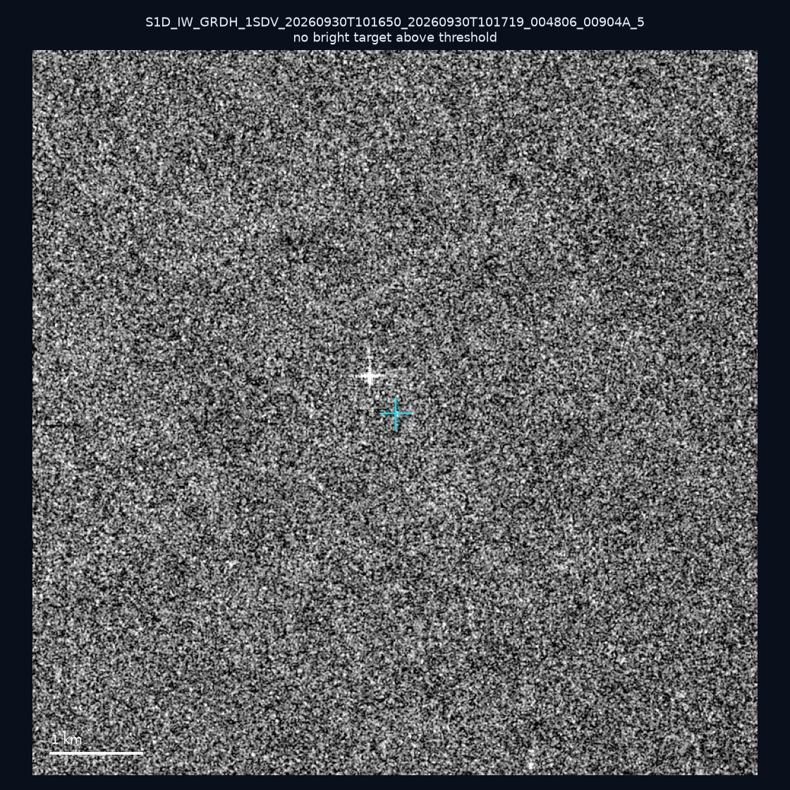
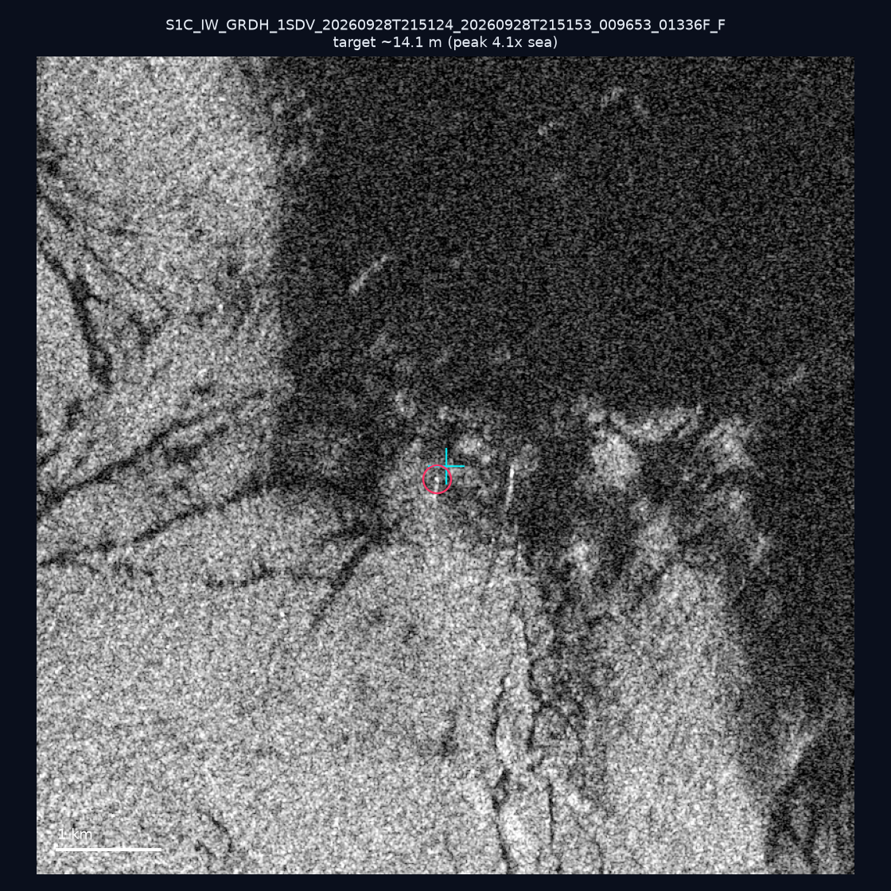
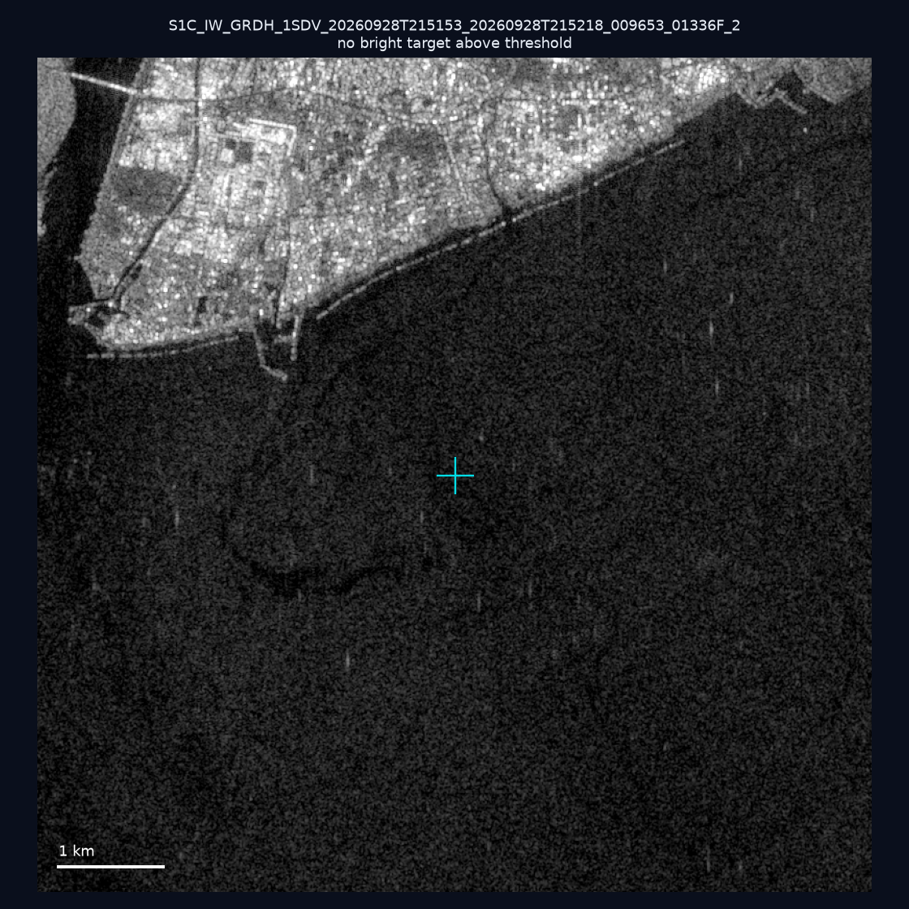
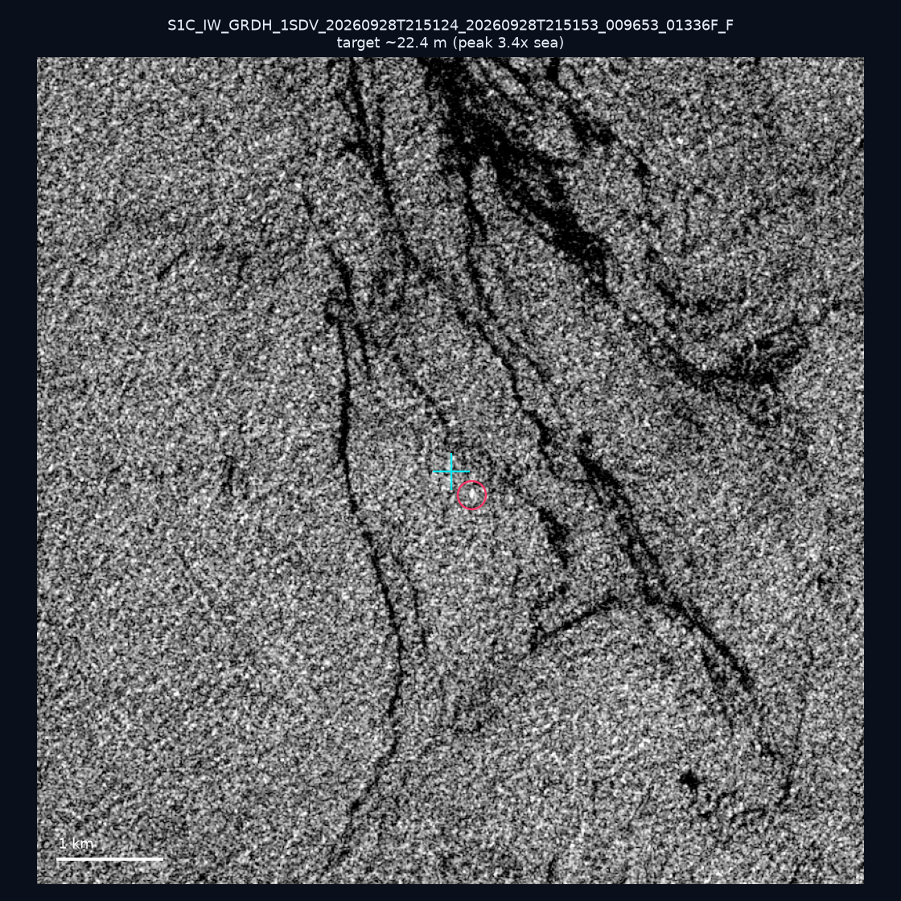

# 暗船 SAR 取證報告 — 2026-10-04

## 1. 總覽

- 執行時間：2026-10-04（GitHub Actions cron 自動執行）
- 線上比對摘要：暗偵測 19463 筆、殘餘暗船 14468 筆、假暗船剔除率 25.7%
- 本輪測試：10 筆
- 成功：10 筆
- 找到亮目標：3 筆
- 失敗：0 筆

## 2. 結果總表

| 日期 | 座標 | 海域 | 法域 | 成像時刻 | 判定 | 估計長度 | 峰值比 |
|------|------|------|------|----------|------|----------|--------|
| 2026-09-30 | 23.22, 118.26 | southwest | eez | 10:16:50 | ⚪ 無目標（雜訊或低RCS） | — | — |
| 2026-09-30 | 22.94, 118.05 | southwest | eez | 10:16:50 | ⚪ 無目標（雜訊或低RCS） | — | — |
| 2026-09-30 | 23.12, 118.27 | southwest | eez | 10:16:50 | ⚪ 無目標（雜訊或低RCS） | — | — |
| 2026-09-30 | 23.13, 118.24 | southwest | eez | 10:16:50 | ⚪ 無目標（雜訊或低RCS） | — | — |
| 2026-09-30 | 23.21, 118.03 | southwest | eez | 10:16:50 | 🟡 弱目標 | ~107.7 m | 6.9× |
| 2026-09-30 | 23.29, 117.1 | southwest | eez | 10:16:50 | ⚪ 無目標（雜訊或低RCS） | — | — |
| 2026-09-30 | 23.3, 118.1 | southwest | eez | 10:16:50 | ⚪ 無目標（雜訊或低RCS） | — | — |
| 2026-09-28 | 25.14, 122.02 | east | internal_waters | 21:51:24 | 🟡 弱目標 | ~14.1 m | 4.1× |
| 2026-09-28 | 22.47, 120.38 | southwest | internal_waters | 21:51:53 | ⚪ 無目標（雜訊或低RCS） | — | — |
| 2026-09-28 | 24.64, 121.92 | east | territorial_sea | 21:51:24 | 🟡 弱目標 | ~22.4 m | 3.4× |

## 3. 逐目標段落

### 2026-09-30 (23.22, 118.26)

⚪ 無目標（雜訊或低RCS）。

### 2026-09-30 (22.94, 118.05)

⚪ 無目標（雜訊或低RCS）。

### 2026-09-30 (23.12, 118.27)

⚪ 無目標（雜訊或低RCS）。

### 2026-09-30 (23.13, 118.24)

⚪ 無目標（雜訊或低RCS）。

### 2026-09-30 (23.21, 118.03)

🟡 弱目標，估計長度 ~107.7 m，峰值 6.9× 海面背景（25 px）。

### 2026-09-30 (23.29, 117.1)

⚪ 無目標（雜訊或低RCS）。

### 2026-09-30 (23.3, 118.1)

⚪ 無目標（雜訊或低RCS）。

### 2026-09-28 (25.14, 122.02)

🟡 弱目標，估計長度 ~14.1 m，峰值 4.1× 海面背景（1 px）。

### 2026-09-28 (22.47, 120.38)

⚪ 無目標（雜訊或低RCS）。

### 2026-09-28 (24.64, 121.92)

🟡 弱目標，估計長度 ~22.4 m，峰值 3.4× 海面背景（2 px）。

## 4. 後續建議

- 累積統計：全歷史 419 筆（有效 419 筆），確認實體目標 54 筆（12.9%）

> 所有結果是研判線索，不是法律認定；無目標 ≠ 誤報（小型木殼漁船 RCS 低，SAR 可能拍不到）。
